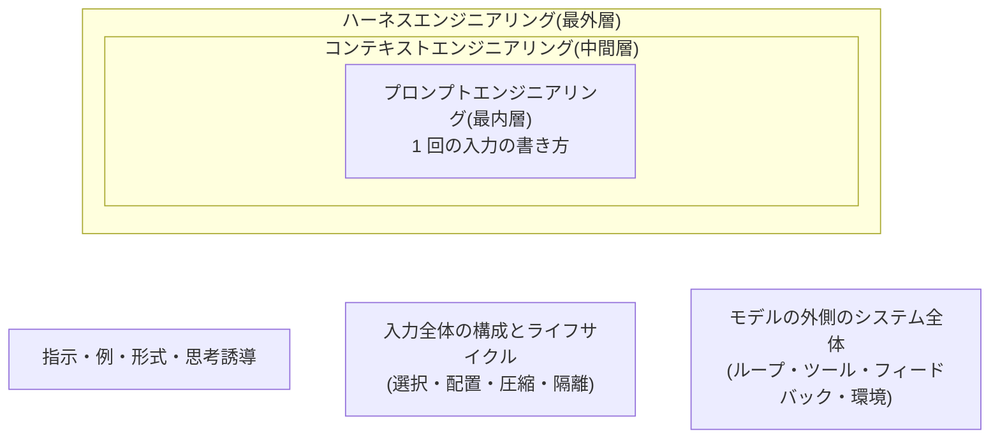

# DEEP-DIVE-PLAN — エンジニアリング詳解計画(プロンプト・コンテキスト・ハーネス・ループ)

> **ステータス: 設計案(2026-07-07 作成、ユーザーの追加要望に基づく。同日ループエンジニアリングを追加。着手指示待ち)。**
> プロンプトエンジニアリング・コンテキストエンジニアリング・ハーネスエンジニアリング(とその時間軸であるループエンジニアリング)を、既存ドキュメントとのギャップ分析に基づいて**網羅的・詳細**に拡充する計画です。進捗の正本は着手後 [ROADMAP.md](ROADMAP.md) に置きます。

## 1. 中心となる整理: 三層のエンジニアリング

3 領域は独立したバズワードではなく、**モデルを取り巻く設計の同心円**として整理できます。これが本計画の背骨であり、各記事の分担の基準です。

- **プロンプト**: 1 回の LLM 呼び出しに渡す「文章」の設計
- **コンテキスト**: 呼び出しに渡す「情報全体」(システム・ツール定義・履歴・資料)の選択・配置・ライフサイクルの設計
- **ハーネス**: 呼び出しの「外側」— ループ制御・ツール実行・フィードバック・環境・安全 — の設計。同一モデルでもハーネスで性能が数十ポイント変わることは公開ベンチマークで実証されています(`research/professional/benchmarks.md`: 統一ハーネス実測とベンダー最適化ハーネスの乖離、CORE-Bench の同一精度でもタスク成否 31% 不一致、ほか)
- **ループ**: ハーネス層の**時間軸**。ハーネスが空間的な構成(何を置くか)だとすれば、ループエンジニアリングは動的な制御(いつ考えさせ・いつ行動させ・いつ立ち止まらせ・いつ止めるか)の設計。同心円の 4 番目の輪ではなく、最外層(ハーネス)の運転設計として位置づけます

## 2. 既存カバレッジとギャップ分析(2026-07-07 時点、全 92 本)

| 領域 | 既存ドキュメント(役割) | ギャップ |
| --- | --- | --- |
| プロンプト | [prompt-engineering-fundamentals](docs/03-implementation/prompt-engineering-fundamentals.md)(basic の入口カタログ)/ [agent-prompt-design](docs/03-implementation/agent-prompt-design.md)(システムプロンプト)/ [coding-agent-prompting](docs/08-coding-agents/coding-agent-prompting.md)(依頼文)/ [prompt-management](docs/03-implementation/prompt-management.md)(資産管理) | **上級の技法詳解がない**(few-shot の設計詳細・出力制御・長文パターン・頑健性)。**改善を工学にする方法論がない**(評価駆動の最適化・自動最適化の原理) |
| コンテキスト | [context-engineering](docs/02-architecture/context-engineering.md)(原則: 選択・配置・ライフサイクル)/ [attention-and-context](docs/10-llm-foundations/attention-and-context.md)(理論: KV キャッシュ・位置の偏り)/ [memory-and-state](docs/01-concepts/memory-and-state.md)(履歴圧縮の基礎) | **実践パターンの詳解がない**(レイアウト・予算・just-in-time 取得の設計)。**圧縮と隔離の専用記事がない**(コンパクション戦略・サブエージェント分配・汚染の仕切り直し) |
| ハーネス | [agent-loop](docs/01-concepts/agent-loop.md)(ループ)/ [tool-definition-design](docs/03-implementation/tool-definition-design.md)(ツール)/ [framework-selection](docs/03-implementation/framework-selection.md)(既製の選定)/ [error-handling-and-retries](docs/02-architecture/error-handling-and-retries.md) / [agent-benchmarks-landscape](docs/04-evaluation/agent-benchmarks-landscape.md)(ハーネス依存の実証) | **「ハーネス」を一級の設計対象として扱う記事が存在しない**(部品は揃っているが全体設計論がない)。**ループ内フィードバック・検証器の設計論がない**(ツール結果の整形・エラーメッセージ設計・自己修正の回し方) |
| ループ | [agent-loop](docs/01-concepts/agent-loop.md)(基礎: サイクルと停止条件の概念)/ [planning-and-reasoning](docs/01-concepts/planning-and-reasoning.md)(計画の概念)/ [async-and-durable-agents](docs/02-architecture/async-and-durable-agents.md)(中断・再開)/ [orchestration-patterns](docs/02-architecture/orchestration-patterns.md)(マルチエージェントの流れ) | **ループの制御設計の詳解がない** — 停止条件の設計詳解(完了判定・予算・行き詰まり)、再計画のリズム、迷走・堂々巡りの検知と介入、バックトラック、ループの入れ子と分割 |

結論: 部品は既に多く存在するため、**新記事は「詳解」と「全体設計論」に特化**し、既存記事を正本とする分担を各記事冒頭で明示します(既存との重複解説はしない)。

## 3. 追加トピック一覧(7 本)

| # | 配置 | ファイル | 仮タイトル | level | 領域 |
| --- | --- | --- | --- | --- | --- |
| 1 | 03-implementation | `prompt-engineering-patterns.md` | プロンプトエンジニアリングの上級パターン | advanced | プロンプト |
| 2 | 03-implementation | `prompt-optimization.md` | プロンプト最適化(評価駆動の改善と自動化) | advanced | プロンプト |
| 3 | 02-architecture | `context-engineering-patterns.md` | コンテキスト設計の実践パターン | advanced | コンテキスト |
| 4 | 02-architecture | `context-compaction-and-isolation.md` | コンテキストの圧縮と隔離 | advanced | コンテキスト |
| 5 | 02-architecture | `harness-engineering.md` | ハーネスエンジニアリング | advanced | ハーネス |
| 6 | 02-architecture | `loop-engineering.md` | ループエンジニアリング(Agent ループの制御設計) | advanced | ループ |
| 7 | 03-implementation | `loop-feedback-and-verification.md` | ループ内フィードバックと検証器の設計 | advanced | ハーネス/ループ |

すべて advanced(既存の basic / intermediate 層の上に積む詳解層)。新セクションは不要です。

## 4. 各ページの設計

### 4.1 プロンプト詳解(Phase M)

#### prompt-engineering-patterns.md — プロンプトエンジニアリングの上級パターン(03)

- **目的**: [基礎技法](docs/03-implementation/prompt-engineering-fundamentals.md)の先。個々の技法を「なぜ効くか(10 章接続)・いつ使うか・どう検証するか」まで詳解し、難しいタスクのプロンプトを設計・診断できる
- **主要トピック**: 構造化の詳解(区切り・タグ・セクション順序を、キャッシュ前方一致と注意の偏りから設計する)/ 役割・視点の設計 / few-shot 詳解(例の選択基準・順序効果・ラベル分布・形式の伝染・動的選択)/ 思考制御の詳解(考察誘導の使い分け・自己検証をさせる・推論モデルの思考量制御)/ 出力制御(応答の書き出し指定(prefill)・停止シーケンス・構造化出力との併用)/ 長文・大量データのパターン(分割 + 統合・逐次精緻化)/ 頑健性(入力の言い換え耐性・崩れた入力・指示とデータ分離の徹底)
- **H3 案**: 概要(基礎技法との分担)/ 構造化の詳解 / 例示の詳解 / 思考の制御 / 出力の制御 / 長文・大量データ / 頑健性 / パターンの検証方法
- **分担**: 入口 = fundamentals(basic)、システムプロンプト = agent-prompt-design、形式保証 = structured-output

#### prompt-optimization.md — プロンプト最適化(03)

- **目的**: プロンプト改善を「感想戦」から評価駆動の工学に変える。手動最適化の型と、自動最適化の原理を理解する
- **主要トピック**: 改善サイクル(失敗分析 → 仮説 → 最小変更 → 回帰評価)/ 失敗モード別の対策マップ(どの症状にどの技法を試すか)/ LLM を使った改善(書き換え・批評・メタプロンプティング)/ 自動プロンプト最適化の原理(候補生成 × 評価 × 選択。個別フレームワークの動向は TODO 前提)/ 評価セットへの過適合の罠 / 実験の記録
- **H3 案**: 概要 / 評価駆動の改善サイクル / 失敗モード別の対策マップ / LLM による改善 / 自動最適化の原理と限界 / 過適合の罠 / この先(資産管理・実験管理へ)
- **分担**: 資産管理・変更フロー = prompt-management、判定器 = llm-as-a-judge、データセット = evaluation-datasets

### 4.2 コンテキスト詳解(Phase N)

#### context-engineering-patterns.md — コンテキスト設計の実践パターン(02)

- **目的**: [コンテキストエンジニアリング](docs/02-architecture/context-engineering.md)(原則)の実践詳解。レイアウト・予算・取得戦略を根拠を持って設計できる
- **主要トピック**: レイアウト設計(キャッシュ前方一致 × 注意の偏り × 更新頻度で「層」に並べる)/ コンテキスト予算(セクション別バジェット・計測・超過時の縮退規則)/ 事前ロード vs just-in-time 取得(ツールで都度引く)の判断基準 / 資料の前処理(要約・抜粋・構造化のどれで渡すか)/ 複数情報源の統合(競合・鮮度の扱い)/ 効果の計測(どのセクションが品質に効いているかのアブレーション)
- **H3 案**: 概要(原則記事との分担)/ レイアウトの設計 / 予算の設計 / 取得戦略 / 資料の前処理 / 統合と競合 / 計測と改善
- **分担**: 原則 = context-engineering、理論 = attention-and-context(10 章)、検索そのもの = rag-implementation-patterns

#### context-compaction-and-isolation.md — コンテキストの圧縮と隔離(02)

- **目的**: 長時間・長対話でコンテキストを健全に保つ 2 大手段 — 圧縮(compaction)と隔離(isolation)— を設計できる
- **主要トピック**: 圧縮のトリガ設計(閾値・フェーズ境界)/ 何を残すか(決定事項・制約・未解決点・参照ポインタ)と何を落とすか / 要約の階層化と段階的圧縮 / 圧縮の失敗モード(決定の消失 → 同じ議論のループ)/ 構造化状態への外部化(タスクリスト・メモファイル・DB)/ 隔離: サブエージェントへの分配(コンテキスト分離を目的とした委譲)/ 汚染の検知と仕切り直しの判断 / 信頼できないコンテンツの隔離(セキュリティ側の接続)
- **H3 案**: 概要 / 圧縮のトリガ / 残すものと落とすもの / 外部化という第三の道 / 隔離とサブエージェント / 仕切り直しの判断 / 失敗モード
- **分担**: メモリ 3 層の基礎 = memory-and-state、マルチエージェント一般 = single-vs-multi-agent / orchestration-patterns、コーディング特化のコンパクション = coding-agent-cost-optimization、間接インジェクション対策 = prompt-injection

### 4.3 ハーネス(Phase O)

#### harness-engineering.md — ハーネスエンジニアリング(02)

- **目的**: モデルの外側 = ハーネス(harness。ループ・ツール・フィードバック・環境・制御の総体)を**一級の設計対象**として扱い、同じモデルから最大の性能と信頼性を引き出す設計ができる
- **主要トピック**: ハーネスの定義と構成要素マップ(既存記事が部品の正本、本記事は全体の設計論)/ なぜ効くか(公開ベンチマークにおけるハーネス依存の実証 — benchmarks 調査メモを根拠に)/ 設計原則(「モデルに任せる」と「コードで固定する」の境界線の引き方・最小ハーネスから始める・モデル更新のたびにハーネスを軽くする方向で共進化させる)/ 環境設計(作業空間・一時状態・サンドボックス)/ 既製ハーネス(フレームワーク・コーディングエージェント)を使う vs 作る / ハーネスの評価(同一モデルでのハーネス A/B)
- **H3 案**: 概要(なぜ一級の設計対象か)/ 構成要素の全体マップ / 設計原則 / 環境の設計 / 既製と自作 / ハーネスの評価 / モデルとの共進化
- **分担**: ループ = agent-loop、ツール = tool-definition-design、フレームワーク選定 = framework-selection、権限・サンドボックス = 06 章、ベンチのハーネス依存 = agent-benchmarks-landscape

#### loop-engineering.md — ループエンジニアリング(02)

- **目的**: Agent ループの制御 — いつ考えさせ、いつ行動させ、いつ立ち止まらせ、いつ止めるか — を設計対象として扱い、**迷走せず・止まりすぎず・予算内で収束する**ループを設計できる
- **主要トピック**: ループの型の選択(自由ループ / フェーズ制(計画 → 実行 → 検証)/ 状態機械 — 自律性スペクトラムとの対応)/ 停止条件の設計詳解(完了の自己申告 vs 検証器による確認・ステップ / トークン / 時間 / コストの予算設計・予算超過時の縮退)/ 再計画のリズム(毎ステップ判断 vs 節目で再計画・計画の陳腐化検知)/ 迷走・堂々巡りの検知(同一ツール呼び出しの反復・進捗シグナル・ステップ数分布)と介入(ヒント注入・仕切り直し・エスカレーション)/ バックトラック(失敗を認めて戻る設計・チェックポイントからのやり直し)/ ループの入れ子と分割(サブタスクの子ループ・長時間タスクのフェーズ分割)/ 制御をコードで固定するかプロンプトで促すか(「指示はお願い」の制御フロー版)
- **H3 案**: 概要(agent-loop との分担)/ ループの型を選ぶ / 停止条件の設計 / 再計画のリズム / 迷走の検知と介入 / バックトラックとやり直し / 入れ子と分割 / コードで制御するか、プロンプトで促すか
- **分担**: ループの基礎概念 = agent-loop(01)、計画の概念 = planning-and-reasoning(01)、中断・再開の永続化 = async-and-durable-agents、マルチエージェント構成 = orchestration-patterns、暴走時の運用対応 = incident-response、全体設計 = harness-engineering(本記事はその時間軸の詳解)

#### loop-feedback-and-verification.md — ループ内フィードバックと検証器の設計(03)

- **目的**: ループの中でモデルに返す情報(ツール結果・エラー・検証結果)を設計し、自己修正が実際に回るハーネスを作れる
- **主要トピック**: ツール結果の整形(生ログ / 要約 / 構造化のどれで返すか・長大な結果の切り詰め)/ エラーメッセージの設計(モデルが次の一手を選べる形 — 原因・候補・制約)/ 検証器(verifier)の 3 種と配置(決定的: テスト・lint・スキーマ / モデル: ループ内判定 / 人: HITL)/ 自己修正の促し方(再試行の伝え方・回数上限・行き詰まり検知)/ 「生成は難しいが検証は易しい」構造を作る(capabilities-and-limits の実装側)/ 検証を騙す出力(テストの無効化・見せかけの成功)への対策
- **H3 案**: 概要 / ツール結果の整形 / エラーメッセージの設計 / 検証器の 3 種と配置 / 自己修正ループの制御 / 検証を騙す出力への対策
- **分担**: リトライ戦略の一般論 = error-handling-and-retries、ツールのエラー返却の基本 = tool-definition-design、判定器の検証 = llm-as-a-judge、軌跡の検証 = trajectory-evaluation

## 5. スコープ外(検討のうえ除外)

- **特定の最適化フレームワーク・ツールのチュートリアル**(DSPy 等): 変化が速く、原理(候補生成 × 評価 × 選択)を prompt-optimization で扱えば十分。名前は TODO 前提で最小限
- **ベンダー固有のパラメータ・機能のリファレンス**(prefill の API 仕様等): 本文はベンダー中立の原理とし、具体は公式ドキュメント参照と各モデルガイドに委ねる
- **学習(FT・RLHF)によるモデル側の改善**: 10 章と fine-tuning-and-distillation で既カバー
- **プロンプトインジェクション対策の再執筆**: 06 章が正本。頑健性・隔離の記事からリンクで接続する

## 6. フェーズ分割(ROADMAP 追記案)

既存フェーズ(〜L)に続けて **Phase M〜O** を使用します。三層モデルの内側から外側へ(M → N → O)の順を推奨します(各記事が内側の層を前提にリンクするため)。

| フェーズ | 内容 | 成果物 | 備考 |
| --- | --- | --- | --- |
| M-1 | プロンプト上級パターン + プロンプト最適化 | `prompt-engineering-patterns.md`, `prompt-optimization.md` | 調査不要(原理は安定。自動最適化の動向のみ TODO 前提) |
| M-R | Phase M レビュー(fundamentals・agent-prompt-design からの逆リンク、published 化、同期一式) | — | — |
| N-1 | コンテキスト実践パターン + 圧縮と隔離 | `context-engineering-patterns.md`, `context-compaction-and-isolation.md` | 調査不要 |
| N-R | Phase N レビュー(context-engineering・memory-and-state からの逆リンク、published 化、同期一式) | — | — |
| O-1 | ハーネスエンジニアリング + ループエンジニアリング | `harness-engineering.md`, `loop-engineering.md` | 調査不要(`research/professional/benchmarks.md` を根拠に再利用) |
| O-2 | ループ内フィードバックと検証器 | `loop-feedback-and-verification.md` | 調査不要 |
| O-R | Phase O レビュー + 三層の相互リンク総点検(agent-loop・planning-and-reasoning・framework-selection・benchmarks からの逆リンク、published 化、同期一式) | — | — |

完了時の規模: **92 → 99 本**(02: 8 → 12、03: 15 → 18)。

## 7. 執筆前調査

原理が安定した領域のため、**専用の調査タスクは設けません**(執筆時の部分確認のみ)。ハーネス依存の実証は既存の `research/professional/benchmarks.md`(調査日 2026-07-07)を根拠として再利用します。自動プロンプト最適化のフレームワーク動向のみ変化が速いため、本文では原理に留め `TODO(要確認)` を残します。

## 8. 同期・派生作業

- **GLOSSARY 候補**(執筆時確定): ハーネス(harness)、ループエンジニアリング(loop engineering)、検証器(verifier)、プリフィル(prefill)、just-in-time 取得、メタプロンプティング(meta-prompting)、バックトラック(backtrack)。既存の「コンパクション」エントリはリンク先の拡張を検討(現在は 08 章のみを指す)
- **逆リンク**(各フェーズの X-R で実施): prompt-engineering-fundamentals → patterns / optimization、agent-prompt-design → patterns、context-engineering → patterns / compaction、memory-and-state → compaction、agent-loop → harness-engineering / loop-engineering、planning-and-reasoning → loop-engineering、framework-selection → harness-engineering、tool-definition-design → loop-feedback、agent-benchmarks-landscape → harness-engineering
- **learning-roadmap**: 変更不要の見込み(セクション追加なし。advanced 層の拡充のため)
- **website**: 構造変更なし(sync が自動反映)。ビルド検証のみ
- **タグ**: `prompt-design` / `context-engineering` / `harness`(新規)/ `evaluation` 等、既存語彙を優先

## 9. 未確定事項(着手時に確認)

1. **7 本構成の粒度**: 推奨は 7 本。「まず各領域 1 本ずつ(patterns / compaction / harness / loop の 4 本)で骨格を作り、残り 3 本は需要を見て」という縮小案もある
2. **フェーズ順**: 推奨は M → N → O(内側から外側)。ハーネス・ループを急ぐ場合は O 先行も可能(依存は弱い)

## 10. TODO

> **TODO(要確認):** 自動プロンプト最適化フレームワークの動向(名前・提供形態)は prompt-optimization 執筆時に最小限の確認を行い、本文では原理のみ扱う(最終確認: 2026-07)
