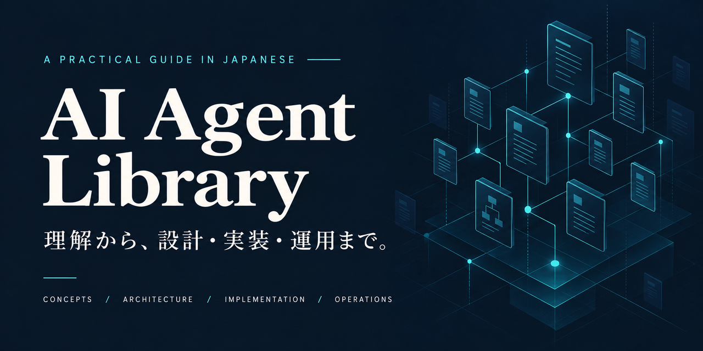
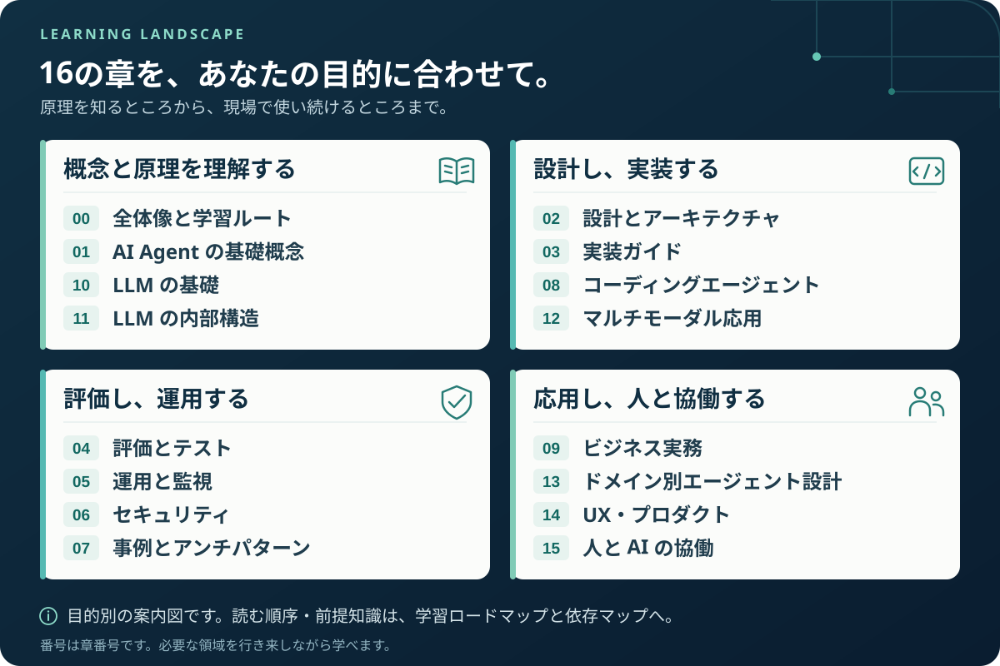
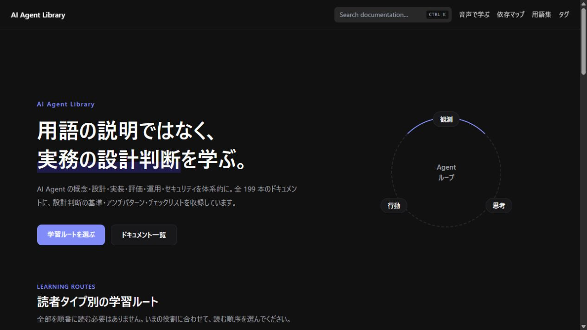
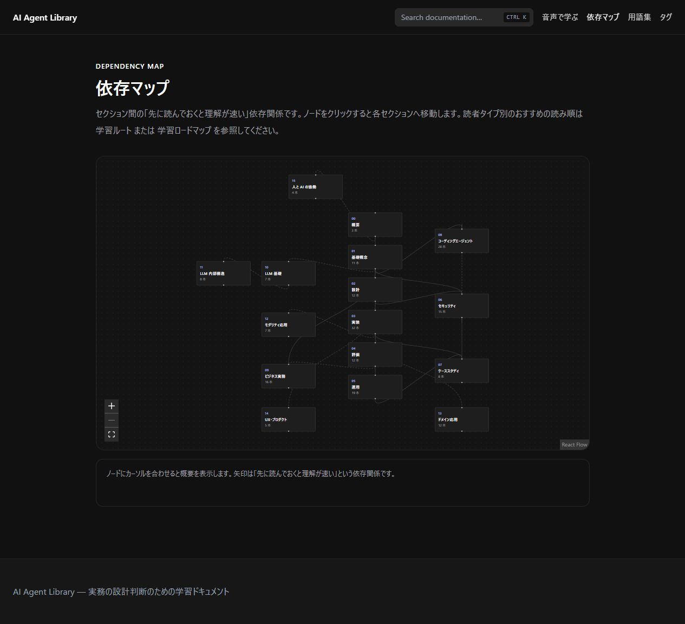
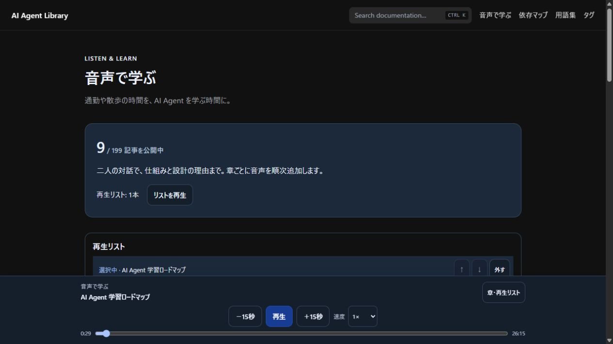

# AI Agent Library

[](https://pero3dev.github.io/ai-agent-library/)

**AI Agent を、理解から設計・実装・運用まで。**

日本語で学ぶ、エンジニアのための実践ライブラリ。設計判断の基準・アンチパターン・チェックリスト・実装例を通して、「どう作るか」「なぜその構成を選ぶか」を学べます。

**16 章・199 記事** ｜ **Python サンプル 6 件** ｜ 8 つの学習ルート ｜ 検索・依存マップ・音声学習

[](https://github.com/pero3dev/ai-agent-library/actions/workflows/ci.yml)
[](LICENSE)
[](LICENSE)

**[サイトで学ぶ →](https://pero3dev.github.io/ai-agent-library/)** · [まず読む 3 本](#まず読む-3-本) · [サンプルを動かす](#python-で検証とリトライを試す) · [用語集](GLOSSARY.md)

## まず読む 3 本

LLM API を使い始めた人は、この順で Agent の構造をつかめます。LLM 自体の仕組みから知りたい場合は [LLM 基礎](docs/10-llm-foundations/README.md) も並行して読めます。

| 順番 | 記事 | 読むと分かること |
| --- | --- | --- |
| 1 | [AI Agent とは何か](docs/01-concepts/what-is-an-ai-agent.md) | Agent の構成要素と、手順をコードで固定する Workflow との違い |
| 2 | [Agent ループ](docs/01-concepts/agent-loop.md) | 観測・思考・行動の流れと、停止条件・エラー・履歴の設計 |
| 3 | [ツール使用](docs/01-concepts/tool-use.md) | モデルの要求をアプリケーションが実行し、結果を次の判断へ返す仕組み |

## 実務で使う 3 本

| いまの問い | 記事 | 持ち帰れる判断基準 |
| --- | --- | --- |
| この機能は Agent にするべきか? | [Workflow 型 vs Agent 型](docs/02-architecture/workflow-vs-agent.md) | 手順の予測可能性と必要な柔軟性から、Workflow・Agent・ハイブリッドを選ぶ |
| 本番に出せる品質か? | [Agent 評価の基礎](docs/04-evaluation/agent-evaluation-basics.md) | 最終成果・実行過程・部品を分け、データセットと採点方法を組み立てる |
| 外部文書の指示に誘導されたら? | [プロンプトインジェクション](docs/06-security/prompt-injection.md) | 入力の検知に加え、権限・承認・実行制限を設計する |

たとえば「どこまで自律的に任せるか」は、次のように考えます。

| タスクの性質 | 最初に検討する構成 |
| --- | --- |
| 処理手順を事前に列挙できる | 固定した Workflow |
| 手順は固定で、入口の振り分けに判断が要る | Workflow + ルーティング |
| 探索が必要な部分を一部に限定できる | Workflow の一部に Agent を組み込む |
| 入力や途中結果によって手順全体を変える必要がある | 停止条件・権限を定めた Agent |

[設計判断の全文とチェックリストを読む →](docs/02-architecture/workflow-vs-agent.md)

## 16 章を、自分の目的に沿って学ぶ

[](docs/00-overview/learning-roadmap.md)

全記事を順番に読む必要はありません。[学習ロードマップ](docs/00-overview/learning-roadmap.md#読者タイプ別の推奨ルート)では、8 つの読者タイプに合わせて読む順序を案内しています。

| 目的 | 読み始める場所 |
| --- | --- |
| AI Agent をこれから学ぶ | [基礎概念](docs/01-concepts/README.md) |
| 要件を受けて設計する | [設計・アーキテクチャ](docs/02-architecture/README.md) |
| Agent を実装する | [実装ガイド](docs/03-implementation/README.md) → [サンプル](examples/README.md) |
| 本番運用を担当する | [運用](docs/05-operations/README.md) → [回帰テスト](docs/04-evaluation/regression-testing.md) |
| 安全性をレビューする | [セキュリティ](docs/06-security/README.md) |
| コーディングエージェントを使う・導入する | [分類と全体像](docs/08-coding-agents/coding-agents-overview.md) |
| 技術の幅を広げ、案件を推進する | [スキルマップ](docs/00-overview/skill-map.md) → [ビジネス実務](docs/09-business/README.md) |
| SIer・情シスで工程横断に活用する | [SE 工程別活用マップ](docs/08-coding-agents/se-process-map.md) |

## ブラウザーで探す・つなぐ・聴く

[公開サイト](https://pero3dev.github.io/ai-agent-library/)では、全文検索で必要な記事を探し、学習ルートから読み進められます。記事はこのリポジトリの `docs/` を正本として生成しています。

[](https://pero3dev.github.io/ai-agent-library/)

| 前提知識のつながりをたどる | 音声で学ぶ |
| --- | --- |
| [](https://pero3dev.github.io/ai-agent-library/roadmap/) | [](https://pero3dev.github.io/ai-agent-library/audio/) |
| [依存マップを開く →](https://pero3dev.github.io/ai-agent-library/roadmap/) セクション間の関係から、先に学ぶ領域や次のテーマを見つけられます。 | [音声ライブラリを開く →](https://pero3dev.github.io/ai-agent-library/audio/) 対象記事を二人の対話形式で聴けます。音声化は一部の記事のみです。 |

画面は 2026-09-20 の公開サイトです。[全文検索の表示例](assets/readme/site-search.png)も確認できます。音声の公開数はサイトで確認してください。

## Python で検証とリトライを試す

まずは「LLM の出力を検証し、不正ならエラーを添えて再試行する」流れを動かしてみてください。**Python 3.11 以降と Git があれば、API キーも追加パッケージも不要**です。

```bash
git clone https://github.com/pero3dev/ai-agent-library.git
cd ai-agent-library
python -X utf8 examples/python/structured-output/structured_output.py --mock
```

実行結果:

```text
[試行 1] 検証 NG: priority は ['低', '中', '高'] のいずれか(実際: '至急')
[試行 2] 検証 OK: {"category": "請求", "priority": "高", "summary": "二重引き落としの確認依頼"}
最終結果: {"category": "請求", "priority": "高", "summary": "二重引き落としの確認依頼"}
```

最初の不正な応答を検証で拒否し、2 回目の応答を受け入れます。モックは固定した応答を返し、検証と再試行のコードを実行します。実モデルの生成品質を測るものではありません。[解説記事](docs/03-implementation/structured-output.md)と[ソース・実 API の実行手順](examples/python/structured-output/README.md)をあわせて確認できます。

ほかにも [ツール使用](examples/python/tool-use/README.md)・[RAG](examples/python/rag-basics/README.md)・[MCP サーバー](examples/python/mcp-server/README.md)・[マルチエージェント](examples/python/multi-agent/README.md)・[評価ハーネス](examples/python/evaluation-harness/README.md)を収録しています。6 件とも API キー不要の `--mock` に対応し、必要な依存と確認範囲は各 README に記載しています。

## 更新と品質管理

記事には目的・前提知識・設計判断・実務上の注意点・参考資料を共通の構成で記載しています。変わりやすい仕様は一次情報と確認日をたどれるようにし、未確認事項は `TODO(要確認)` として残しています。

- **機械検査**: [CI](https://github.com/pero3dev/ai-agent-library/actions/workflows/ci.yml)で記事規約・相対リンク・Python サンプル・サイトビルド・ブラウザー試験などを確認します。具体的な検査は [CONTRIBUTING.md](CONTRIBUTING.md#提出前のセルフチェック)に記載しています。
- **内容レビュー**: [公開レビュー手順](.agents/skills/publish-review/SKILL.md)で、機械検査に加えて独立したレビュー担当が内容・整合性を確認します。
- **継続更新**: [定期メンテナンス](ROADMAP.md#定期メンテナンスフェーズ完了後も継続)と[定期最新化](freshness-automation.md)の手順を公開しています。確認範囲と結果は[調査・観測記録](research/README.md)に残します。
- **変更の追跡**: [最近の変更](https://github.com/pero3dev/ai-agent-library/commits/main/)と[実施記録の索引](project/README.md)から、何を更新し、どこまで確認したかをたどれます。

記事数は章索引を除く公開記事の数です。個別記事の更新日は front matter、執筆・レビューの記録は [ROADMAP.md](ROADMAP.md) で確認できます。

## 全 16 章の索引

| 章 | 扱うテーマ |
| --- | --- |
| [00 — 全体像](docs/00-overview/README.md) | 学習ロードマップ、スキルマップ、情報の追い方 |
| [01 — 基礎概念](docs/01-concepts/README.md) | Agent ループ、ツール使用、メモリ、RAG、マルチエージェント |
| [02 — 設計](docs/02-architecture/README.md) | Workflow との使い分け、コンテキスト、承認、耐久実行 |
| [03 — 実装](docs/03-implementation/README.md) | プロンプト、構造化出力、MCP、RAG、モデル・フレームワーク選定 |
| [04 — 評価](docs/04-evaluation/README.md) | 評価設計、LLM-as-a-Judge、軌跡評価、回帰テスト |
| [05 — 運用](docs/05-operations/README.md) | 可観測性、コスト、デプロイ、インシデント対応 |
| [06 — セキュリティ](docs/06-security/README.md) | 脅威モデル、インジェクション、権限、データ漏えい対策 |
| [07 — 事例](docs/07-case-studies/README.md) | アンチパターンと具体的なシステムの構成事例 |
| [08 — コーディングエージェント](docs/08-coding-agents/README.md) | 選定、設定、依頼設計、チーム導入、企業システムでの活用 |
| [09 — ビジネス実務](docs/09-business/README.md) | ユースケース、要件定義、PoC から本番、組織と調達 |
| [10 — LLM 基礎](docs/10-llm-foundations/README.md) | 生成・トークン・注意機構・学習の仕組みと能力の限界 |
| [11 — LLM 内部構造](docs/11-llm-internals/README.md) | Transformer、MoE、スケーリング則、推論、解釈可能性 |
| [12 — モダリティ応用](docs/12-multimodal/README.md) | 文書・画像・動画・音声の理解と生成 |
| [13 — ドメイン応用](docs/13-domain-agents/README.md) | リサーチ、データ分析、RPA、業務領域ごとの設計判断 |
| [14 — UX・プロダクト](docs/14-ux-and-product/README.md) | 会話設計、チャット以外の UI、回復、アクセシビリティ |
| [15 — 人と AI の協働](docs/15-human-ai/README.md) | 過信、検証習慣、キャリア、リテラシー教育 |

用語から探す場合は [GLOSSARY.md](GLOSSARY.md)、ファイルを検索する場合は `docs/` の英語ケバブケースのファイル名を使えます。本文は日本語です。

## コントリビューション

誤りの指摘、情報更新、改善提案を歓迎します。[Issue](https://github.com/pero3dev/ai-agent-library/issues)で相談するか、[CONTRIBUTING.md](CONTRIBUTING.md)を読んで変更を提案してください。脆弱性の報告は [SECURITY.md](SECURITY.md) を参照してください。

作業の共通契約は [AGENTS.md](AGENTS.md)、執筆・命名・同期更新の詳細は [harness/writing-rules.md](harness/writing-rules.md) が正本です。人が書く場合も同じ規約を使い、Claude Code 向けの入口と共通スキルは正本から生成します。

| リポジトリ内の入口 | 役割 |
| --- | --- |
| [docs/](docs/) / [templates/](templates/) | 学習記事の正本と執筆テンプレート |
| [examples/](examples/README.md) | 自己完結の Python サンプルと横断試験 |
| [website/](website/) | 公開サイトの実装([設計](project/plans/engineering/website.md)) |
| [ROADMAP.md](ROADMAP.md) | 記事タスク・定点観測の台帳 |
| [project/](project/README.md) / [research/](research/README.md) | 計画・実施履歴と、調査の根拠・観測記録 |
| [harness/](harness/) / [scripts/](scripts/) / [tests/](tests/) | 共通規約、検証・保守ツール、試験 |
| [freshness-automation.md](freshness-automation.md) / [automation/](automation/) | 定期最新化の運用手順と登録用プロンプト |
| [assets/](assets/) | README の画像と記事中の図版([紹介画像の更新方法](assets/readme/README.md)) |

## ライセンス

ドキュメントは **CC BY 4.0**、サンプルコードとサイト実装は **MIT** です。利用条件は [LICENSE](LICENSE) を確認してください。
