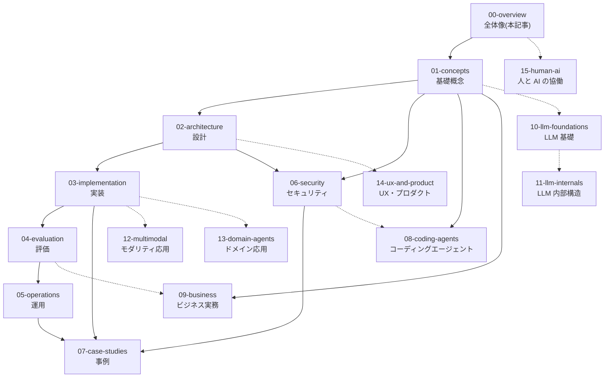

# AI Agent 学習ロードマップ

## この記事の目的

このライブラリを「どの順で読むか」を、自分の目的に合わせて決められるようになります。16 のセクションの役割と依存関係を把握し、読者タイプ別の推奨ルートから自分に合うものを選べる状態がゴールです。

## 対象読者

- このライブラリを初めて訪れたソフトウェアエンジニア全般
- チームに AI Agent の学習を導入する立場のテックリード・エンジニアリングマネージャー

## 前提知識

- システムプロンプトとユーザーメッセージの区別が付けば読み始められます。LLM API の呼出し経験は理解の助けになりますが、APIキーなしのmock経路で学習を開始できます
- このライブラリ内の前提ドキュメントはありません(本記事が入口です)

## 本文

### 概要: 16 セクションの構成と依存関係

このライブラリは「概念 → 設計 → 実装 → 評価 → 運用」という開発ライフサイクルの順にセクションを並べ、セキュリティと事例を横断テーマとして置いています。08(コーディングエージェント)は「Agent を**使う**側」の独立したテーマで、01 の基礎概念だけを前提に読めます。09(ビジネス実務)は「何をやるか・どう本番に届けるか」という案件推進の方法論で、技術セクションと並行して読めます。10(LLM 基礎)は「LLM 自体がなぜそう振る舞うか」を深める任意の基礎で、01 と並行して、または実務で挙動の疑問に当たったときに読めます。11(LLM 内部構造)は 10 の学術的な下層で、Transformer の数式・スケーリング則・アラインメント理論・推論機構・解釈可能性などを原論文つきで深めます(10 を読んで「なぜ」をさらに数式で掘りたい人向けの任意セクション)。12(モダリティ応用)は文書・画像・動画・音声の理解と生成を扱う応用テーマで、03(実装)を前提に、必要になったときに読めます。13(ドメイン応用)はリサーチ・データ分析・RPA・アシスタントなど応用ドメインごとの設計判断で、03(実装)を前提に、該当ドメインに取り組むときに読めます。14(UX・プロダクト)は非決定的な AI システムの体験設計で、02・03(設計・実装)を前提に、体験を作り込む段で読めます。15(人と AI の協働)は、AI を使うすべての人の認知と技能 — 過信・検証習慣・キャリア・リテラシー教育 — を扱う横断的な基礎で、全読者に関わります。


```mermaid
flowchart TD
    O["00-overview<br/>全体像(本記事)"] --> C1["01-concepts<br/>基礎概念"]
    C1 --> A2["02-architecture<br/>設計"]
    A2 --> I3["03-implementation<br/>実装"]
    I3 --> E4["04-evaluation<br/>評価"]
    E4 --> P5["05-operations<br/>運用"]
    C1 --> S6["06-security<br/>セキュリティ"]
    A2 --> S6
    I3 --> CS7["07-case-studies<br/>事例"]
    S6 --> CS7
    P5 --> CS7
    C1 --> CA8["08-coding-agents<br/>コーディングエージェント"]
    S6 -.-> CA8
    C1 --> B9["09-business<br/>ビジネス実務"]
    E4 -.-> B9
    C1 -.-> F10["10-llm-foundations<br/>LLM 基礎"]
    F10 -.-> I11["11-llm-internals<br/>LLM 内部構造"]
    I3 -.-> MM12["12-multimodal<br/>モダリティ応用"]
    I3 -.-> DA13["13-domain-agents<br/>ドメイン応用"]
    A2 -.-> UX14["14-ux-and-product<br/>UX・プロダクト"]
    O -.-> H15["15-human-ai<br/>人と AI の協働"]
```

矢印は「先に読んでおくと理解が速い」という依存関係です(点線は必須ではない補助的な依存)。上から順にすべて読む必要はなく、次の推奨ルートから選んでください。

### 読者タイプ別の推奨ルート

| タイプ | 状況 | 推奨ルート |
| --- | --- | --- |
| A: 入門 | AI Agent をこれから学ぶ | [01-concepts](../01-concepts/README.md) を上から順に → [Workflow 型 vs Agent 型](../02-architecture/workflow-vs-agent.md) → [03-implementation](../03-implementation/README.md) → [Agent 評価の基礎](../04-evaluation/agent-evaluation-basics.md) → [プロンプトインジェクション](../06-security/prompt-injection.md) |
| B: 設計担当 | 要件を受けて設計を始める | [AI Agent とは何か](../01-concepts/what-is-an-ai-agent.md) → [Agent ループ](../01-concepts/agent-loop.md) → [02-architecture](../02-architecture/README.md) を全部 → [Agent の脅威モデル概観](../06-security/threat-model-overview.md) |
| C: 実装担当 | 設計済みのものを実装する | [03-implementation](../03-implementation/README.md) を全部 → [実装済みサンプル](https://github.com/pero3dev/ai-agent-library/blob/d990973c2c02b6108cd9911fc06e45b3a29f9332/examples/README.md) → [04-evaluation](../04-evaluation/README.md) |
| D: 運用・SRE | 既存の Agent を本番運用する | [05-operations](../05-operations/README.md) を全部 → [回帰テストと CI 組み込み](../04-evaluation/regression-testing.md) → [06-security](../06-security/README.md) |
| E: セキュリティ | Agent システムをレビュー・監査する | [06-security](../06-security/README.md) を全部 → [ツール使用](../01-concepts/tool-use.md) → [Human-in-the-Loop 設計](../02-architecture/human-in-the-loop.md) |
| F: エージェント活用 | Claude Code 等のコーディングエージェントを使う・導入する | [AI Agent とは何か](../01-concepts/what-is-an-ai-agent.md) → [Agent ループ](../01-concepts/agent-loop.md) → [08-coding-agents](../08-coding-agents/README.md) を「この章の読み方」の順で |
| G: プロフェッショナル志向 | 全領域を実務レベルに広げ、案件を推進する | [スキルマップ](skill-map.md)で自己評価 → 弱い領域のセクションを README の順に → [ユースケース発見と要件定義](../09-business/usecase-discovery.md) → [PoC から本番への進め方](../09-business/poc-to-production.md) → 組織定着なら [AI 時代のチームトポロジー](../09-business/ai-team-topologies.md) ほか 09 章の組織・プロセス層 |
| H: 企業システム開発(SIer・情シス) | 受託・社内の企業システム開発でコーディングエージェントを工程横断で使う | [AI コーディングエージェントの分類と全体像](../08-coding-agents/coding-agents-overview.md) → [SE 工程別活用マップ](../08-coding-agents/se-process-map.md) → 自分の工程の記事(要件定義・設計 / テスト / レガシー / 保守)→ [企業システム環境の制約と対応](../08-coding-agents/se-enterprise-constraints.md) |

個別ドキュメントの執筆状況は各セクションの README で確認できます(ファイル名がリンクになっているものが執筆済み、バッククォートのままの名前は計画段階です)。

### A・B・Cの最初の小課題と到達確認

最初の成果物を次の3つに限定します。A/Bは文章だけ、CはPython 3.11以降の標準ライブラリだけで完了でき、APIキーも有料API実行も不要です。これは学習の区切りであり、資格認定・実APIの生成品質・本番適性の証明ではありません。[スキルマップ](skill-map.md)の既存の到達レベルや実務経験の自己評価とは分けて使います。

#### A: 構成と使い分けを1ページで説明する

- 入力: 「先月の請求額が二重に引き落とされています。至急確認してください。」という問い合わせを、カテゴリ・優先度・要約に整理する業務です。外部への送信は行いません。
- 必要な記事: [AI Agentとは何か](../01-concepts/what-is-an-ai-agent.md)、[Agentループ](../01-concepts/agent-loop.md)、[Workflow型 vs Agent型](../02-architecture/workflow-vs-agent.md)。
- 成果物: モデル・ツール・状態・ループの役割、固定した分類Workflowで足りる理由、Agentにするなら何を動的に選ぶか、成功/失敗/回数上限/人への引継ぎという停止条件を1ページに書きます。
- 終了条件: 分類の手順が固定ならWorkflowを選べること、ツールを呼ぶモデルと実行コードを区別できること、無制限に続けない条件を説明できることを、記事に照らして確認します。
- 次へ: [ツール使用](../01-concepts/tool-use.md)を読んでBの設計メモへ進みます。

#### B: 実行境界を埋めた設計メモを作る

- 入力: Aと同じ問い合わせを分類し、回答の下書きまで作る業務です。実データや実サービスは使いません。
- 必要な記事: [ツール使用](../01-concepts/tool-use.md)、[Human-in-the-Loop設計](../02-architecture/human-in-the-loop.md)、[エラー処理](../02-architecture/error-handling-and-retries.md)、[Agent評価の基礎](../04-evaluation/agent-evaluation-basics.md)。
- 成果物: 入力、出力(category/priority/summary/回答下書き)、ツール権限(参照と下書きのみ)、承認(外部送信は今回禁止、将来許可するなら実引数・宛先・差分の承認)、停止(検証成功、認可拒否、最大試行2回)、評価(期待カテゴリ「請求」、優先度「高」、要約30字以内、外部送信0件)を空欄なく書きます。
- 終了条件: 正常分類、許容外priority、認可拒否、承認後の引数変更の4ケースについて、検証・許可済み代替・停止・再承認のどこへ進むか一意に書ければ一区切りです。禁止操作を代替経路で実行しません。
- 次へ: [構造化出力](../03-implementation/structured-output.md)を読んでCの実行記録へ進みます。

#### C: 2つのmockの実行結果を説明する

- 入力: [structured-outputのREADME](../../examples/python/structured-output/README.md)と[evaluation-harnessのREADME](../../examples/python/evaluation-harness/README.md)の固定mock入力です。
- 成果物: Pythonの版、コマンド、標準出力、終了コード、検証NG/OKと評価NGの理由、mockで確認できる範囲と実APIでは未確認の範囲を実行記録に残します。
- 実行: リポジトリのルートで次の2コマンドを実行します。終了コードは端末で確認します(PowerShellでは各実行の直後に `$LASTEXITCODE`)。

```bash
python -X utf8 examples/python/structured-output/structured_output.py --mock
python -X utf8 examples/python/evaluation-harness/eval_harness.py --mock
```

- 終了条件: structured-outputの試行1は許容外の「至急」でNG、試行2は「高」でOKとなり終了0。evaluation-harnessはc4が「その他」/正解「請求」でNG、全体は4/5=80%で閾値80%を満たし終了0になることを説明します。1ケースのNGと、全体の閾値割れによる終了1を区別します。READMEの手順で閾値を90%にすると、この同じ結果は全体不合格になります。
- 次へ: [回帰テストとCI組み込み](../04-evaluation/regression-testing.md)を読み、実APIを使う場合は各READMEの依存・キー・費用条件を確認して別の検証として記録します。

### セクションごとの読みどころ

- [01-concepts](../01-concepts/README.md) — 「Agent とは何か」から始まる基礎概念。**全読者に共通の土台**で、他セクションはここの用語を前提にします
- [02-architecture](../02-architecture/README.md) — 「Agent にするか、Workflow で済ませるか」など、コードを書く前の設計判断。**過剰な Agent 化を防ぐ**視点を提供します
- [03-implementation](../03-implementation/README.md) — ツール定義・プロンプト・構造化出力などの実装パターン。`examples/` の動くコードと対で読みます
- [04-evaluation](../04-evaluation/README.md) — 「作ったが品質が分からない」を防ぐ評価設計。**実装と同時に読み始める**ことを推奨します
- [05-operations](../05-operations/README.md) — 可観測性・コスト・インシデント対応など本番運用の実務
- [06-security](../06-security/README.md) — プロンプトインジェクションを筆頭とする Agent 固有の脅威と対策。**設計初期に一読**してください
- [07-case-studies](../07-case-studies/README.md) — 具体事例とアンチパターン詳解。他セクションを読んだあとの総仕上げ
- [08-coding-agents](../08-coding-agents/README.md) — Claude Code などのコーディングエージェントを**使う**側の体系(選定・設定・セキュリティ・チーム導入)。01 だけ読めば独立して読めます
- [09-business](../09-business/README.md) — ユースケース選定・PoC → 本番・ROI といった**案件推進の方法論**。技術の前(何をやるか)と後(どう届けるか)を扱い、04(評価)を先に読むと本番化の関門判断が理解しやすくなります
- [10-llm-foundations](../10-llm-foundations/README.md) — 生成・トークン・注意機構・学習・能力限界という **LLM 自体の「なぜ」**。数式なしの直感で、01 の理解と日々のデバッグ・設計判断を深めます(任意の基礎。01 と並行して読めます)
- [11-llm-internals](../11-llm-internals/README.md) — Transformer の数式・注意の変種・MoE 内部・スケーリング則・アラインメント理論・推論機構・解釈可能性・文脈内学習という **LLM 内部の「なぜ」を数式と原論文で**。10 の学術的下層で、数式ありの深掘り(任意。10 を読んでさらに掘りたいとき)
- [12-multimodal](../12-multimodal/README.md) — 文書・画像・動画・音声の**理解と生成**の実務(ドキュメント AI・画像理解・マルチモーダル RAG・画像/動画/音声生成・リアルタイム観測)。03(実装)を前提とする応用テーマで、必要になったときに読めます
- [13-domain-agents](../13-domain-agents/README.md) — リサーチ・データ分析・RPA・アシスタント・検索・執筆翻訳・教育など**応用ドメインごとの設計判断**。01〜06 章の「ドメイン非依存の作り方」に対する「横の設計ガイド」で、03(実装)を前提に該当ドメインに取り組むときに読めます
- [14-ux-and-product](../14-ux-and-product/README.md) — 非決定的な AI システムの**体験設計**(UX パターン・会話設計・チャット以外の UI・プロアクティブ性・アクセシビリティ)。従来のデザイン原則がそのまま通じない領域で、02・03 を前提に体験を作り込む段で読めます(価格設計は 09 章)
- [15-human-ai](../15-human-ai/README.md) — AI と協働する**個人の認知と技能**(オートメーションバイアス・検証習慣・キャリア戦略・リテラシー研修設計)。仕組みの手前にある「使う人間の側」を扱う横断的な基礎で、全読者に関わります

### 学習の進め方の指針

1. **概念(01)を飛ばさない**。フレームワークの API はすぐ変わりますが、Agent ループやツール使用(tool use)の原理は変わりません
2. **評価(04)とセキュリティ(06)を「あとで」にしない**。どちらも後付けが最も高くつく領域です
3. 読むだけでなく、[実装済みの6サンプル](https://github.com/pero3dev/ai-agent-library/blob/d990973c2c02b6108cd9911fc06e45b3a29f9332/examples/README.md)を手元で動かして確かめてください。最初は [structured-output](../../examples/python/structured-output/README.md) の `--mock` を使い、検証NGから再試行でOKになる流れを確認します。ほかにツール使用・RAG・MCPサーバー・マルチエージェント・評価ハーネスを収録しています。6件ともAPIキー不要の `--mock` 経路があり、追加依存と確認範囲は各READMEを参照します

mock実行はPython 3.11以降など、各READMEの条件を満たす環境で始められます。実APIは任意の次段階で、APIキー・固定SDK依存・利用費用を別に準備します。mockの成功は、実モデルの生成品質や外部サービスとの接続を確認した結果ではありません。

## 実務での注意点

### アンチパターン

- **いきなりフレームワークから学び始める** → 抽象化の下で何が起きているか分からず、不具合時にデバッグできない → 先に [01-concepts](../01-concepts/README.md) で生の仕組み(ループ・ツール呼び出し)を理解してからフレームワークに進む
- **デモが動いた時点で「学習完了」と判断する** → Agent は動くものを作るより、品質を保証し運用し続ける方が難しい → 04(評価)と 05(運用)までをスコープに含めて学習計画を立てる
- **セキュリティを本番直前に初めて調べる** → プロンプトインジェクション対策は後付けしにくく、設計変更を強いられる → 設計段階で 06 の脅威モデルに目を通す

### チェックリスト

学習を始める前のセルフチェック:

- [ ] 自分の読者タイプ(A〜H)を決めた
- [ ] 作りたいもの(または運用するもの)を 1 文で説明できる
- [ ] mockを実行する場合、Python 3.11以降と対象READMEの条件を満たす環境がある(APIキー不要)
- [ ] A/B/Cの小課題を選び、入力・成果物・終了条件を確認した
- [ ] 任意の実API検証はmockと分け、依存・キー・費用条件と未確認範囲を記録する
- [ ] 読む予定のセクションの README にざっと目を通した

## 関連トピック

- [AI Agent とは何か](../01-concepts/what-is-an-ai-agent.md) — 本記事の次に最初に読む 1 本
- [AI Agent プロフェッショナルのスキルマップ](skill-map.md) — 「どの順で読むか」(本記事)に対して「どこまで深めるか」を決める自己評価軸
- 各セクションの詳細は上記「セクションごとの読みどころ」の各 README リンクを参照

## 参考資料

- [Building Effective Agents(Anthropic)](https://www.anthropic.com/research/building-effective-agents) — Workflow と Agent の区別、シンプルさを優先する設計原則(アクセス日: 2026-07-05)
- [LLM Powered Autonomous Agents(Lilian Weng)](https://lilianweng.github.io/posts/2023-06-23-agent/) — プランニング・メモリ・ツールという構成要素の古典的な整理(アクセス日: 2026-07-05)

## TODO・未確認事項

> **TODO(要確認):** 参考資料に挙げた外部記事の URL 有効性と、より新しい公式の学習ガイド(Anthropic / OpenAI / Google)の有無を各社公式サイトで確認する(最終確認: 2026-07)
