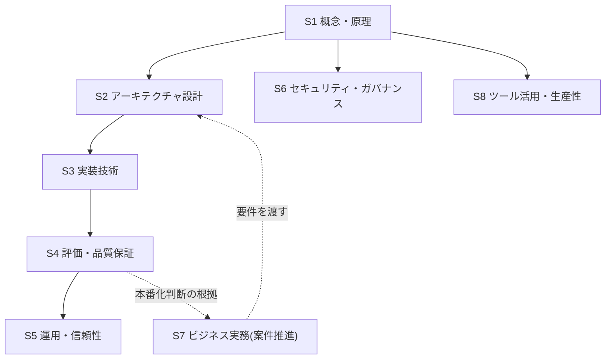

# AI Agent プロフェッショナルのスキルマップ

## この記事の目的

AI Agent を実務で扱うために必要なスキルを 8 つの領域に整理し、自分(またはチームメンバー)の現在地を自己評価して「次に何をどこまで深めるか」を決められるようになります。[学習ロードマップ](learning-roadmap.md)が「どの順で読むか」を示すのに対し、本記事は「どこまで深めるか」の軸を提供します。

## 対象読者

- 基礎を学び終え、実務レベル・専門レベルへ進みたいソフトウェアエンジニア
- チームメンバーの育成計画やスキル要件を設計するテックリード・エンジニアリングマネージャー

## 前提知識

- [AI Agent 学習ロードマップ](learning-roadmap.md) — セクション構成と読者タイプ別ルート
- [AI Agent とは何か](../01-concepts/what-is-an-ai-agent.md) — 8 領域すべてが前提とする基本概念

## 本文

### 概要: スキルマップの使い方

本ライブラリでは「AI Agent プロフェッショナル」を、次の 8 領域を実務レベル以上で扱える人と定義します。使い方は 3 ステップです。

1. 8 領域それぞれについて、自分の現在地(入門 / 実務 / 専門)を自己評価する
2. 自分の役割像に照らして、重点的に伸ばす領域を 2〜3 つ選ぶ
3. 「ライブラリ内の学習パス対応」から該当ドキュメントを読み、実践課題で確かめる

領域どうしの関係は次のとおりです。技術領域(S1〜S6・S8)は概念(S1)を根とした依存関係を持ち、ビジネス実務(S7)は要件と本番化判断を通じて技術領域と行き来します。

### 8 つのスキル領域と到達レベル

| # | スキル領域 | 中心の問い | 主担当セクション |
| --- | --- | --- | --- |
| S1 | 概念・原理の理解 | Agent はどういう仕組みで動くのか | [01-concepts](../01-concepts/README.md) |
| S2 | アーキテクチャ設計 | どんな構成にすべきか(そもそも Agent にすべきか) | [02-architecture](../02-architecture/README.md) |
| S3 | 実装技術 | どう書くか(ツール定義・プロンプト・モデル選定) | [03-implementation](../03-implementation/README.md) |
| S4 | 評価・品質保証 | 品質をどう測り、劣化をどう検知するか | [04-evaluation](../04-evaluation/README.md) |
| S5 | 運用・信頼性 | 本番で安定して動かし続けられるか | [05-operations](../05-operations/README.md) |
| S6 | セキュリティ・ガバナンス | 何が脅威で、どう防ぐか | [06-security](../06-security/README.md) |
| S7 | ビジネス実務(案件推進) | 何をやるか・どう本番に届けるか・投資に見合うか | [09-business](../09-business/README.md) |
| S8 | ツール活用・生産性 | コーディングエージェントをどう使いこなすか | [08-coding-agents](../08-coding-agents/README.md) |

到達レベルは、資格や年数ではなく **観察可能な行動** で定義します。自己評価では「説明できるか」ではなく「直近 3〜6 か月で実際にやったか」で判定してください。

| 到達レベル | 目安となる行動 |
| --- | --- |
| 入門 | 領域の用語と全体像を説明でき、他者の設計・コード・レポートを読んで理解できる |
| 実務 | 自分で設計・実装・レビューを担当でき、選択肢のトレードオフを根拠付きで説明できる |
| 専門 | 組織の標準(ガイドライン・評価基盤・ガードレール・推進プロセス)を設計し、他者を指導できる |

### 役割像別の重点マップ

全領域を同時に専門レベルへ伸ばす必要はありません。代表的な 4 つの役割像ごとに、目指す水準の目安を示します(◎ = 専門を目指す / ○ = 実務レベル / △ = 入門レベルで可)。

| 領域 | Agent エンジニア | Agent アーキテクト | 評価・運用担当 | テックリード(導入推進) |
| --- | --- | --- | --- | --- |
| S1 概念・原理 | ○ | ◎ | ○ | ○ |
| S2 アーキテクチャ設計 | ○ | ◎ | △ | ○ |
| S3 実装技術 | ◎ | ○ | △ | △ |
| S4 評価・品質保証 | ◎ | ○ | ◎ | ○ |
| S5 運用・信頼性 | ○ | ○ | ◎ | △ |
| S6 セキュリティ・ガバナンス | ○ | ◎ | ○ | ○ |
| S7 ビジネス実務 | △ | ○ | △ | ◎ |
| S8 ツール活用・生産性 | ○ | △ | △ | ◎ |

役割像は排他的な職種ではなく「同一人物が段階的に広げていく重心」です。小さなチームでは 1 人がエンジニアとテックリードを兼ねることも普通で、その場合は両列の ◎ を足し合わせて優先順位を付けます。

### ライブラリ内の学習パス対応

各領域を伸ばすときの入口と、実務レベルに進むための代表ドキュメントです(網羅リストは各セクションの README を参照)。

| 領域 | まず読む(入門) | 実務レベルへ |
| --- | --- | --- |
| S1 | [AI Agent とは何か](../01-concepts/what-is-an-ai-agent.md) | [01-concepts](../01-concepts/README.md) を README の順にすべて |
| S2 | [Workflow 型 vs Agent 型](../02-architecture/workflow-vs-agent.md) | [コンテキストエンジニアリング](../02-architecture/context-engineering.md)、[Human-in-the-Loop 設計](../02-architecture/human-in-the-loop.md) ほか 02 全体 |
| S3 | [ツール定義の設計](../03-implementation/tool-definition-design.md) | [Agent 向けプロンプト設計](../03-implementation/agent-prompt-design.md)、[モデル選定ガイド](../03-implementation/model-selection.md)、`examples/` の写経 |
| S4 | [Agent 評価の基礎](../04-evaluation/agent-evaluation-basics.md) | [LLM-as-a-Judge](../04-evaluation/llm-as-a-judge.md)、[回帰テストと CI 組み込み](../04-evaluation/regression-testing.md) |
| S5 | [可観測性とトレーシング](../05-operations/observability-and-tracing.md) | [コスト管理](../05-operations/cost-management.md)、[インシデント対応](../05-operations/incident-response.md) |
| S6 | [Agent の脅威モデル概観](../06-security/threat-model-overview.md) | [プロンプトインジェクション](../06-security/prompt-injection.md)、[ガードレール](../06-security/guardrails.md) |
| S7 | [ユースケース発見と要件定義](../09-business/usecase-discovery.md) | [PoC から本番への進め方](../09-business/poc-to-production.md) |
| S8 | [AI コーディングエージェントの分類と全体像](../08-coding-agents/coding-agents-overview.md) | [選定基準](../08-coding-agents/coding-agent-selection.md)、[セキュリティ](../08-coding-agents/coding-agent-security.md) ほか 08 全体 |

専門レベルへ進むための advanced ドキュメント([マルチテナント設計](../02-architecture/multi-tenancy-and-isolation.md)、[RAG 実装パターン](../03-implementation/rag-implementation-patterns.md)、[評価データセットの構築と保守](../04-evaluation/evaluation-datasets.md)、[デプロイとスケーリング](../05-operations/deployment-and-scaling.md)、[エージェントの認証・認可](../06-security/agent-identity-and-auth.md)など)も各セクションに収録しています。執筆状況は各セクション README の収録予定表で確認してください。

### 実践で伸ばす方法(社内題材の選び方)

読むだけで実務レベルには到達できません。レベルを上げるには、実際の題材で作り・測り・直すサイクルが必要です。社内で実践題材を選ぶときの条件は次の 4 つです。

1. **失敗しても業務が止まらない**(自分たちが被害者になれる範囲)
2. **結果を検証できる**(正解データや人のレビューで良し悪しを判定できる)
3. **データとツールにプログラムからアクセスできる**(交渉だけで数か月かかる題材を避ける)
4. **繰り返し発生する**(1 回きりの作業では改善ループが回らない)

レベル遷移ごとの実践課題の例です。

| 遷移 | 実践課題の例 |
| --- | --- |
| 入門 → 実務 | `examples/` を参考に最小の Agent ループを自作する / 社内業務 1 つを[要件定義の型](../09-business/usecase-discovery.md)で書き切る / 10 ケースの評価データセットと採点スクリプトを作る |
| 実務 → 専門 | チームのルールファイル・実装ガイドラインを策定して運用する / 複数案件で使い回せる評価ハーネスを整備する / 新規案件の脅威モデルレビューを主催する / PoC → 本番の関門プロセスを組織に導入する |

## 実務での注意点

### アンチパターン

- **8 領域すべてを同時に伸ばそうとする** → 学習が広く浅く止まり、どの領域でも実務を任せられない → 役割像で重点 2〜3 領域を選び、他は入門で維持する
- **ツール操作(S8)の習熟だけで「Agent に強い」と見なす** → 原理(S1)と評価(S4)が欠けると、ツールの外(自作 Agent・品質問題)で応用が利かない → S8 と並行して S1・S4 の入門を済ませる
- **スキル評価を自己申告の「知っている / 知らない」で行う** → 過大評価に偏り、育成計画が機能しない → 「直近 3〜6 か月で実際にやったか」と成果物(設計書・評価ハーネス・レビュー記録)で判定する

### チェックリスト

- [ ] 8 領域それぞれの現在地(入門 / 実務 / 専門)を、行動ベースで自己評価した
- [ ] 自分の役割像を決め、重点的に伸ばす領域を 2〜3 つ選んだ
- [ ] 重点領域の「実務レベルへ」のドキュメントを学習計画に入れた
- [ ] 4 条件(失敗許容・検証可能・アクセス可能・反復性)を満たす実践題材を 1 つ決めた
- [ ] (チームの場合)メンバーごとの重点領域が重複しすぎず、S4・S6 を担う人がいることを確認した

## 関連トピック

- [AI Agent 学習ロードマップ](learning-roadmap.md) — 「どの順で読むか」の正本。本記事の自己評価後に読む順序を決める
- [ユースケース発見と要件定義](../09-business/usecase-discovery.md) — S7(ビジネス実務)の最初の 1 本
- [PoC から本番への進め方](../09-business/poc-to-production.md) — S7 の 2 本目。実践題材を本番まで運ぶ方法論
- [よくあるアンチパターン集](../07-case-studies/common-anti-patterns.md) — 8 領域を横断する失敗の共通根。自己評価の答え合わせに使える

## 参考資料

- なし(AI Agent のスキル体系には 2026-07 時点で業界標準が確立しておらず、本記事は本ライブラリの章構成と収録ドキュメントに基づく独自の整理のため)

## TODO・未確認事項

なし(スキル領域とドキュメントの対応表は、新しいドキュメントの追加時に本記事も同期更新する運用とします)
