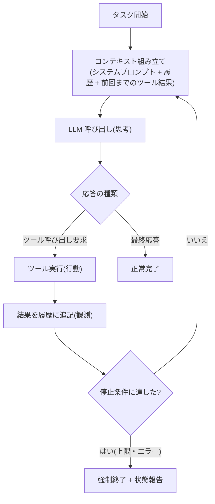

# Agent ループ

## この記事の目的

Agent ループの 1 周で何が起きているかを説明でき、**停止条件・エラーの返し方・履歴の増加**という 3 つの設計ポイントを、自分のシステムに当てはめて判断できるようになります。

## 対象読者

- 初めて Agent ループを実装するアプリケーションエンジニア
- フレームワークを使っているが、その抽象の下で何が起きているかを理解したいエンジニア

## 前提知識

- [AI Agent とは何か](what-is-an-ai-agent.md) — Agent の定義と構成要素
- LLM API の基本(チャット履歴を渡して応答を得る流れ)

## 本文

### 概要: ループが Agent を作る

LLM API の 1 回の呼び出しは、入力に対して 1 つの応答を返すだけの、状態を持たない関数に近いものです。Agent らしい振る舞い — 状況を見て、行動し、結果を確かめて次を決める — は、この呼び出しを「**観測 → 思考 → 行動**」のサイクルで繰り返すことで生まれます。この繰り返しの制御構造が **Agent ループ(agent loop)** です。



### 詳細: 1 イテレーションの分解

ループの 1 周は次の 5 段階で構成されます。

1. **コンテキスト組み立て** — システムプロンプト・会話履歴・これまでのツール結果をまとめて入力を作ります。何を入れ、何を削るかが品質とコストを左右します
2. **LLM 呼び出し** — モデルが状況を解釈し、次の一手を決めます
3. **応答の解釈** — 応答は「ツール呼び出し要求」か「最終応答」のどちらかです。ツール要求なら続行、最終応答なら正常完了です
4. **ツール実行と結果の追記** — アプリケーション側でツールを実行し、結果(成功でも失敗でも)を履歴に追記します。これが次の周の「観測」になります
5. **停止判定** — 正常完了以外に、上限やエラーによる強制終了を判定します

### 詳細: 停止条件は「正常完了」以外に必ず用意する

モデルが最終応答を返すことだけを終了条件にすると、判断を誤ったときに止まりません。停止条件は最低でも次の 4 系統を設計します。

| 停止条件 | トリガー | 終了時にやること |
| --- | --- | --- |
| 正常完了 | モデルがツールを呼ばず最終応答を返す | 成果物を返す |
| 上限到達 | 最大ステップ数 / タイムアウト / コスト上限 | 途中経過と未完了理由を報告する |
| エラー確定 | 回復不能なエラー(認証失敗、対象消失など) | エラー内容と実行済みの操作を報告する |
| 人間の介入 | ユーザーのキャンセル / 承認拒否 | 状態を保存し、再開可能にする |

強制終了時に**途中経過を捨てない**ことが重要です。20 ステップ分の作業結果は、未完了でもユーザーにとって価値があります。

### 詳細: ツールの失敗はループに返す

ツール実行の失敗を例外としてループの外に投げると、モデルは何が起きたかを知る機会を失います。エラーメッセージは**モデルへの観測データ**です。「引数の形式が違う」「対象が見つからない」といった情報を履歴に返せば、モデルは引数を直す・別の手段を試すといった回復行動を取れます。リトライをコード側で行うかモデルに任せるかの使い分けは [エラー処理・リトライ・フォールバック設計](../02-architecture/error-handling-and-retries.md) で扱います。

### 詳細: 履歴は単調増加する

ループが回るたびに、履歴にはモデルの応答とツール結果が追記され続けます。長いタスクではコンテキストウィンドウの上限・入力トークンのコスト・重要情報の埋没という 3 つの問題に必ず突き当たります。対処(刈り込み・要約・外部化)は [メモリと状態管理](memory-and-state.md) を参照してください。

### 設計判断: ループを自前で書くか、フレームワークに任せるか

| 選択 | 向いている状況 | 注意点 |
| --- | --- | --- |
| 自前実装 | 制御・ログ・権限チェックを細かく握りたい。仕組みを学びたい | ループ自体は数十行。周辺(リトライ・監視)の作り込みは必要 |
| フレームワーク | 標準的な構成で早く作りたい。周辺機能(履歴管理・トレース)込みで欲しい | 抽象の下の挙動(停止条件のデフォルト等)を把握しないとデバッグできない |

どちらを選ぶ場合でも、**一度は最小のループを自分で書いてみる**ことを推奨します。以下のとおり、本質は短いコードです。

### 実装例: 最小の Agent ループ

ベンダー中立の擬似コードです(実際の API 呼び出し部分は各 SDK に読み替えてください)。

```python
MAX_STEPS = 20

def run_agent(task: str) -> str:
    history = [user_message(task)]
    for step in range(MAX_STEPS):
        response = llm_call(SYSTEM_PROMPT, history, TOOLS)
        history.append(response)

        if not response.tool_calls:          # 最終応答 = 正常完了
            return response.text

        for call in response.tool_calls:     # 行動
            try:
                result = execute_tool(call)  # 実行はアプリ側の責務
            except ToolError as e:
                result = f"ツールエラー: {e}"  # 失敗も観測としてモデルに返す
            history.append(tool_result_message(call, result))

    raise StepLimitExceeded("最大ステップ数に達しました")  # 上限による強制終了
```

## 実務での注意点

### アンチパターン

- **停止条件がモデル任せだけ** → モデルが「完了」を出し損ねると無限に回り、コストが暴走する → 最大ステップ数・タイムアウト・コスト上限を必ずコード側に置く
- **ツールエラーで例外を投げてループごと落とす** → モデルに回復のチャンスがなく、1 回の一時的な失敗でタスク全体が失敗する → エラーを観測として履歴に返す
- **ループの中身を記録しない** → 「たまに変な動きをする」を再現も分析もできない → 各イテレーションの入出力・ツール結果を記録する(`observability-and-tracing.md`、執筆予定)

### チェックリスト

- [ ] 最大ステップ数・タイムアウト・コスト上限がコード側で設定されている
- [ ] ツール失敗時にエラー内容がモデルへ観測として返る
- [ ] 各イテレーションの入出力が記録されている
- [ ] 副作用のあるツールについて、リトライ時の二重実行(冪等性)を考慮した
- [ ] 強制終了時に途中経過と未完了理由をユーザーへ報告する

## 関連トピック

- [AI Agent とは何か](what-is-an-ai-agent.md) — ループが Agent の構成要素の 1 つであることの全体像
- [ツール使用](tool-use.md) — ループ内の「行動」の仕組みの詳細
- [メモリと状態管理](memory-and-state.md) — 履歴の増加への対処
- [プランニングと推論](planning-and-reasoning.md) — ループ内の「思考」の設計
- [エラー処理・リトライ・フォールバック設計](../02-architecture/error-handling-and-retries.md) — リトライ・フォールバックの設計

## 参考資料

- [Building Effective Agents(Anthropic)](https://www.anthropic.com/research/building-effective-agents) — ループを含む Agent の基本構成の整理(アクセス日: 2026-07-05)

## TODO・未確認事項

> **TODO(要確認):** 主要フレームワーク(Claude Agent SDK、LangGraph 等)のループ実装が持つ停止条件のデフォルト値を各公式ドキュメントで確認する(最終確認: 2026-07)
