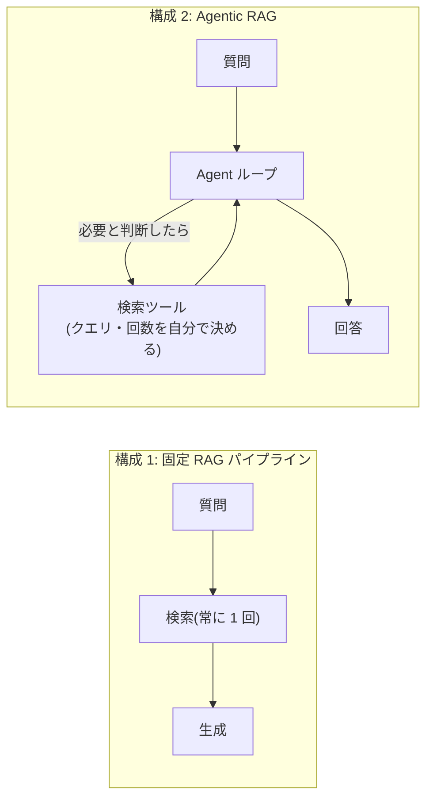

# RAG と Agent の関係・使い分け

## この記事の目的

「RAG か Agent か」という問いを正しく分解できるようになります。RAG と Agent は二者択一ではなく直交する設計要素であることを理解し、固定 RAG パイプライン・Agentic RAG・検索なしのどれで作るかを判断できる状態がゴールです。

## 対象読者

- 社内ナレッジ検索・質問応答システムの実現方式を選定するエンジニア
- 既存の RAG システムの限界(複雑な質問に答えられない)に直面しているエンジニア

## 前提知識

- [AI Agent とは何か](what-is-an-ai-agent.md) — Workflow 型と Agent の区別
- [ツール使用](tool-use.md) — 検索をツールとして渡す仕組み

## 本文

### 概要: RAG と Agent は軸が違う

検索拡張生成(RAG: Retrieval-Augmented Generation)とは、外部の知識ソースを検索し、結果を LLM の入力に加えて、回答の根拠にする手法です。

「RAG vs Agent」という比較をよく見かけますが、この 2 つは対立概念ではありません。**RAG は「知識をどう与えるか」、Agent は「制御をどう与えるか」** — 軸が異なるため、組み合わせ自由です。実際にこの問いが意味しているのはたいてい「検索を固定パイプラインで行うか、Agent の判断に任せるか」であり、それは [Workflow 型 vs Agent 型の使い分け](../02-architecture/workflow-vs-agent.md) と同じ構図です。

### 詳細: 3 つの構成

1. **固定 RAG パイプライン** — 検索 → 生成の手順をコードで固定します。速い・安い・予測可能で、検索が必ず 1 回で済む定型質問に向きます
2. **Agentic RAG** — 検索をツールとして Agent に渡します。検索するかどうか・どんなクエリで・何回検索するかをモデルが判断するため、クエリの再構成、複数ソースの横断、絞り込みの反復ができます。その分、遅く・高くなります
3. **検索なし** — 知識ソースが小さく静的なら(数十ページの規定集など)、検索せず全文をコンテキストに入れる構成も 2026 年時点では現実的です。ただし毎回の入力コストと、ソースが成長したときの限界に注意します

### 設計判断: どれで作るか

| 状況 | 推奨構成 |
| --- | --- |
| 質問が定型的で、1 回の検索で答えられる | 固定 RAG パイプライン |
| クエリの言い換え・複数ソース横断・絞り込みの反復が必要 | Agentic RAG |
| 検索結果を使った計算・比較・突き合わせまで必要 | Agentic RAG(検索以外のツールも渡す) |
| 知識ソースが小さく静的 | 検索なし(全文投入)も検討 |

どの構成でも土台になるのは**検索そのものの品質**です。インデックス・チャンク分割・クエリの質が悪ければ、Agentic にしても「悪い検索を何度も繰り返す」だけです。検索品質は回答品質と分けて単体で評価します(`agent-evaluation-basics.md`、執筆予定)。

### 例: 同じ知識ソースでも質問で構成が変わる

社内規定の問い合わせシステムを考えます。

- 「有給休暇の繰越上限は?」 → 規定を 1 回検索すれば答えられます。**固定 RAG で十分**です
- 「今年の残り有給と規定を踏まえると、最長で何連休を作れますか?」 → 複数の規定(繰越・計画年休・連続取得)の検索、勤怠データの照会、計算の組み合わせが必要です。**Agentic RAG(+ 計算ツール)** の領域です

利用者の質問の大半が前者なら、固定 RAG で作って後者のパターンには「担当者への引き継ぎ」で対応するのが、コストと信頼性のバランスの良い初手です。

## 実務での注意点

### アンチパターン

- **定型 FAQ に Agentic RAG を使う** → コストとレイテンシが増えるだけで回答品質は上がらない → 固定 RAG から始め、足りない証拠(答えられない質問のログ)が出てから Agentic 化する
- **検索品質の問題を Agent 化で解決しようとする** → 検索が悪ければ、賢いループでも悪い結果を繰り返すだけ → インデックス・チャンク分割・クエリ生成を先に直す
- **出典を返さない** → 利用者が回答の根拠を確認できず、誤答が発覚したときに信頼を全て失う → 回答に出典(文書名・箇所)を必ず付ける

### チェックリスト

- [ ] Agentic RAG を選ぶ場合、固定 RAG で足りない具体的な理由を説明できる
- [ ] 検索品質(必要な文書が上位に来るか)を回答品質と分けて評価している
- [ ] 回答に出典が付いている
- [ ] 知識ソースの更新頻度と再インデックスの運用が決まっている
- [ ] 答えられない質問のログを取り、構成を見直す材料にしている

## 関連トピック

- [AI Agent とは何か](what-is-an-ai-agent.md) — Workflow 型 vs Agent という同型の判断
- [ツール使用](tool-use.md) — 検索をツールにする仕組み
- [メモリと状態管理](memory-and-state.md) — 長期記憶の読み出しとしての検索
- [コンテキストエンジニアリング](../02-architecture/context-engineering.md) — 検索結果をコンテキストにどう組み込むか

## 参考資料

- [Retrieval-Augmented Generation for Knowledge-Intensive NLP Tasks](https://arxiv.org/abs/2005.11401) — RAG の原論文(アクセス日: 2026-07-05)

## TODO・未確認事項

> **TODO(要確認):** 埋め込みモデル・検索手法(ハイブリッド検索・リランキング等)の有力な選択肢は変化が速いため、実装選定時に公開ベンチマーク(MTEB 等)と各ベンダーの公式ドキュメントで最新の比較情報を確認する(最終確認: 2026-07)
