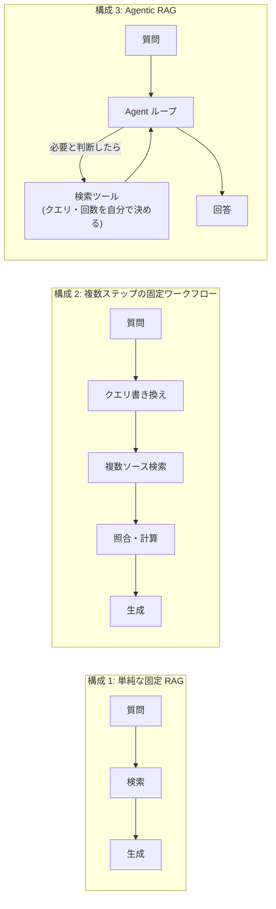

# RAG と Agent の関係・使い分け

## この記事の目的

「RAG か Agent か」という問いを正しく分解できるようになります。RAG と Agent は二者択一ではなく直交する設計要素であることを理解し、単純な固定 RAG・複数ステップの固定ワークフロー・Agentic RAG・検索なしのどれで作るかを判断できる状態がゴールです。

## 対象読者

- 社内ナレッジ検索・質問応答システムの実現方式を選定するエンジニア
- 既存の RAG システムの限界(複雑な質問に答えられない)に直面しているエンジニア

## 前提知識

- [AI Agent とは何か](what-is-an-ai-agent.md) — Workflow 型と Agent の区別
- [ツール使用](tool-use.md) — 検索をツールとして渡す仕組み

## 本文

### 概要: RAG と Agent は軸が違う

検索拡張生成(RAG: Retrieval-Augmented Generation)とは、外部の知識ソースを検索し、結果を LLM の入力に加えて、回答の根拠にする手法です。

「RAG vs Agent」という比較をよく見かけますが、この 2 つは対立概念ではありません。**RAG は「知識をどう与えるか」、Agent は「制御をどう与えるか」** — 軸が異なるため、組み合わせ自由です。実際にこの問いが意味しているのはたいてい「検索を固定パイプラインで行うか、Agent の判断に任せるか」であり、それは [Workflow 型 vs Agent 型の使い分け](../02-architecture/workflow-vs-agent.md) と同じ構図です。

### 詳細: 検索を使う 3 つの構成と検索なしの選択肢

```mermaid
flowchart LR
    subgraph P["構成 1: 単純な固定 RAG"]
        Q1["質問"] --> S1["検索"] --> G1["生成"]
    end
    subgraph W["構成 2: 複数ステップの固定ワークフロー"]
        Q3["質問"] --> R3["クエリ書き換え"] --> S3["複数ソース検索"] --> C3["照合・計算"] --> G3["生成"]
    end
    subgraph A["構成 3: Agentic RAG"]
        Q2["質問"] --> L2["Agent ループ"]
        L2 -- "必要と判断したら" --> S2["検索ツール<br/>(クエリ・回数を自分で決める)"]
        S2 --> L2
        L2 --> G2["回答"]
    end
```

1. **単純な固定 RAG** — 検索 → 生成の手順をコードで固定します。定型質問を少ない処理段数で扱う出発点です
2. **複数ステップの固定ワークフロー** — クエリ書き換え、複数ソースの並列検索、照会・計算、必要なら上限付き再検索を事前定義した手順で実行します。個々の段で LLM を使っても、実行経路をコードが決める構成です
3. **Agentic RAG** — 検索をツールとして Agent に渡し、入力や途中結果に応じた次の検索先・ツール・続行の選択をモデルに委ねます。事前に列挙しにくい探索に適用し、処理数・費用・停止条件を制限します

**検索なし**も別の選択肢です。知識ソースが入力枠に収まるなら全文投入を評価できます。ただし、毎回の入力コスト、必要箇所を参照できるか、ソースの成長時に収まるかを確認します。

固定ワークフローと Agent の違いは、検索の回数や計算の有無だけでは決まりません。**入力や途中結果に応じた実行経路を、事前定義したコードとモデルのどちらが選ぶか**が選定軸です。この区別は [Building effective agents](https://www.anthropic.com/engineering/building-effective-agents) の設計上の整理に従います。

### 設計判断: どれで作るか

| 状況 | 推奨構成 |
| --- | --- |
| 質問が定型的で、単純な検索で答えられる | 単純な固定 RAG |
| 言い換え・複数ソース検索・絞り込みの手順や分岐を事前に決められる | 複数ステップの固定ワークフロー |
| 照会先と計算・比較の手順が定型化できる | 検索・照会・計算を組み込んだ固定ワークフロー |
| 入力や途中結果により探索経路が大きく変わり、モデルによる経路選択が必要 | Agentic RAG。固定ワークフローとの比較評価で採否を決める |
| 知識ソースが小さく静的 | 検索なし(全文投入)も検討 |

どの構成でも土台になるのは**検索そのものの品質**です。インデックス・チャンク分割・クエリの質が悪ければ、Agentic にしても「悪い検索を何度も繰り返す」だけです。検索品質は回答品質と分けて単体で評価します([Agent 評価の基礎](../04-evaluation/agent-evaluation-basics.md))。

### 例: 同じ知識ソースでも質問で構成が変わる

社内規定の問い合わせシステムを考えます。

- 「有給休暇の繰越上限は?」 → 規定を 1 回検索すれば答えられます。**固定 RAG で十分**です
- 「今年の残り有給と規定を踏まえると、最長で何連休を作れますか?」 → 規定検索・勤怠照会・計算の順序が決まるなら、**固定ワークフローで実装できます**。途中で見つかる条件に応じて調査先や手段を柔軟に選ぶ必要があり、定義済み経路では対応できない部分に Agentic RAG を検討します

利用者の質問の大半が前者なら、単純な固定 RAG から始めます。後者が頻出するなら固定ワークフローを追加し、まれな未対応質問は担当者へ引き継ぐ構成も選べます。自律的な探索を追加する前に、対応率・費用・レイテンシ・失敗時の影響を比較します。

## 実務での注意点

### アンチパターン

- **複数の検索や計算があるだけで Agentic RAG を使う** → 固定ワークフローでも満たせる要件に、経路選択の不確実性と検証範囲を増やす → 単純な固定 RAG、複数ステップの固定ワークフローと比較し、自律的探索が必要な部分を特定する
- **検索品質の問題を Agent 化で解決しようとする** → 検索が悪ければ、賢いループでも悪い結果を繰り返すだけ → インデックス・チャンク分割・クエリ生成を先に直す
- **出典を返さない** → 利用者が回答の根拠を確認できず、誤答が発覚したときに信頼を全て失う → 回答に出典(文書名・箇所)を必ず付ける

### チェックリスト

- [ ] Agentic RAG を選ぶ場合、複数ステップの固定ワークフローでも足りない経路選択の要件を説明できる
- [ ] 検索品質(必要な文書が上位に来るか)を回答品質と分けて評価している
- [ ] 回答に出典が付いている
- [ ] 知識ソースの更新頻度と再インデックスの運用が決まっている
- [ ] 答えられない質問のログを取り、構成を見直す材料にしている

## 関連トピック

- [AI Agent とは何か](what-is-an-ai-agent.md) — Workflow 型 vs Agent という同型の判断
- [ツール使用](tool-use.md) — 検索をツールにする仕組み
- [メモリと状態管理](memory-and-state.md) — 長期記憶の読み出しとしての検索
- [コンテキストエンジニアリング](../02-architecture/context-engineering.md) — 検索結果をコンテキストにどう組み込むか

## 参考資料

- [Retrieval-Augmented Generation for Knowledge-Intensive NLP Tasks](https://arxiv.org/abs/2005.11401) — RAG の原論文(アクセス日: 2026-07-05)
- [Building effective agents(Anthropic)](https://www.anthropic.com/engineering/building-effective-agents) — 事前定義した経路を持つワークフローと、モデルが経路を選ぶ Agent の区別(アクセス日: 2026-09-10)

## TODO・未確認事項

> **TODO(要確認):** 埋め込みモデル・検索手法(ハイブリッド検索・リランキング等)の有力な選択肢は変化が速いため、実装選定時に公開ベンチマーク(MTEB 等)と各ベンダーの公式ドキュメントで最新の比較情報を確認する(最終確認: 2026-07)
