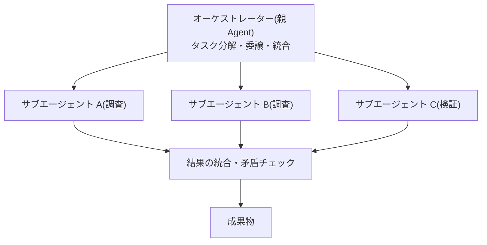

# シングルエージェントとマルチエージェント

## この記事の目的

マルチエージェント化の正当な動機(コンテキスト分離・並列化・専門化・権限分離)と、その代償を理解し、「シングルで粘るべきか、マルチに進むべきか」をシグナルに基づいて判断できるようになります。

## 対象読者

- シングル Agent の限界(コンテキスト溢れ・役割の混線)を感じ始めたエンジニア
- 「マルチエージェントにしたい」という要望の妥当性を評価する立場のテックリード

## 前提知識

- [AI Agent とは何か](what-is-an-ai-agent.md) — 自律性のスペクトラム(マルチはその右端)
- [Agent ループ](agent-loop.md) — 1 つのループの構造
- [メモリと状態管理](memory-and-state.md) — コンテキストの制約

## 本文

### 概要

- **シングルエージェント** — 1 つの Agent ループが、すべてのツールと文脈を持って動く構成
- **マルチエージェント(multi-agent)** — 複数の Agent ループが分担・協調する構成。それぞれのループは独立したコンテキストを持ちます

「独立したコンテキストを持つ」ことがマルチエージェントの本質です。利点も代償も、ほぼすべてここから派生します。

### 詳細: マルチにする 4 つの動機

| 動機 | 内容 | 例 |
| --- | --- | --- |
| コンテキスト分離 | 大量の読み込み・探索をサブエージェントに任せ、親は結論だけ受け取る | 調査タスク: 資料 100 件の精査を分担し、親は要約を統合 |
| 並列化 | 独立したサブタスクを同時に実行する | 複数観点のレビューを同時実行 |
| 専門化 | 役割ごとにプロンプト・ツールセットを最適化する | 「調査役」と「執筆役」でツールと指示を分ける |
| 権限分離 | 危険なツールを持つ Agent を限定し、監督下に置く | 削除権限を持つ Agent は承認付きでのみ起動 |

実務で最も価値が出やすいのは**コンテキスト分離**です。サブエージェントが大量のトークンを消費しても、親のコンテキストは汚れません。

### 詳細: 代償

- **文脈の断絶** — サブエージェントは親の会話履歴を知りません。委譲時に目的・制約・前提を明示的に詰めないと、意図とずれた成果物が返ります(伝言ゲームの劣化)
- **デバッグの複雑化** — 障害の原因が複数のループにまたがり、追跡が難しくなります
- **コストの増加** — 同じ資料の重複読み込みや調整のやり取りが発生し、トークン消費はシングル比で数倍になりえます
- **統合の難しさ** — サブエージェントの成果物同士の矛盾・重複の検出は、親(または統合ステップ)の仕事として残ります

### 詳細: 基本形

- **オーケストレーター型** — 親がタスクを分解してサブエージェントに委譲し、結果を統合します。最も一般的な形です
- **パイプライン型** — 「調査 → 執筆 → 校閲」のように直列に受け渡します
- **生成・批評型(generator-critic)** — 作る Agent と評価する Agent を分けます。リフレクション([プランニングと推論](planning-and-reasoning.md))の多エージェント版で、同一コンテキストでの自己評価より批判が効きやすくなります

より詳細なパターンと、組織・システム境界を越える外部エージェント連携(A2A 等の標準プロトコル)は [オーケストレーションパターン](../02-architecture/orchestration-patterns.md) で扱います。

### 設計判断: まずシングルで粘る

マルチエージェントは複雑性の先払いです。次の**シグナル**が出るまでは、シングル + プロンプト・ツールの改善を優先します。

1. コンテキストが常態的に溢れる(圧縮では追いつかない)
2. 1 つのプロンプトに矛盾する役割要求が同居している(例: 大胆に書く執筆者と、厳しく削る校閲者)
3. 独立して並列実行できるサブタスクが明確に存在する
4. ツール権限を分離したい明確な理由がある

どれにも当てはまらないのに Agent の品質が低いなら、原因はマルチ化で解決しない場所(プロンプト・ツール定義・検索品質)にあります。

## 実務での注意点

### アンチパターン

- **人間の組織図を模して Agent を分ける**(営業 Agent・法務 Agent・企画 Agent…)→ 人間の分業の前提(専門知識・作業時間の制約)は LLM に当てはまらず、文脈断絶のコストだけが残る → 役割ではなく「コンテキストと権限の境界」で分ける
- **曖昧な委譲指示** → サブエージェントが親の意図を推測で補い、ずれた成果物に工数を費やす → 委譲時に目的・制約・出力形式・完了条件を明示する
- **シングルの改善を試す前のマルチ化** → プロンプト整理で直る問題に、分散システムの複雑性を持ち込む → 上のシグナルに該当するかを先に確認する

### チェックリスト

- [ ] マルチ化の動機が 4 つ(分離・並列・専門化・権限)のいずれかに該当する
- [ ] サブエージェントへの指示テンプレートに目的・制約・出力形式・完了条件が含まれる
- [ ] 成果物の統合時に矛盾・重複を検出する仕組みがある
- [ ] トークンコストの増加(シングル比)を見積もった
- [ ] 障害時にどの Agent の問題かを特定できるログがある

## 関連トピック

- [AI Agent とは何か](what-is-an-ai-agent.md) — 自律性スペクトラム上の位置づけ
- [プランニングと推論](planning-and-reasoning.md) — 生成・批評分離の単一 Agent 版(リフレクション)
- [メモリと状態管理](memory-and-state.md) — コンテキスト分離が効く理由
- [オーケストレーションパターン](../02-architecture/orchestration-patterns.md) — 協調パターンの詳細と外部エージェント連携

## 参考資料

- [How we built our multi-agent research system(Anthropic)](https://www.anthropic.com/engineering/built-multi-agent-research-system) — オーケストレーター型の実運用知見(アクセス日: 2026-07-05)
- [Building Effective Agents(Anthropic)](https://www.anthropic.com/research/building-effective-agents) — 「シンプルな構成から始める」原則(アクセス日: 2026-07-05)

## TODO・未確認事項

> **TODO(要確認):** エージェント間連携の標準プロトコル(A2A 等)の成熟度・採用状況を公式仕様とコミュニティ動向で確認する(最終確認: 2026-07)
