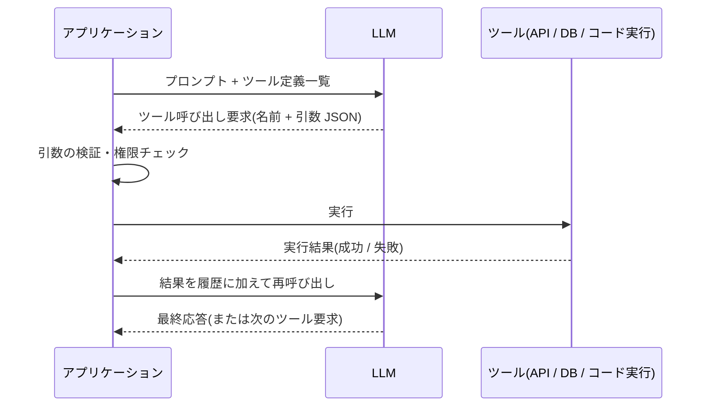

# ツール使用(Tool Use / Function Calling)

## この記事の目的

ツール使用の仕組みを正しく説明できるようになります。特に「**モデルはツールを実行しない**」という事実の設計上の意味を理解し、ツールの粒度と結果の返し方を自分で設計できる状態がゴールです。

## 対象読者

- ツール使用型の Agent を初めて実装するアプリケーションエンジニア
- ツールの設計(何をツールにするか、結果をどう返すか)に責任を持つエンジニア

## 前提知識

- [AI Agent とは何か](what-is-an-ai-agent.md) — Agent の構成要素
- [Agent ループ](agent-loop.md) — ツール使用が組み込まれるループの全体像

## 本文

### 概要: モデルはツールを「実行しない」

ツール使用(tool use)とは、LLM に利用可能な機能の一覧(名前・説明・入力スキーマ)を渡し、モデルが「この機能をこの引数で呼びたい」という**構造化された要求**を出力し、**実行はアプリケーション側が行って**結果をモデルに返す仕組みです。関数呼び出し(function calling)とも呼ばれ、同じ機構を指します。

「モデルは実行要求を出すだけで、実行しない」— この一点が安全設計の土台です。実行の手前にアプリケーションのコードが必ず挟まるため、検証・権限チェック・人間の承認をそこに置けます。



### 詳細: ツール定義の 3 要素

| 要素 | 役割 | 設計のポイント |
| --- | --- | --- |
| 名前 | モデルが要求で指定する識別子 | 動詞 + 対象で具体的に(`search_expenses`) |
| 説明文 | モデルが「いつ使うか」を判断する唯一の材料 | **プロンプトの一部**として書く。用途・制約・使わない場面まで |
| 入力スキーマ | 引数の構造(JSON Schema) | 各引数に説明と形式例を付ける |

説明文の質がツール選択の精度を直接決めます。定義例:

```json
{
  "name": "search_expenses",
  "description": "社員の経費精算履歴を検索します。精算の状況・金額・日付の照会に使います。経費の新規申請や修正はできません(照会専用)。",
  "input_schema": {
    "type": "object",
    "properties": {
      "employee_id": { "type": "string", "description": "社員 ID(例: E12345)" },
      "month": { "type": "string", "description": "対象月。YYYY-MM 形式(例: 2026-06)" }
    },
    "required": ["employee_id", "month"]
  }
}
```

### 詳細: 結果の返し方も設計対象

ツールが返す内容は、そのままモデルの「観測」になります。

- **成功時**: モデルの判断に必要なフィールドに絞って返します。生 API レスポンスの全文ダンプはコンテキストを圧迫し、重要な値を埋もれさせます
- **失敗時**: 「何が悪かったか」「どうすればよいか」を含めます(例: 「month は YYYY-MM 形式で指定してください」)。エラーは例外で握りつぶさず観測として返します([Agent ループ](agent-loop.md) 参照)
- **大きい結果**: 件数制限・要約・ページングを用意します。「検索ヒット 1 万件を全部返す」はツール側の設計ミスです

### 詳細: 自前実装と標準プロトコル(MCP)

ツールを 1 つずつ自前で定義する方法に加えて、2026 年時点では **MCP(Model Context Protocol)** のような標準プロトコルで既存のツールサーバーに接続する形態が広く使われています。概念上はどちらも「ツール」であり、本記事の仕組み(定義を渡す → 要求が返る → アプリ側で実行)がそのまま当てはまります。

接続の実務は `mcp-and-tool-protocols.md`(執筆予定)、外部ツールサーバーをどこまで信頼するかという安全性の論点は `tool-permissions-and-sandboxing.md`(執筆予定)で扱います。

> **TODO(要確認):** MCP の仕様バージョンと主要クライアント / サーバーの対応状況を公式サイト(modelcontextprotocol.io)で確認する(最終確認: 2026-07)

### 設計判断: 何をツールにするか(粒度)

- **細かすぎる場合**: 低レベル API を 1:1 で 30 個並べると、モデルは毎回呼び出し順序を推論することになり、選択ミスとトークン消費が増えます
- **粗すぎる場合**: `do_anything(action: string)` のような万能ツールは、スキーマによる制約が効かず検証もできません
- **指針**: 「モデルに判断させたい境界」でツールを切ります。決定論的にできる処理(整形・集計・入力検証)はツール内部のコードで済ませ、モデルには判断だけをさせます
- **ツール数**: 多いほど選択ミスと定義のトークン消費が増えます。タスクに必要なセットへ絞り込むこと自体が設計です

## 実務での注意点

### アンチパターン

- **説明文が名前の言い換えだけ**(`search_expenses`: 経費を検索する)→ いつ使うべきか・使うべきでないかが伝わらず、誤用と不使用の両方が起きる → 用途・制約・形式例まで書く
- **「念のため」全ツールを常時渡す** → 選択ミスの確率とトークンコストだけが増える → タスク種別ごとにツールセットを絞る
- **ツール呼び出し要求を無検証で実行する** → モデルの出力は誤りうる入力であり、プロンプトインジェクション(`prompt-injection.md`、執筆予定)の出口にもなる → 引数の妥当性と権限をアプリ側で必ず検証する

### チェックリスト

- [ ] 各ツールの説明文に「いつ使うか」「何ができないか」が書いてある
- [ ] 引数スキーマの各項目に説明と形式例がある
- [ ] 失敗時に、モデルが次の手を判断できるエラーメッセージを返す
- [ ] 大きい結果に件数制限・要約の仕組みがある
- [ ] 副作用のあるツール(送信・削除・購入)を照会系と区別し、権限・承認を設計した
- [ ] ツール呼び出し要求の引数をアプリ側で検証している

## 関連トピック

- [Agent ループ](agent-loop.md) — ツール使用が組み込まれるループ全体
- [AI Agent とは何か](what-is-an-ai-agent.md) — ツールが Agent の構成要素である位置づけ
- [RAG と Agent の関係・使い分け](rag-vs-agent.md) — 「検索をツールにする」代表的な応用
- `tool-definition-design.md`(執筆予定)— 定義設計の実践プラクティス集
- `mcp-and-tool-protocols.md`(執筆予定)— MCP による接続の実務

## 参考資料

- [Building Effective Agents(Anthropic)](https://www.anthropic.com/research/building-effective-agents) — ツールを含む Agent 構成の設計原則(アクセス日: 2026-07-05)
- [Model Context Protocol 公式サイト](https://modelcontextprotocol.io/) — MCP の仕様とドキュメント(アクセス日: 2026-07-05)

## TODO・未確認事項

> **TODO(要確認):** MCP の仕様バージョンと主要クライアント / サーバーの対応状況を公式サイト(modelcontextprotocol.io)で確認する(最終確認: 2026-07)

> **TODO(要確認):** 主要ベンダー(Anthropic / OpenAI / Google)のツール使用 API の呼称・並列ツール呼び出しの仕様差を各公式ドキュメントで確認する(最終確認: 2026-07)
