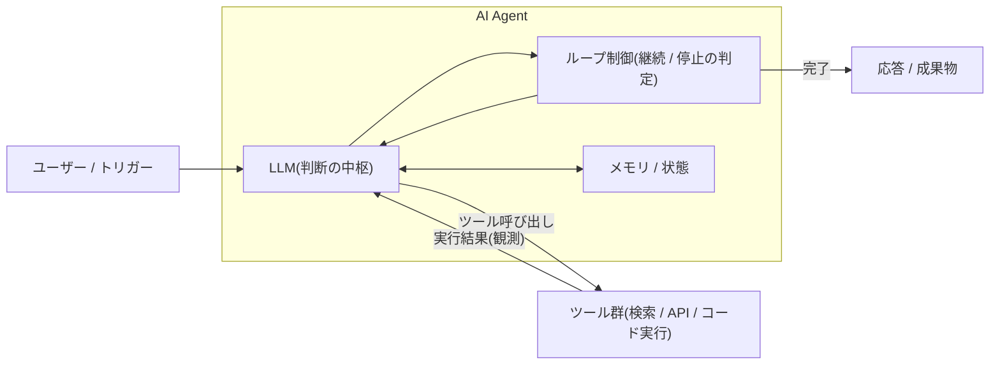

# AI Agent とは何か

## この記事の目的

「Agent」という言葉のブレを整理し、(1) 自分が作ろうとしているものが Agent なのか、そうでないもので足りるのかを判断できる、(2) Agent の類型と自律性の度合いをチーム内の共通言語として使える、という 2 点をゴールにします。

## 対象読者

- LLM API の利用経験はあるが、Agent 的な設計(ツール使用・自律ループ)はこれからのアプリケーションエンジニア
- 「Agent を作りたい」という要件を受け、実現方式を判断する立場のテックリード

## 前提知識

- [AI Agent 学習ロードマップ](../00-overview/learning-roadmap.md) — このライブラリの読み進め方
- LLM API の基本(システムプロンプト、チャット履歴、トークンの概念)

## 本文

### 概要: このライブラリでの定義

このライブラリでは AI Agent を次のように定義します。

> **AI Agent とは、LLM を判断の中枢に置き、ツールを使いながら、目標達成までの手順を実行時に自律的に決めて実行するシステム**

重要なのは「**手順を実行時に自分で決める**」という点です。処理手順を開発者がコードで固定し、LLM を各ステップの部品(分類・要約・生成など)として使う構成は、このライブラリでは **Workflow 型(workflow)** と呼んで Agent と区別します。

2026 年時点でも業界での「Agent」の定義は揺れており、マーケティング上は Workflow 型のプロダクトも「Agent」と呼ばれることがあります。実務で重要なのはラベルではなく、**システムにどれだけの自律性を与えるかという設計上の選択**です。

### 詳細: Agent を構成する 4 つの要素

| 要素 | 役割 | 詳細ドキュメント |
| --- | --- | --- |
| LLM | 状況を観測し、次の行動を決める判断の中枢 | — |
| ツール使用(tool use) | 検索・API 呼び出し・コード実行など、外界への働きかけ | [tool-use.md](tool-use.md) |
| Agent ループ(agent loop) | 「観測 → 思考 → 行動」を繰り返し、完了・失敗・上限で止める制御 | [agent-loop.md](agent-loop.md) |
| メモリ / 状態 | 会話履歴・中間成果物・長期記憶の管理 | [memory-and-state.md](memory-and-state.md) |

この 4 要素の外側に、権限制御やガードレール(実行前の検証層)、監視といった運用系の仕組みが付きます(それぞれ 06-security・05-operations で扱います)。

### 詳細: 自律性のスペクトラム

「Agent かどうか」は二値ではなく、自律性の度合いのスペクトラムで捉えると設計判断に使えます。

| 段階 | 手順の決め方 | 予測可能性 | 柔軟性 | コスト / デバッグ性 |
| --- | --- | --- | --- | --- |
| 固定パイプライン(Workflow 型) | すべてコードで固定 | 高い | 低い | 低コスト / 容易 |
| ルーティング | 分岐先の選択のみ LLM が判断 | 高い | 中 | 低コスト / 容易 |
| 単一 Agent ループ | 手順・ツール選択を LLM が実行時に決定 | 中 | 高い | 中〜高コスト / 難しい |
| マルチエージェント | 複数の Agent が分担・協調 | 低い | 最も高い | 高コスト / 最も難しい |

右に行くほど扱える問題は広がりますが、予測可能性・コスト・デバッグ性を差し出すことになります。**左で足りるなら左を選ぶ**のが原則です(詳細は `workflow-vs-agent.md` で扱う予定です)。

### 詳細: Agent の 3 類型

実務で出会う Agent は、行動する対象によって大きく 3 つに分類できます。

| 類型 | 観測と行動の対象 | 例 | 特有のリスク・考慮点 |
| --- | --- | --- | --- |
| 会話型 | 自然言語の対話 + 限定的なツール | サポートチャットボット、社内ヘルプデスク | 会話履歴の肥大、話題の脱線、根拠のない回答 |
| ツール実行型 | API・コード・データ | コーディング Agent、データ分析 Agent、調査 Agent | 誤操作の影響範囲、ツール権限の設計、実行時間 |
| コンピュータ操作型(computer use) | 画面(スクリーンショット)とマウス・キーボード操作 | ブラウザ操作 Agent、GUI 業務の自動化 | 誤クリックの実害、処理の遅さ、画面経由の間接的な攻撃(詳細は [computer-use-and-multimodal-agents.md](computer-use-and-multimodal-agents.md)) |

類型によって、必要なサンドボックス・評価方法・レイテンシ特性が大きく変わります。要件定義の段階でどの類型かを明確にしてください。

### 設計判断: 「Agent が必要か」から始める

最初に問うべきは「Agent をどう作るか」ではなく「**Agent が必要か**」です。

1. タスクの手順を事前にすべて列挙できる → **固定パイプライン**で作る
2. 手順は固定だが、入口の振り分けだけ判断が要る → **ルーティング**を足す
3. 手順が入力によって大きく変わる・探索的で事前に列挙できない → **Agent ループ**を検討する

具体例で比べます。「先月の出張費はいくら精算されましたか?」という社内問い合わせに答えるシステムを考えます。

- **固定パイプライン**: 問い合わせを分類 → 経費 API を呼ぶ → 結果を整形して返す。手順はコードで固定
- **Agent**: 経費 API・社内規定検索・担当者へのメール送信をツールとして渡し、必要な手順を LLM が決める。曖昧な質問への追加確認も自分で判断する

この例では問い合わせのパターンが安定しているため、**固定パイプラインで十分**です。Agent が正当化されるのは「精算が却下された理由を調べて、規定と突き合わせて、再申請の下書きまで作ってほしい」のような、手順が可変で探索的なタスクです。

## 実務での注意点

### アンチパターン

- **「とりあえず Agent 化」** → 固定パイプラインで足りるタスクを Agent にすると、コスト・レイテンシ・不安定さだけが増える → 上の設計判断フローを先に通し、自律性は必要最小限にする
- **自律性の上限を決めずに作り始める** → ループ回数・実行時間・使えるツールが無制限の Agent は、暴走時の影響範囲を見積もれない → 停止条件(最大ステップ数・タイムアウト・コスト上限)とツール権限を最初に設計する
- **デモの成功率で本番投入を判断する** → デモは成功しやすい入力を選びがちで、実運用の分布とずれる → 投入判断の前に評価設計(`agent-evaluation-basics.md`、執筆予定)を行う

### チェックリスト

Agent という方式を採用する前の確認:

- [ ] タスクの手順を事前に列挙できないことを確認した(列挙できるなら Workflow 型にする)
- [ ] Agent の類型(会話型 / ツール実行型 / コンピュータ操作型)を特定した
- [ ] 使えるツールと権限の一覧を書き出した
- [ ] ループの停止条件(最大回数・タイムアウト・コスト上限)を決めた
- [ ] 失敗時に人間へエスカレーションする経路がある
- [ ] 品質をどう測るかを実装前に決めた

## 関連トピック

- [AI Agent 学習ロードマップ](../00-overview/learning-roadmap.md) — 本記事の次に読む記事の選び方
- [Agent ループ](agent-loop.md) — 「観測 → 思考 → 行動」ループの動作原理
- [ツール使用](tool-use.md) — ツール使用の仕組みと設計
- `workflow-vs-agent.md`(執筆予定)— 本記事の設計判断をトレードオフ表で詳細化

## 参考資料

- [Building Effective Agents(Anthropic)](https://www.anthropic.com/research/building-effective-agents) — Workflow と Agent の区別、「シンプルな構成から始める」原則の出典(アクセス日: 2026-07-05)
- [LLM Powered Autonomous Agents(Lilian Weng)](https://lilianweng.github.io/posts/2023-06-23-agent/) — プランニング・メモリ・ツールという構成要素の古典的な整理(アクセス日: 2026-07-05)

## TODO・未確認事項

> **TODO(要確認):** 主要ベンダー(Anthropic / OpenAI / Google)の Agent 定義・分類に関する最新の公式ドキュメントを確認し、本記事の 3 類型・スペクトラム整理と大きな齟齬がないか照合する(最終確認: 2026-07)
