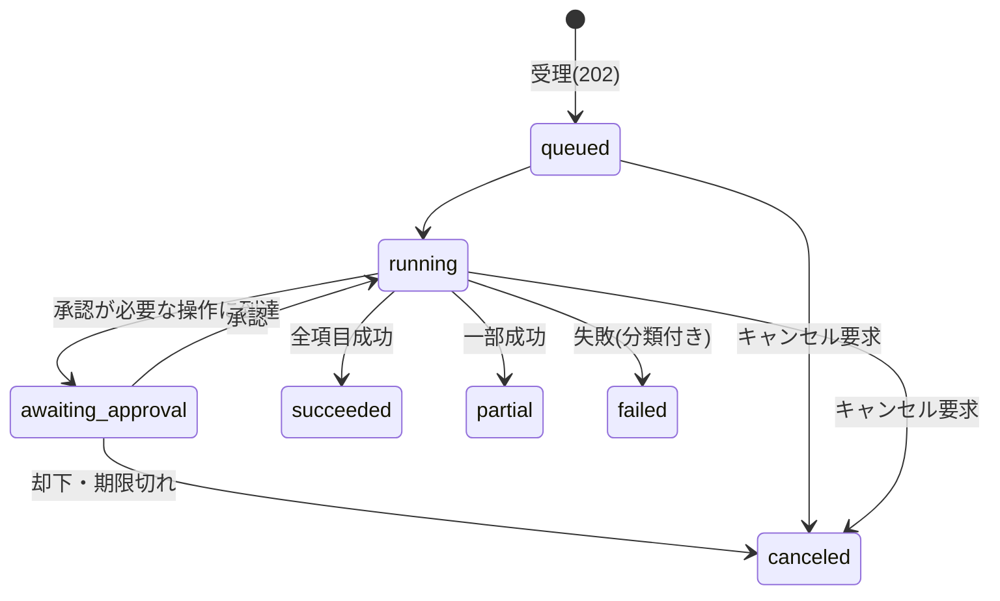

# エージェントの API 設計

## この記事の目的

自分たちの Agent を API として他システム・他チーム・外部顧客に公開する際の**契約(インターフェース)**を設計できるようになります。非同期ジョブ API・ステータスモデル・ストリーミング・冪等キー・部分結果・バージョニング・メータリングという、Agent 特有の性質が API 面に現れる論点を扱います。

## 対象読者

- 自社の Agent を製品 API・社内共通 API として公開するエンジニア
- Agent 機能を既存プロダクトの API 面に組み込むアーキテクト・テックリード

## 前提知識

- [非同期・長時間タスクの設計(耐久実行)](async-and-durable-agents.md) — 内部実装側の再開・冪等性(本記事はそれを外部契約に写す側)
- [エラー処理・リトライ・フォールバック設計](error-handling-and-retries.md) — エラー分類(本記事で API エラーコードに写像します)
- [ストリーミングと Agent の UX 実装パターン](../03-implementation/streaming-and-agent-ux.md) — 対人 UI 側の進捗提示(本記事は機械間の契約側)

## 本文

### 概要: Agent は「普通の REST」に収まらない

Agent を API として公開するとき、単発の LLM 呼び出しや通常の CRUD API と同じ設計をすると必ず破綻します。原因は Agent の 3 つの性質です。

1. **実行時間が長く、分散が大きい**: 数秒で終わるタスクと数十分かかるタスクが同じエンドポイントに来ます
2. **非決定的で、部分的に成功する**: 同じ入力でも結果が揺れ、「5 件中 3 件だけ処理できた」が正常系として起きます
3. **途中経過に価値がある**: 進捗・中間結果・承認待ちという「実行中の状態」を呼び出し側が知る必要があります

本記事の分担は「機械間の契約」です。人間のユーザーに進捗をどう見せるかは[ストリーミングと Agent の UX 実装パターン](../03-implementation/streaming-and-agent-ux.md)が、中断・再開を内部でどう実装するかは[非同期・長時間タスクの設計(耐久実行)](async-and-durable-agents.md)が正本で、本記事はそれらを**外部に公開する約束事**へ写します。内部でできないことは契約にできないため、内部設計が先です。

### 同期かジョブ型か

最初の分岐は、リクエストへの応答で結果を返す(同期)か、ジョブとして受理して後から結果を取らせる(ジョブ型)かです。判断基準は実行時間の分布で、平均ではなく p99 で判断します(実行形態の選び方は[デプロイとスケーリング](../05-operations/deployment-and-scaling.md)と同じ軸です)。HTTP 接続を安心して保持できる時間(経路上のタイムアウトを考慮すると通常は数十秒)を p99 が超えるなら、ジョブ型にします。

ジョブ型 API の基本形は次の 3 点セットです。

- **投入**: `POST /jobs` がジョブを受理し、即座にジョブ ID を返す(HTTP 202)
- **照会**: `GET /jobs/{id}` が現在の状態と、完了していれば結果を返す
- **通知**: 完了をポーリング(定期照会)、Webhook(呼び出し側の URL への通知)、またはイベントストリームで伝える。外部顧客向けはポーリング + Webhook の併用が既定です

注意すべきは、**同期からジョブ型への変更は破壊的変更**だということです。「今は数秒で終わるから同期でよい」と始めると、タスクが重くなった時点で全利用者の呼び出しコードが書き直しになります。実行時間の伸びが見込まれる Agent では、最初からジョブ型で公開し、速いタスクは「すぐ完了状態になるジョブ」として扱う設計が安全です。

### ステータスモデルと部分結果

ジョブの状態遷移は契約の中核です。Agent では「成功/失敗」の 2 値では足りず、少なくとも承認待ち・部分成功・キャンセルを一級の状態として持ちます。

- **部分成功(partial)**: 「10 件の請求書のうち 8 件を処理、2 件は判定不能」を全体失敗として返すと、呼び出し側は成功した 8 件ごと再実行するしかなくなります。結果に項目別のステータスを含め、全体状態は partial とします(partial は API 層の集約状態であり、内部の状態モデルに同名の状態がなくても、項目別の結果から写像できれば成立します)。人が引き取るべき残りが何かを機械可読にすることが、Human-in-the-Loop の連携面でもあります([Human-in-the-Loop 設計](human-in-the-loop.md))
- **承認待ち(awaiting_approval)**: 内部で承認待ちを永続化している([非同期・長時間タスクの設計(耐久実行)](async-and-durable-agents.md))なら、API にもその状態を公開し、承認用のエンドポイント(または承認依頼の Webhook)を用意します。誰が承認できるかは認可の設計です([エージェントの認証・認可](../06-security/agent-identity-and-auth.md))。期限切れ時の扱い(自動キャンセルか保留継続か)も契約に明記します
- **失敗の分類**: [エラー処理・リトライ・フォールバック設計](error-handling-and-retries.md)の分類(一時的/恒久的)を API エラーコードに写像し、「リトライしてよいか」「入力を直せば通るのか」「ポリシーで拒否されたのか」を呼び出し側がコードで分岐できる形にします。自然文のエラーメッセージだけを返す API は、呼び出し側に文字列マッチングを強います

### ストリーミングとイベント設計

進捗をストリームで流す場合、粒度は 3 段階から選びます。

| 粒度 | 内容 | 向く用途 |
| --- | --- | --- |
| トークン単位 | モデル出力の逐次ストリーム | 対人チャット UI(機械間連携には過剰) |
| ステップ単位 | ツール実行の開始・完了、フェーズ遷移 | 機械間連携の既定。進捗率・中間結果の受け渡し |
| マイルストーン単位 | 大きな節目(受理・承認待ち・完了)のみ | Webhook 通知。イベント数を抑えたい統合 |

ここでの最重要原則は、**イベントスキーマは公開契約であり、内部実装の生ログではない**ことです。Agent ループの内部イベント(生のツール名・プロンプトの断片・思考過程)をそのまま流すと、2 つの問題が起きます。第一に、内部のツール構成やプロンプトを変更するたびに API の破壊的変更になります。第二に、内部情報(システムプロンプトの内容、内部システムの構成)が外部に漏れる経路になります([データ漏えい対策](../06-security/data-exfiltration.md))。内部イベントを公開用の安定したイベント型(例: `step_started` / `step_completed` / `progress` / `approval_required`)へ写像する変換層を 1 枚置きます。

### 冪等性と再試行の契約

ネットワーク断やタイムアウトで応答を受け取れなかった呼び出し側は、同じ要求を再送します。何も設計しなければ、再送のたびに同じタスクがもう 1 つ走ります — Agent では二重実行が「二重のコスト」と「二重の副作用(メール 2 通・注文 2 件)」を意味するため、通常の API より深刻です。

対策の標準形が**冪等キー(idempotency key)**です。呼び出し側がリクエストに一意なキーを付け、サーバーは同一キーの再送に対して新しいジョブを作らず、最初のジョブ(またはその結果)を返します。契約として次を定義します。

- **スコープと保持期間**: キーの一意性の範囲(API キー単位が普通)と、何時間・何日まで同一視するか
- **ペイロード不一致の扱い**: 同じキーで異なる内容が来たらエラーにする(サイレントに片方を無視しない)
- **どの操作に必須か**: 少なくともジョブ投入と、承認などの副作用を持つ操作すべて

内部の重複実行対策([非同期・長時間タスクの設計(耐久実行)](async-and-durable-agents.md)の冪等性)とは層が異なることに注意してください。API 層の冪等キーは「ジョブを二重に作らない」ため、内部の冪等性は「1 つのジョブ内でステップを二重に実行しない」ためのもので、両方必要です。

### バージョニングと互換性

Agent API には**スキーマの互換性と挙動の互換性という 2 つの互換性**があります。リクエスト・レスポンスの形(スキーマ)が変わらなくても、内部のモデル更新やプロンプト改善で出力の分布・傾向は変わり、利用者の下流処理(出力のパースや品質前提)が静かに壊れえます([バージョニング・デプロイ・モデル更新追従](../05-operations/versioning-and-model-updates.md)の問題が、今度は自分が提供者側として降りかかる形です)。

- スキーマは通常の API バージョニング(後方互換の追加は同一バージョン、破壊的変更は新バージョン)で扱います
- 挙動の変更は、変更履歴(チェンジログ)での告知と、大きな変更の事前予告を契約にします。利用者側での回帰テストを推奨として案内し、機械処理される出力には構造化出力([構造化出力](../03-implementation/structured-output.md))でスキーマを保証します
- 「挙動を固定したい」という要求に応える場合は、旧挙動の並行提供(モデル・プロンプトのピン止め版)に運用コストがかかることを踏まえ、提供期限を切って契約します

### メータリングと課金・上限

Agent API の原価はトークン従量で変動します。課金の計測単位は、原価との連動と利用者の予測可能性のトレードオフで選びます。

| 計測単位 | 提供側のリスク | 利用者側の体験 |
| --- | --- | --- |
| トークン従量 | 低(原価に連動) | 請求が予測できない |
| タスク数(実行回数) | 中(重いタスクで原価割れしうる) | 予測しやすい。単価にばらつきを織り込む必要 |
| 成功課金(成功したタスクのみ) | 高(失敗コストを提供側が負担) | 最も納得感が高い |

どの単位で課金するにせよ、**内部のメータリングはテナント・API キー別に正確に取る**ことが先です([マルチテナント設計](multi-tenancy-and-isolation.md))。加えて、利用者側のコスト事故(暴走ループでの大量投入)を防ぐ上限(クォータ)と、超過時の応答(HTTP 429 と再試行までの待ち時間の提示)を契約に明記します。認証は API キーまたは OAuth を使い、「呼び出し元ユーザーの権限で動くのか、サービスとしての権限で動くのか」を最初に決めます([エージェントの認証・認可](../06-security/agent-identity-and-auth.md))。

## 実務での注意点

### アンチパターン

- **長時間タスクを同期 HTTP で待たせる** → 経路上のタイムアウトで切断され、呼び出し側の再送で二重実行になる → ジョブ型 + 冪等キーを最初から契約にする
- **内部イベントをそのまま公開スキーマにする** → 内部のツール・プロンプト変更が破壊的変更になり、内部情報の漏えい経路にもなる → 公開用イベント型への写像層を置く
- **冪等キーなしで「失敗したらリトライしてください」と案内する** → 再送のたびにタスクが増え、コストと副作用が二重になる → 副作用のある操作すべてに冪等キーを必須にする
- **結果を全か無かで表現する** → 部分成功が捨てられ、呼び出し側が成功分まで全再実行する → 項目別ステータス + partial 状態を一級市民にする
- **挙動の変更を無告知で行う** → スキーマ互換でも利用者の下流品質が静かに劣化し、信頼を失う → 変更履歴・事前予告・利用者側回帰テストの推奨を運用に組み込む

### チェックリスト

- [ ] 実行時間の p99 を根拠に同期/ジョブ型を選んだ(迷ったらジョブ型)
- [ ] ステータスモデルに承認待ち・部分成功・キャンセルが含まれている
- [ ] エラーがリトライ可否・入力起因・ポリシー拒否で分類され、機械可読になっている
- [ ] 進捗イベントが公開契約として定義され、内部実装から写像層で分離されている
- [ ] 冪等キーの仕様(スコープ・保持期間・ペイロード不一致時の挙動)を定義した
- [ ] スキーマと挙動の 2 つの互換性について、告知・予告の経路を決めた
- [ ] メータリングの単位・上限・429 応答を契約に明記した
- [ ] 呼び出し元の認証と、Agent が動く権限(ユーザー代理かサービスか)を決めた

## 関連トピック

- [非同期・長時間タスクの設計(耐久実行)](async-and-durable-agents.md) — 本記事の契約を支える内部実装
- [ストリーミングと Agent の UX 実装パターン](../03-implementation/streaming-and-agent-ux.md) — 対人 UI 側の進捗提示(本記事の対)
- [エラー処理・リトライ・フォールバック設計](error-handling-and-retries.md) — エラー分類の元
- [バージョニング・デプロイ・モデル更新追従](../05-operations/versioning-and-model-updates.md) — 挙動バージョンの内部管理側
- [マルチテナント設計](multi-tenancy-and-isolation.md) — メータリング・クォータの基盤
- [構造化出力](../03-implementation/structured-output.md) — 機械処理される出力の契約化
- [Human-in-the-Loop 設計](human-in-the-loop.md) — 承認待ち状態の設計元

## 参考資料

- なし(非同期ジョブ API・冪等キー・Webhook は Web API 設計の確立された一般実践であり、本記事はそれを Agent 特有の性質 — 長時間実行・非決定性・部分成功・挙動の変化 — に適用した本ライブラリの整理のため、単独の外部一次資料はありません)

## TODO・未確認事項

なし
