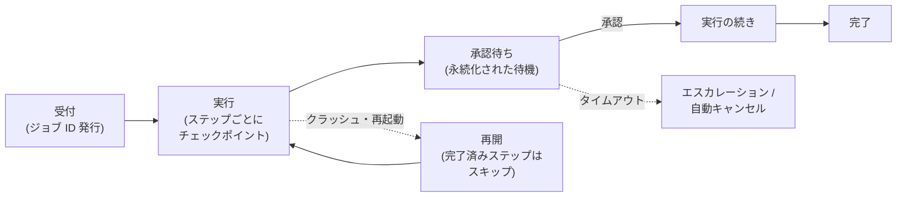

# 非同期・長時間タスクの設計(耐久実行)

## この記事の目的

数分〜数日かかるタスクや人の承認を挟むタスクを、「プロセスが生きている前提」を捨てて設計できるようになります。チェックポイントと再開、冪等性、承認待ちの永続化、進捗の可視化という設計要素と、それらをまとめて提供する耐久実行(durable execution)という実行モデルの考え方・採用判断を扱います。

## 対象読者

- 長時間・多段のタスクを実行する Agent で、クラッシュ・再起動のたびに「全部やり直し」になっている状態を直したいエンジニア
- 人の承認を挟むフローを本番品質(数日待てる・重複しない・監査できる)にしたいアーキテクト

## 前提知識

- [メモリと状態管理](../01-concepts/memory-and-state.md) — 作業状態を構造化して外部に持つという原則(本記事はその執行系)
- [エラー処理・リトライ設計](error-handling-and-retries.md) — 呼び出し単位の失敗処理と冪等性の基礎
- [Human-in-the-Loop 設計](human-in-the-loop.md) — 承認ゲートの設計(本記事は「待ち」を永続化する側)

## 本文

### 概要: 「プロセスが生きている」前提を捨てる

短い対話型 Agent は、1 つのプロセスの中でループが回りきる前提で書けます。しかしタスクが数分を超え、承認待ちが数日に及ぶと、その前提は必ず破れます — デプロイ・スケールイン・クラッシュ・ネットワーク断は日常だからです。長時間タスクの設計とは、**実行のどの瞬間にプロセスが死んでも、途中から再開できる**ように状態と副作用を配置することです。

なお、キュー・ワーカー・状態ストアといったインフラ構成と容量設計は [デプロイとスケーリング](../05-operations/deployment-and-scaling.md) が正本です。本記事はその上で動く**実行モデルの設計**(何を永続化し、どう再開し、どう待つか)を扱います。

### 同期の限界と非同期化の判断

非同期化(ジョブ化)を判断する基準は 3 つです。

| 基準 | 同期のままでよい | 非同期化する |
| --- | --- | --- |
| 実行時間 | p99 が UI・ゲートウェイの許容内(目安: 数十秒) | p99 が許容を超える、または入力次第で読めない |
| 人の関与 | ない(または即時応答できる) | 承認・確認・追加入力の待ちが入る |
| やり直しコスト | 失敗しても最初から再実行で許容できる(短い・安い) | 途中失敗の全やり直しが時間・トークン費用として痛い |

1 つでも「非同期化する」側に該当したら、ジョブ ID を返す非同期 API + 進捗通知の形へ寄せます。中間形として「同期で始めて、長引いたら非同期へ昇格」という設計もありますが、2 つの経路を両方保守するコストが掛かるため、迷ったら最初から非同期に寄せる方が総コストは小さくなります。

### チェックポイントと再開

チェックポイント(checkpoint)とは、「ここまで完了した」を再開可能な形で永続化することです。[メモリと状態管理](../01-concepts/memory-and-state.md)の「作業状態」を、障害を前提に運用する設計と言えます。

- **何を保存するか**: 完了したステップと結果(特にツール実行の結果)、会話・推論の状態(全履歴ではなく再開に必要な要約 + 決定事項)、中間成果物の参照(本体は外部ストレージ)、次にやることの計画
- **どこで切るか**: 意味のある単位で切ります。基本は「ツール実行の完了ごと」と「フェーズ(計画 → 実行 → 検証)の境界」です。細かすぎるチェックポイントは書き込みコストとレイテンシを増やし、粗すぎると再開時のやり直しが増えます
- **再開の設計**: 再開時は「チェックポイントの構造化状態 + 経緯の要約」からコンテキストを再構築します。生の全履歴を再投入する必要はなく、するべきでもありません(トークンコストと文脈の質の両方で不利です)
- **コストの視点**: Agent のやり直しは計算のやり直しであると同時に**トークン課金のやり直し**です。チェックポイントは信頼性の仕組みであると同時に、コスト制御の仕組みでもあります([コスト管理](../05-operations/cost-management.md))

### 耐久実行(durable execution)という考え方

チェックポイント・再開・再試行を毎回手作りする代わりに、これを実行モデルとして提供するのが耐久実行(durable execution)です。中核のアイデアは次の 3 点で、主要なエンジン・フレームワークに共通しています。

1. **結果の永続ログ**: 実行の各ステップの「操作と結果」を永続ログに記録する
2. **決定的な再実行**: 障害後はログを頼りに実行を再現し、**完了済みステップはスキップ**して続きから走る
3. **非決定処理の隔離**: LLM 呼び出し・ツール実行・現在時刻などの非決定的な処理は、「結果が記録される単位」に隔離する(オーケストレーション部分のコードは決定的に保つ)

この 3 点目が Agent にとって決定的に重要です。**LLM 呼び出しは非決定的**なので、再開のたびに再実行すると「毎回違う計画で動き直す」Agent になります。耐久実行では完了済みの LLM 呼び出しは保存された結果が再利用されるため、再開しても同じ軌跡の続きを走れます。2026-07 時点で主要エンジンはいずれも「LLM 呼び出しを結果が永続化される実行単位に置く」ことを公式の標準解としています。

呼称はエンジンごとに違いますが、対応は次のとおりです(2026-07 時点の概観。一次情報の記録は `research/professional/durable-execution.md`)。

| 提供元(例) | 永続ログの呼称 | 非決定処理の隔離単位 | 承認・外部イベント待ち |
| --- | --- | --- | --- |
| Temporal | Event History(replay) | Activity | Signal / Update |
| Restate | journal | `ctx.run` | Awakeable |
| Inngest | step のメモ化 | `step.run` / `step.ai` | `step.waitForEvent` |
| Azure(Durable Functions / Durable Task) | オーケストレーション履歴 | アクティビティ関数 | 外部イベント待ち |
| Cloudflare(Workflows / Agents) | step 状態 + Durable Object 内ストレージ | step | イベント待ち・承認ゲート |
| AWS Step Functions | 状態マシンの実行履歴 | Task 状態 | タスクトークン待ち |
| LangGraph(フレームワーク側) | checkpointer(グラフ状態のスナップショット) | ノード / task | interrupt + 再開コマンド |

採用判断と注意点です。

- **自前かエンジンか**: 「ジョブキュー + DB チェックポイント」の自前実装は、ステップ数が少なく承認待ちが単純なうちは十分です。ステップの分岐・並列・長い待機・再試行ポリシーが増えてきたら、エンジンの採用を検討します(自前の再開ロジックはバグの温床になりやすい領域です)
- **決定性要件という新しい制約**: 耐久実行のオーケストレーションコードには「実行中のインスタンスがある状態でコードを変えると再現が壊れる」という制約が付きます。長時間実行と頻繁なデプロイを両立するには、ワークフローのバージョニング戦略が必須になります([バージョニング・デプロイ・モデル更新追従](../05-operations/versioning-and-model-updates.md)の考え方の適用先です)
- **履歴・状態のサイズ上限**: エンジンの実行履歴・状態には上限があり、会話履歴やツールの大きな出力をそのまま状態に載せると上限を圧迫します。大きなデータは外部ストレージに置いて参照だけを状態に持つ、履歴は要約して持つ、という [メモリと状態管理](../01-concepts/memory-and-state.md) の外部化原則がここでも効きます

### 冪等性と重複実行

再実行と重複は「起きるかもしれない」ではなく「必ず起きる」前提で設計します。再試行・再開・イベントの再配送(多くの仕組みは at-least-once 配送)のすべてが重複の源で、対策の軸は冪等性(idempotency)— 同じ操作を何度実行しても結果が変わらない性質 — の担保です。

- **副作用のあるステップに冪等キー**: 送信・登録・決済などのツール実行には、ジョブ ID + ステップ ID から導出した冪等キーを付け、受け側または実行前チェックで二重実行を防ぎます([エラー処理・リトライ設計](error-handling-and-retries.md))
- **「完了の記録」と「副作用」を近づける**: 副作用の実行とチェックポイント書き込みの間でクラッシュすると、再開時に副作用が再実行されます。冪等キーはこの隙間を埋める保険です
- **承認イベントの重複排除**: 承認・差し戻しのイベントも重複して届き得ます。イベントに一意 ID を持たせ、処理済み ID を記録して二重適用を防ぎます

### 承認待ちの永続化

[Human-in-the-Loop 設計](human-in-the-loop.md)で設計した承認ゲートを長時間タスクに組み込むには、「待ち」自体を永続化する必要があります。プロセス内の sleep やメモリ上の待機フラグは、再起動で消えます。

設計する要素は 4 つです。

1. **待機状態の永続化**: 「何を・誰の承認で・いつから待っているか」を状態として保存し、プロセスを占有せずに待ちます(耐久実行エンジンはこれをプリミティブとして提供します。前掲の対応表)
2. **通知とリマインド**: 待ち状態を作ったら承認者に通知し、放置に対してはリマインドを送ります。「気づかれない承認待ち」は事実上の障害です
3. **タイムアウトの設計**: 無期限の待機を作らないでください。期限超過時の挙動(代理承認者へのエスカレーション / 自動キャンセル / 縮退実行)を決め、タイマーとして実装します
4. **監査記録**: 誰がいつ何を承認・却下したかを、タスクの実行記録と紐づけて残します

### 進捗の可視化

非同期にした瞬間、「今どうなっているのか」が見えなくなる問題が生まれます。利用者と運用者の両方に対して可視化を設計します。

- **状態モデルを明示する**: ジョブは「受付済み / 実行中(ステップ n/m)/ 承認待ち / 完了 / 失敗 / キャンセル」のような有限の状態を持たせ、API・UI から照会できるようにします
- **進捗イベントを流す**: 長い沈黙は失敗と区別が付きません。ステップ完了ごとに進捗イベントを発行し、UI へはストリーミング・ポーリングで届けます([ストリーミングと Agent の UX 実装パターン](../03-implementation/streaming-and-agent-ux.md))
- **スタック検知**: 「実行中のまま進捗が止まっている」を検知する仕組み(ハートビート・最終進捗からの経過時間アラート)を用意します。承認待ちの滞留も同様に監視します([可観測性とトレーシング](../05-operations/observability-and-tracing.md))
- **キャンセルを最初から作る**: 長時間タスクには必ず「途中でやめる」操作が必要になります。キャンセル時の後始末(実行中ステップの扱い・部分結果の保存)まで含めて設計します

## 実務での注意点

### アンチパターン

- **長時間タスクをプロセス内の sleep・メモリ上のフラグで待たせる** → デプロイ・再起動のたびに待機中のタスクが消える → 待機状態を永続化し、プロセスを占有しない待ちにする
- **チェックポイントなしで多段タスクを回す** → 終盤の失敗で全ステップやり直しになり、時間とトークン費用を二重に払う → ツール実行完了・フェーズ境界でのチェックポイントを最初から入れる
- **再開時に完了済みの LLM 呼び出しを再実行する** → 毎回違う計画で動き直し、済んだはずの副作用も重複する → 完了済みステップの結果を保存・再利用し、副作用には冪等キーを付ける
- **承認待ちに期限を付けない** → 承認者の異動・見落としでタスクが永遠に滞留し、待機中の権限・データだけが残り続ける → タイムアウト + エスカレーション + 自動キャンセルを設計する
- **実行中インスタンスを残したままオーケストレーションのコードを変更する** → 再開・再現が壊れ、長時間タスクが不定状態で失敗する → ワークフローのバージョニング戦略(旧定義の並存)を用意してからデプロイする

### チェックリスト

- [ ] 非同期化の判断(p99 実行時間・承認の有無・やり直しコスト)を根拠付きで行った
- [ ] チェックポイントの単位(ツール完了・フェーズ境界)と保存内容が定義されている
- [ ] 再開がチェックポイント + 要約からのコンテキスト再構築になっている(全履歴の再投入をしていない)
- [ ] 完了済みステップ(LLM 呼び出し含む)の結果が再開時に再利用される
- [ ] 副作用のあるステップに冪等キーがあり、承認イベントも重複排除されている
- [ ] 承認待ちが永続化され、通知・リマインド・タイムアウト・監査記録がある
- [ ] ジョブの状態モデルと進捗イベントが利用者・運用者から見える
- [ ] スタック検知(進捗停止・承認滞留)とキャンセル操作がある
- [ ] 実行中インスタンスとコード変更の共存方法(バージョニング)が決まっている

## 関連トピック

- [メモリと状態管理](../01-concepts/memory-and-state.md) — 作業状態の外部化という本記事の土台
- [Human-in-the-Loop 設計](human-in-the-loop.md) — 承認ゲートの設計(本記事はその永続化)
- [エラー処理・リトライ設計](error-handling-and-retries.md) — 呼び出し単位の失敗処理・冪等性の基礎
- [デプロイとスケーリング](../05-operations/deployment-and-scaling.md) — キュー・ワーカー・状態ストアのインフラ側
- [ストリーミングと Agent の UX 実装パターン](../03-implementation/streaming-and-agent-ux.md) — 進捗をユーザーに届ける実装
- [バージョニング・デプロイ・モデル更新追従](../05-operations/versioning-and-model-updates.md) — 実行中インスタンスとコード変更の共存

## 参考資料

- [Understanding Temporal](https://docs.temporal.io/evaluate/understanding-temporal) — 耐久実行の定義と Event History・replay・Activity の関係(アクセス日: 2026-07-06)
- [Restate: AI use cases](https://docs.restate.dev/ai) — LLM 呼び出しの耐久化と Durable Agents / HITL 承認のパターン集(アクセス日: 2026-07-06)
- [LangGraph: Persistence](https://docs.langchain.com/oss/python/langgraph/persistence) — フレームワーク側のチェックポイントと interrupt による HITL(アクセス日: 2026-07-06)
- [Durable agents with Microsoft Agent Framework](https://learn.microsoft.com/en-us/azure/durable-task/sdks/durable-agents-microsoft-agent-framework) — 会話状態の永続化と状態サイズ上限という制約の実例(アクセス日: 2026-07-06)

## TODO・未確認事項

> **TODO(要確認):** 耐久実行エンジン・フレームワークのエージェント統合(提供状況・API 名・履歴/状態サイズの上限値)は変化が速い。採用検討時に各公式ドキュメントで最新を確認する(一次情報の記録: `research/professional/durable-execution.md`)(最終確認: 2026-07)
