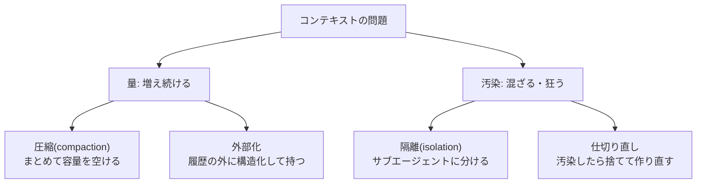

# コンテキストの圧縮と隔離

## この記事の目的

長時間・長対話でコンテキストが増え続け・汚染されていく問題に対する 2 大手段 — **圧縮(compaction)**(履歴をまとめて容量を空ける)と**隔離(isolation)**(そもそも増やさない・混ぜない)— を設計できるようになります。[メモリと状態管理](../01-concepts/memory-and-state.md)が示す圧縮の基本手法の先にある、トリガ設計・失敗モード・サブエージェントによる分離までを扱います。

## 対象読者

- 数十ステップ〜数時間動く Agent で、コンテキストの肥大・汚染に対処するエンジニア
- 「会話が長くなると同じ議論をループする / 過去の決定と矛盾する」問題に直面しているエンジニア

## 前提知識

- [コンテキストエンジニアリング](context-engineering.md) — コンテキスト設計の原則(本記事の上位の正本)
- [メモリと状態管理](../01-concepts/memory-and-state.md) — 3 層モデルと圧縮の基本手法(刈り込み・要約・外部化)
- [コンテキスト設計の実践パターン](context-engineering-patterns.md) — レイアウト・予算(本記事は増え続ける動的部分への対処)

## 本文

### 概要: 増やさない・まとめる・混ぜない

コンテキストが健全さを失う原因は 2 つです — **量**(増え続けてコスト増・希釈・上限到達)と**汚染**(古い決定・無関係な脱線・信頼できない内容が判断を狂わせる)。これに対する手段も 2 つに整理できます。

圧縮が「溜まったものをまとめる」事後策なのに対し、隔離・外部化は「そもそも 1 つのコンテキストに溜め込まない」事前策です。長いタスクほど、事後の圧縮に頼りきらず事前の設計で量と汚染を抑えるのが要点になります。

### 圧縮のトリガ: いつ実行するか

圧縮を「上限にぶつかったら自動で」任せると、最悪のタイミング(重要な作業の途中)で損失圧縮が起き、直後の品質が落ちます。トリガは設計対象です。

- **閾値ベース**: 上限の一定割合(例: 使用率が高くなってきた時点)で発火。ぶつかる前に余裕を持って実行します
- **フェーズ境界ベース**: タスクの区切り(サブタスク完了・大きな成果物の確定後)で実行。**「区切りの良いところで圧縮する」ほうが要約の質が高く**、直後の作業への影響も小さくなります。コーディングエージェントで「自動任せにせず手動で区切って圧縮する」のと同じ判断です([コーディングエージェントのコスト最適化](../08-coding-agents/coding-agent-cost-optimization.md))
- **併用**: 通常はフェーズ境界で、閾値に達したら強制、の二段構えが実践的です

### 残すものと落とすもの

圧縮は損失圧縮です。[メモリと状態管理](../01-concepts/memory-and-state.md)が説く「圧縮後も必ず残す情報のリスト」を、実務の粒度まで具体化します。

| 必ず残す | 落としてよい |
| --- | --- |
| ユーザーが指定した制約・要件 | 途中の試行錯誤の生ログ |
| すでに下した決定と、その理由 | 冗長なツール出力(要点だけ残す) |
| 未解決の課題・保留事項 | 解決済みの脇道の議論 |
| 外部成果物への参照(ファイルパス・ID) | 成果物の全文(参照に置換) |
| 現在の計画・進捗 | 一般的な前置き・確認の往復 |

要点は、**「決定」と「決定に至った試行錯誤」を区別**することです。試行錯誤の生ログは落としてよいですが、決定そのものと理由を落とすと、後で同じ議論を蒸し返します(後述の失敗モード)。要約プロンプトには、この「残すリスト」を明示的に埋め込みます。

### 段階的圧縮と要約の階層化

一度に全履歴を 1 つの要約に潰すと、古い決定ほど細部が失われます。より頑健なのは階層化です。

- **段階的圧縮(rolling)**: 古いターンから順に要約し、新しいターンは生で残す。時間とともに「遠い過去ほど粗い要約・近い過去ほど詳細」というグラデーションになります
- **階層要約**: サブタスク単位の要約を作り、それらの要約をさらに束ねる。ツリー状に保つと、必要なときに特定サブタスクの詳細へ降りられます(参照を残しておけば外部から引ける)
- **ドリフトへの注意**: 要約を要約する多段圧縮は、初期の誤りや偏りが増幅されます。節目で元資料(外部化した生成物・決定ログ)に立ち返る経路を残します

### 外部化という第三の道

圧縮の前に、そもそも履歴に溜めない選択があります。作業状態を**構造化して履歴の外に持つ**と、コンテキストは「作業の生ログ」ではなく「現在の状態への参照」で済みます([メモリと状態管理](../01-concepts/memory-and-state.md)の作業状態層)。

- **タスクリスト・計画**: 進捗を構造化データ(やること・完了・保留)として外部に持ち、コンテキストには現在地だけを載せる
- **メモファイル・スクラッチパッド**: 決定事項・調査結果を Agent 自身が書き出すファイルに残し、必要時に読み返す。長い探索で「さっき調べたことを忘れる」を防ぎます
- **成果物の外部化**: 大きな生成物(コード・ドキュメント)はファイル・DB に置き、履歴には参照(パス・ID)だけ残す

外部化は圧縮より情報損失が小さく(捨てるのでなく移すため)、中断・再開や外部監視とも相性が良い一方、参照を辿る手段(読み出しツール)と、状態を最新に保つ規律が要ります。

### 隔離とサブエージェント: コンテキストを分けて汚染を防ぐ

もう 1 つの手段が隔離です。ここでの隔離は「性能を上げるためのマルチエージェント」ではなく、**コンテキストを分離すること自体を目的とした委譲**を指します(マルチエージェントの一般論は [シングルエージェントとマルチエージェント](../01-concepts/single-vs-multi-agent.md)・[オーケストレーションパターン](orchestration-patterns.md)が正本)。

- **探索の隔離**: 大量の中間出力を生む調査(多数の検索・ファイル読み)をサブエージェントに委譲し、**結果の要点だけを親に返す**。親のコンテキストは探索の生ログで汚れず、要点だけが残ります。長い調査ほど効果が大きい定番パターンです
- **関心の分離**: 独立に進められるサブタスクを別コンテキストに分けると、互いのノイズが混ざりません([シングルエージェントとマルチエージェント](../01-concepts/single-vs-multi-agent.md)の「コンテキスト分離が効く理由」の実践)
- **信頼境界としての隔離**: 信頼できない外部コンテンツ(Web ページ・受信メール)を処理する部分を隔離し、権限の高い親から分けるのは、間接プロンプトインジェクションへの構造的防御でもあります(詳細は [プロンプトインジェクション](../06-security/prompt-injection.md)が正本)
- **隔離の代償**: サブエージェントは親の文脈を共有しないため、必要な前提を渡し漏れると的外れな結果を返します。委譲の境界は「独立して完結でき、要点だけ返せばよい」単位に引きます

### 仕切り直しの判断: 汚染したら作り直す

圧縮も隔離も追いつかず、コンテキストが汚染して抜け出せなくなることがあります(同じ失敗の反復・矛盾した状態)。このとき最も効く手段が、**現在のコンテキストを捨てて、外部化した状態から作り直す**仕切り直しです。

- **検知**: 同一ツールの同一引数での反復、進捗のない往復の増加、過去の決定と矛盾する言動は、汚染のサインです(検知の仕組みは [可観測性とトレーシング](../05-operations/observability-and-tracing.md)・ループ設計側)
- **作り直し**: 「経緯の要約 + 外部化した作業状態(計画・決定・成果物の参照)」から新しいコンテキストを再構築します([メモリと状態管理](../01-concepts/memory-and-state.md)の再開と同じ手続き)。だからこそ、平時から決定と状態を外部化しておくことが仕切り直しを可能にします
- **判断**: 圧縮で回復するか仕切り直すかは、「汚染が局所的(古い脱線)か全体的(状態の不整合)か」で決めます。全体が矛盾しているなら、まとめ直すより作り直すほうが速いことが多いです

### 圧縮の失敗モード

圧縮は便利さゆえに、失敗が見えにくいのが危険です。

- **決定の消失 → 議論のループ**: 「すでに決めたこと」が要約から抜けると、Agent は同じ論点を蒸し返し、下手をすると前と違う結論を出します。最も頻度が高く、最も高くつく失敗です。対策は「残すリスト」の徹底
- **制約の消失 → 逸脱**: ユーザーの禁止事項・要件が要約で消えると、以降それを破ります。安全に関わる制約は要約任せにせず、システムプロンプト側の固定部分に持たせる選択もあります
- **偽の連続性**: 要約が滑らかだと、情報が失われたことに人もモデルも気付きにくいものです。圧縮の前後で重要情報が保持されているかを検証する仕組み(残すリストとの照合)を入れます
- **タイミングの悪さ**: 作業の途中で圧縮が入ると直後の品質が落ちます。フェーズ境界トリガで回避します

## 実務での注意点

### アンチパターン

- **上限到達まで圧縮を自動任せにする** → 最悪のタイミングで損失圧縮が起き、直後の品質が落ちる → 閾値 + フェーズ境界でトリガを設計する
- **決定とその理由まで要約で落とす** → 同じ議論をループし、前と矛盾する結論を出す → 「必ず残すリスト」に決定・制約・未解決点を入れて要約プロンプトに埋め込む
- **すべてを 1 つのコンテキストに溜め込む** → 量と汚染の両方が悪化する → 探索はサブエージェントに隔離し、状態は外部化する
- **信頼できない外部コンテンツを権限の高い本体で直接処理する** → 間接インジェクションの経路になる → 処理を隔離し、境界を設ける([プロンプトインジェクション](../06-security/prompt-injection.md))
- **汚染したコンテキストを圧縮で立て直そうとし続ける** → 不整合な状態をまとめ直すだけで抜け出せない → 外部化した状態から仕切り直す
- **仕切り直せる設計を平時に用意していない** → いざ汚染しても作り直す材料がない → 決定・計画・成果物を平時から外部化しておく

### チェックリスト

- [ ] 圧縮のトリガ(閾値 + フェーズ境界)が設計されている(上限まかせでない)
- [ ] 「圧縮後も必ず残す情報」のリストがあり、要約プロンプトに埋め込まれている
- [ ] 決定と、決定に至った試行錯誤を区別して扱っている
- [ ] 作業状態(計画・決定・成果物)が履歴の外に構造化されている
- [ ] 大量の中間出力を生む探索をサブエージェントに隔離している
- [ ] 信頼できない外部コンテンツの処理が隔離されている
- [ ] 汚染の検知手段(反復・矛盾)と、外部化状態からの仕切り直し経路がある

## 関連トピック

- [コンテキストエンジニアリング](context-engineering.md) — コンテキスト設計の原則(本記事の上位の正本)
- [メモリと状態管理](../01-concepts/memory-and-state.md) — 3 層モデルと圧縮の基本手法(本記事の前提)
- [コンテキスト設計の実践パターン](context-engineering-patterns.md) — レイアウト・予算(対の記事)
- [シングルエージェントとマルチエージェント](../01-concepts/single-vs-multi-agent.md) — コンテキスト分離が効く理由(隔離の根拠)
- [オーケストレーションパターン](orchestration-patterns.md) — サブエージェントへの委譲の一般設計
- [プロンプトインジェクション](../06-security/prompt-injection.md) — 信頼境界としての隔離(正本)
- [コーディングエージェントのコスト最適化](../08-coding-agents/coding-agent-cost-optimization.md) — 手動コンパクションの実践例
- [非同期・長時間タスクの設計(耐久実行)](async-and-durable-agents.md) — 外部化した状態からの中断・再開

## 参考資料

- [Effective context engineering for AI agents(Anthropic)](https://www.anthropic.com/engineering/effective-context-engineering-for-ai-agents) — 圧縮・サブエージェントによる隔離を含むコンテキスト管理の設計(アクセス日: 2026-07-07)

## TODO・未確認事項

なし
