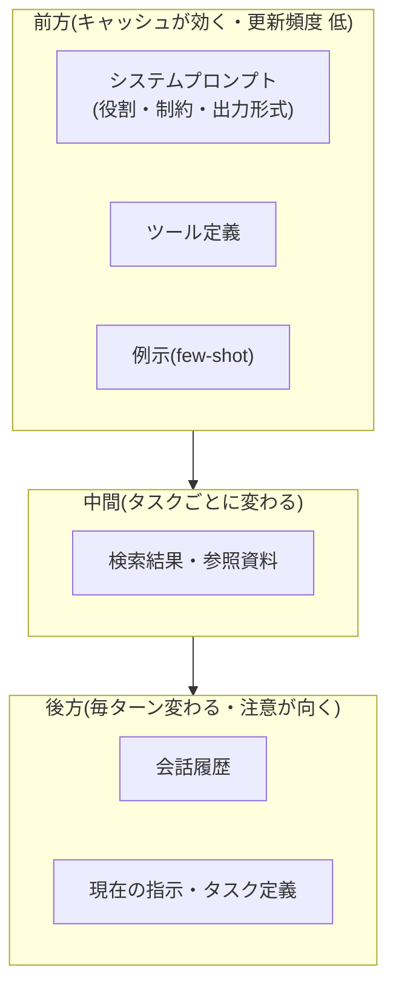

# コンテキスト設計の実践パターン

## この記事の目的

[コンテキストエンジニアリング](context-engineering.md)が示す原則(最小十分・重要情報を埋もれさせない・静的動的の分離・実行時取得)を、**実際にどう並べ・どれだけ割り当て・どう取得し・どう前処理し・どう測るか**という実践パターンに落とせるようになります。原則は分かったが具体の設計で手が止まる、という状態を解消します。

## 対象読者

- コンテキストエンジニアリングの原則は理解し、実際のコンテキスト構成を設計・改善する段階のエンジニア
- 長い対話・大量の参照資料を扱う Agent で、品質とコストを両立させたいエンジニア

## 前提知識

- [コンテキストエンジニアリング](context-engineering.md) — 設計原則(本記事はその実践詳解)
- [注意機構とコンテキストウィンドウの仕組み](../10-llm-foundations/attention-and-context.md) — レイアウトの根拠となる理論
- [メモリと状態管理](../01-concepts/memory-and-state.md) — 履歴という動的部分の基礎

## 本文

### 概要: 原則記事との分担

| 層 | 正本 | 本記事 |
| --- | --- | --- |
| 設計原則(何を入れるか) | [コンテキストエンジニアリング](context-engineering.md) | — |
| 実践パターン(どう並べ・測るか) | **本記事** | レイアウト・予算・取得・前処理・統合・計測の 6 領域 |
| 理論(なぜ効くか) | [注意機構とコンテキストウィンドウの仕組み](../10-llm-foundations/attention-and-context.md) | — |
| 検索そのもの | [RAG 実装パターン](../03-implementation/rag-implementation-patterns.md) | — |
| 履歴の圧縮・隔離 | [コンテキストの圧縮と隔離](context-compaction-and-isolation.md) | — |

なお、1 つのプロンプト内部の配置([プロンプトエンジニアリングの上級パターン](../03-implementation/prompt-engineering-patterns.md)の構造化)と、コンテキスト**全体**(システム・ツール定義・履歴・資料の総体)のレイアウトは別の粒度です。本記事は後者を扱います。

### レイアウトの設計: 更新頻度で層を分ける

コンテキスト全体を「どの順に並べるか」は、**更新頻度**を第一の軸にすると設計判断が単純になります。前方に置くほどプロンプトキャッシュが効き、後方(末尾)に置くほど直近性で注意が向く、という 2 つの性質([注意機構とコンテキストウィンドウの仕組み](../10-llm-foundations/attention-and-context.md))を、更新頻度の低い順に並べることで同時に満たせます。

- **キャッシュ境界を意識する**: 前方の固定ブロックにタイムスタンプ・セッション ID などの可変値が 1 つでも混じると、それ以降のキャッシュが毎回無効になります([コスト管理](../05-operations/cost-management.md))。可変値は後方の専用ブロックへ隔離します
- **末尾に「現在の指示」を再掲する**: 長い資料の後にタスク定義を短く繰り返すと、中間に置いたときより確実に参照されます(中間の想起が弱くなる性質への対処)
- **ツール定義の常駐を疑う**: 使用頻度の低いツールの定義は、前方に常駐させる価値があるか(トークンを毎回占有する)を検討します。フェーズによってツールセットを切り替える設計も選択肢です

### 予算の設計: コンテキストを配分する

「上限に入るか」ではなく「各要素にどれだけ割り当てるか」を設計します。コンテキストウィンドウを予算とみなし、セクション別に配分するのが実践的です。

- **セクション別バジェット**: システム + ツール定義(固定)/ 検索結果(上位 N 件・M トークンまで)/ 履歴(直近 K ターン + 要約)/ 出力用の余白、というように上限を要素ごとに決めます。とくに**出力用の余白**の確保は忘れられがちで、入力で埋め尽くすと生成が途中で打ち切られます
- **計測を先に用意する**: 実際に何がどれだけ占有しているかは、想像ではなく計測します。要素別のトークン内訳をトレースに残すと、肥大の主因(たいてい履歴か検索結果)がすぐ分かります([可観測性とトレーシング](../05-operations/observability-and-tracing.md)、[トークナイザとトークン経済](../10-llm-foundations/tokenization.md))
- **超過時の縮退規則を決める**: 予算を超えたときに何を削るかを、実行時に慌てて決めるのではなく規則化します(古い履歴から要約 → 検索件数を減らす → それでも溢れるなら停止して報告)。「入るだけ入れて溢れたら末尾を捨てる」実装は、最も重要な直近の指示を捨てる事故を生みます

### 取得戦略: 事前ロードと実行時取得の設計

[コンテキストエンジニアリング](context-engineering.md)の「事前ロードより実行時取得(just-in-time)」を、判断基準まで具体化します。

| 判断軸 | 事前ロードが向く | 実行時取得(JIT)が向く |
| --- | --- | --- |
| 使用確率 | 毎回使う | タスクによる |
| サイズ | 小さい | 大きい(一部しか使わない) |
| 更新頻度 | 静的 | 動的・鮮度が要る |
| レイテンシ許容 | 追加往復を避けたい | 往復を許容できる |

- **JIT のコスト**: 実行時取得は「検索してから答える」ための追加のループ往復とレイテンシを生みます([レイテンシ最適化](../05-operations/latency-optimization.md))。使用確率が高く小さいものまで JIT にすると、遅く高くなります
- **ハイブリッド(目次 + 本文)**: 大きなマニュアルは「目次・見出しだけ事前ロード + 本文は読み出しツールで取得」が定番です。モデルが全体像を把握したうえで必要箇所だけ引けます
- **迷ったら JIT に寄せる**: 事前ロードの過剰は静かに品質を蝕みますが、取得漏れは「検索してから答えて」という観測可能・改善可能な失敗として現れます(原則記事と同じ判断)

### 資料の前処理: どの形で渡すか

同じ資料でも、渡す前の加工形態で品質もコストも変わります。

| 形態 | 向く場面 | 代償 |
| --- | --- | --- |
| 全文 | 短い・正確な引用が要る | トークン消費・希釈 |
| 抜粋(関連箇所のみ) | 長文から一部を使う | 抽出の失敗が抜け漏れになる |
| 要約 | 概要把握で足りる | 損失圧縮・元の細部が消える |
| 構造化(表・キー値) | 定型データ | 構造化の前処理コスト |

判断の要点は、**下流のタスクが要求する精度**です。正確な引用・数値が要るなら全文か抜粋、方針判断だけなら要約、というように後段の用途から逆算します。要約で渡すと「元資料にない細部を聞かれても答えられない」という制約が生まれることを、渡す時点で意識します。

### 統合と競合: 複数情報源をどう束ねるか

複数の資料・情報源を渡すと、必ず競合(食い違い)と重複が起きます。放置するとモデルが恣意的にどちらかを採用し、再現性が失われます。

- **出所を明示する**: 各資料に出所(文書名・更新日・信頼度)を付けて渡すと、モデルが優先順位を判断でき、回答の検証もしやすくなります
- **競合の解決規則を渡す**: 「新しい更新日を優先」「一次情報を優先」「食い違う場合は両論併記して確認を促す」など、競合時の振る舞いを指示に含めます。指示がなければ運任せになります
- **重複を除く**: 同一内容の版違い・重複チャンクは前処理で除きます(希釈と混乱の元)。検索段での重複排除は [RAG 実装パターン](../03-implementation/rag-implementation-patterns.md)が扱います
- **鮮度**: 古い資料が混じると自信のある誤答の元になります([ケーススタディ: 社内ナレッジ Agent](../07-case-studies/case-study-knowledge-agent.md)の鮮度問題)。更新日をメタデータで渡し、古いものの扱いを規則化します

### 計測と改善: 効いているセクションを見つける

コンテキストは「入れた分だけ効く」わけではありません。どのセクションが品質に寄与しているかを測らないと、無駄な要素を運び続けます。

- **アブレーション(除去実験)**: あるセクション(例示・特定の資料・履歴の一部)を抜いて評価セットを回し、スコアが下がらなければそれは効いていない候補です([Agent 評価の基礎](../04-evaluation/agent-evaluation-basics.md))。1 セクション 1 実験で交絡を避けます
- **失敗の帰属**: 失敗ケースで「必要な情報がコンテキストにあったのに使われなかった(配置・希釈の問題)」のか「そもそも無かった(取得の問題)」のかを切り分けます。前者はレイアウト、後者は取得戦略の改善に向かいます
- **コストと品質の同時計測**: セクションを増減させたときの品質とトークンコストを両方見ます。品質が変わらずコストだけ増える要素は、削減候補です

## 実務での注意点

### アンチパターン

- **とにかく大きいウィンドウに詰め込む** → 希釈・中間の想起低下でむしろ品質が落ち、コストだけ増える → セクション別予算とアブレーションで「効く分だけ」に絞る
- **可変値を前方の固定ブロックに混ぜる** → キャッシュが毎回無効になりコストが跳ねる → タイムスタンプ・ID 等は後方の専用ブロックへ隔離する
- **出力用の余白を残さず入力で埋める** → 生成が途中で打ち切られ、壊れた出力になる → 予算に出力枠を先に確保する
- **競合する資料を無規則に並べる** → モデルが恣意的に採用し再現性が失われる → 出所と競合解決規則を渡す
- **効果を測らずにセクションを足し続ける** → 効かない要素を毎ターン運び続ける → アブレーションで寄与を確認してから採否を決める

### チェックリスト

- [ ] コンテキストを更新頻度の低い順(前方=固定・後方=可変)に並べている
- [ ] 前方の固定ブロックに可変値が混入していない(キャッシュ境界が保たれている)
- [ ] セクション別のトークン予算と、出力用の余白を確保している
- [ ] 予算超過時の縮退規則(何をどの順で削るか)が定義されている
- [ ] 事前ロード / JIT を判断軸(使用確率・サイズ・更新頻度・レイテンシ)で選んでいる
- [ ] 資料の前処理形態(全文・抜粋・要約・構造化)を下流の要求精度から選んでいる
- [ ] 複数資料に出所を付け、競合解決規則を渡している
- [ ] アブレーションで各セクションの品質寄与を確認している

## 関連トピック

- [コンテキストエンジニアリング](context-engineering.md) — 設計原則(本記事の前提・正本)
- [コンテキストの圧縮と隔離](context-compaction-and-isolation.md) — 履歴が増え続ける動的部分への対処(対の記事)
- [注意機構とコンテキストウィンドウの仕組み](../10-llm-foundations/attention-and-context.md) — レイアウトの理論的根拠
- [RAG 実装パターン](../03-implementation/rag-implementation-patterns.md) — 検索・重複排除の実装
- [コスト管理](../05-operations/cost-management.md) — プロンプトキャッシュとトークンコストの実務
- [プロンプトエンジニアリングの上級パターン](../03-implementation/prompt-engineering-patterns.md) — プロンプト内部(1 呼び出し)の配置

## 参考資料

- [Effective context engineering for AI agents(Anthropic)](https://www.anthropic.com/engineering/effective-context-engineering-for-ai-agents) — コンテキストを有限資源として設計する原則(アクセス日: 2026-07-07)

## TODO・未確認事項

なし
