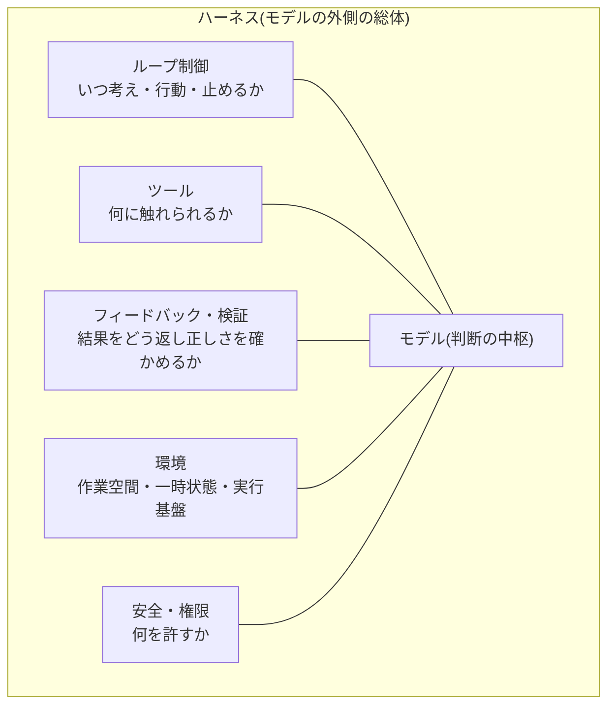

# ハーネスエンジニアリング

## この記事の目的

モデルの外側 — ループ・ツール・フィードバック・環境・制御の総体 = **ハーネス(harness)** — を一級の設計対象として扱い、同じモデルから最大の性能と信頼性を引き出せるようになります。「モデルを変えずに品質を上げる」余地がどこにあるかを、構成要素マップ・設計原則・評価方法として持ち帰れる状態がゴールです。

## 対象読者

- フレームワークやコーディングエージェントの部品(ループ・ツール・履歴管理)は使えるが、それらを「全体として設計する」視点がまだないエンジニア
- モデルを最新にしても品質が頭打ちで、モデル以外の伸びしろを探しているエンジニア

## 前提知識

- [Agent ループ](../01-concepts/agent-loop.md) — ハーネスの中心にある制御構造
- [ツール定義の設計](../03-implementation/tool-definition-design.md) — ハーネスの主要部品の 1 つ
- [フレームワーク選定ガイド](../03-implementation/framework-selection.md) — 既製ハーネスを選ぶ側の判断

## 本文

### 概要: なぜハーネスを一級の設計対象にするのか

Agent の品質は「モデルの賢さ」だけで決まると思われがちですが、実際には**同じモデルでも、それを取り巻くハーネスの作り込みで性能と信頼性が大きく変わります**。公開ベンチマークでは、同一モデルを最小構成のハーネス(コマンド実行とファイル編集だけ)で動かした場合と、試行の並列化や結果のスコアリングまで作り込んだ場合とで、無視できない差がつくことが繰り返し報告されています。総合精度が同じでもタスク単位では成否が入れ替わる、という報告もあります(具体例と数値の読み方は [エージェントベンチマークの全体像](../04-evaluation/agent-benchmarks-landscape.md) が正本)。

つまりハーネスは「モデルを載せる台」ではなく、**モデルと並ぶ性能の変数**です。ループ・ツール・履歴といった部品の正本はそれぞれ既存記事にあります。本記事はそれらを**全体として設計する論** — 何を部品として置き、どこをモデルに任せ、どう評価し、モデル更新とどう共進化させるか — を扱います。

| 対象 | 正本 | 本記事 |
| --- | --- | --- |
| ループの基礎 | [Agent ループ](../01-concepts/agent-loop.md) | — |
| ループの制御設計(時間軸) | [ループエンジニアリング](loop-engineering.md) | — |
| ツール定義 | [ツール定義の設計](../03-implementation/tool-definition-design.md) | — |
| ループ内フィードバック・検証器 | [ループ内フィードバックと検証器の設計](../03-implementation/loop-feedback-and-verification.md) | — |
| 入力に何を載せるか(内側の層) | [コンテキストエンジニアリング](context-engineering.md) | — |
| 既製ハーネスの選定 | [フレームワーク選定ガイド](../03-implementation/framework-selection.md) | — |
| 権限・サンドボックス | [ツール権限設計とサンドボックス](../06-security/tool-permissions-and-sandboxing.md) | — |
| ハーネス依存の実証 | [エージェントベンチマークの全体像](../04-evaluation/agent-benchmarks-landscape.md) | — |
| **全体の設計論** | **本記事** | 構成要素マップ・設計原則・環境・評価・共進化 |

なお三層のエンジニアリング(プロンプト → コンテキスト → ハーネス)の同心円で言えば、プロンプトが 1 回の入力、コンテキストが入力全体、ハーネスが**その外側のシステム全体**です。ハーネスはコンテキストを内包します。

### 構成要素の全体マップ

ハーネスはモデルを取り囲む部品群として整理できます。各部品には正本の記事があり、ハーネスエンジニアリングはそれらを**一貫した 1 つのシステムとして噛み合わせる**役割を担います。

| 部品 | 問い | 正本 |
| --- | --- | --- |
| ループ制御 | いつ考え・行動し・立ち止まり・止めるか | [ループエンジニアリング](loop-engineering.md) |
| ツール | モデルは何に触れられるか | [ツール定義の設計](../03-implementation/tool-definition-design.md) |
| フィードバック・検証 | 結果・エラーをどう返し、正しさをどう確かめるか | [ループ内フィードバックと検証器の設計](../03-implementation/loop-feedback-and-verification.md) |
| 環境 | どこで動き、状態をどこに持つか | 本記事(後述) |
| 安全・権限 | 何を許し、被害の上限をどう決めるか | [ツール権限設計とサンドボックス](../06-security/tool-permissions-and-sandboxing.md) |

### 設計原則: モデルに任せる部分とコードで固定する部分

ハーネス設計の中心にある判断は、**どこまでをモデルの裁量に委ね、どこからをコードで固定するか**の線引きです。

- **モデルに任せる**: 判断に多様性がある・入力が予測できない・正解が 1 つに決まらない部分(次の一手の選択、自然言語の解釈、方針の組み立て)
- **コードで固定する**: 正しさが決まっている・失敗が高くつく・毎回同じでよい部分(権限チェック、リトライ上限、出力スキーマの検証、危険な操作の承認ゲート)

境界を引く指針は 2 つです。第一に、**「指示はお願いにすぎない」**という原則です。プロンプトで「必ず〜すること」と書いても、それは強制ではありません。破られては困る制御はコード側([ガードレール](../06-security/guardrails.md))に置きます。第二に、**最小ハーネスから始める**ことです。先回りして足場を作り込むと、モデルが本来できることまで奪い、モデル更新で不要になる負債を積みます。動かない部分・失敗する部分を観測してから、その穴を埋める部品だけを足します。

### 環境の設計: モデルが働く場所を用意する

ハーネスの見落とされがちな部品が**環境** — モデルが実際に働く作業空間です。同じモデル・同じツールでも、環境の作りで安定性が変わります。

- **作業空間**: ファイルシステム・スクラッチパッドなど、Agent が中間成果や調査結果を書き出せる場所を与えると、すべてをコンテキストに抱え込まずに済みます(状態の外部化。[コンテキストの圧縮と隔離](context-compaction-and-isolation.md))
- **一時状態と使い捨て**: セッションごとに環境を作り直せると、前の実行の副作用が次に漏れません。再現とデバッグも容易になります
- **サンドボックス**: コード実行やコンピュータ操作を伴う Agent では、本番から隔離した使い捨て環境が安全性の前提です(設計の正本は [ツール権限設計とサンドボックス](../06-security/tool-permissions-and-sandboxing.md))

環境は「安全のための隔離」であると同時に、「モデルに手を動かす余地を与える」性能側の部品でもあります。

### 既製ハーネスを使うか、自作するか

ハーネス全体を自作する必要は必ずしもありません。フレームワークやコーディングエージェントは、作り込まれた既製ハーネスとも言えます。

| 選択 | 向いている状況 | 注意点 |
| --- | --- | --- |
| 既製(フレームワーク・コーディングエージェント) | 標準的な構成で早く作りたい。周辺機能(履歴・トレース・再開)込みで欲しい | 抽象の下の挙動(停止条件・圧縮のデフォルト)を把握しないとデバッグできない |
| 自作 | 制御・権限・監査・ログを細かく握りたい。独自の制御フローが要る | ループ本体は短いが、周辺(リトライ・監視・評価)の作り込みが要る |
| ハイブリッド | 大半は既製に乗せ、核心の制御だけ自作 | 境界の責務分担を明確にする |

選定軸の詳細は [フレームワーク選定ガイド](../03-implementation/framework-selection.md) が正本です。判断の勘所は、**自分たちの差別化がハーネスのどこにあるか**です。そこだけを握り、残りは既製に任せるのが現実的です。

### ハーネスの評価: 同一モデルで A/B する

ベンチマークがハーネス依存であるという事実は、裏返せば**自社でもハーネスの変更を評価対象にすべき**ということです。モデルを固定し、ハーネス(ツールの返し方・ループの型・環境)だけを変えて評価セットを回せば、その変更が効いているかを切り分けられます。

- **モデルとハーネスを分けて測る**: 「モデルを上げたら良くなった」のか「ハーネスを直したら良くなった」のかを混ぜないよう、変更は 1 つずつ評価します([Agent 評価の基礎](../04-evaluation/agent-evaluation-basics.md))
- **コストと品質を同時に見る**: ハーネスの作り込み(並列試行・多段検証)は品質を上げますが、コストとレイテンシも上げます。品質だけでなくコスト対効果(パレート)で判断します
- **軌跡で見る**: ハーネスの良し悪しは最終出力より過程に現れます(無駄な往復・堂々巡り)。[軌跡(trajectory)評価](../04-evaluation/trajectory-evaluation.md)で経路を評価します

### モデルとの共進化: ハーネスは軽くする方向で見直す

ハーネスの作り込みの多くは、その時点のモデルの弱点を補うために積まれます。手順を細かく指示する、失敗しやすい操作を分解する、といった足場です。ところが**モデルが賢くなると、その足場は逆に邪魔になります** — 細かすぎる手順指示はモデルの探索と衝突し、過剰な分解は往復を増やすだけになります。

したがってモデルを更新するたびに、ハーネスは**足す方向ではなく減らす方向**で見直します。「この足場はまだ必要か」「モデルに任せて消せる部品はないか」を定期的に問い、評価で確かめます。ハーネスとモデルは共進化する関係であり、一度組んだら固定するものではありません。

## 実務での注意点

### アンチパターン

- **モデルを上げることだけで品質を上げようとする** → ハーネスに残った伸びしろ(ツールの返し方・ループの型・環境)を放置し、コストの高いモデル変更に頼り続ける → まず同一モデルでハーネスを A/B し、モデル以外の余地を先に使い切る
- **先回りしてハーネスを作り込む** → 使われない足場が積み上がり、モデル更新のたびに保守負債になる → 最小構成から始め、観測された穴だけを埋める
- **破られては困る制御をプロンプトの指示で担保する** → 「指示はお願い」なので確率的に破られ、権限・上限が効かない → 強制すべき制御はコード(ガードレール)に置く
- **モデル更新でハーネスを見直さない** → 旧モデルの弱点を補う足場が、新モデルの足かせになって性能を頭打ちにする → 更新時に「減らせる足場」を棚卸しする
- **ハーネスの変更を評価せずに入れる** → 効いた気がするだけの部品が増え、コストだけ膨らむ → ハーネス変更も 1 変更 1 評価の対象にする

### チェックリスト

- [ ] モデルに任せる部分とコードで固定する部分の境界を、意図をもって引いている
- [ ] 破られては困る制御(権限・上限・危険操作の承認)がコード側にある
- [ ] 最小構成から始め、部品は観測された必要に応じて足している
- [ ] Agent の作業空間(スクラッチパッド・ファイル)と、必要なら使い捨て環境を用意している
- [ ] 既製ハーネスを使う場合、その停止条件・圧縮などのデフォルト挙動を把握している
- [ ] ハーネスの変更を、モデルを固定した A/B(品質とコストの両面)で評価している
- [ ] モデル更新時に「減らせる足場」を見直す運用がある

## 関連トピック

- [Agent ループ](../01-concepts/agent-loop.md) — ハーネスの中心にある制御構造(基礎)
- [ループエンジニアリング](loop-engineering.md) — ハーネスの時間軸(いつ考え・止めるか)の詳解
- [ループ内フィードバックと検証器の設計](../03-implementation/loop-feedback-and-verification.md) — ハーネスの「結果を返し正しさを確かめる」部品
- [ツール定義の設計](../03-implementation/tool-definition-design.md) — ハーネスの主要部品(ツール)の設計
- [フレームワーク選定ガイド](../03-implementation/framework-selection.md) — 既製ハーネスを選ぶ側の判断
- [ツール権限設計とサンドボックス](../06-security/tool-permissions-and-sandboxing.md) — 環境と権限の正本
- [エージェントベンチマークの全体像](../04-evaluation/agent-benchmarks-landscape.md) — ハーネス依存が実証されている根拠
- [コンテキストエンジニアリング](context-engineering.md) — ハーネスが内包する内側の層(入力の設計)

## 参考資料

- [Building Effective Agents(Anthropic)](https://www.anthropic.com/research/building-effective-agents) — ループ・ツール・環境を含む Agent 全体構成の整理(アクセス日: 2026-07-08)

## TODO・未確認事項

なし
