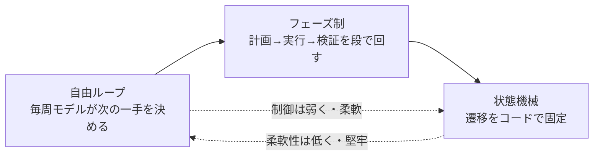

# ループエンジニアリング

## この記事の目的

Agent ループの制御 — いつ考えさせ、いつ行動させ、いつ立ち止まらせ、いつ止めるか — を設計対象として扱い、**迷走せず・止まりすぎず・予算内で収束する**ループを設計できるようになります。[Agent ループ](../01-concepts/agent-loop.md)が示す「1 周で何が起きるか」の先にある、ループの型・停止条件の詳解・堂々巡りへの介入・バックトラック・入れ子までを扱います。

## 対象読者

- 最小の Agent ループは動かせるが、長いタスクで迷走・空回り・早すぎる打ち切りに悩んでいるエンジニア
- 自律度の高い Agent を、暴走させず予算内で完了させる制御を設計したいエンジニア

## 前提知識

- [Agent ループ](../01-concepts/agent-loop.md) — 1 イテレーションの構造と停止条件の基礎(本記事はその制御設計の詳解)
- [プランニングと推論](../01-concepts/planning-and-reasoning.md) — 逐次判断・事前計画・リフレクションの区別
- [ハーネスエンジニアリング](harness-engineering.md) — ループを含むモデル外側の全体設計(本記事はその時間軸)

## 本文

### 概要: ループは「空間」ではなく「時間」の設計

[ハーネスエンジニアリング](harness-engineering.md)が「モデルの外側に何を置くか」という空間的な構成だとすれば、ループエンジニアリングはその**時間軸** — いつ考え・いつ動き・いつ止まるか — の設計です。[Agent ループ](../01-concepts/agent-loop.md)は 1 周の構造と最低限の停止条件を扱いました。本記事は、そのループを**長く回しても破綻させない制御**に踏み込みます。

| 対象 | 正本 | 本記事 |
| --- | --- | --- |
| ループ 1 周の構造・基本の停止条件 | [Agent ループ](../01-concepts/agent-loop.md) | — |
| 計画・推論のパターン | [プランニングと推論](../01-concepts/planning-and-reasoning.md) | — |
| エラー分類とリトライの一般論 | [エラー処理・リトライ・フォールバック設計](error-handling-and-retries.md) | — |
| 中断・再開の永続化 | [非同期・長時間タスクの設計(耐久実行)](async-and-durable-agents.md) | — |
| 複数 Agent の構成 | [オーケストレーションパターン](orchestration-patterns.md) | — |
| 暴走時の運用対応 | [インシデント対応](../05-operations/incident-response.md) | — |
| **ループの制御設計** | **本記事** | 型・停止条件の詳解・再計画・迷走介入・バックトラック・入れ子 |

### ループの型を選ぶ

すべてを 1 種類の自由ループで回す必要はありません。タスクの性質に応じて、制御の強さが異なる 3 つの型から選び、組み合わせます。自律性スペクトラム([AI Agent とは何か](../01-concepts/what-is-an-ai-agent.md))とおおむね対応します。

| 型 | 向く場面 | 代償 |
| --- | --- | --- |
| 自由ループ | 探索的・手順が事前に決まらない | 迷走・堂々巡りのリスクが最も高い |
| フェーズ制(計画 → 実行 → 検証) | 中〜長タスクで、段階に分けられる | フェーズ境界の設計が要る |
| 状態機械(遷移をコード固定) | 手順が既知・失敗が高くつく | 柔軟性を失う(想定外に弱い) |

指針は、**必要な最小限の自由度だけをモデルに与える**ことです。手順が決まっている工程まで自由ループにすると、迷走の余地を無駄に広げます。逆に探索が要る工程を状態機械で縛ると、モデルの強みを殺します。多くの実務は「大枠はフェーズ制、各フェーズ内は自由ループ」の混成に落ち着きます。

### 停止条件の設計

[Agent ループ](../01-concepts/agent-loop.md)で挙げた 4 系統(正常完了・上限・エラー・人間の介入)を、設計の粒度まで詳解します。要点は、**「完了」の判定をモデルの自己申告だけに委ねない**ことです。

- **完了判定は検証で裏を取る**: モデルの「できました」は主観です。可能なら検証器(テスト・スキーマ・照合)で客観的に確認してから完了とします(設計は [ループ内フィードバックと検証器の設計](../03-implementation/loop-feedback-and-verification.md))。検証できないタスクでは、完了基準を事前にプロンプトへ明示します
- **予算は多次元で持つ**: ステップ数・トークン・時間・コストは別々に上限を設けます。1 つだけだと、他の次元で暴走します(例: ステップ数は少ないが 1 回の出力が巨大)
- **超過時の縮退を決める**: 上限に達したら黙って止めるのではなく、途中経過・未完了理由・次にやるべきことを構造化して返します。20 ステップ分の作業は未完了でも価値があります
- **予算配分を動的にする**: 難しいサブタスクに予算を寄せ、簡単な工程は早く切り上げる、といった配分も選択肢です(一律上限より収束が速くなります)

### 再計画のリズム

計画は立てた瞬間から陳腐化します。どのタイミングで見直すかが、迷走と硬直の分かれ目です。

- **毎ステップ再計画**: 柔軟だが、方針がふらつき往復が増える。短く探索的なタスク向き
- **節目で再計画**: フェーズ完了・大きな失敗・新情報の獲得時にだけ計画を見直す。長いタスクで安定します
- **計画の陳腐化を検知する**: 「計画の前提がまだ成り立っているか」を節目で確認します。前提が崩れたのに古い計画を実行し続けるのが、長時間タスクの典型的な失敗です

原則は、**行動のリズムより粗い頻度で計画を見直す**ことです。毎周方針を疑うと収束しません。計画の作り方そのものは [プランニングと推論](../01-concepts/planning-and-reasoning.md) が正本です。

### 迷走の検知と介入

長いループの最大の敵は、**同じところを回り続ける堂々巡り**です。放置するとコストだけが増えて完了しません。検知と介入をループに組み込みます。

- **検知シグナル**: 同一ツール・同一引数の反復、成果物が変化しないままのステップ増加、同じエラーの繰り返し、進捗指標(残タスク・テスト通過数)の停滞。これらはコード側で機械的に監視できます([可観測性とトレーシング](../05-operations/observability-and-tracing.md))
- **介入の段階**: 軽いものから、(1) ヒント注入(「同じ方法を 3 回試している。別の手段を検討せよ」)、(2) 仕切り直し(汚染したコンテキストを外部化状態から作り直す。[コンテキストの圧縮と隔離](context-compaction-and-isolation.md))、(3) エスカレーション(人間へ引き継ぐ。[Human-in-the-Loop 設計](human-in-the-loop.md))
- **早めに介入する**: 堂々巡りは時間とともに悪化します。「3 回同じ失敗を繰り返したら介入」のような閾値を先に決めておきます

エラーそのものの分類と回復(リトライするか・フォールバックするか)は [エラー処理・リトライ・フォールバック設計](error-handling-and-retries.md) が、本番で暴走が起きた際の運用対応は [インシデント対応](../05-operations/incident-response.md) が正本です。本記事は「ループ内で迷走をどう検知し介入するか」の制御設計を扱います。

### バックトラックとやり直し

前進だけがループではありません。**失敗を認めて戻る**設計が、行き詰まりからの回復を可能にします。

- **チェックポイントを置く**: フェーズ境界や成果物確定時に、戻れる地点を作業状態として保存します([非同期・長時間タスクの設計(耐久実行)](async-and-durable-agents.md)のチェックポイントと同じ仕組み)
- **戻る判断**: 現在の経路が行き詰まったら、直前のチェックポイントまで戻り、別の手段で再挑戦します。ずるずる前進を続けるより速いことが多いです
- **戻った事実を残す**: 「この経路は失敗した」という情報をコンテキストに残さないと、戻った先で同じ失敗を繰り返します。失敗した試みの要約を残し、探索済みの経路を避けさせます

### 入れ子と分割

長いタスクを 1 本の巨大なループで回すと、コンテキストが肥大し迷走しやすくなります。ループを**入れ子**にして分割します。

- **サブタスクの子ループ**: 独立して完結できる工程を子ループ(必要ならサブエージェント)に切り出し、親には要点だけ返します。親のループは短く保たれ、子の探索ログで汚れません([コンテキストの圧縮と隔離](context-compaction-and-isolation.md)の隔離)
- **フェーズ分割**: 長時間タスクを「調査 → 設計 → 実装 → 検証」のようなフェーズに割り、各フェーズを独立したループとして回します。フェーズ境界は圧縮・チェックポイント・再計画の自然な単位になります
- **複数 Agent への展開**: 分割が組織的になると、オーケストレーションの領域に入ります(構成の正本は [オーケストレーションパターン](orchestration-patterns.md))。本記事は 1 つの Agent のループを入れ子にする単位までを扱います

### コードで制御するか、プロンプトで促すか

ループ制御にも [ハーネスエンジニアリング](harness-engineering.md)の原則 — 「指示はお願いにすぎない」— がそのまま効きます。

- **コードで固定すべき制御**: 上限(ステップ・コスト・時間)、危険な操作の前の停止、堂々巡りの検知と強制介入。これらは破られては困るので、プロンプトの指示ではなくループのコードに書きます
- **プロンプトで促す制御**: 「行き詰まったら別の手段を検討する」「節目で計画を見直す」といった、柔らかい振る舞いの誘導。効くこともありますが、確実ではありません
- **併用が現実的**: 柔らかい誘導をプロンプトで与えつつ、破綻を防ぐ硬い上限はコードで担保する二重化が実務の定石です

## 実務での注意点

### アンチパターン

- **完了をモデルの自己申告だけで判定する** → 「できました」を鵜呑みにして、未完成・誤った成果物を完了扱いする → 検証器で裏を取るか、完了基準を事前に明示する
- **予算を 1 次元でしか持たない** → ステップ上限は守られても、トークンや時間が別次元で暴走する → ステップ・トークン・時間・コストを別々に上限化する
- **迷走を検知せず自由ループを回し続ける** → 同じ失敗を繰り返してコストだけ増え、完了しない → 反復・停滞のシグナルを機械的に監視し、閾値で介入する
- **毎ステップ計画を疑う** → 方針がふらついて収束しない → 再計画は行動より粗いリズム(節目)で行う
- **戻る設計がない** → 行き詰まっても前進し続け、傷を深くする → チェックポイントを置き、失敗した経路の記録を残してバックトラックする
- **1 本の巨大ループにすべてを詰める** → コンテキストが肥大し迷走しやすくなる → フェーズ分割と子ループで入れ子にする

### チェックリスト

- [ ] タスクに対してループの型(自由 / フェーズ制 / 状態機械)を意図して選んでいる
- [ ] 完了判定を自己申告だけに委ねず、検証または事前の完了基準で裏付けている
- [ ] ステップ・トークン・時間・コストの上限を別々に設定している
- [ ] 上限超過時に途中経過と未完了理由を構造化して返す
- [ ] 堂々巡り(反復・停滞)の検知シグナルと、段階的な介入を用意している
- [ ] 再計画のリズムが行動より粗く、計画の前提を節目で確認している
- [ ] チェックポイントとバックトラック(失敗経路の記録を含む)を設計している
- [ ] 破られては困る制御(上限・危険操作の停止)がコード側にある

## 関連トピック

- [Agent ループ](../01-concepts/agent-loop.md) — 1 周の構造と基本の停止条件(本記事の前提・正本)
- [ハーネスエンジニアリング](harness-engineering.md) — ループを含むモデル外側の全体設計(本記事はその時間軸)
- [プランニングと推論](../01-concepts/planning-and-reasoning.md) — 再計画の中身(計画の作り方)
- [ループ内フィードバックと検証器の設計](../03-implementation/loop-feedback-and-verification.md) — 完了判定を裏付ける検証器の設計
- [エラー処理・リトライ・フォールバック設計](error-handling-and-retries.md) — エラー分類とリトライの一般論
- [コンテキストの圧縮と隔離](context-compaction-and-isolation.md) — 仕切り直しと子ループへの隔離
- [非同期・長時間タスクの設計(耐久実行)](async-and-durable-agents.md) — チェックポイントと中断・再開
- [インシデント対応](../05-operations/incident-response.md) — 本番で暴走が起きた際の運用対応

## 参考資料

- [Building Effective Agents(Anthropic)](https://www.anthropic.com/research/building-effective-agents) — ループの型と制御の基本構成の整理(アクセス日: 2026-07-08)

## TODO・未確認事項

なし
