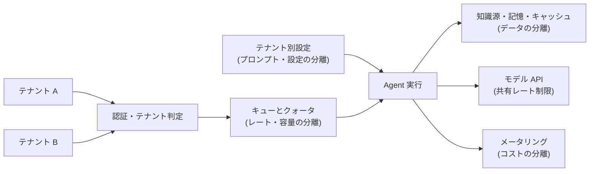

# マルチテナント設計

## この記事の目的

複数の顧客・部門(テナント)が 1 つの Agent 基盤を共有する構成で、**データ・プロンプト設定・レート容量・コストの 4 軸の分離**を設計できるようになります。クロステナント混入(他社のデータが回答に混ざる)とノイジーネイバー(1 テナントの暴走が全テナントを巻き込む)という 2 大事故を、モデルの善意ではなく構造で防ぐことが目標です。

## 対象読者

- B2B SaaS プロダクトに Agent 機能を組み込むエンジニア・アーキテクト
- 社内共通の Agent 基盤を複数部門・複数チームに提供するプラットフォーム担当

## 前提知識

- [デプロイとスケーリング](../05-operations/deployment-and-scaling.md) — 基盤全体の実行形態・容量設計(本記事はそれをテナント軸で分割します)
- [エージェントの認証・認可](../06-security/agent-identity-and-auth.md) — 「誰の権限で動くか」の設計(テナント判定の前提)
- [データ漏えい対策](../06-security/data-exfiltration.md) — 漏えい経路の全体像(本記事はテナント間の漏えいに特化します)

## 本文

### 概要: 分離すべき 4 つの軸

マルチテナント(multi-tenancy)とは、複数のテナント(tenant。顧客企業・部門などの契約単位)が同一のシステムを共有する構成です。Agent 基盤では、共有されるものが通常の Web アプリより多くなります — アプリケーションコードに加えて、モデル API のレート制限枠、知識源のインデックス、長期記憶、キャッシュ、そして運用チームの目までが共有資源です。

Agent のマルチテナントが通常の SaaS より難しい理由は 3 つあります。

1. **確率的な挙動**: プロンプトに他テナントの情報が混入すれば、モデルはそれを使って回答しえます。「使うな」という指示は分離ではありません
2. **共有ボトルネック**: モデル API のレート制限・容量は基盤全体で共有され、1 テナントの大量実行が全テナントのレイテンシに直結します
3. **従量コスト**: テナントごとの利用量がそのまま原価になるため、テナント別に測れないと採算管理が成立しません

この性質に対応して、分離を 4 つの軸に分けて設計します。

| 分離の軸 | 守るもの | 代表的な事故 |
| --- | --- | --- |
| データ | 知識源・記憶・履歴・キャッシュ・ログ | クロステナント混入(他社データが回答に出る) |
| プロンプト・設定 | テナント別カスタマイズの影響範囲 | あるテナントの設定が全体の挙動を変える |
| レート・容量 | 実行資源の公平な配分 | ノイジーネイバー(1 社の暴走で全社が遅延) |
| コスト | テナント別の原価と上限 | 赤字テナントの検知不能・コスト暴走の波及 |

### データの分離: テナントコンテキストの貫通

データ分離の基本原則は、**テナント ID を認証時に一度だけ確定し、以後のすべての層(ツール呼び出し・検索・記憶・キャッシュ・ログ)へ実行コンテキストとして機械的に伝播させる**ことです。モデルへの指示(「テナント A のデータだけを使ってください」)やツールの引数(モデルが生成する `tenant_id` パラメータ)にテナント判定を委ねてはいけません。どちらもモデルの出力に依存しており、プロンプトインジェクションや単純な生成ミスで破れます([データ漏えい対策](../06-security/data-exfiltration.md))。

知識源(RAG)の分離には 2 つの方式があります。

| 方式 | 内容 | 向く状況 |
| --- | --- | --- |
| 物理分離 | テナントごとに別のインデックス・コレクションを持つ | テナント数が少ない/契約・規制で分離を求められる/事故耐性を最優先 |
| 論理分離 | 共有インデックス + テナント ID によるメタデータフィルタ | テナント数が多い/インデックス運用コストを抑えたい |

論理分離を選ぶ場合の必須条件は、フィルタを**検索基盤のクエリ層で無条件に強制する**ことです(アプリケーションコードが検索クエリを組み立てる時点でテナント ID を注入し、フィルタなしのクエリを発行できない構造にします)。フィルタの付け忘れが 1 か所でもあれば混入事故になるため、「フィルタを付ける」規約ではなく「フィルタなしでは検索できない」構造で守ります([RAG 実装パターン](../03-implementation/rag-implementation-patterns.md)の権限反映と同じ原則のテナント版です)。

長期記憶・会話履歴は「テナント → ユーザー」の 2 段スコープで管理します([長期記憶の実装](../03-implementation/long-term-memory-implementation.md)のユーザー分離の上位に、テナント境界がもう 1 枚加わる形です)。解約時にはテナント単位の全削除が契約・規制上の義務になることが多いため、テナント ID で横断的に消せるデータ配置にしておきます([コンプライアンスとガバナンス](../06-security/compliance-and-governance.md))。

見落とされやすい共有資源が 3 つあります。

- **キャッシュ**: プロンプトキャッシュや検索結果・回答のキャッシュ(セマンティックキャッシュ)をテナント横断で共有すると、テナント固有情報を含む結果が別テナントに返りえます。キャッシュキーにテナントスコープを含めるか、テナント固有情報を含む内容を共有キャッシュに入れない設計にします
- **トレース・ログ**: 可観測性基盤には全テナントの会話・ツール実行が集まります。運用担当が全テナントを閲覧できる状態は契約・規制上の論点になるため、閲覧のアクセス制御と監査を設計します([可観測性とトレーシング](../05-operations/observability-and-tracing.md))
- **評価・改善への本番データ利用**: あるテナントの失敗ケースを評価データセットに還流させる運用([フィードバックループの運用](../05-operations/feedback-loops.md))は、テナント契約でデータのそのような利用が許可されているかの確認が先です

### プロンプトとテナント別設定

テナントごとのカスタマイズ(追加指示・用語集・トーン・有効にするツールの範囲)は必ず発生します。これを**コード分岐ではなく設定データ**として扱います。テンプレート化したプロンプトにテナント設定を注入する構成にし、設定はバージョン管理された資産として運用します([プロンプト資産の管理とバージョニング](../03-implementation/prompt-management.md))。テナントごとに if 文とプロンプト変種を増やす方式は、テナント数 × 変更頻度で検証コストが爆発します。

このとき、**テナント設定は半信頼の入力**として扱います。テナント管理者が書ける追加指示は、そのテナントのスコープ内でだけ効くよう設計し、システム全体の方針(安全制約・ツール権限・他テナントに影響する挙動)を上書きできない位置と形式で注入します。テナント管理者は攻撃者ではないにせよ、その入力はプロンプトインジェクションの持ち込み経路になりえます([プロンプトインジェクション](../06-security/prompt-injection.md))。

モデルとプロンプトのバージョンは、**テナント間で揃えるのが既定**です。テナント別にバージョンを固定し始めると、回帰テストの検証マトリクスが「バージョン数 × テナント数」に膨らみ、更新が事実上止まります。特定テナントからの「挙動を固定してほしい」という要求は、専用ティア(後述)の契約事項として例外扱いにします。

### レートと容量の分離: ノイジーネイバー対策

モデル API のレート制限と同時実行容量は基盤全体の共有資源です。何もしなければ、1 テナントのバッチ処理や暴走ループが枠を使い切り、他の全テナントの対話がタイムアウトします。この「うるさい隣人」問題をノイジーネイバー(noisy neighbor)と呼びます。全体の容量設計([デプロイとスケーリング](../05-operations/deployment-and-scaling.md))を済ませたうえで、その内側をテナントに配分します。

- **入口のテナント別クォータ**: 同時実行数と単位時間あたりのリクエスト・トークン量をテナントごとに制限します。超過は即エラーではなくキュー投入にして、当該テナントだけを待たせます
- **公平なスケジューリング**: 全テナント共有の 1 本キューは、先に大量投入したテナントが勝つ構造です。テナント別キュー + 重み付きの取り出し(契約ティアに応じた配分)にします
- **ワークロード種別の優先度**: 同じテナント内でも、対話型(人が待っている)をバッチ(夜間集計など)より優先します。優先度はテナント軸と直交する第 2 の軸です
- **バックプレッシャ(backpressure)のスコープ**: プロバイダーから 429 が返り始めたときの減速は、全体一律ではなく発生源のテナント・ワークロードから絞ります

プロバイダー側の機能でキーやプロジェクトを分ける(大口テナントに専用のレート制限枠・専用キーを割り当てる)と、この配分を物理的に分離できます。運用するキーが増える代わりに、暴走の波及とコスト集計の混在を構造的に断てます。

### コストの分離とメータリング

従量課金のモデル API を共有する以上、**テナント別のメータリング(metering。利用量の計測)**がないと採算も異常検知も成立しません。

- **計測の実装**: トレースにテナント ID を属性として付け、トークン消費・ツール実行数・タスク数をテナント別に集計します。トレース基盤に最初から仕込んでおけば、課金・採算・異常検知が同じデータから出せます([コスト管理](../05-operations/cost-management.md))
- **テナント別のコスト上限**: コスト暴走([インシデント対応](../05-operations/incident-response.md))はテナント単位でも起きます。テナントごとの日次・月次上限と、超過時の縮退(上限到達テナントだけ停止・低速化)を用意します
- **プラン別のモデルティア**: 上位プランに上位モデル・下位プランに軽量モデルという振り分けは、ティア混在設計([モデル選定ガイド](../03-implementation/model-selection.md))をプラン軸に適用したものです。プラン原価と価格の整合をメータリングデータで検証します

テナント別コストを外部への課金に反映する(計測単位の選択・上限の契約化)は、[エージェントの API 設計](agent-api-design.md)のメータリングで扱います。

### 分離レベルの選択

4 軸すべてを最大強度で分離する必要はありません。分離レベルは段階があり、コストと事故耐性のトレードオフで選びます。

| レベル | 構成 | 選ぶ理由 |
| --- | --- | --- |
| 共有(論理分離) | 全テナント同一インフラ。データはフィルタとスコープで分離 | 標準。運用が 1 系統で済む |
| 部分専用 | 大口テナントに専用キュー・専用インデックス・専用 API キー | ノイジーネイバー・コスト混在を物理的に断ちたい |
| 専用(物理分離) | テナント専用のデプロイ・リージョン固定・専用の鍵管理 | 契約・規制(データ所在地・分離要件)で要求される |

実務では「基本は共有、大口 1〜2 社だけ部分専用または専用」というハイブリッドに落ち着くことが多いです。重要なのは、**テナント ID がすべての層を貫通していれば、分離レベルは後から上げられる**ことです。逆に、途中の層でテナント文脈が消える設計は、専用化の要求が来たときに作り直しになります。

## 実務での注意点

### アンチパターン

- **プロンプトの指示でテナント分離を実現しようとする** → インジェクションや生成ミスで破れ、クロステナント混入になる → テナント ID は実行コンテキストとして基盤層で強制する
- **キャッシュ・長期記憶にテナントスコープを付け忘れる** → 検索とデータベースは分離できていても、キャッシュ経由で他テナントの内容が返る → 共有されるすべての保存層を棚卸しし、キーにテナントスコープを含める
- **全体のレート制限だけでテナント別クォータを設けない** → 1 テナントのバッチ暴走で全テナントの対話が止まる(ノイジーネイバー) → テナント別クォータ + 公平スケジューリング + テナント単位のバックプレッシャ
- **テナント別のコスト計測を後回しにする** → 赤字プランの検知もテナント単位のコスト暴走対応もできない → トレースのテナント属性として最初から仕込む
- **テナント別の要望をコード分岐で受け続ける** → プロンプト変種と if 文が増殖し、更新のたびに全変種の検証が必要になる → テンプレート + 設定データ + バージョン統一を既定にする

### チェックリスト

- [ ] テナント ID が認証からツール・検索・記憶・キャッシュ・ログまで機械的に伝播している(モデルの出力に依存する箇所がない)
- [ ] 知識源の検索フィルタが「付け忘れられない」構造(クエリ層での強制)になっている
- [ ] キャッシュのキーとスコープにテナント境界が含まれている
- [ ] テナント別のクォータ(同時実行・トークン量)と公平なスケジューリングがある
- [ ] テナント別のコストメータリングと上限・縮退がある
- [ ] テナント設定を半信頼入力として扱い、影響範囲をテナント内に限定している
- [ ] 解約時にテナント単位でデータを全削除できる(記憶・履歴・インデックス・ログを含む)
- [ ] 分離レベル(共有/部分専用/専用)を契約・規制要求と照らして明示的に選んだ

## 関連トピック

- [デプロイとスケーリング](../05-operations/deployment-and-scaling.md) — 基盤全体の容量設計(本記事はその配分)
- [エージェントの API 設計](agent-api-design.md) — メータリングを外部課金・API 契約へ反映する側
- [エージェントの認証・認可](../06-security/agent-identity-and-auth.md) — テナント内の「誰として動くか」
- [データ漏えい対策](../06-security/data-exfiltration.md) — 漏えい経路の全体像
- [長期記憶の実装](../03-implementation/long-term-memory-implementation.md) — ユーザー分離・削除要求(テナント境界の 1 段内側)
- [プロンプト資産の管理とバージョニング](../03-implementation/prompt-management.md) — テナント設定を資産として扱う基盤
- [コスト管理](../05-operations/cost-management.md) — コスト構造とメータリングの技術面
- [コンプライアンスとガバナンス](../06-security/compliance-and-governance.md) — データ所在地・削除義務など分離要求の出どころ

## 参考資料

- なし(マルチテナント分離は SaaS 設計の一般原則であり、本記事はそれを Agent 固有の共有資源 — モデル呼び出し枠・知識源・記憶・キャッシュ — に適用した本ライブラリの整理のため、単独の外部一次資料はありません)

## TODO・未確認事項

なし
