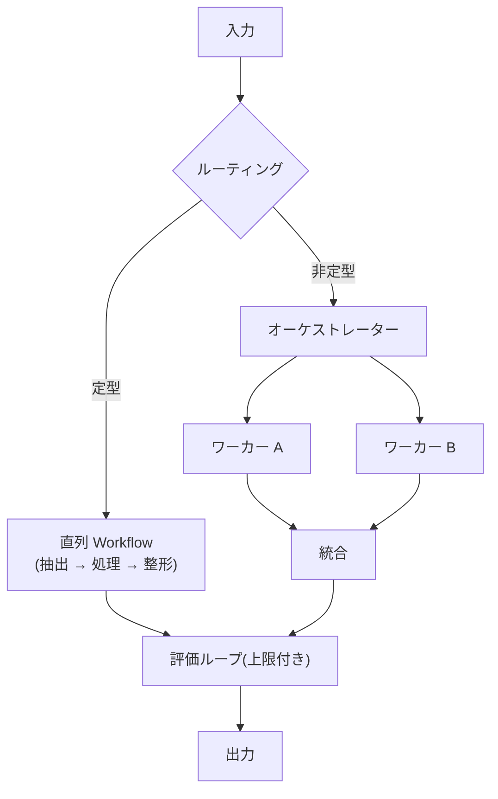

# オーケストレーションパターン

## この記事の目的

複数の LLM 呼び出し・Agent を組み合わせる定番パターン(直列・並列・ルーティング・オーケストレーター・評価ループ)の使いどころと弱点を理解し、タスクに合う構成を最小の複雑さで選べるようになります。

## 対象読者

- 単一の LLM 呼び出し・単一 Agent では品質が頭打ちになり、構成を検討しているエンジニア
- マルチステップの LLM システムの全体構造を設計するテックリード

## 前提知識

- [Workflow 型 vs Agent 型の使い分け](workflow-vs-agent.md) — 固定手順と自律の使い分け
- [シングルエージェントとマルチエージェント](../01-concepts/single-vs-multi-agent.md) — 複数 Agent の動機と代償

## 本文

### 概要

オーケストレーション(orchestration)とは、複数の LLM 呼び出しや Agent の**実行順序とデータの流れを制御する**ことです。部品(1 回の呼び出し・1 つの Agent)の品質が同じでも、組み合わせ方で全体の品質・コスト・堅牢性は大きく変わります。

以下のパターンは Workflow 型の構成として使うことも、各ノードを Agent にして使うこともできます。

### 詳細: 5 つの基本パターン

| パターン | 動き方 | 使いどき | 弱点 |
| --- | --- | --- | --- |
| 直列(プロンプトチェーン) | タスクを段階に分解し、順に処理する | 段階ごとに性質が違う(抽出 → 変換 → 整形)。中間検証を挟みたい | 段数分のレイテンシ。前段の誤りが伝搬する |
| 並列 | 独立した部分を同時に実行し、結果を統合する | 観点別レビュー、セクション分割、多数決による信頼性向上 | 統合ステップの設計が必要。共有状態を持てない |
| ルーティング | 入力を分類し、専用の処理へ振り分ける | 入力の種類が明確に分かれる(問い合わせ分類など) | ルーターの誤分類が下流の失敗として現れる |
| オーケストレーター・ワーカー | 親がタスクを動的に分解し、ワーカーに委譲して統合する | 分解の仕方が事前に決められない調査・生成タスク | 複雑性・コストが最も高い。委譲指示の質に依存する |
| 評価・最適化ループ | 生成結果を評価役が検査し、修正を繰り返す | 品質基準が明確で、反復改善が効く成果物 | 回数上限がないとコストが発散する |

### 詳細: パターンは合成して使う

実システムは単一パターンでは完結せず、上図のような合成になります。よくある合成形:

- **ルーター + 二層構成** — 定型入力は安価な直列 Workflow へ、非定型だけ Agent へ振り分け、コストを入力の難しさに比例させます
- **並列 + 統合 + 評価** — 独立した生成を並列で行い、統合結果を評価ループで検品します
- **オーケストレーター配下の直列ワーカー** — ワーカー自体は固定手順にして、不確実性を親の分解判断だけに閉じ込めます

合成の指針は [Workflow 型 vs Agent 型](workflow-vs-agent.md) と同じで、**判断が必要な場所だけに自律性を置く**ことです。

### 詳細: 外部エージェント連携の概観

ここまでは自システム内のオーケストレーションでしたが、組織・システムの境界を越えて他社・他チームのエージェントと連携する動きがあります。エージェント同士の発見・認証・タスク委譲を標準化するプロトコルとして A2A(Agent2Agent)などが提案されています。

設計上の最重要ポイントは、**外部エージェントは信頼境界の外にある**ことです。返ってくる成果物は検証が必要な外部入力であり、委譲するデータは外部送信です([Agent の脅威モデル概観](../06-security/threat-model-overview.md))。

> **TODO(要確認):** A2A 等のエージェント間連携プロトコルの仕様・採用状況を公式仕様リポジトリと主要ベンダーの対応発表で確認する(最終確認: 2026-07)

### 設計判断: 最小構成から計測して育てる

パターン追加は 1 つずつ、計測を伴って行います。「直列で作る → ボトルネックのステップを特定する → そこだけ並列化 / Agent 化する」という順序が、最初から複雑なグラフを組むより速く良い構成に到達します。各パターンの弱点(上表)は、追加のたびに監視項目になります。

## 実務での注意点

### アンチパターン

- **最初から複雑なグラフを組む** → どのノードが品質・コストのボトルネックか分からず、デバッグ不能になる → 直列の最小構成から始め、計測でパターン追加を正当化する
- **並列ノードが共有状態に書き込む** → 実行順序依存の不整合が「たまに起きるバグ」になる → 並列部分は読み取り専用にし、書き込みは統合ステップに集約する
- **ルーターの分類品質を単体で検証しない** → 誤ルーティングが下流の失敗として現れ、原因特定に時間を浪費する → ルーター単体の分類精度を評価してから下流を疑う

### チェックリスト

- [ ] 各パターンの採用理由を計測データ(またはタスク特性)で説明できる
- [ ] 中間出力に検証ポイントがある(前段の誤りを早期に検出できる)
- [ ] 並列部分に共有状態への書き込みがない
- [ ] ルーター・評価役など「判断する部品」の単体評価がある
- [ ] 評価ループに回数上限がある
- [ ] 外部エージェントとの連携部分を信頼境界として扱っている

## 関連トピック

- [Workflow 型 vs Agent 型の使い分け](workflow-vs-agent.md) — 各ノードを固定にするか自律にするかの判断
- [シングルエージェントとマルチエージェント](../01-concepts/single-vs-multi-agent.md) — オーケストレーター・ワーカーの Agent 版の詳細
- [プランニングと推論](../01-concepts/planning-and-reasoning.md) — 計画を構造(オーケストレーション)に固定する選択
- [エラー処理・リトライ・フォールバック設計](error-handling-and-retries.md) — ノード間のエラー伝搬への対処
- [Human-in-the-Loop 設計](human-in-the-loop.md) — フロー内への承認ポイントの配置
- [examples/python/multi-agent/](../../examples/python/multi-agent/README.md) — 計画役 + 実行役の最小オーケストレーション(モック実行可)

## 参考資料

- [Building Effective Agents(Anthropic)](https://www.anthropic.com/research/building-effective-agents) — 本記事のパターン分類の主要な出典(アクセス日: 2026-07-05)
- [How we built our multi-agent research system(Anthropic)](https://www.anthropic.com/engineering/built-multi-agent-research-system) — オーケストレーター・ワーカー構成の実運用知見(アクセス日: 2026-07-05)

## TODO・未確認事項

> **TODO(要確認):** A2A 等のエージェント間連携プロトコルの仕様・採用状況を公式仕様リポジトリと主要ベンダーの対応発表で確認する(最終確認: 2026-07)
