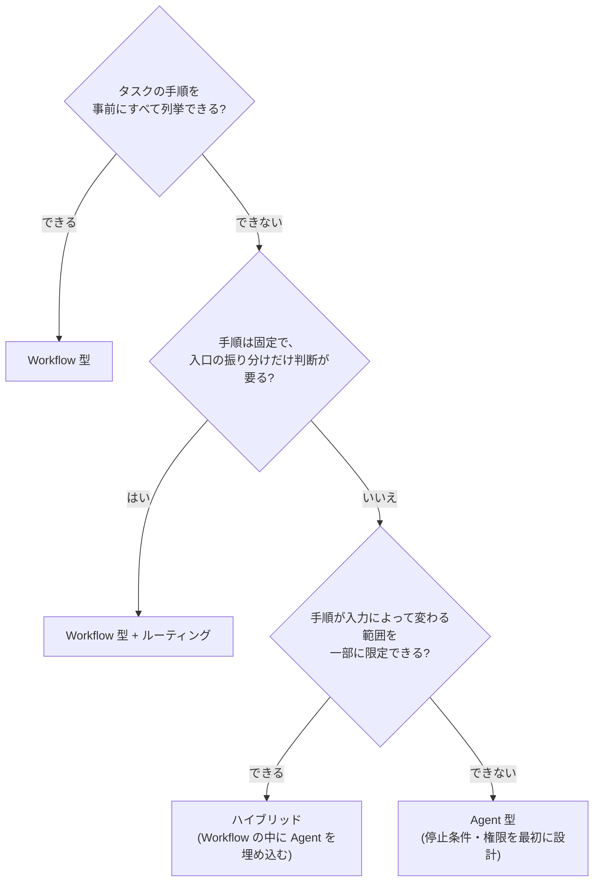

# Workflow 型 vs Agent 型の使い分け

## この記事の目的

LLM システムの実現方式を、Workflow 型・Agent 型・その中間(ハイブリッド)から根拠を持って選べるようになります。特に、実務で最も多い失敗である「過剰な Agent 化」を、トレードオフ表と判断フローで防げる状態がゴールです。

## 対象読者

- LLM 機能の実現方式を決める設計担当・テックリード
- 「Agent で作りたい」という要望・提案の妥当性を評価する立場の人

## 前提知識

- [AI Agent とは何か](../01-concepts/what-is-an-ai-agent.md) — Workflow 型と Agent の定義、自律性のスペクトラム

## 本文

### 概要: 原則は「同じ品質なら、自律性の低い方」

[AI Agent とは何か](../01-concepts/what-is-an-ai-agent.md) で定義したとおり、Workflow 型は手順をコードで固定し、Agent 型は手順の決定をモデルに委ねます。本記事はこの選択を設計判断として詳細化します。

出発点となる原則は 1 つです — **要件を満たせる範囲で、最も自律性の低い構成を選ぶ**。自律性は必要になってから足すことはできますが、外すのは(それに依存した設計が積み上がるため)困難です。

### 詳細: トレードオフの全体像

| 観点 | Workflow 型 | Agent 型 |
| --- | --- | --- |
| 予測可能性 | 高い(実行経路が固定) | 低い(実行のたびに経路が変わりうる) |
| デバッグ性 | 失敗したステップを特定しやすい | 失敗の原因が経路依存で再現が難しい |
| コスト | 見積もり可能(呼び出し回数が固定) | 上振れする(ループ回数が入力依存) |
| レイテンシ | 安定 | 変動が大きい |
| 柔軟性 | 想定外の入力に弱い | 想定外の入力に対応しうる |
| 評価 | ステップ単位で評価できる | 軌跡(過程)の評価が必要になる |
| 失敗モード | 想定外入力で手順が破綻する | 経路の選択そのものを誤る |

Agent 型が優位なのは「柔軟性」だけです。それ以外のすべての観点でコストを払うため、**柔軟性が本当に必要か**が判断の中心になります。

### 詳細: 判断フロー

「手順を列挙できるか」は、机上ではなく**実際に列挙を試みて**判断します。列挙を試みた結果として「分岐が発散して書き切れない」ことが確認できたときが、Agent 型を正当化できる瞬間です。

### 詳細: ハイブリッドという現実解

実務のシステムの多くは、純粋な Workflow でも純粋な Agent でもなく、その組み合わせに落ち着きます。

- **Workflow の 1 ステップとして Agent を埋め込む** — 全体の流れ(受付 → 処理 → 検証 → 出力)は固定し、「処理」の中の探索的な部分だけ Agent に任せます。Agent の不確実性を 1 ステップに閉じ込められます
- **Agent のツールとして Workflow を渡す** — 定型手順(例: 帳票作成の 5 ステップ)を 1 つのツールに固めて Agent に渡します。Agent は「いつ使うか」だけを判断し、手順の中身では迷いません

どちらの方向でも、**予測可能な部分をコードに固定し、判断が必要な部分だけをモデルに委ねる**という同じ原則が働いています。

### 設計判断: 段階的な移行を前提にする

最初から正解の構成を当てる必要はありません。移行しやすい順序があります。

1. **Workflow で始める** — まず固定手順で作り、実運用のログから「手順が足りなかったケース」を集めます
2. **足りない部分を特定して Agent 化する** — 発散していた分岐が実は 3 パターンだった、と分かればルーティングで済みます。本当に探索的だと確認できた部分だけ Agent にします
3. **境界を関数・ツールとして切っておく** — Workflow のステップと Agent の境界をきれいに保つと、双方向の移行(Agent 化・Workflow への後退)が安価になります

## 実務での注意点

### アンチパターン

- **「Agent の方が先進的だから」という選定** → 要件ではなく流行で方式が決まり、上のトレードオフ表の代償だけを払う → 柔軟性が必要な根拠(列挙を試みた結果)を要求する
- **システム全体を 1 つの巨大 Agent にする** → 予測可能だった部分まで不安定・高コストになり、デバッグ不能に近づく → 予測可能な部分を Workflow に固定し、Agent の範囲を最小にする
- **Agent から Workflow に戻せない密結合** → 「Agent 化してみたが不安定」となっても後退できず、不安定なまま運用する羽目になる → ステップ境界を関数・ツールとして分離しておく

### チェックリスト

- [ ] タスクの手順の列挙を実際に試みた(その結果を根拠として残した)
- [ ] Agent 型を選ぶ場合、柔軟性が必要な具体的ケースを提示できる
- [ ] コスト・レイテンシの上振れ幅を見積もった
- [ ] Agent の範囲を一部に限定する構成(ハイブリッド)を検討した
- [ ] Workflow への後退(ロールバック)が可能な設計になっている

## 関連トピック

- [AI Agent とは何か](../01-concepts/what-is-an-ai-agent.md) — 定義と自律性スペクトラムの基礎
- [オーケストレーションパターン](orchestration-patterns.md) — Workflow 型の具体的な構成パターン
- [RAG と Agent の関係・使い分け](../01-concepts/rag-vs-agent.md) — 検索領域における同型の判断
- [コンテキストエンジニアリング](context-engineering.md) — どちらの型でも品質を左右する共通基盤

## 参考資料

- [Building Effective Agents(Anthropic)](https://www.anthropic.com/research/building-effective-agents) — Workflow と Agent の区別と「シンプルさ優先」原則の出典(アクセス日: 2026-07-05)

## TODO・未確認事項

なし
