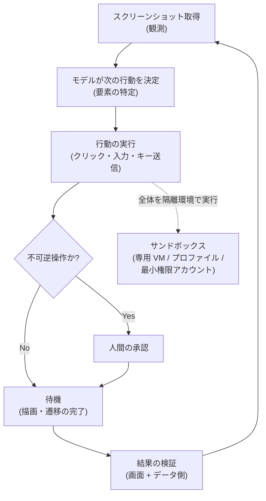

# ブラウザ・コンピュータ操作の実装

## この記事の目的

コンピュータ操作型 Agent(画面を見てマウス・キーボードで操作する Agent)を実装するときの設計判断を扱います。操作ループの組み方、要素の特定と安定化、待機と成功検証、「操作より API」の徹底、安全策(サンドボックス・確認ゲート・ドメイン制限)、デバッグと評価を、自分のユースケースに合わせて選べるようになります。

## 対象読者

- API のない GUI 業務システム・Web サイトの自動化を、コンピュータ操作型 Agent で実装するエンジニア
- ブラウザ自動化の PoC を作ったが「脆くて本番に載せられない」段階のエンジニア

## 前提知識

- [コンピュータ操作型・マルチモーダル Agent](../01-concepts/computer-use-and-multimodal-agents.md) — 画面観測ループの原理と 3 つのリスク(本記事はその実装編)
- [ツール権限設計とサンドボックス](../06-security/tool-permissions-and-sandboxing.md) — 隔離環境の設計(本記事は実装の前提として要約)
- [Human-in-the-Loop 設計](../02-architecture/human-in-the-loop.md) — 不可逆操作の承認ゲート

## 本文

### 概要: 実装は「脆さと実害」への対処が中心

コンピュータ操作の原理は通常の [Agent ループ](../01-concepts/agent-loop.md) と同じですが、実装の労力の大半は「座標依存の脆さ」と「誤操作の実害」への対処に費やされます。まず判断すべきは、**そもそもコンピュータ操作を使うか**です([コンピュータ操作型・マルチモーダル Agent](../01-concepts/computer-use-and-multimodal-agents.md) の設計判断のとおり、API があるなら API が第一選択)。使うと決めた後の実装は、次の流れで組み立てます。

### 操作ループの実装

- **観測 → 決定 → 行動 → 待機 → 検証**を 1 周とします。行動のたびに画面を撮り直すため、周回数がそのままレイテンシとコスト(画像トークン)になります。**周回数を減らす設計**が品質・コスト・安全性のすべてに効きます
- **アクションの粒度**: モデルには「座標クリック」「文字入力」「キー送信」「スクロール」「待機」などをツールとして渡します([ツール定義の設計](tool-definition-design.md))。ベンダーがコンピュータ操作向けのツール定義を公式提供している場合はそれに従います
- **上限を必ず設ける**: 周回数・時間・コストの上限を設定し、超過で安全に停止します。GUI 操作はループが迷走したとき青天井にコストを食うため、上限は必須です([コスト管理](../05-operations/cost-management.md))
- **状態を持たせる**: 「今どのステップか・何を達成済みか」を作業状態として保持し、長い手順を見失わないようにします([メモリと状態管理](../01-concepts/memory-and-state.md))

### 要素特定と安定化

座標依存(「(512, 384) をクリック」)は、解像度・ウィンドウサイズ・UI 変更で簡単に壊れます。脆さを下げる手立てです。

- **アクセシビリティツリー / DOM を併用する**: ブラウザ操作なら、スクリーンショットだけに頼らず DOM やアクセシビリティツリーから要素を特定できると格段に安定します。「送信ボタン」を座標でなく要素として指定できれば、レイアウト変更に強くなります
- **環境を固定する**: 解像度・ウィンドウサイズ・ズーム・フォント・言語を固定します。同じ環境なら座標のばらつきが減ります
- **相対的な指定を優先する**: 絶対座標より「このラベルの隣のボタン」のような相対・意味ベースの指定を優先します
- **ブラウザ専用ツールを検討する**: 汎用のスクリーンショット操作より、ブラウザ操作に特化した仕組み(DOM アクセス・要素セレクタを持つもの)の方がブラウザ内タスクでは安定します。「画面操作の Agent」より「ブラウザ操作の Agent」の方が対象が絞れる分だけ堅牢になります

### 待機と成功検証

GUI 自動化の失敗の多くは「まだ描画されていない画面に対して操作した」という**タイミング問題**です。

- **明示的な待機条件**: 固定時間の sleep ではなく、「特定の要素が現れるまで」「ページ遷移が完了するまで」という条件で待ちます。固定 sleep は遅すぎたり早すぎたりします
- **行動後の再観測**: 行動が意図どおり効いたかを、次のスクリーンショットで確認してから進みます
- **成功を画面だけで判定しない**: 「最後のスクリーンショットがそれっぽい」は静かな失敗を見逃します。可能なら**データ側で検証**します(登録したはずのレコードを API・DB で照会する等)。画面確認とデータ確認の二重化が、コンピュータ操作型の信頼性を決めます

### 「操作より API」の原則

これは設計判断([コンピュータ操作型・マルチモーダル Agent](../01-concepts/computer-use-and-multimodal-agents.md))の実装への落とし込みです。実装段階でも、操作を減らす機会を常に探します。

- **手順を棚卸しして API 化できる区間を切り出す**: GUI 操作 20 手順のうち 15 手順が API で置換できるなら、コンピュータ操作は残り 5 手順に限定します。ハイブリッド構成が現実的な最適解です
- **ログイン・認証は操作させない**: 認証は最も壊れやすく最も危険な区間です。可能ならセッション・クッキーの注入や専用アカウントの事前ログインで、Agent に認証情報を操作させない設計にします
- **データ入力はまとめて渡す**: 1 文字ずつ入力させるより、フォーム値をまとめて設定できる経路(DOM 操作・API)があればそちらを使います

### 安全策

コンピュータ操作は「誤操作がその場で実害になる」ため、安全策は任意ではなく前提です([コンピュータ操作型・マルチモーダル Agent](../01-concepts/computer-use-and-multimodal-agents.md) の 3 リスクへの対処)。

- **サンドボックス**: 専用の VM・コンテナ・ブラウザプロファイル、最小権限の専用アカウントで動かします。開発者本人のアカウント・実環境で動かすことは、誤操作とインジェクションの実害を本物のデータに直撃させます([ツール権限設計とサンドボックス](../06-security/tool-permissions-and-sandboxing.md))
- **確認ゲート**: 送信・購入・削除・送金などの不可逆操作の前に、人間の承認を挟みます([Human-in-the-Loop 設計](../02-architecture/human-in-the-loop.md))。承認待ちを永続化する必要があるなら[非同期・長時間タスクの設計](../02-architecture/async-and-durable-agents.md)と組み合わせます
- **ドメイン・操作の許可リスト**: アクセスできるドメイン、実行できる操作種別を許可リストで絞ります。画面に映る外部コンテンツ(Web・メール)は間接プロンプトインジェクションの運び手なので、「読んだ指示に従って知らないドメインへ送信」を構造的に塞ぎます([プロンプトインジェクション](../06-security/prompt-injection.md)、[データ漏えい対策](../06-security/data-exfiltration.md))
- **緊急停止**: 実行中に人間が即座に止められる手段を用意します([インシデント対応](../05-operations/incident-response.md))

### 評価とデバッグ

- **軌跡を全部残す**: 各周回のスクリーンショット・決定・行動・結果を記録します。失敗が「どの画面で・何を誤ったか」まで遡れないと、脆い自動化は直せません([可観測性とトレーシング](../05-operations/observability-and-tracing.md)、[軌跡(trajectory)評価](../04-evaluation/trajectory-evaluation.md))
- **タスク成功率で評価する**: 単発の成否でなく、代表的なシナリオを複数回実行した成功率で品質を測ります。GUI は非決定性が高いため、1 回成功しても再現するとは限りません([Agent 評価の基礎](../04-evaluation/agent-evaluation-basics.md))
- **公開ベンチマークは参考程度に**: Web 操作系の公開ベンチマークは能力の目安になりますが、順位は自タスクの成否と直結しません。自前シナリオでの測定を正とします
- **UI 変更の検知**: 定期実行する自動化では、対象 UI の変更で静かに壊れます。成功率の低下を監視し、変更を早期に検知する運用を組みます

## 実務での注意点

### アンチパターン

- **API がある操作を画面操作で実装する** → 遅く・脆く・高く、誤クリックやインジェクションのリスクまで抱え込む → 手順を棚卸しし、API・MCP で置換できる区間を先に切り出す
- **絶対座標に依存する** → 解像度・レイアウト変更で一斉に壊れる → DOM・アクセシビリティツリーでの要素特定と環境固定で安定させる
- **固定時間 sleep で待つ** → 遅すぎて無駄か、早すぎて未描画画面を操作するかの二択になる → 要素出現・遷移完了を条件にした明示的な待機にする
- **成功を最後のスクリーンショットだけで判定する** → 入力ずれなどの静かな失敗が蓄積する → データ側(API・DB)での検証と二重化する
- **開発者の実アカウント・実環境で動かす** → 誤操作とインジェクションが本物の権限・データに直撃する → 専用サンドボックスと最小権限アカウントを最初に用意する
- **不可逆操作に承認を付けない** → 誤った送信・購入・削除がそのまま実行される → 送信・購入・削除の前に人間の承認ゲートを置く

### チェックリスト

- [ ] 対象手順を棚卸しし、API・MCP で置換できる区間を最小化した
- [ ] 要素特定を座標依存から DOM・アクセシビリティツリー併用に寄せた
- [ ] 解像度・ウィンドウサイズ・言語などの環境を固定している
- [ ] 待機が固定 sleep でなく明示的な条件(要素出現・遷移完了)になっている
- [ ] タスク成功を画面とデータ側の両方で検証している
- [ ] 専用サンドボックス・最小権限アカウントで動かしている
- [ ] 不可逆操作の前に承認ゲートがあり、緊急停止手段がある
- [ ] アクセス可能ドメイン・操作種別が許可リストで絞られている
- [ ] 周回数・時間・コストの上限があり、超過で安全に停止する
- [ ] 各周回の軌跡(スクリーンショット・行動・結果)を記録している

## 関連トピック

- [コンピュータ操作型・マルチモーダル Agent](../01-concepts/computer-use-and-multimodal-agents.md) — 原理・採用判断・3 リスク(本記事の前段)
- [ツール権限設計とサンドボックス](../06-security/tool-permissions-and-sandboxing.md) — 隔離環境の設計詳細
- [Human-in-the-Loop 設計](../02-architecture/human-in-the-loop.md) — 不可逆操作の承認ゲート
- [プロンプトインジェクション](../06-security/prompt-injection.md) — 画面経由の間接インジェクション対策
- [非同期・長時間タスクの設計(耐久実行)](../02-architecture/async-and-durable-agents.md) — 承認待ちを挟む長い操作の永続化
- [軌跡(trajectory)評価](../04-evaluation/trajectory-evaluation.md) — 操作ログの評価

## 参考資料

- [Developing a computer use model(Anthropic)](https://www.anthropic.com/news/developing-computer-use) — コンピュータ操作型モデルの動作原理と制約(アクセス日: 2026-07-07)

## TODO・未確認事項

> **TODO(要確認):** 主要ベンダーのコンピュータ操作・ブラウザ操作機能(computer use / ブラウザ操作ツール)の最新仕様・提供する操作プリミティブ・推奨サンドボックス構成を各社公式ドキュメントで確認する(最終確認: 2026-07)
