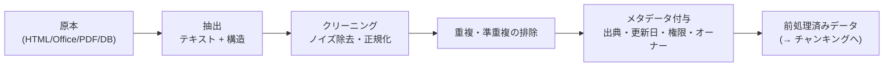

# LLM 向けデータ前処理パイプライン

## この記事の目的

チャンキングの**前**にある工程 — 収集・抽出・クリーニング・重複排除・メタデータ付与 — を、検索品質の上限を決める工程として設計できるようになります。[RAG 実装パターン](rag-implementation-patterns.md)がチャンキング以降を扱うのに対し、本記事はその手前の「どんなデータをパイプラインに入れるか」に踏み込みます。

## 対象読者

- RAG やナレッジ基盤の取り込みを担当し、検索の当たりが悪い原因をデータ側から切り分けたいエンジニア
- 知識源が増えてきて、取り込みパイプラインを一度きちんと設計し直したいエンジニア

## 前提知識

- [RAG 実装パターン](rag-implementation-patterns.md) — チャンキング・検索・評価(本記事はその取り込みの前段)
- [埋め込み(embeddings)の選定と運用](embeddings.md) — 前処理後のチャンクを埋め込む工程

## 本文

### 概要: 分担と「ゴミを入れればゴミが出る」

| 工程 | 正本 | 本記事 |
| --- | --- | --- |
| **取り込みの前処理**(抽出・クリーニング・重複排除・メタデータ設計) | **本記事** | パイプライン全体・フォーマット別抽出・鮮度運用 |
| チャンキング以降(分割・埋め込み・検索・評価) | [RAG 実装パターン](rag-implementation-patterns.md) | — |
| 埋め込みモデルの選定 | [埋め込みの選定と運用](embeddings.md) | — |
| 知識源をめぐる組織の仕組み(オーナーシップ・カタログ) | [AI のためのデータガバナンス](../05-operations/data-governance-for-ai.md) | — |

RAG の体感品質の問題は、多くが取り込みと検索に根があります([RAG 実装パターン](rag-implementation-patterns.md))。その取り込みの**さらに上流**が前処理です。**壊れた抽出・ノイズだらけのテキスト・重複した版**を入れれば、後段のチャンキングや検索をどれだけ磨いても品質は頭打ちになります(garbage in, garbage out)。前処理は「地味だが上限を決める」工程です。

### 前処理パイプラインの全体像

前処理は、原本から検索可能なチャンクの手前までを、再現可能なパイプラインとして組みます。

各工程を**冪等**(同じ入力なら同じ出力)かつ**再実行可能**に作ることが要点です。前処理をやり直せないと、抽出のバグやクリーニング規則の改善を過去データに適用できず、品質改善が止まります。

### フォーマット別の抽出

原本からテキストと構造を取り出す工程です。フォーマットごとに難所が違います。

| フォーマット | 難所 | 勘所 |
| --- | --- | --- |
| HTML | ナビゲーション・広告・フッタなどの非本文 | 本文抽出でボイラープレートを落とす(後述) |
| Office(Word/Excel など) | 表・セル結合・脚注・変更履歴 | 表を壊さず、構造(見出し・セル)を保って抽出 |
| PDF(テキスト) | 段組み・ヘッダ/フッタ・改行の乱れ | レイアウト順に読む・ページ跨ぎの段落を再結合 |
| PDF(スキャン画像) | そもそも文字が画像 | OCR が必要。精度は原本品質次第で、レイアウト解析を伴う専門領域 |

**構造を捨てない**のが共通の勘所です。見出し・表・箇条書きといった構造は、後段の構造ベースのチャンキング([RAG 実装パターン](rag-implementation-patterns.md))で効きます。単なるプレーンテキストに潰すと、この情報が失われます。スキャン PDF・複雑なレイアウトの抽出は難度が高く、専用のドキュメント理解が要る領域です(本記事ではテキスト抽出可能な原本を主対象とし、画像主体の文書は別途の専門的処理を前提とします)。

### クリーニング

抽出したテキストから、検索と生成を邪魔するノイズを除きます。

- **ボイラープレート除去**: ナビゲーション・広告・「関連記事」・定型フッタなど、どの文書にも付く非本文を落とします。残すと、検索が本文でなく定型文にヒットする事故が起きます
- **文字化け・エンコーディングの正規化**: 文字コードの取り違え・全角半角の揺れ・制御文字を正規化します
- **過剰な空白・改行の整理**: 抽出時に混入する不自然な改行(PDF に多い)を整えます。ただし**意味のある構造(段落・表)まで潰さない**線引きが要ります
- **やりすぎない**: クリーニングは強くかけるほど情報も失います。正規化のつもりで数値・記号・コードを壊すと、完全一致検索(型番・エラーコード)が効かなくなります。評価で「クリーニングで検索が悪化していないか」を確認します

### 重複・準重複の排除

同じ内容が複数入ると、検索結果が重複で埋まり、生成の希釈と矛盾の元になります。

- **完全重複**: 同一ファイルの多重取り込みはハッシュで検出して除きます
- **準重複(near-duplicate)**: **同一文書の版違い**が最頻出の問題です。「規定 v1」と「規定 v2」が両方インデックスにあると、古い版が検索にヒットして誤答の原因になります。版の管理(どれを正とするか)を取り込み時に決めます
- **判定の手段**: 準重複は、テキストの近さ(ハッシュの近さや埋め込み類似度)で検出します。ただし「似ているが別物」(テンプレート由来の類似文書)を消しすぎないよう、閾値を評価で調整します

### メタデータ設計: 取り込み時にしか付けられない

前処理で最も後戻りできないのが**メタデータ**です。出典・更新日・権限・オーナーは、**取り込みの瞬間に付けないと、後から正確に付け直すのが困難**です。

- **必ず付ける項目**: 出典(文書名・URL・システム)/ 更新日 / アクセス権限ラベル / オーナー(責任者)。これらは検索時のフィルタ(権限反映・鮮度優先)と引用の提示([RAG 実装パターン](rag-implementation-patterns.md))で必須になります
- **権限ラベルは原本から引き継ぐ**: 原本の ACL を、チャンク・埋め込み・要約などの派生データすべてに引き継がせます。派生物の権限が緩むと漏えい経路になります([データ漏えい対策](../06-security/data-exfiltration.md))
- **更新日は鮮度運用の起点**: 更新日がないと「古い文書を落とす・新しい版を優先する」ができません
- 「後で付ければいい」は通用しません。取り込みパイプラインに**メタデータ付与を組み込む**のが唯一の現実解です

### 増分更新と再処理の運用

知識源は生き続けます。**取り込みは一度きりではなく運用**です(鮮度管理の重要性は [ケーススタディ: 社内ナレッジ Agent](../07-case-studies/case-study-knowledge-agent.md) が物語で示すとおり)。

- **増分更新**: 全再取り込みは高くつくため、変更のあった文書だけを差分で取り込む仕組みを作ります。更新・削除を検知し、古いチャンクを置き換え・削除します
- **削除の伝播**: 原本が消えたら、その派生チャンク・ベクトルも消します。「原本は削除したのに検索にまだ出る」は典型的な事故です
- **再処理の余地を残す**: 抽出・クリーニング規則を改善したら、過去データに再適用できるよう、原本を保持し前処理を再実行可能にしておきます
- **前処理も評価対象**: クリーニング規則や抽出方法を変えたら、検索評価([RAG 実装パターン](rag-implementation-patterns.md))で悪化していないか確認してから本番に反映します

## 実務での注意点

### アンチパターン

- **抽出でプレーンテキストに潰す** → 見出し・表の構造が失われ、後段の構造ベースチャンキングが効かない → 構造を保って抽出する
- **クリーニングを強くかけすぎる** → 型番・コード・数値が壊れ、完全一致検索が効かなくなる → 評価でクリーニングによる検索悪化を確認する
- **同一文書の版違いを両方インデックスに入れる** → 古い版がヒットして誤答する → 準重複を検出し、正とする版を決める
- **メタデータを後回しにする** → 出典・更新日・権限を後から正確に付けられず、鮮度・権限運用が破綻する → 取り込み時にメタデータ付与を組み込む
- **取り込みを一度きりにする** → 原本の更新・削除が反映されず、古い・消したはずの情報が回答に出る → 増分更新と削除の伝播を運用に組み込む

### チェックリスト

- [ ] 前処理パイプラインが冪等かつ再実行可能で、規則改善を過去データに再適用できる
- [ ] フォーマット別の抽出で、見出し・表などの構造を保っている
- [ ] ボイラープレート除去・文字化け正規化を行い、やりすぎで完全一致検索を壊していない
- [ ] 完全重複・準重複(版違い)を検出し、正とする版を決めている
- [ ] 取り込み時に出典・更新日・権限・オーナーのメタデータを付与している
- [ ] 権限ラベルを派生データ(チャンク・埋め込み・要約)まで引き継いでいる
- [ ] 増分更新と、原本削除時の派生データ削除(伝播)を運用している
- [ ] 前処理の変更を検索評価で検証してから本番へ反映している

## 関連トピック

- [RAG 実装パターン](rag-implementation-patterns.md) — チャンキング以降(本記事の下流・正本)
- [埋め込み(embeddings)の選定と運用](embeddings.md) — 前処理済みチャンクを埋め込む工程
- [ベクトルデータベースの選定と運用](vector-databases.md) — 索引に載せる基盤
- [ケーススタディ: 社内ナレッジ Agent](../07-case-studies/case-study-knowledge-agent.md) — 鮮度管理・派生データ権限の運用事例
- [データ漏えい対策](../06-security/data-exfiltration.md) — 派生データの権限を緩めた場合の漏えい経路
- [会話データの管理基盤](../05-operations/conversation-data-management.md) — 「AI が生むデータ」側の管理(本記事は「AI に食わせるデータ」側)

## 参考資料

- なし(LLM 向けデータ前処理は、確立したデータエンジニアリングの実践(抽出・クリーニング・重複排除・メタデータ管理)を RAG・知識基盤の要件に沿って整理したものであり、単一の一次資料はありません。フォーマット別抽出・OCR の具体手段は、利用するライブラリ・サービスの公式ドキュメントを参照してください)

## TODO・未確認事項

なし
