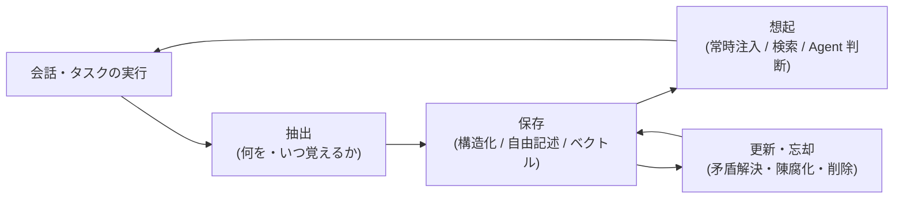

# 長期記憶の実装

## この記事の目的

セッションを越えて「覚えている」Agent を作るための実装判断を扱います。[メモリと状態管理](../01-concepts/memory-and-state.md)が示した 3 層モデルのうち長期記憶に絞り、抽出(何を覚えるか)・保存(どの形式で持つか)・想起(いつ引くか)・更新と忘却・プライバシーという 5 つの設計を自分のシステムに合わせて選択できるようになります。

## 対象読者

- ユーザーの好み・過去の決定を覚えるアシスタント型 Agent を実装するエンジニア
- 「記憶機能を付けたら、無関係な過去の話を持ち出すようになった」という品質問題に直面しているエンジニア

## 前提知識

- [メモリと状態管理](../01-concepts/memory-and-state.md) — 短期記憶・作業状態・長期記憶の 3 層モデル(本記事はその長期記憶の実装編)
- [RAG 実装パターン](rag-implementation-patterns.md) — 想起(読み出し)は検索実装の再利用になるため

## 本文

### 概要: 難しいのは「読む」より「書く」と「捨てる」

長期記憶の読み出しは検索の実装([RAG 実装パターン](rag-implementation-patterns.md))を再利用できます。長期記憶固有の難しさは、**何を覚えるか(抽出)** と **いつ捨てる・直すか(更新と忘却)** にあります。全体は次のライフサイクルで設計します。

「とりあえず全部保存して検索で引く」は最初に思いつく構成ですが、ノイズの山から誤った記憶が想起される品質問題と、プライバシー要件(削除・分離)を満たせない構造問題の両方につながります。

### 抽出: 何を・いつ覚えるか

記憶の入口は 3 経路あり、信頼度が違います。

| 経路 | 内容 | 信頼度 |
| --- | --- | --- |
| 明示指示 | ユーザーの「覚えておいて」、設定画面での登録 | 高(本人の意思) |
| オンライン自動抽出 | ターンやタスクの終了時に、会話から「覚える価値のある事実」を LLM で抽出 | 中(推論を含む) |
| バッチ振り返り | セッション終了後・定期バッチでログから抽出・統合 | 中(文脈が薄れる分、統合・重複排除に向く) |

自動抽出には **抽出基準の明文化** が必要です。抽出プロンプトに「覚えるもの」と「覚えないもの」を列挙します。

- **覚えるもの**: 安定した事実(役割・環境・利用ツール)、明示された好み(出力形式・言語)、下した決定とその理由
- **覚えないもの**: 一時的な状態(「今週は忙しい」)、タスク限りの文脈、根拠の弱い推測、そして後述する機微情報

抽出時には出所(どの会話から)・日時・信頼度(明示か推論か)をメタデータとして必ず付けます。あとで矛盾解決・削除・説明(なぜこれを覚えているのか)のすべてに効きます。

### 保存: 形式の選択

| 形式 | 強み | 弱み |
| --- | --- | --- |
| 構造化プロファイル(固定スキーマ) | 読み書きが決定的。常時注入しやすい | スキーマにない情報を持てない。項目設計が必要 |
| 自由記述メモ + 検索 | 柔軟。何でも書ける | 矛盾・重複の管理が難しい。想起は検索品質に依存 |
| ベクトル検索(埋め込み) | 言い換えに強い類似想起 | 完全一致・否定(「X はやらない」)に弱い。検索方式の議論は RAG と同じ |
| グラフ・リレーショナル構造 | 関係(誰が何を担当)を表現できる | 実装・保守コストが大きく、過剰設計になりやすい |

実務の初手は **「小さな構造化プロファイル + 自由記述メモの検索」のハイブリッド** です。毎回必要な安定情報(役割・好みの上位数項目)は固定スキーマに、それ以外はメタデータ付きメモとして検索対象に置きます。グラフ構造は「関係の質問に答えられない」という具体的な失敗が観測されてから検討すれば十分です。

### 想起: いつ・どう引くか

想起の設計は 3 パターンで、[RAG と Agent の関係・使い分け](../01-concepts/rag-vs-agent.md)の構成選択と同型です。

1. **常時注入**: 構造化プロファイルをシステムプロンプトに毎回入れます。確実ですがコンテキストを常時消費するため、対象は「毎ターン効く少量の情報」に絞ります([コンテキストエンジニアリング](../02-architecture/context-engineering.md))
2. **暗黙検索(固定パイプライン)**: ユーザー入力をクエリに記憶を検索し、上位を注入します。実装が単純な一方、無関係な記憶が混ざるリスクがあるため、**関連度の下限(しきい値)** を設けて「該当なしなら注入しない」を明示的に設計します
3. **記憶ツール(Agent 判断)**: 記憶の検索・保存をツールとして渡し、引くかどうかをモデルに任せます。柔軟ですがレイテンシ・コストが増えます

品質問題として最も多いのは「無関係な過去の話を持ち出す」です。原因はたいてい想起側(しきい値なしの注入)か抽出側(何でも保存)にあり、生成プロンプトの修正では直りません。どの記憶が注入されたかをトレースに記録し([可観測性とトレーシング](../05-operations/observability-and-tracing.md))、想起の的中率を評価できるようにしておきます。

### 更新と忘却

記憶は追記だけでは壊れていきます。「引っ越した」「担当が変わった」という新情報は古い記憶と矛盾し、両方が想起されると挙動が不安定になります。

- **矛盾の解決**: 同じ対象の新情報が来たら、上書きか「有効期間付きの履歴」かをデータ種別ごとに決めます(現在の好み = 上書き / 過去の決定 = 履歴保持)
- **訂正の反映**: ユーザーに間違いを訂正されたら、応答だけでなく**記憶側も更新**します。誤った記憶は「毎回同じ間違いをする Agent」を作ります
- **陳腐化への対処**: 記憶に最終確認・最終参照日時を持たせ、長期間参照されない・古い記憶は想起の優先度を下げる、またはアーカイブします
- **ユーザーへの可視化と編集**: 「自分について何を覚えているか」を見せ、修正・削除できる UI は、品質(誤記憶の訂正が入る)と信頼(不気味さの回避)の両方に効きます

### プライバシーと削除要求

長期記憶は個人データの蓄積そのものであり、セキュリティ・コンプライアンス要件を実装の最初から組み込みます。

- **ユーザー別の分離**: 記憶ストアはユーザー(またはテナント)単位で厳格に分離し、想起時のフィルタではなく**ストア・インデックスの分離またはクエリ強制条件**で担保します。他ユーザーの記憶が応答に混ざる事故は、重大な情報漏えいです([データ漏えい対策](../06-security/data-exfiltration.md))
- **覚えない基準**: 健康・信条・機微な個人情報は、明示的な同意なしに自動抽出で保存しない、を抽出基準に含めます。「会話に出てきた = 保存してよい」ではありません
- **削除要求への対応**: ユーザー単位・項目単位の完全削除を実装します。ベクトルインデックス・バックアップ・派生データ(要約に混ざった記憶)まで含めた削除経路を設計しておかないと、削除要求が来てから「消せない」ことが発覚します
- **透明性**: 何を記憶する機能なのかを利用者に説明し、オプトアウトを用意します

## 実務での注意点

### アンチパターン

- **全会話を要約して全部保存する** → ノイズの山から誤った・無関係な記憶が想起され、品質がむしろ下がる → 抽出基準(覚えるもの・覚えないもの)を明文化し、価値のある事実だけを保存する
- **追記のみで更新・削除がない** → 矛盾した記憶が並存し、「昔の情報で答える」「毎回同じ間違いをする」Agent になる → 矛盾解決のルールと訂正の反映を最初から実装する
- **しきい値なしで検索上位を常に注入する** → 無関係な過去の話を持ち出し、コンテキストを浪費する → 関連度の下限を設け、「該当なしなら注入しない」を設計する
- **ユーザー別分離を想起時のフィルタだけで行う** → フィルタ漏れ・実装バグが他ユーザーの記憶の漏えいに直結する → ストア分離またはクエリ強制条件で構造的に担保する
- **削除を後回しにする** → 削除要求が来てから、インデックス・バックアップ・要約に散った記憶を消せないことが発覚する → 削除経路(単一ユーザーの完全削除)を最初に設計し、テストする

### チェックリスト

- [ ] 抽出基準(覚えるもの・覚えないもの・機微情報の扱い)が明文化されている
- [ ] 記憶に出所・日時・信頼度のメタデータが付いている
- [ ] 保存形式の選択理由(プロファイル / メモ検索 / ベクトル)を説明できる
- [ ] 想起に関連度のしきい値があり、注入された記憶がトレースで追える
- [ ] 矛盾する新情報の扱い(上書き / 履歴)がデータ種別ごとに決まっている
- [ ] ユーザーが記憶を確認・修正・削除できる手段がある
- [ ] 記憶ストアがユーザー・テナント単位で構造的に分離されている
- [ ] ユーザー単位の完全削除(インデックス・派生データ含む)が実装・テストされている

## 関連トピック

- [メモリと状態管理](../01-concepts/memory-and-state.md) — 3 層モデルと「何をコンテキストに残すか」の概念編
- [RAG 実装パターン](rag-implementation-patterns.md) — 想起(検索)の実装詳細(チャンキング・検索方式・しきい値)
- [コンテキストエンジニアリング](../02-architecture/context-engineering.md) — 常時注入する記憶とコンテキスト予算の設計
- [データ漏えい対策](../06-security/data-exfiltration.md) — 記憶ストア経由の漏えい経路と分離
- [可観測性とトレーシング](../05-operations/observability-and-tracing.md) — どの記憶が注入されたかの記録

## 参考資料

- [MemGPT: Towards LLMs as Operating Systems](https://arxiv.org/abs/2310.08560) — コンテキストを階層メモリとして自己管理させる代表的な研究(アクセス日: 2026-07-06)

## TODO・未確認事項

> **TODO(要確認):** 主要ベンダー・フレームワークの記憶機能(モデル API の memory 系ツール、エージェントフレームワークの記憶モジュール)の提供状況と仕様を、採用検討時に各公式ドキュメントで確認する(最終確認: 2026-07)
