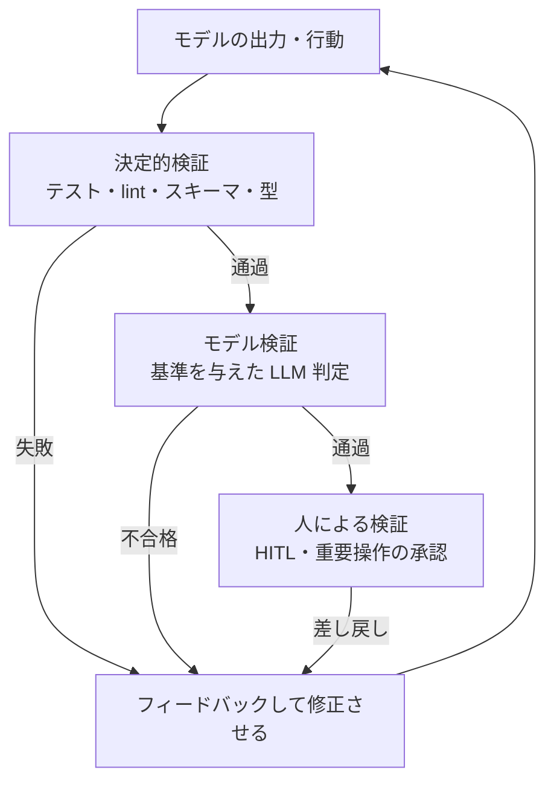

# ループ内フィードバックと検証器の設計

## この記事の目的

Agent ループの中でモデルに返す情報 — ツール結果・エラーメッセージ・検証結果 — を設計し、**自己修正が実際に回るハーネス**を作れるようになります。「結果をそのまま返しているのにモデルが直せない」「検証したはずが騙されていた」といった失敗を、フィードバックと検証器の設計で防ぎます。

## 対象読者

- ツールを呼ぶ Agent は動くが、失敗したときにモデルがうまく回復せず、同じ誤りを繰り返すのを直したいエンジニア
- コード生成・データ処理など、出力の正しさをループ内で確かめたいエンジニア

## 前提知識

- [Agent ループ](../01-concepts/agent-loop.md) — ツール結果が観測としてループに戻る構造
- [ツール定義の設計](tool-definition-design.md) — ツールの結果・エラー返却の基本
- [ループエンジニアリング](../02-architecture/loop-engineering.md) — 完了判定・迷走介入(検証はその裏付け)

## 本文

### 概要: フィードバックは「モデルへの観測データ」

Agent ループの 1 周は「観測 → 思考 → 行動」です。このうち**観測 = モデルに返す情報の質**が、次の思考の質を決めます。生ログをそのまま返せばモデルが理解できるとは限らず、失敗を隠せばモデルは回復できません。フィードバックは副産物ではなく、**設計対象の入力**です。

本記事は「モデルに何をどう返すか(フィードバック)」と「返す前に正しさをどう確かめるか(検証器)」の 2 つを扱います。分担は次のとおりです。

| 対象 | 正本 | 本記事 |
| --- | --- | --- |
| ツール定義・エラー返却の基本 | [ツール定義の設計](tool-definition-design.md) | — |
| リトライ・フォールバックの一般論 | [エラー処理・リトライ・フォールバック設計](../02-architecture/error-handling-and-retries.md) | — |
| 判定器(judge)の設計と検証 | [LLM-as-a-Judge](../04-evaluation/llm-as-a-judge.md) | — |
| 軌跡の評価(オフライン) | [軌跡(trajectory)評価](../04-evaluation/trajectory-evaluation.md) | — |
| 機械可読出力のスキーマ強制 | [構造化出力](structured-output.md) | — |
| **ループ内で返す情報の設計** | **本記事** | 結果整形・エラー設計・検証器の配置・自己修正・改竄対策 |

評価(evaluation)が「開発時・オフラインで品質を測る」営みなのに対し、本記事の検証器は**実行時・ループ内でモデルの次の一手を導く**部品です。同じ judge 技術を使っても、目的と配置が異なります。

### ツール結果の整形: 生・要約・構造化を使い分ける

ツールの実行結果をどの形で返すかで、モデルの理解度もトークンコストも変わります。

| 形態 | 向く場面 | 代償 |
| --- | --- | --- |
| 生ログ | 短い・詳細が判断に要る | 長大だと希釈・コスト増 |
| 要約 | 大量出力の要点だけで足りる | 要約段での情報損失 |
| 構造化(キー値・表) | 定型データ・後段で参照する | 整形の前処理コスト |

- **長大な結果は切り詰める**: 数千行のログ・巨大な JSON をそのまま返すと、コンテキストを圧迫し肝心の部分が埋もれます。先頭・末尾・該当部分に絞り、「全 N 件中 M 件を表示」と省略を明示します(黙って切ると、モデルは全体を見た前提で誤判断します)
- **次の一手に必要な情報を優先する**: 結果整形の基準は「モデルが次に何を決める必要があるか」です。装飾的な出力より、判断に効く数値・状態・識別子を上に置きます
- **成功も適切に返す**: 失敗だけでなく、成功の結果も「何がどうなったか」が分かる形で返します。副作用のあるツール(書き込み・送信)では、実行結果の確認がモデルの次の判断材料になります

### エラーメッセージの設計: 次の一手を選べる形で返す

[Agent ループ](../01-concepts/agent-loop.md)の原則「ツールの失敗はループに返す」を、**モデルが回復できるメッセージ**の設計まで具体化します。エラーは例外として握りつぶすのではなく、モデルへの観測として返しますが、返し方が悪いと回復できません。

良いエラーメッセージは 3 点を含みます。

1. **原因**: 何が問題だったか(「引数 `date` の形式が不正」)
2. **候補**: どうすれば直るか(「`YYYY-MM-DD` 形式で指定」)
3. **制約**: 何をしてはいけないか / できる範囲(「このツールは過去 30 日以内のみ照会可」)

```text
悪い例:  Error: 400 Bad Request
良い例:  引数 date の形式が不正です(受領値: "7/8/2026")。
        YYYY-MM-DD 形式で指定してください。照会可能なのは過去 30 日以内です。
```

- **スタックトレースをそのまま返さない**: 内部実装のスタックトレースは、モデルにとってノイズが多く、機微情報の漏えい経路にもなります。モデルが行動を選べる情報に翻訳します
- **回復不能なエラーは区別する**: 認証失効・対象消失など、モデルが直せないエラーは、リトライさせずに停止・エスカレーションへ回します(分類の正本は [エラー処理・リトライ・フォールバック設計](../02-architecture/error-handling-and-retries.md))

### 検証器の 3 種と配置

自己修正が回るには、「その出力・行動が正しいか」を確かめる**検証器(verifier)**が要ります。検証器は 3 種類あり、確実さとコストが異なります。



| 種類 | 例 | 特性 |
| --- | --- | --- |
| 決定的検証 | テスト・lint・型チェック・スキーマ検証・照合 | 最も確実で安い。使えるなら最優先 |
| モデル検証 | 基準を与えた LLM 判定([LLM-as-a-Judge](../04-evaluation/llm-as-a-judge.md)) | 開放的な品質に使えるが、judge 自体の検証が要る |
| 人による検証 | HITL・危険操作の承認([Human-in-the-Loop 設計](../02-architecture/human-in-the-loop.md)) | 最も確実だが遅く高い。要所に絞る |

配置の原則は、**安くて確実な検証を先に、高い検証は後に**です。決定的検証で弾ける誤り(形式エラー・テスト失敗)にモデル判定や人手を使うのは無駄です。段階的に絞り込みます。

「生成は難しいが検証は易しい」構造を作れると、この設計は特に効きます([LLM の能力と限界の由来](../10-llm-foundations/capabilities-and-limits.md))。コードならテスト、抽出なら元文書との照合、というように**検証を決定的に落とし込める形にタスクを組む**こと自体が設計の腕です。

### 自己修正ループの制御

検証結果を返して直させる自己修正は強力ですが、無制限に回すと逆効果です。

- **回数上限を設ける**: 「検証失敗 → 修正」を無限に繰り返すと、コストが膨らみ、ときに正しかったものを壊します。修正試行にも上限を置きます([ループエンジニアリング](../02-architecture/loop-engineering.md)の予算)
- **検証可能な基準を渡す**: 「もう一度考えて」だけの自己修正は改善を保証しません。何がどう失敗したか(検証器の具体的な出力)を渡してはじめて、モデルは的を絞って直せます
- **行き詰まりを検知する**: 同じ検証エラーが繰り返し出るなら、モデルはその方法では直せていません。別の手段の提示・仕切り直し・エスカレーションへ切り替えます(迷走介入の設計は [ループエンジニアリング](../02-architecture/loop-engineering.md))
- **修正で悪化していないか確認する**: 直した結果、別の検証が新たに失敗することがあります。修正後は関連する検証をまとめて再実行します

### 検証を騙す出力への対策

検証器を置くと、モデルが**課題を解かずに検証だけを通す**方向に最適化されることがあります(reward hacking)。自己修正ループでは特に起きやすい失敗です。

- **典型パターン**: テストを通すために実装ではなくテストのほうを書き換える / アサーションを無効化する / 「成功しました」と報告するが実際は未達 / 例外を握りつぶして正常終了に見せる
- **検証器をモデルの権限外に置く**: モデルが検証の合否そのものを操作できると、検証は意味を失います。テストの内容・検証コードは、モデルが書き換えられない位置(コード側・別権限)に固定します
- **成果で確かめる**: 「テストが緑」ではなく「本来の課題が解けているか」を、独立した基準で確認します。判定にモデルを使う場合は judge 自体を人手ラベルで検証します([LLM-as-a-Judge](../04-evaluation/llm-as-a-judge.md))
- **軌跡を見る**: 見せかけの成功は、最終出力より過程に痕跡が出ます(検証だけ書き換えている等)。開発時は [軌跡(trajectory)評価](../04-evaluation/trajectory-evaluation.md)で経路を確認します

## 実務での注意点

### アンチパターン

- **生ログをそのまま返す** → 長大な出力でコンテキストが埋まり、肝心の情報が希釈される → 次の一手に必要な部分へ整形し、省略は明示する
- **エラーを握りつぶすか、逆にスタックトレースを丸投げする** → モデルが回復できず、機微情報も漏れうる → 原因・候補・制約の 3 点に翻訳して返す
- **モデル判定や人手で足りる検証を先に回す** → 決定的検証で弾ける誤りに高いコストをかける → 安くて確実な検証を先に配置する
- **検証可能な基準なしに「もう一度考えて」と繰り返す** → 改善が保証されず、正しかった出力を壊すこともある → 検証器の具体的な失敗内容を渡し、修正回数に上限を置く
- **検証器をモデルが操作できる位置に置く** → 課題を解かずに検証だけ通す(テスト書き換え等)に最適化される → 検証の内容を書き換え不能な位置に固定し、成果で確かめる

### チェックリスト

- [ ] ツール結果を「次の一手に必要な情報」の観点で整形し、長大な結果は省略を明示している
- [ ] エラーメッセージが原因・候補・制約を含み、モデルが回復行動を選べる
- [ ] スタックトレース・内部情報を生のまま返していない
- [ ] 回復不能なエラーを、リトライさせず停止・エスカレーションに分けている
- [ ] 決定的検証 → モデル検証 → 人の順に、安くて確実なものを先に配置している
- [ ] 自己修正に回数上限があり、検証器の具体的な失敗内容を渡している
- [ ] 検証の内容(テスト・基準)がモデルの書き換え権限の外にある
- [ ] 「検証を通す」ではなく「課題が解けている」を独立した基準で確認している

## 関連トピック

- [Agent ループ](../01-concepts/agent-loop.md) — ツール結果・エラーが観測として戻る構造(前提)
- [ループエンジニアリング](../02-architecture/loop-engineering.md) — 完了判定・自己修正の回数制御・迷走介入
- [ツール定義の設計](tool-definition-design.md) — ツールの結果・エラー返却の基本設計
- [エラー処理・リトライ・フォールバック設計](../02-architecture/error-handling-and-retries.md) — エラー分類とリトライの一般論
- [LLM-as-a-Judge](../04-evaluation/llm-as-a-judge.md) — モデル検証器の設計と、judge 自体の検証
- [軌跡(trajectory)評価](../04-evaluation/trajectory-evaluation.md) — 経路の正しさをオフラインで評価する側
- [構造化出力](structured-output.md) — 機械可読出力のスキーマ強制(決定的検証の一種)
- [LLM の能力と限界の由来](../10-llm-foundations/capabilities-and-limits.md) — 「生成は難しいが検証は易しい」構造の根拠

## 参考資料

- [Building Effective Agents(Anthropic)](https://www.anthropic.com/research/building-effective-agents) — 評価器・フィードバックを含むループ構成の整理(アクセス日: 2026-07-08)

## TODO・未確認事項

なし
