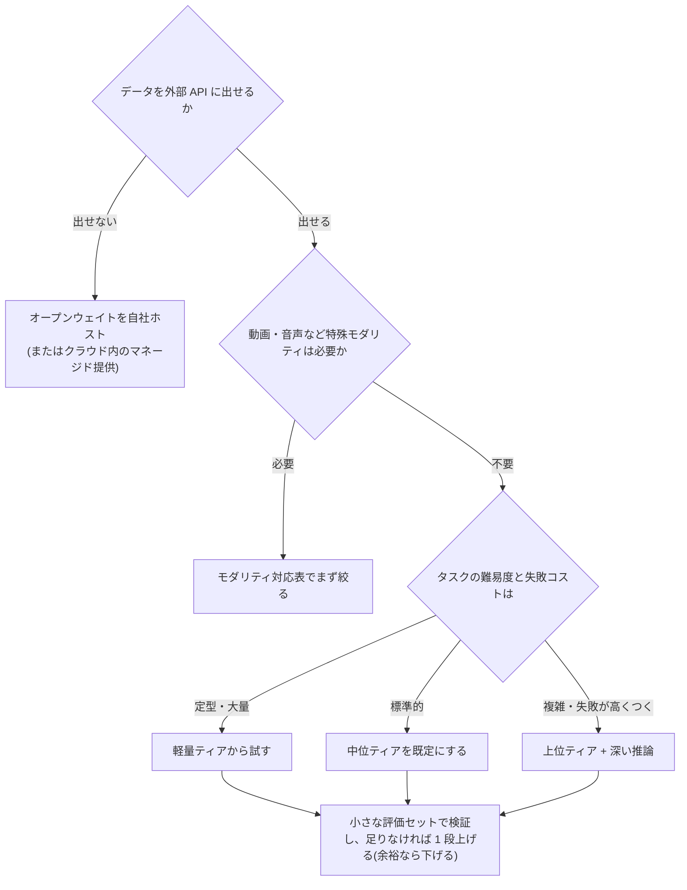

# モデル選定ガイド

## この記事の目的

タスクと制約から、使う LLM を迷わず選べるようになります。判断軸(能力ティア・推論・レイテンシ・コスト構造・コンテキスト長・モダリティ・提供形態)と、用途別の具体的な使い分け、複数モデルを組み合わせるポートフォリオ設計を扱います。

個々のモデルの特性・カタログは [主要 LLM の全体像](llm-landscape.md) が正です。本記事は「選び方」を担当し、モデル名は 2026-07 時点の例として最小限だけ挙げます。

## 対象読者

- Agent・LLM アプリケーションのモデル選定に責任を持つエンジニア・テックリード
- 「とりあえず最上位モデル」で作ってきて、コストまたはレイテンシが問題になり始めた人

## 前提知識

- [AI Agent とは何か](../01-concepts/what-is-an-ai-agent.md)
- [コスト管理](../05-operations/cost-management.md) — トークン課金の基本構造

## 本文

### 概要: 「最強の 1 つ」ではなくポートフォリオを選ぶ

モデル選定の最重要原則は、**「どのモデルが一番良いか」ではなく「どのタスクにどのティアを割り当てるか」を決める**ことです。2026 年時点の主要プロバイダーはいずれも「上位(最高性能)/ 中位(バランス)/ 軽量(速く安い)」の同型なティア構造でモデルファミリーを提供しており、単価はティア間で 1 桁変わります。1 つのシステムの中でも、タスクごとに適切なティアへ振り分けるのが標準的な設計です。

迷ったときの既定則は次の 2 つです。

1. **中位ティアを既定にする** — 大半のタスク(日常のコーディング・標準的なエージェントループ・RAG 応答)は中位で足ります。検証して足りなければ上げ、余裕なら下げます
2. **調整の方向はリスクで決める** — 大量・定型処理は「軽量から試して、精度が足りなければ 1 段上げる」。失敗コストが高いタスク(設計判断・本番障害の調査)は「上位から始めて、実績が出たら下げる」

### 選定の判断軸(7 つ)

| 軸 | 問うこと | 判断への影響 |
| --- | --- | --- |
| 能力ティア | タスクの難易度と失敗コストに対して、どの段が必要か | 単価が 1 桁変わる主変数。「タスク成功あたりコスト」で比較する |
| 推論(reasoning / thinking) | 深く考えさせる必要があるか(複雑なコード・数学・多段の計画) | 品質が大きく伸びる一方、思考トークンは**出力側で課金**される(Anthropic は公式明記。各社の扱いは料金ページで確認)。単純タスクでは切るか浅くする |
| レイテンシ | 対話 UX か、バッチ処理か | 対話は軽量ティア + ストリーミング + キャッシュが基本([レイテンシ最適化](../05-operations/latency-optimization.md)) |
| コスト構造 | 単価表のどの行が自分のワークロードに効くか | 入力と出力で単価が数倍違う。キャッシュ・バッチ割引を含めた実効単価で見る(後述) |
| コンテキスト長 | 一度に見せる必要がある情報量はどれだけか | 長いほど良いわけではない。長コンテキストは単価・レイテンシ・精度の劣化と引き換え([コンテキストエンジニアリング](../02-architecture/context-engineering.md)) |
| モダリティ | テキスト以外(画像・音声・動画)の入出力が要るか | 対応の有無で選択肢が絞られる。特に動画・リアルタイム音声は対応モデルが限られる |
| 提供形態・データ要件 | API 直・クラウド経由(Bedrock / Vertex 等)・自社ホストのどれが許されるか | データを外に出せない場合はオープンウェイト(open weights: 重みが公開され自社ホストできるモデル)に絞られる。クラウド経由は既存のガバナンス・請求に統合できる |

### 用途別の使い分け(具体表)

迷わないための対応表です。**モデル名は 2026-07 時点の例**であり、世代交代します。最新の顔ぶれは [主要 LLM の全体像](llm-landscape.md) と各公式ページで確認してください。

| 用途 | 選ぶティア・種別 | 具体例(2026-07 時点) | 判断のポイント |
| --- | --- | --- | --- |
| 分類・抽出・ルーティング・タグ付け(大量・定型) | 軽量 | Claude Haiku 4.5、GPT-5.4 mini / nano、Gemini 3.1 Flash-Lite | 小さな評価セットで精度を検証してから量産に乗せる。[構造化出力](structured-output.md) と併用 |
| チャット応答・RAG の回答生成 | 軽量〜中位 | 同上 + Claude Sonnet 5、GPT-5.4、Gemini 3.5 Flash | レイテンシ要件が厳しいほど軽量寄り + ストリーミングとキャッシュを活用 |
| 日常のコーディング支援・標準的なエージェントループ | 中位(既定) | Claude Sonnet 5、GPT-5.4、Gemini 3.5 Flash | ツール呼び出しの信頼性・指示追従を評価セットで確認 |
| 複雑な設計判断・難しいデバッグ・長時間の自律エージェント | 上位 + 深い推論 | Claude Opus 4.8 / Fable 5、GPT-5.5(難問は pro 系)、Gemini 3.1 Pro | 手戻り 1 回の損失が単価差を上回るなら上位。迷ったら上位で 1 回で終わらせる方が安いことも多い |
| 要約・翻訳・文書整形(品質より量) | 軽量 + Batch API | 各社の軽量ティア + バッチ割引 | 非同期で良いならバッチ割引(概ね半額)を使う |
| 画像を含む理解(スクリーンショット・図面) | 中位以上のマルチモーダル | 主要 3 社の現行世代はいずれも画像入力対応 | 精度はモデル差が大きい領域。自社の画像で検証 |
| 動画・長時間音声の理解 | 対応モデル限定 | Gemini 系(動画・音声入力に対応) | モダリティ対応表で絞ってから選ぶ |
| リアルタイム音声対話 | 音声特化系 | GPT のリアルタイム系 等 | テキストモデルとは別系統。専用モデルの対応表を確認 |
| データを外部 API に出せない(規制・機密) | オープンウェイト | Llama、Qwen、DeepSeek、Mistral 等 | 選定・運用責任を自分で負う([OSS 系ツールの議論](../08-coding-agents/open-source-coding-agents.md) と同型)。マネージド提供(Bedrock 等)経由という中間解もある |
| LLM-as-a-Judge(評価者) | 被評価者と別系統 | 評価対象と異なるファミリーの中位以上 | 同一モデルの自己評価バイアスを避ける([LLM-as-a-Judge](../04-evaluation/llm-as-a-judge.md)) |

### ティア混在(ポートフォリオ)設計

1 つのシステムに複数ティアを組み合わせる定番パターンです。

- **計画と実行の分離** — 計画・設計は上位モデル、決まった計画の実行は中位・軽量モデルで行います(GitHub Copilot の公式コスト最適化ガイドが明記する構図で、他のコーディングエージェントも同様の使い分けをサポートします。[コスト最適化](../08-coding-agents/coding-agent-cost-optimization.md))
- **サブエージェントの軽量化** — 探索・要約などスコープの狭い委譲タスクには軽量モデルを割り当てます
- **ルーティング** — 入力の難易度を軽量モデル(または分類器)で判定し、難しいものだけ上位へ回します([オーケストレーションパターン](../02-architecture/orchestration-patterns.md) のルーティング)
- **フォールバック** — 過負荷・障害時に代替モデルへ切り替えるチェーンを用意します([エラー処理とリトライ](../02-architecture/error-handling-and-retries.md))
- **評価者の分離** — 検証・レビューは別ファミリーのモデルに任せ、自己評価バイアスを避けます

### 料金体系の読み方

単価表を読むときは、次の構造を押さえると実効コストを見誤りません(数値の傾向は 2026-07 時点)。

- **出力は入力より数倍高い**(主要 3 社とも 5〜6 倍が典型)。生成量の多いワークロードは出力単価が支配します
- **思考(thinking / reasoning)トークンは出力側で課金**されるのが一般的です(Anthropic は公式明記。各社の扱いは料金ページで確認してください)。推論を深くする設定はコストに直結します
- **キャッシュ読み取りは入力の 1 割前後**(各社類似)。プロンプトの固定部分を先頭に置く設計で効きます([コスト管理](../05-operations/cost-management.md))
- **Batch API はおおむね半額**。非同期で許されるワークロードは常に検討価値があります
- 一部モデルには**長コンテキスト利用時の割増**があります。また、モデルの世代交代で同等性能の単価は下がる傾向があるため、単価前提は定期的に見直します

### 乗り換えと再評価

- **本番はモデル ID をピン止めする** — 「最新を指すエイリアス」は中身が予告なく変わります。スナップショット付き ID を固定し、更新は自分のタイミングで行います([バージョニングとモデル更新追従](../05-operations/versioning-and-model-updates.md))
- **評価セットが乗り換えの通行証** — 自社タスクの回帰テスト([回帰テストと CI 組み込み](../04-evaluation/regression-testing.md))があれば、新モデル・新世代の採否を数時間で判断できます。なければ乗り換えのたびに賭けになります
- 公開ベンチマークの順位は参考情報に留めます。自社タスクとの相関は保証されません([Agent 評価の基礎](../04-evaluation/agent-evaluation-basics.md))

## 実務での注意点

### アンチパターン

- **ベンチマーク 1 位を追いかけて乗り換え続ける** — 移行・再評価のコストが利得を食い潰し、自社タスクでの改善は保証されません。→ 社内評価セットで測ってから乗り換えます
- **全タスクを最上位モデルで回す** — 定型処理に 1 桁高い単価を払い続けることになります。→ 中位既定 + 用途別の振り分けに再設計します
- **単価最安のモデルで難タスクに挑む** — 失敗と再試行で「成功あたりコスト」が逆転します。→ 失敗コストが高いタスクは上位から始めます
- **エイリアス(latest 系)のまま本番運用する** — モデルの中身が勝手に変わり、ある日突然挙動が変わります。→ ID ピン止め + 更新時の回帰テストを義務化します
- **コンテキスト長の大きさでモデルを選ぶ** — 「入るから全部入れる」はコスト・精度の両面で悪手です。→ 必要な情報を選ぶ設計([コンテキストエンジニアリング](../02-architecture/context-engineering.md))が先です

### チェックリスト

- [ ] 制約(データ要件・モダリティ・レイテンシ)で選択肢を絞ってからティアを選んだか
- [ ] 「中位を既定に、検証して上下する」運用になっているか
- [ ] 出力・思考・キャッシュ・バッチを含めた実効単価で比較したか
- [ ] タスク別のモデル使い分けがチームで文書化されているか
- [ ] 本番のモデル ID がピン止めされ、更新時の回帰テストがあるか
- [ ] 評価者(LLM-as-a-Judge)を被評価モデルと分けたか

## 関連トピック

- [主要 LLM の全体像](llm-landscape.md) — 各ファミリーの特性・カタログ(本記事の具体例の正)
- [フレームワーク選定ガイド](framework-selection.md) — 同型の選定判断(実行基盤側)
- [コスト管理](../05-operations/cost-management.md) — トークン課金・キャッシュの原理
- [バージョニングとモデル更新追従](../05-operations/versioning-and-model-updates.md) — ピン止めと更新運用
- [コーディングエージェントのコスト最適化](../08-coding-agents/coding-agent-cost-optimization.md) — 「使う側」でのモデル使い分け
- [モデル間の違いと移行(横断比較)](cross-model-prompting.md) — 選んだ/乗り換えるモデルへのプロンプトの書き方(各社の特化ガイドへの入口)
- [推論モデル(考える時間を使う LLM)](../10-llm-foundations/reasoning-models.md) — 選定の「推論」軸の仕組みと使いどころの詳解
- [小型言語モデル(SLM)の活用戦略](slm-strategy.md) — ティア混在の「小型を既定にする」戦略詳解
- [ローカル・オンデバイス LLM の実務](local-and-on-device-llm.md) — 端末・ローカルで動かすという提供形態の選択
- [セルフホスト推論の実務](../05-operations/self-hosted-inference.md) — API を借りず自分で提供する選択と運用
- [フロンティアセーフティの概観](../06-security/frontier-safety-overview.md) — 「提供者の安全体制」を選定軸に足す(機微用途で重要)

## 参考資料

- [Claude モデル一覧(Anthropic)](https://platform.claude.com/docs/en/about-claude/models/overview) — ファミリー構成と仕様の一次情報(アクセス日: 2026-07-06)
- [OpenAI Models](https://developers.openai.com/api/docs/models) — 同上(アクセス日: 2026-07-06)
- [Gemini API Models(Google)](https://ai.google.dev/gemini-api/docs/models) — 同上(アクセス日: 2026-07-06)

## TODO・未確認事項

### 変わりやすい項目(定点観測)

> **TODO(要確認):** 用途別表の「具体例(2026-07 時点)」のモデル名を、各社公式のモデル一覧ページで四半期ごとに確認する(世代交代が速い。最終確認: 2026-07)

> **TODO(要確認):** 料金構造の傾向値(出力 5〜6 倍・キャッシュ 1 割前後・バッチ半額)が各社の現行料金でも成り立つかを確認する(最終確認: 2026-07)
