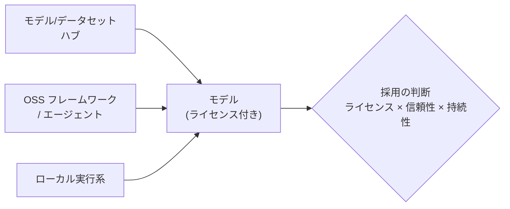

# オープンソース AI エコシステム

## この記事の目的

オープンウェイトモデルと OSS ツールのエコシステム(モデルハブ・ライセンス・コミュニティ)を使いこなし、リスクを判断できるようになります。特に**「オープン(公開)= 商用自由 ではない」**というライセンスの実務判断、モデルカードの読み方、派生モデルの信頼性、コミュニティの持続性の見極めを扱います。モデルそのものの地図は[主要 LLM の全体像](llm-landscape.md)が担い、本記事は**その周りのエコシステムの地図**です。

**本記事は鮮度リスクの高いページです。** ライセンスの版・条件、ハブの規約、OSS の顔ぶれは変わるため、企業・製品名は代表例とし、ライセンス条項は**現行版を各自で確認**する前提で構造と読み方を示します。

## 対象読者

- オープンウェイトモデル・OSS ツールの採用を検討し、ライセンス・信頼性のリスクを判断したいエンジニア・テックリード
- 「オープンだから自由に使える」と思い込みがちな箇所を、実務判断として押さえたい人

## 前提知識

- [主要 LLM の全体像](llm-landscape.md) — モデルの地図(オープンウェイト節)。本記事はエコシステムの地図
- [AI サプライチェーンセキュリティ](../06-security/ai-supply-chain-security.md) — 外部から持ち込む AI 資産のリスク(本記事の派生モデルの信頼と接続)

## 本文

> **最終確認日:** 2026-07-10 — 本記事が挙げるライセンス類型・ハブ・OSS の代表例と所在はこの日付時点のものです。各一次情報 URL と確認状況は、リポジトリ内 `research/ecosystem/industry-oss.md` を参照してください。**本記事は法的助言ではありません。** ライセンスの適法性判断は法務に確認してください。

### 概要: エコシステムを地図として持つ

「オープンな AI」は、モデル単体でなく、**ハブ・ライセンス・ツール・コミュニティが絡んだエコシステム**です。ここを地図として持つと、「どのモデルを・どの条件で・どれだけ信頼して使えるか」を判断できます。エコシステムは 4 つの構成要素で捉えます。

### エコシステムの構造

- **モデル/データセットハブ**: モデル・データセット・デモを共有する基盤(Hugging Face が代表例)。モデルは通常、リポジトリ内の**モデルカード**(`README.md` の先頭に機械可読メタデータ、本文に説明)として公開され、`license` フィールドでライセンスを宣言します。ハブの利用規約は、本体の ToS と、禁止事項を定める別紙(コンテンツポリシー等)の**二層構造**が一般的です
- **OSS フレームワーク/エージェント**: モデルとアプリの間で、オーケストレーション・エージェント構築・推論最適化・ツール接続を担う OSS 群。層として厚く、代表例が類型ごとに存在します(オーケストレーション系・高スループット推論サーバ・学習/変換ライブラリ)
- **ローカル実行系**: 手元のマシンでモデルを動かす実行系。C/C++ の推論エンジン(GGUF フォーマット)と、その上に管理・CLI を載せた利用しやすいラッパという構造があります([ローカル・オンデバイス LLM の実務](local-and-on-device-llm.md))
- **標準・ガバナンスの組織**: ライセンス条文(Apache 等)、責任ある AI ライセンス、AI/データ OSS のホスティングなど、標準に関わる組織が複数あります

### ライセンスの読み方: 「オープン ≠ 商用自由」

最も実務に効くのが**ライセンスの類型の見分け**です。「公開/ダウンロード可能」「OSI 定義のオープンソース」「商用利用が自由」は**別物**です。類型ごとに、確認すべき観点が違います(法的判断ではなく、確認すべき点の整理です)。

| 類型 | 特徴 | 確認すべき観点(代表例) |
| --- | --- | --- |
| 寛容型(permissive) | 商用・改変・再配布を広く許諾。利用規模・用途の制限は付かない | 帰属表示・ライセンス文の保持(Apache 2.0 は特許条項・NOTICE 同梱も)。代表例: Apache 2.0・MIT |
| 振る舞い制限付き(OpenRAIL 系) | 自由に使える一方、**特定の有害用途を禁止**。制限は派生物にも伝播 | 禁止用途(監視・差別・偽情報・兵器等が典型)。用途制限があるため OSI 定義の「オープンソース」ではない |
| 独自制限付き(利用規模・用途) | 重みは配布するが、**規模や用途に条件**。OSI 承認ライセンスではない | 利用規模の条件(大規模サービスは別途ライセンス要のことがある)・用途制限・再配布時の表示義務・派生物(蒸留含む)の扱い。代表例: 各社の Community License / Terms of Use |

**「オープンソース AI」の定義**として、OSI が Open Source AI Definition(OSAID)を策定しており、4 つの自由(利用・研究・改変・共有)と、そのためのデータ情報・コード・パラメータへのアクセスを要件とします。この定義に照らすと、**重みは配布するが用途/規模制限を持つ「オープンウェイト」モデルは、OSAID の「オープンソース」には該当しません**。両者を区別して語るのが正確です。

実務の行動指針はシンプルです — **採用前に、そのモデルの `license` を必ず読む**。特に「自社の使い方(商用か・規模はどれくらいか・再配布や派生物を作るか)」を、その類型の条件に照らして確認します。数値(規模のしきい値など)や版は世代で変わるため、**現行版のモデルカード・公式規約で確認**します。判断に迷う条項は法務に確認します(本記事は法的助言ではありません)。

### モデルカード・データシートの読み方

モデル/データセットを採用する前に、**カード**を読みます。標準は 1 つに統一されていませんが、確認すべき項目は概ね共通です。

- **モデルカードで見る**: 想定用途と非推奨用途、既知の限界・バイアス、学習データ、評価結果、**ライセンス(`license`)**、ベースモデル(`base_model`)
- **データセットカード/データシートで見る**: 動機・構成・収集プロセス・ラベリング・推奨用途・ライセンス・言語・規模
- カードが薄い・限界の記述がない資産は、**それ自体がリスクのシグナル**です

### 派生モデルの系譜と信頼

オープンウェイトの世界では、あるモデルを土台に**ファインチューニング・マージ・量子化**した派生モデルが大量に流通します。ここは信頼の見極めが要ります。

- **系譜(来歴)を確認する**: ベースモデルは何か(`base_model`)、誰が・何のデータで派生させたか。系譜が辿れない資産は信頼しにくい
- **派生でライセンスが引き継がれる**: ベースが独自制限付きなら、派生物にも制限が及ぶのが通常です(蒸留を含める規約もある)。派生モデルを使うときも、**元のライセンスの条件**を確認します
- **サプライチェーンとして扱う**: 外部から持ち込むモデル・重み・データは、汚染・改ざんのリスクを持つサプライチェーンです。出所確認・署名/ハッシュ・受け入れプロセスで守ります([AI サプライチェーンセキュリティ](../06-security/ai-supply-chain-security.md))

### コミュニティの持続性と企業としての関与

OSS の採用は、**誰が保守しているか・続くか**の見極めを含みます。

- **持続性を見る**: 単独メンテナか組織か、更新の頻度、GitHub の組織移管・メンテナンス状態の変化。土台にする OSS が枯れる/放棄されるリスクを見積もります
- **企業としての関与の判断**: 「利用する」「貢献する(バグ報告・PR)」「自社成果を公開する」のどこまで関与するかは経営判断です。公開には自社の資産・ブランドと、コミュニティへの還元のトレードオフがあります
- **ライセンスは自社の公開時にも効く**: 自社が OSS を公開・改変配布する側になるときも、取り込んだ OSS のライセンス義務(帰属・ソース開示等)を守る必要があります

### この理解が効く場面

- **オープンウェイトモデルの採用判断**: ライセンス類型と自社の使い方を照らし、商用可否・規模条件・再配布条件を確認する([モデル選定ガイド](model-selection.md))
- **OSS ツールの採用**: 持続性・ライセンス・信頼性を見て土台を選ぶ([オープンソースのコーディングエージェント](../08-coding-agents/open-source-coding-agents.md))
- **セルフホストの前提**: どのモデル・実行系を、どのライセンスで動かすか([セルフホスト推論の実務](../05-operations/self-hosted-inference.md)・[ローカル・オンデバイス LLM の実務](local-and-on-device-llm.md))
- **業界の地図と接続**: OSS が厚いミドルウェア層の力学([AI 業界レイヤーマップ](../09-business/ai-industry-map.md))

## 実務での注意点

### アンチパターン

- **「オープン」を「商用自由」と同一視する** → 独自制限付きライセンスの規模条件・用途制限に抵触する → 採用前に `license` を読み、自社の使い方を条件に照らす
- **オープンウェイトを OSI オープンソースと混同する** → 用途/規模制限のある重みを「オープンソース」と誤認する → OSAID(4 自由 + データ/コード/パラメータ)との違いを区別する
- **モデルカードを読まずに採用する** → 非推奨用途・限界・ライセンスを見落とす → カードの想定用途・限界・license・base_model を確認する
- **派生モデルを系譜を見ずに使う** → 来歴不明・ベースの制限が及ぶことを見落とす → base_model と元ライセンスを確認し、サプライチェーンとして受け入れ審査する
- **OSS の持続性を見ずに土台にする** → 保守が止まった OSS に依存し、後で行き詰まる → メンテナンス状態・組織・更新頻度を見て選ぶ
- **ライセンスの適法性を自己判断する** → 誤った解釈が法的リスクになる → 迷う条項は法務に確認する(本記事は読み方まで)

### チェックリスト

- [ ] 採用するモデルの `license` を読み、類型(寛容/振る舞い制限/独自制限付き)を把握した
- [ ] 自社の使い方(商用・規模・再配布・派生)を、そのライセンスの条件に照らした
- [ ] 「オープンウェイト」と「OSI オープンソース(OSAID)」を区別している
- [ ] モデルカードの想定用途・限界・base_model を確認した
- [ ] 派生モデルの系譜(ベース・作成者・データ)と、引き継がれる制限を確認した
- [ ] 外部モデル/データをサプライチェーンとして受け入れ審査している
- [ ] 土台にする OSS の持続性(保守・組織・更新)を評価した
- [ ] ライセンスの具体条件・版を、現行版のモデルカード/公式規約で確認している

## 関連トピック

- [主要 LLM の全体像](llm-landscape.md) — モデルの地図(オープンウェイト節)。本記事はエコシステムの地図
- [AI 業界レイヤーマップ](../09-business/ai-industry-map.md) — OSS が厚いミドルウェア層を含む業界全体の地図
- [AI サプライチェーンセキュリティ](../06-security/ai-supply-chain-security.md) — 派生モデル・外部資産の信頼(受け入れプロセス)
- [オープンソースのコーディングエージェント](../08-coding-agents/open-source-coding-agents.md) — OSS ツール採用の実例(BYOK・持続性)
- [ローカル・オンデバイス LLM の実務](local-and-on-device-llm.md) — ローカル実行系(GGUF・ラッパ)の実務
- [セルフホスト推論の実務](../05-operations/self-hosted-inference.md) — オープンウェイトを自分で動かす提供層
- [モデル選定ガイド](model-selection.md) — オープンウェイトを選定判断に位置づける

## 参考資料

- [The Open Source AI Definition(OSI)](https://opensource.org/ai/open-source-ai-definition) — オープンソース AI の定義(OSAID・現行 1.0)。オープンウェイトとの区別(アクセス日: 2026-07-10)
- [Apache License 2.0](https://www.apache.org/licenses/LICENSE-2.0) — 寛容型ライセンスの条文(特許条項・NOTICE)(アクセス日: 2026-07-10)
- [Model Cards(Hugging Face Hub docs)](https://huggingface.co/docs/hub/model-cards) — モデルカードの仕組みとメタデータ(`license`・`base_model`)(アクセス日: 2026-07-10)
- [Model Cards for Model Reporting](https://arxiv.org/abs/1810.03993) — モデルカードの原典(Mitchell et al., 2019、アクセス日: 2026-07-10)
- [Datasheets for Datasets](https://arxiv.org/abs/1803.09010) — データシートの原典(Gebru et al.、アクセス日: 2026-07-10)

各ライセンス条文(Llama Community License・Gemma Terms・OpenRAIL 等)・ハブ規約・OSS リポジトリの現行 URL と確認状況は `research/ecosystem/industry-oss.md` に整理しています。

## TODO・未確認事項

> **TODO(要確認):** モデルライセンスの版・規模条件・用途制限、および採用ライセンス(同一ベンダーでも世代で寛容型 ↔ 独自規約が変わりうる)は、現行版のモデルカード・公式規約で必ず確認する。本記事は類型と読み方に徹し、具体条項は断定していない(所在は `research/ecosystem/industry-oss.md`)(最終確認: 2026-07)

### 変わりやすい項目(定点観測)

> **TODO(要確認):** モデルライセンスの現行版と規模条件、OSI Open Source AI Definition の版、Hugging Face の規約構造、OSS フレームワークの GitHub 組織移管・統合・メンテナンス状態を四半期ごとに一次情報で確認する(`research/ecosystem/industry-oss.md` を更新起点にする)(最終確認: 2026-07)
