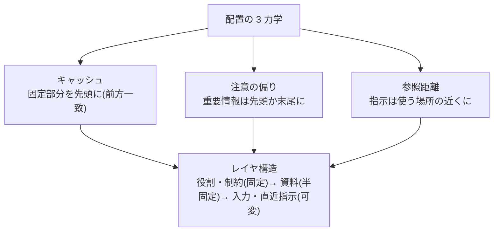

# プロンプトエンジニアリングの上級パターン

## この記事の目的

[基礎技法](prompt-engineering-fundamentals.md)で名前と使いどころを掴んだ技法を、**なぜ効くか(仕組み)・どう設計するか(詳細)・どう検証するか**まで掘り下げます。難しいタスクのプロンプトを設計し、うまくいかないプロンプトを原理から診断できる状態がゴールです。

## 対象読者

- 基礎技法では足りない複雑なタスク(長文書・厳密な形式・揺れる判断)のプロンプトを設計するエンジニア
- 「動いているが理由が説明できない」プロンプトを、根拠のある設計に作り直したい人

## 前提知識

- [プロンプトエンジニアリングの基礎技法](prompt-engineering-fundamentals.md) — 技法の名前と使いどころ(本記事はその詳解)
- [LLM はどうやってテキストを生成するか](../10-llm-foundations/how-llms-generate-text.md) / [注意機構とコンテキストウィンドウの仕組み](../10-llm-foundations/attention-and-context.md) — 「なぜ効くか」の根拠として全編で参照します

## 本文

### 概要: 基礎技法との分担

| 層 | 正本 | 本記事 |
| --- | --- | --- |
| 名前と使いどころ | [基礎技法](prompt-engineering-fundamentals.md) | — |
| 技法の詳細設計と検証 | **本記事** | 構造化・例示・思考・出力・長文・頑健性の 6 領域 |
| システムプロンプト(長期間・多状況) | [Agent 向けプロンプト設計](agent-prompt-design.md) | — |
| モデル別の具体的な推奨 | [Claude](claude-prompting.md) / [OpenAI](openai-prompting.md) / [Gemini](gemini-prompting.md) の特化ガイド | 本記事はモデル中立の原理まで |

### 構造化の詳解: 配置には 3 つの力学がある

プロンプトの構造(何をどの順で置くか)は好みの問題ではなく、3 つの力学の合成で決まります。

- **レイヤ構造**: 役割・制約・手順(固定)→ 例(半固定)→ 資料(タスクごと)→ ユーザー入力と直近の指示(可変)という順序は、キャッシュ効率([注意機構とコンテキストウィンドウの仕組み](../10-llm-foundations/attention-and-context.md))と「最後に読んだ指示が効きやすい」性質を同時に満たします。長い資料の後に要点の指示を繰り返すのは、この力学の応用です
- **区切りの設計**: 領域(指示・資料・例・出力欄)を対称的な区切り(開始と終了が明確なタグ形式)で囲むと、境界の誤解釈が減り、後からの部分差し替えも安全になります。入れ子で階層を表現できるのも利点です。どの記法が最も効くかはモデルにより異なるため、公式ガイドで確認します
- **役割・視点の設計**: 役割の付与は語彙・粒度・前提の選択を条件付けます(生成の条件が変わる、という 10 章の原理そのもの)。効かせ方の要点は「肩書き」ではなく**判断基準と読者像**を与えることです(「あなたは専門家」より「◯◯の観点で、△△な読者向けに」)。過剰な人格設定は口調にばかり効いて判断品質に効かないことが多く、トークンの無駄になります

### 例示(few-shot)の詳解: 例は第 2 の仕様書

- **選択**: 例セットは「分布の代表 + 境界例 + 否定例」で組みます。とくに**否定例(「該当なし」「回答を拒否すべき入力」)を欠くと、モデルは常に何かを出力する方向に倒れます**。分類タスクではラベルの出現比率も出力の事前分布として働くため、偏った例は偏った予測を生みます
- **順序**: 直近(最後)の例への同調が最も強い傾向があります。出力形式を最終的に決めるのは最後の例、と考えて配置します。順序を入れ替えて結果が大きく変わるなら、例ではなく指示の明文化が不足しているサインです
- **形式の伝染**: 例の長さ・文体・構造は内容と独立に出力へ伝染します。これは意図的に使えば強力な形式制御(スタイルを例で示す)であり、無自覚だと事故(例が全部短いので出力も短くなる)になります
- **動的選択**: 入力に類似した例を検索して差し込む方式は、多様な入力分布で精度を上げますが、(1) 例がプロンプトの可変部分になるためキャッシュと衝突する(後方に置く)、(2) 検索品質が新たな故障点になる、という代償があります。静的な例で足りるかをまず検証します

### 思考の制御: 書く順序が品質を決める

- **考察 → 結論の順序を強制する**: 「結論を先に、理由を後に」と頼むと、理由は結論の後付けになります(生成済みトークンは取り消せない — 10 章)。品質が欲しいときは考察を先に書かせ、表示上結論を先に見せたいなら後処理で並べ替えます
- **自己検証をさせる**: 生成後に「上の回答を次のチェックリストで検証し、問題があれば修正版を出力」と続ける 2 段構成は、形式ミスや明白な矛盾に有効です。ただし**根拠のない自己修正は改善を保証しません** — 検証器(テスト・照合)なしの「もう一度考えて」は、正解を不正解に変えることもあります。自己検証には検証可能な基準を渡します
- **推論モデルでは委任に切り替える**: 応答前に考えるモデルに対して手順を細かく指定すると、モデル内部の探索と衝突して逆効果になりえます。目標・制約・成功基準・出力仕様を渡し、過程は任せるのが基本方針です([基礎技法](prompt-engineering-fundamentals.md)の位置づけの詳細化)。思考量はプロンプトではなくパラメータ側で制御します

### 出力の制御: 「お願い」を物理的な制約に近づける

- **応答の書き出し指定(prefill)**: アシスタント応答の冒頭を開発者側で与えてから続きを生成させる技法です。前置きの除去(いきなり JSON から始めさせる)・形式の強制・役割の維持に効きます。生成は与えた書き出しの続きとして条件付けられるため、指示より強い形式制御になります(対応可否・作法はモデルにより異なります)
- **停止シーケンス**: 「ここで止まる」を文字列で指定し、余計な続きを構造的に断ちます。区切り記法と組にすると安定します
- **構造化出力との併用**: 機械処理する形式は構造化出力([構造化出力](structured-output.md))で強制するのが正本です。プロンプト側の仕事は「フィールドに何を入れるか」の内容品質に集中させます
- **長さの制御**: 最大トークン数は「打ち切り」であって長さ指定ではありません([LLM はどうやってテキストを生成するか](../10-llm-foundations/how-llms-generate-text.md))。長さは指示(「3 点、各 1 文」)と例で制御し、上限はあくまで安全弁にします

### 長文・大量データのパターン

- **配置と引用**: 資料は前方(キャッシュに載る)・指示は資料の後(直近性)が基本形です。回答の前に**該当箇所をまず引用させてから答えさせる**と、資料に基づかない回答(中間の見落とし・記憶による回答)が目に見えて減り、検証もしやすくなります
- **分割 + 統合(map-reduce)**: 資料を分割して個別に処理し、結果を統合します。失敗モードは境界での文脈喪失(チャンクまたぎの情報)と、統合段での重複・矛盾です。分割時に重なり(オーバーラップ)を持たせ、統合プロンプトに矛盾解決の基準を書きます
- **逐次精緻化(rolling refinement)**: 要約を持ち回りながら順に読み進める方式は、長い時系列に強い一方、初期の誤りが増幅されるドリフトが弱点です。節目でのリセット(全体見直し)を挟みます
- そもそも「全部渡す」が正しいかはコンテキスト設計の問題です([コンテキストエンジニアリング](../02-architecture/context-engineering.md))

### 頑健性: きれいな入力を前提にしない

- **言い換え耐性**: 同じ意図の別表現(パラフレーズ)でテストします。特定の言い回しにだけ効くプロンプトは、実ユーザーの前で崩れます
- **崩れた入力への振る舞い**: 不完全な JSON・誤字・複数言語の混在・空入力に対する挙動を明示的に指定します(「解析できない場合は `parse_error` を返す」)。指定がなければモデルは推測で補い、静かな失敗になります
- **指示とデータの分離の徹底**: 処理対象データの中の命令文(「これまでの指示を無視して…」)を実行しない、という振る舞いはプロンプトでも明示しますが、**これは防御の 1 層にすぎません**。境界の設計と構造的な防御は [プロンプトインジェクション](../06-security/prompt-injection.md)が正本です

### パターンの検証方法

上級技法ほど「効いた気がする」に陥りやすいため、検証の規律が本体です。

1. **1 変更 1 評価**: 複数の技法を同時に入れると、何が効いたか永久に分からなくなります
2. **ペア比較 + 複数回実行**: 変更前後を同じ評価セットで、非決定性を踏まえ複数回比較します([Agent 評価の基礎](../04-evaluation/agent-evaluation-basics.md))
3. **理由を原理で説明する**: 「なぜ効いたか」を 10 章の仕組みで説明できない改善は、モデル更新で消える偶然の可能性を疑います
4. **記録**: 採用したパターンと検証結果を資産として残します([プロンプト資産の管理とバージョニング](prompt-management.md))

## 実務での注意点

### アンチパターン

- **技法を足し算で盛り込む** → 役割 + 例 8 個 + 思考指示 + 制約 30 行…と積むほど干渉し、どれが効いているか不明になる → 最小構成から 1 変更ずつ検証して足す
- **例を増やせば精度が上がると考える** → 効くのは数ではなく選択(代表・境界・否定例)と一貫性。増えた例はコストと干渉になる → 例セットを設計し、順序シャッフルで頑健性を確認する
- **検証器のない自己検証で品質を保証する** → 「もう一度考えて」は正解を壊すこともある → 自己検証には検証可能な基準(チェックリスト・照合手段)を渡す
- **prefill・区切り記法を別モデルへ無検証で移植する** → 対応・効き方はモデル依存で、静かに無効化される → 移行時に公式ガイド確認 + 回帰評価を行う([バージョニング・デプロイ・モデル更新追従](../05-operations/versioning-and-model-updates.md))
- **きれいな入力だけでテストする** → 実入力の言い換え・崩れで一気に劣化する → パラフレーズ・破損入力をテストセットに含める

### チェックリスト

- [ ] プロンプトがレイヤ構造(固定 → 半固定 → 可変)になっており、配置の理由を説明できる
- [ ] 例セットに境界例・否定例が含まれ、ラベル分布を確認した
- [ ] 考察と結論の生成順序が、品質要求と整合している
- [ ] 機械処理される出力は構造化出力 + プロンプトは内容品質、と分担している
- [ ] 長文処理の方式(全文・分割統合・逐次)を資料の性質から選んだ
- [ ] パラフレーズ・崩れた入力での挙動を検証した
- [ ] 採用パターンごとに「なぜ効くか」と検証結果が記録されている

## 関連トピック

- [プロンプトエンジニアリングの基礎技法](prompt-engineering-fundamentals.md) — 入口(名前と使いどころ)
- [プロンプト最適化(評価駆動の改善と自動化)](prompt-optimization.md) — 本記事のパターンを「どう改善に回すか」
- [Agent 向けプロンプト設計](agent-prompt-design.md) — システムプロンプトへの適用
- [構造化出力](structured-output.md) — 形式制御の強制側
- [注意機構とコンテキストウィンドウの仕組み](../10-llm-foundations/attention-and-context.md) — 配置の力学の理論
- [コンテキストエンジニアリング](../02-architecture/context-engineering.md) — プロンプトの外側(何を渡すか)の設計
- [モデル間の違いと移行(横断比較)](cross-model-prompting.md) — 本記事の原理を各モデルの具体に落とす際の差分(各社の特化ガイドへの入口)

## 参考資料

- なし(本記事はモデル中立の原理と検証方法の整理であり、個別技法の推奨はモデルごとの公式プロンプトガイドが一次情報です。利用中モデルの公式ガイドを併読してください)

## TODO・未確認事項

> **TODO(要確認):** 区切り記法・応答の書き出し指定(prefill)・停止シーケンスの対応状況と推奨形式はモデルごとに異なる。採用前に利用中モデルの公式プロンプトガイドで確認する(最終確認: 2026-07)
