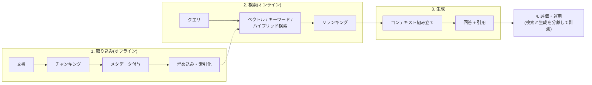

# RAG 実装パターン

## この記事の目的

検索拡張生成(RAG)を「概念として知っている」から「本番品質で実装できる」に進むための、取り込み・検索・生成・評価の各段の設計判断を扱います。チャンキング戦略、検索方式(ベクトル・キーワード・ハイブリッド)、リランキング、Agentic RAG、引用の提示、権限反映までを自分のシステムに合わせて選択できるようになります。

## 対象読者

- 固定 RAG または Agentic RAG の実装・改善を担当するエンジニア
- 「作った RAG の精度が上がらない」段階で、どの段を直すべきか切り分けたいエンジニア

## 前提知識

- [RAG と Agent の関係・使い分け](../01-concepts/rag-vs-agent.md) — 固定 RAG / Agentic RAG / 検索なしの構成選択(本記事は構成決定後の実装編)
- [Agent 評価の基礎](../04-evaluation/agent-evaluation-basics.md) — 検索品質と回答品質を分けて測る前提
- ライブラリ外の前提: ベクトル検索(埋め込みの類似度検索)のごく基本的な仕組み

## 本文

### 概要: RAG は 4 段のパイプライン

RAG の品質問題は「どの段の問題か」を切り分けないと直せません。本記事では次の 4 段に分けて設計判断を整理します。

経験則として、体感品質の問題の多くは生成(プロンプト)ではなく取り込みと検索に根があります。「必要な文書がそもそも上位に来ていない」状態でプロンプトを磨いても改善しません。

### 取り込み: チャンキング(chunking)とメタデータ

チャンキング(chunking)とは、文書を検索・投入の単位に分割することです。分割の設計が検索品質の上限を決めます。

| 戦略 | 内容 | 向く文書 |
| --- | --- | --- |
| 固定長分割 | N トークンごとに機械的に分割(前後の重なり = オーバーラップ付き) | 構造の乏しいテキスト。まず動かす初手 |
| 構造ベース分割 | 見出し・段落・表・コードブロックなど文書構造の境界で分割 | Markdown・HTML・社内 Wiki など構造のある文書 |
| 意味ベース分割 | 話題の切れ目を埋め込み類似度などで検出して分割 | 構造がなく話題転換の多い長文(コスト増に見合うか要評価) |

設計時の考え方は次のとおりです。

- **チャンクサイズはトレードオフ**です。小さいほど検索の的中は鋭くなるが文脈が欠け、大きいほど文脈は保たれるがノイズが増えて「どこが答えか」がぼやけます。文書タイプごとに評価セットで比較して決めます(勘で固定しない)
- **分割の境界で意味を切らない**ことが原則です。表の途中・手順の途中で切れたチャンクは、検索にヒットしても使いものになりません。構造ベース分割を優先し、長すぎる節だけ二次分割します
- **チャンク単体で意味が通るか**を確認します。「前述の設定を〜」だけのチャンクは検索しても文脈不明です。見出しパスや要約をチャンク先頭に付与する(コンテキスト付きチャンク)と、検索・生成の両方が安定します
- **メタデータ**(出典文書・セクション・更新日・部署・アクセス権限ラベルなど)を必ず付けます。検索時のフィルタ(後述の権限反映・鮮度優先)と、引用の提示の両方で必須になります

### 埋め込みと検索方式

**埋め込みモデルの選定**では、対象言語(日本語の検索品質)・入力長・次元数(ストレージと速度)・コストを見ます。注意すべきは、**埋め込みモデルの変更は全チャンクの再インデックスを意味する**ことです。モデル選定のやり直しは高くつくため、評価セットで比較してから決め、インデックスにモデル名とバージョンを記録しておきます(選定の一般論は [モデル選定ガイド](model-selection.md))。

**検索方式**は 3 択です。

| 方式 | 得意 | 苦手 |
| --- | --- | --- |
| ベクトル検索 | 言い換え・曖昧な質問(意味の近さ) | 型番・人名・エラーコードなどの完全一致 |
| キーワード検索(BM25 等) | 固有名詞・型番・コード片の完全一致 | 言い換え・語彙の揺れ |
| ハイブリッド検索 | 両者の結果を統合(RRF などの順位融合) | 実装・チューニングの手間 |

実務の初期値は **ハイブリッド検索**です。「ベクトル検索だけ」で始めると、型番・エラーコード・固有名詞の質問(業務システムでは頻出)で静かに失敗します。

### リランキングとハイブリッド検索の組み立て

リランキング(reranking)とは、一次検索で広めに取った候補(例: 上位 50 件)を、より精密なモデルで並べ直して上位数件に絞る 2 段目の処理です。一次検索は再現率(取りこぼさない)を、リランキングは精度(上位の質)を担当する、という分業になります。

- **効果**: コンテキストに入れる件数を絞れるため、生成品質とコストの両方に効きます。「上位 20 件を全部入れる」より「リランキング後の上位 5 件」の方が良い結果になることが多いです
- **コスト**: リランキングは候補件数に比例した追加レイテンシ・費用がかかります。まずハイブリッド検索のみで評価し、上位の質がボトルネックだと確認できてから追加します
- **順序**: 一次検索(広く)→ メタデータフィルタ(権限・鮮度)→ リランキング(precision)→ 上位 k 件をコンテキストへ、が基本形です

### Agentic RAG の実装

検索の制御を Agent に渡す構成(選択基準は [RAG と Agent の関係・使い分け](../01-concepts/rag-vs-agent.md))では、実装上、次を設計します。

- **検索をツールとして定義する**: 「クエリ」「フィルタ(文書種別・期間)」「件数」をパラメータにした検索ツールを渡します。ツール説明文には「どんな知識が入っているか」「どういうときに検索すべきか」を書きます([ツール定義の設計](tool-definition-design.md))
- **クエリの再構成を任せる**: 利用者の質問をそのまま検索クエリにせず、モデルに検索用クエリを生成させます(会話履歴を踏まえた具体化・分解)。固定 RAG でも、この「クエリ書き換え」だけ LLM に任せる中間形が有効です
- **反復の上限を決める**: 検索 → 結果確認 → 再検索のループに回数・トークンの上限を設けます。「見つからないときに諦めて『わからない』と言う」条件も指示します
- **検索結果の要約投入**: 長いチャンクを複数往復で扱うとコンテキストが膨らみます。ヒット結果の要約や抜粋をループに返し、全文は最終生成時のみ投入する構成でコストを抑えられます([コンテキストエンジニアリング](../02-architecture/context-engineering.md))

### 引用・根拠の提示

回答には出典を必ず付けます([RAG と Agent の関係・使い分け](../01-concepts/rag-vs-agent.md) のアンチパターンでも触れた原則の実装編です)。

- チャンクに安定した ID を振り、生成時に「使用したチャンク ID」を構造化出力で返させ、アプリ側で文書名・リンクに解決します(モデルに URL や文書名を直接書かせると幻覚の余地が生まれます)
- 「引用された文書が実際に回答内容を支持しているか」は忠実性(faithfulness)の評価対象になります。引用付きでも中身が違う「見せかけの根拠」があるため、評価で検証します([LLM-as-a-Judge](../04-evaluation/llm-as-a-judge.md))
- 回答に使えるチャンクがなかったときは「見つからなかった」と答えさせます。「検索結果に基づいてのみ回答し、なければその旨を述べる」という指示 + 検索ヒットなし時のガード(コード側)の 2 段構えにします

### 権限反映と運用

- **権限反映(ACL)検索**: 社内文書には閲覧権限があります。インデックスを 1 つに統合するなら、チャンクのメタデータに権限ラベルを持たせ、**検索時に必ず利用者の権限でフィルタ**します。生成後のフィルタでは手遅れです(権限外文書の内容が回答に混入してから消すことはできません)。この設計を怠ると、RAG が権限バイパス経路になります([データ漏えい対策](../06-security/data-exfiltration.md))
- **鮮度と再インデックス**: 文書の更新をどう反映するか(定期全再構築 / 差分更新)、古い版をいつ消すかを最初に決めます。「規定は改定されたのに回答が古い」は RAG の典型的な信頼失墜パターンです
- **インデックスのバージョニング**: チャンキング設定・埋め込みモデルを変えたら別インデックスとして構築し、評価で比較してから切り替えます(ロールバック可能に。[バージョニング・デプロイ・モデル更新追従](../05-operations/versioning-and-model-updates.md) と同じ考え方です)

### RAG の評価: 検索と生成を分けて測る

RAG の評価は最終回答だけを見ると切り分けができません。段ごとに測ります。

| 対象 | 代表的な問い | 測り方の例 |
| --- | --- | --- |
| 検索 | 必要なチャンクが上位 k 件に入っているか | 質問と正解チャンクの対応表を作り、再現率(recall@k)や順位を測る |
| 生成 | 与えたチャンクに忠実か(faithfulness)・質問に答えているか | LLM-as-a-Judge + 抜き取りの人手確認 |
| 全体 | 最終回答が正しいか・出典が正しいか | エンドツーエンドの評価セット |

「検索は当たっているのに回答が悪い」なら生成(プロンプト・チャンク投入方法)を、「検索から外している」なら取り込み・検索(チャンキング・方式・クエリ書き換え)を直します。評価セットの作り方自体は [評価データセットの構築と保守](../04-evaluation/evaluation-datasets.md) を参照してください。

## 実務での注意点

### アンチパターン

- **ベクトル検索だけで本番に出す** → 型番・人名・エラーコードの完全一致質問で静かに失敗し続ける → ハイブリッド検索を初期値にし、失敗クエリのログで方式を調整する
- **チャンクサイズを勘で決めて再評価しない** → 精度の上限がそこで固定され、プロンプト改善で挽回できない → 文書タイプごとに評価セットでサイズ・分割方式を比較する
- **権限フィルタを生成後に掛ける(または掛けない)** → 権限外文書の内容が回答へ混入し、RAG が権限バイパス経路になる → 検索段でのメタデータフィルタを必須にし、権限テストケースを評価に含める
- **最終回答の良し悪しだけで改善する** → どの段が悪いか分からず、あてずっぽうの修正が続く → 検索(recall@k)と生成(忠実性)を分離して計測する
- **埋め込みモデルを気軽に乗り換える** → 全チャンク再インデックスと評価やり直しの費用を見落とす → 変更はインデックスのバージョニングと評価比較を伴う「デプロイ」として扱う

### チェックリスト

- [ ] チャンキングは文書構造を考慮し、サイズ・オーバーラップを評価セットで比較して決めた
- [ ] チャンクに出典・更新日・権限ラベルなどのメタデータが付いている
- [ ] 完全一致系の質問(型番・固有名詞)に対応できる検索方式(ハイブリッド等)になっている
- [ ] 検索時に利用者の権限でフィルタしており、権限テストケースが評価にある
- [ ] 回答に出典が付き、根拠チャンク ID から検証できる
- [ ] 該当情報がないときに「見つからない」と答える設計(指示 + コード側ガード)がある
- [ ] 検索品質(recall@k)と生成品質(忠実性)を分離して計測している
- [ ] 再インデックスの運用(頻度・差分・旧版削除)とインデックスのバージョニングが決まっている

## 関連トピック

- [RAG と Agent の関係・使い分け](../01-concepts/rag-vs-agent.md) — 固定 RAG / Agentic RAG / 検索なしの構成選択(本記事の前段)
- [評価データセットの構築と保守](../04-evaluation/evaluation-datasets.md) — 検索・生成の評価セットの作り方
- [コンテキストエンジニアリング](../02-architecture/context-engineering.md) — 検索結果をコンテキストへ組み込む設計
- [ツール定義の設計](tool-definition-design.md) — Agentic RAG の検索ツール定義
- [データ漏えい対策](../06-security/data-exfiltration.md) — 権限反映検索を怠った場合の漏えい経路
- [モデル選定ガイド](model-selection.md) — 埋め込み・生成モデルの選定軸

## 参考資料

- [Introducing Contextual Retrieval(Anthropic)](https://www.anthropic.com/news/contextual-retrieval) — チャンクに文脈を付与して検索精度を上げる手法と、BM25 併用(ハイブリッド)・リランキングの効果測定(アクセス日: 2026-07-06)
- [Retrieval-Augmented Generation for Knowledge-Intensive NLP Tasks](https://arxiv.org/abs/2005.11401) — RAG の原論文(アクセス日: 2026-07-06)

## TODO・未確認事項

> **TODO(要確認):** 埋め込みモデル・リランキングモデル・ベクトル DB の有力な選択肢は変化が速い。実装選定時に公開ベンチマーク(MTEB 等)と各ベンダー公式ドキュメントで最新状況を確認する(最終確認: 2026-07)
