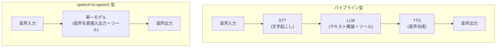

# 音声エージェントの実装

## この記事の目的

音声で対話しツールで行動するエージェントを実装するときの設計判断を扱います。2 つのアーキテクチャ(パイプライン型 / speech-to-speech 型)の選択、レイテンシ設計、ターンテイキングと割り込みの制御、ツール呼び出しとの統合、音声特有の評価を、自分の要件に合わせて組み立てられるようになります。

## 対象読者

- 電話・アプリの音声対話でタスクを遂行するエージェントを設計・実装するエンジニア
- テキストの Agent は動いているが、音声化でレイテンシ・会話制御の壁に当たっているエンジニア

## 前提知識

- [ストリーミングと Agent の UX 実装パターン](streaming-and-agent-ux.md) — 体感レイテンシを下げる基本技術(音声ではさらに重要)
- [ツール使用](../01-concepts/tool-use.md) — 音声会話中の行動もツール呼び出しで表現される
- ライブラリ外の前提: 音声認識(STT)・音声合成(TTS)が何をするかの概要

## 本文

### 概要: テキストとの差分は「沈黙」「ターン」「中間テキスト」

音声エージェントの実装は、テキストの Agent に 3 つの新しい問題が加わったものです。

1. **沈黙が失敗に見える**: テキストなら数秒の待ちは許容されますが、音声の沈黙は「壊れた」と感じられます。レイテンシ管理が体験の中心になります
2. **ターンテイキング**: 「誰が話す番か」をシステムが判定する必要があります。ユーザーが話し終えた検出と、話し始めたときの割り込み処理という、テキストにない制御問題です
3. **中間テキストの有無**: 構成によっては「文字起こし → テキスト推論」という中間テキストが存在せず、ガードレール・監査・デバッグの制御点が変わります

### 2 つのアーキテクチャ

| 観点 | パイプライン型(STT → LLM → TTS) | speech-to-speech 型(realtime) |
| --- | --- | --- |
| レイテンシ | 3 段の遅延が積み上がる(ストリーミングで緩和) | 段間の往復がなく、最初の音声までが速い |
| 制御性 | 各段のテキストが取れる。ポリシーチェック・承認ゲート・決定的な分岐を挟みやすい | 中間テキストの制御点が減る(監査はトランスクリプト取得で補う) |
| 既存資産 | テキスト Agent のプロンプト・評価・ガードレールを再利用できる | 音声モデル向けに調整し直す部分が出る |
| 会話の自然さ | ターン検出・割り込みを自前(またはミドルウェア)で組む | 割り込み・ターンテイキングが API 標準機能 |
| 部品の差し替え | STT・LLM・TTS を個別に選定・交換できる | モデルとベンダーに一体で依存する |

選択の目安です。**電話応対のような自然な会話体験が主目的**で、割り込みへの即応が要るなら speech-to-speech 型が有利です。**各段の可視性が必須**(発話前のポリシーチェック、承認ゲート、確定的な会話ログ)な業務や、**既存のテキスト Agent を音声化**する場合はパイプライン型が堅実です。2026-07 時点では、speech-to-speech の API は主要ベンダーの一部が一般提供・一部がプレビュー段階で、パイプライン型を公式の想定構成とするベンダーもあります。提供状況は変化が速いため、選定時に各社公式ドキュメントで確認してください(調査記録: `research/professional/voice-agents.md`)。

なお両者は排他ではありません。「検証はパイプライン型で始めて資産(プロンプト・評価)を作り、体験要件が確認できたら speech-to-speech に載せ替える」という段階的な進め方も現実的です。

### レイテンシ設計

音声の主要指標は **first-audio latency(ユーザーが話し終えてから、最初の音声が返るまで)** です。合計処理時間より「最初の音が出るまで」が体感を決めます。

- **パイプライン型は「全段ストリーミング」が定石**: STT の逐次確定 → LLM のストリーミング出力を文単位で区切る → 文ごとに TTS へ流す、という構成で、全文完成を待たずに話し始められます。体感レイテンシを 3 割前後下げた公式実測例もあります([ストリーミングと Agent の UX 実装パターン](streaming-and-agent-ux.md)の音声版です)
- **段ごとに計測する**: STT 確定まで・LLM の最初のトークンまで・TTS の最初の音声チャンクまで、を分けて計測し、どこがボトルネックかを特定します。平均でなく分布(p95)で管理します
- **接続方式**: ブラウザ・モバイルなどクライアント直結は WebRTC、サーバー間は WebSocket、という使い分けが公式に案内されています。電話は SIP 接続や電話基盤(CPaaS)経由の統合が提供されており、自前で音声搬送を作る必要はほぼありません(2026-07 時点)
- **沈黙を埋める**: 処理が長引く場面では、つなぎの発話(「確認しますね」)で沈黙を埋めます。次節のツール実行と組み合わせて設計します

### 会話制御: ターン検出と割り込み

- **ターン検出(ユーザーが話し終えたか)**: 音声活動検出(VAD: voice activity detection)が基本で、無音の長さで区切る方式と、発話内容から「言い終えた」確率を推定する方式(セマンティック VAD)があります。感度は **「早すぎる割り込み」と「応答の遅さ」のトレードオフ**で、無音しきい値・感度のパラメータをユースケースに合わせて調整します(考えながら話すユーザーが多い業務では長めに、テンポ重視の案内では短めに)
- **割り込み(barge-in)**: モデルの発話中にユーザーが話し始めたら、進行中の生成・再生をキャンセルします。speech-to-speech API は標準機能として提供します。注意点は**履歴のずれ**です — モデルが「話したつもり」の内容とユーザーに実際に届いた内容(割り込みで途中まで)が食い違うため、未再生分を切り詰めて履歴を実際に届いた範囲に揃える処理が要ります
- **手動ターン制御**: 騒音環境や確実性重視の業務では、自動検出をやめて明示的な操作(押して話す)にする選択肢もあります

### ツール使用との統合

音声エージェントも行動はツール呼び出しです。音声固有の設計点は次のとおりです。

- **音声セッション中の function calling**: 主要な speech-to-speech API はリアルタイムセッション中のツール呼び出しに対応しています(2026-07 時点)。パイプライン型では LLM 段で通常どおりツールを使います
- **ツール実行中の沈黙**: 数秒かかるツールの間、無言だと体験が壊れます。対策は (1) 実行前にひとこと発話(「調べますね」)、(2) ツール実行中も会話を継続できる非同期ツール実行(対応 API がある)、(3) 長い処理は「調べて折り返します」で会話を閉じ、完了後に通知する([非同期・長時間タスクの設計(耐久実行)](../02-architecture/async-and-durable-agents.md)への接続)
- **高リスク操作の承認を音声だけにしない**: 「はい」の一言を不可逆操作(送金・解約)の承認にすると、聞き間違い・言い間違い・本人性の問題を抱えます。金額や対象の**復唱確認**を最低限とし、リスクが高い操作は別チャネル(アプリ・SMS)での確認を挟みます([Human-in-the-Loop 設計](../02-architecture/human-in-the-loop.md))

### 音声特有の評価

テキストの評価([Agent 評価の基礎](../04-evaluation/agent-evaluation-basics.md))に、音声ならではの軸が加わります。

| 評価軸 | 見るもの | 測り方 |
| --- | --- | --- |
| タスク成功 | 用件が解決したか | テキストと同じ(トランスクリプトと最終状態で判定) |
| 認識・了解性 | STT の誤認識、応答の聞き取りやすさ | 誤認識率の計測、人手サンプリング |
| 応答速度 | first-audio latency | 分布(p95)で監視 |
| 会話制御の品質 | 誤割り込み(考え中に被せる)、応答の待たせすぎ | 誤割り込み率・ターン間隔の計測 + 人手確認 |

実装上の要点は、**speech-to-speech でも必ずトランスクリプト(文字起こし)を記録する**ことです。トランスクリプトがあれば、既存の評価資産(LLM-as-a-Judge・回帰テスト)と監査・デバッグの多くをテキストと同じ道具で回せます([可観測性とトレーシング](../05-operations/observability-and-tracing.md))。評価セットには、静かな環境のきれいな発話だけでなく、実環境の入力(騒音・言い直し・方言・電話品質)を含めます。

## 実務での注意点

### アンチパターン

- **テキスト Agent の応答をそのまま読み上げる** → 箇条書き・長文・URL の読み上げは音声では聞くに堪えない → 「短く・一度に 1 つ・確認を挟む」音声向けの応答スタイルをプロンプトで指定する
- **レイテンシを合計時間の平均で管理する** → 体感を決める first-audio latency の悪化を見逃す → first-audio latency を段ごと・分布(p95)で計測する
- **VAD・ターン検出を既定値のまま運用する** → ユーザー層に合わず、考え中に被せる・待たせすぎるが多発する → 誤割り込み率と応答遅延を測りながら感度を調整する
- **ツール実行中に無言で待たせる** → 沈黙が故障と受け取られ、切られる・言い直される → つなぎ発話・非同期ツール・折り返し設計で沈黙を埋める
- **音声の「はい」だけで不可逆操作を実行する** → 聞き間違い・本人性の問題で事故になる → 復唱確認と、高リスク操作の別チャネル承認を設計する
- **トランスクリプトを残さない** → デバッグ・評価・監査がすべて不可能になる → speech-to-speech でも文字起こしを記録し、テキストの評価資産に接続する

### チェックリスト

- [ ] アーキテクチャ(パイプライン / speech-to-speech)の選択理由を制御性・レイテンシ・既存資産の観点で説明できる
- [ ] first-audio latency を段ごと・分布で計測している
- [ ] パイプライン型なら全段ストリーミング(文単位の TTS 送り)になっている
- [ ] ターン検出の感度をユースケースに合わせて調整し、誤割り込み率を測っている
- [ ] 割り込み時に未再生分を切り詰め、履歴を実際に届いた内容と揃えている
- [ ] ツール実行中の沈黙対策(つなぎ発話・非同期・折り返し)がある
- [ ] 不可逆操作に復唱確認・別チャネル承認がある
- [ ] トランスクリプトを記録し、評価・監査に使える形にしている
- [ ] 評価セットに実環境の入力(騒音・言い直し・電話品質)が含まれている

## 関連トピック

- [ストリーミングと Agent の UX 実装パターン](streaming-and-agent-ux.md) — 体感レイテンシ設計の土台(本記事はその音声版)
- [Human-in-the-Loop 設計](../02-architecture/human-in-the-loop.md) — 音声だけに頼らない承認の設計
- [非同期・長時間タスクの設計(耐久実行)](../02-architecture/async-and-durable-agents.md) — 「折り返します」型の長いタスクの永続化
- [Agent 評価の基礎](../04-evaluation/agent-evaluation-basics.md) — トランスクリプトに適用する評価の土台
- [可観測性とトレーシング](../05-operations/observability-and-tracing.md) — トランスクリプト・レイテンシの記録

## 参考資料

- [Voice agents(OpenAI)](https://developers.openai.com/api/docs/guides/voice-agents) — speech-to-speech とパイプラインの 2 択整理と使い分けの公式ガイド(アクセス日: 2026-07-07)
- [Gemini Live API(Google)](https://ai.google.dev/gemini-api/docs/live-api) — リアルタイム音声対話 API の例(2026-07 時点で Preview)(アクセス日: 2026-07-07)
- [Amazon Nova speech-to-speech(AWS)](https://docs.aws.amazon.com/nova/latest/nova2-userguide/using-conversational-speech.html) — 双方向ストリームと非同期ツール実行の例(アクセス日: 2026-07-07)
- [Low-latency voice assistant with ElevenLabs + Claude(Anthropic Cookbook)](https://platform.claude.com/cookbook/third-party-elevenlabs-low-latency-stt-claude-tts) — パイプライン型の実装とレイテンシ実測の公式例(アクセス日: 2026-07-07)

## TODO・未確認事項

> **TODO(要確認):** 各社のリアルタイム音声 API の提供状況(GA / Preview)・モデル名・セッション上限・電話統合の対応先は変化が速い。選定時に各社公式ドキュメントで最新を確認する(一次情報の記録: `research/professional/voice-agents.md`)(最終確認: 2026-07)
