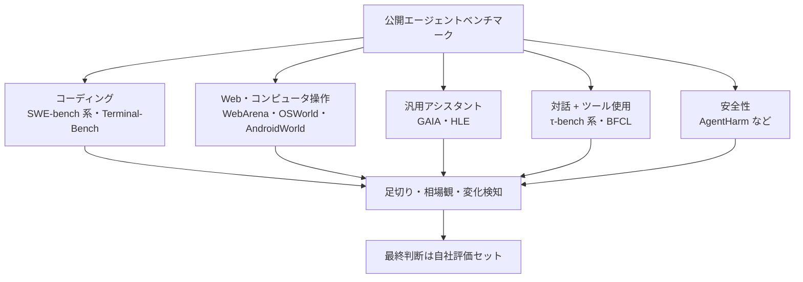

# エージェントベンチマークの全体像

## この記事の目的

エージェントの能力を測る公開ベンチマークの地図(どのカテゴリのベンチマークが何を測るか)と、スコアの読み方(ハーネス依存・試行ばらつき・汚染・飽和・自己報告と第三者実測の区別)を身につけ、モデル・エージェント選定の参考情報として正しく使えるようになります。中心メッセージは 1 つです — **ベンチマークは地図であって、自社品質の保証ではありません**。

**本記事は鮮度リスクの高いページです。** ベンチマークの顔ぶれ・飽和状況・リーダーボードの運用状態は月単位で変わるため、引用の際は必ず本文冒頭の最終確認日と各公式ページを確認してください。

## 対象読者

- モデルやエージェント製品の選定・比較でベンチマークスコアを引用・解釈するエンジニア
- 「ベンチマーク 1 位」という宣伝文句を検証できるようになりたいテックリード・意思決定者

## 前提知識

- [Agent 評価の基礎](agent-evaluation-basics.md) — 自社タスクの評価設計(本記事はその外側にある公開ベンチマークを扱います)
- [モデル選定ガイド](../03-implementation/model-selection.md) — ベンチマークが選定判断のどこに位置づくか

## 本文

> **最終確認日:** 2026-07-07 — 本記事のベンチマークの顔ぶれ・状態はこの日付時点の各公式ページ・原論文に基づきます。具体的なスコア数値は転記せず、飽和状況などの傾向のみ記載します(出典と数値帯はリポジトリ内 `research/professional/benchmarks.md` の調査メモを参照)。

### 概要: ベンチマークの 3 つの正しい用途

公開ベンチマークが答えられるのは「このモデル・エージェントは、そのベンチマークのタスク分布で、その実行条件なら、どの程度できるか」だけです。自社タスクの分布は必ずそれと異なるため、自社品質は自前の評価データセットで測るのが正です([Agent 評価の基礎](agent-evaluation-basics.md))。そのうえで、ベンチマークには 3 つの正しい用途があります。

1. **候補の足切り**: 明らかに水準未満の候補を早期に除外する
2. **相場観**: 「業界の最前線がどの水準まで来たか」「何がまだ難しいか」を把握する
3. **能力の変化検知**: 新モデル登場時に、自社評価を回す価値があるかの一次判断

### カテゴリ別の地図(2026-07 時点)

| カテゴリ | 代表 | 何を測るか | 2026-07 時点の状態 |
| --- | --- | --- | --- |
| コーディング | SWE-bench ファミリー、Terminal-Bench | 実 GitHub Issue の修正パッチ生成(テストで自動判定)、ターミナル環境での実作業全般 | 人手検証版(Verified)は飽和と信頼性低下が指摘され、より難しい派生(Pro など)と Terminal-Bench 系へ重心が移行中 |
| Web 操作 | WebArena / VisualWebArena、Mind2Web 系 | 複製・実サイト上のタスク遂行(実行結果で自動判定) | WebArena は人間ベースラインに肉薄しほぼ飽和。ライブ評価型・長時間探索型の後継へ移行中 |
| コンピュータ操作 | OSWorld、AndroidWorld | 実 OS・実アプリ上の GUI 操作(実行ベース検証) | 検証版は人間ベースライン超えが報告され、長時間ワークフロー版(OSWorld 2.0)へ移行。新版はまだ大幅な余地 |
| 汎用アシスタント | GAIA、Humanity's Last Exam(HLE) | ツール活用を要する実世界質問、専門知識の限界試験 | GAIA は飽和し動的環境の後継(GAIA2)へ。HLE は余地が残るが正解自体への疑義も報告されている |
| 対話 + ツール使用 | τ-bench ファミリー、BFCL | ユーザーとの対話の中でポリシーに従いツールを使う能力(会話終了時の状態で自動判定)、関数呼び出しの正確さ | τ 系はタスク修正を経た新版(τ³)へ移行。BFCL はエージェント能力(検索・メモリ)へ拡張し更新継続 |
| 安全性 | AgentHarm など | 有害タスクの拒否と、攻撃後にエージェント能力が保持されるか | 発展途上。評価対象のエージェントの多くが低スコアという報告が続く |

このほか、ML 実務(MLE-bench)・研究再現(PaperBench)・情報探索(BrowseComp)など特化型が多数あります。2025〜2026 年に共通するパターンは「**飽和 → より難しく・長時間・動的な後継版へ改訂**」です(SWE-bench → Pro、OSWorld → 2.0、Mind2Web → 2、GAIA → GAIA2、τ-bench → τ³)。ベンチマーク名は単体ではなく「ファミリー名 + 版」で読み、どの版のスコアかを必ず確認してください。

### 読み方 1: スコアは「モデル × ハーネス」の値

エージェントベンチマークのスコアは、モデル単体ではなく**モデルとスキャフォールド(scaffold。ループ・ツール・リトライ戦略などのハーネス構成)の組**に付きます。同一モデルでも、最小構成のハーネスと、並列複数試行 + 結果選択のような最適化ハーネスでは、スコアが数ポイントから数十ポイント変わることが公式資料・研究の両方で示されています。同じベンチマークでも、統一ハーネスによる実測の上位帯と、各社の最適化ハーネスによる自己報告の集約とで大きく乖離している例もあります。

だからこそ、**誰がどの条件で実行したスコアか**が数値そのものより重要です。

| 実行主体 | 例 | 読み方 |
| --- | --- | --- |
| 第三者の統一実測 | HAL(Princeton)、検証制度付きの公式リーダーボード | 横比較に使える。ただし「最適化すればもっと出る」方向の余地がある |
| ベンダー自己報告 | モデル発表資料のスコア | そのベンダーの最適条件での上限値として読む。他社との直接比較には条件確認が必須 |
| 自己申告の集約 | 提出ベースのリーダーボード・集約サイト | ハーネスも検証水準もばらばら。傾向把握のみに使う |
| 人間の選好投票 | Arena(旧 LMArena)系 | 能力の実測ではなく「人がどちらを好むか」。タスク成功率とは別物 |

### 読み方 2: 試行ばらつきと信頼性

エージェントは同じタスクでも試行ごとに成否が揺れます。通常報告される pass@1(1 回試行の成功率)に対し、τ-bench が導入した pass^k は「k 回**すべて**成功する確率」で、業務の信頼性に近いのはこちらです。同成功率でも pass^k は大きく下がることが示されており、「8 割できる」と「8 割を安定してできる」は別物です。複数回実行の平均やばらつきを報告するリーダーボードは少数派なので、1 回実行のスコア差が数ポイントなら「誤差の範囲かもしれない」と読むのが安全です。

### 読み方 3: 汚染・飽和・ベンチマーク自体の品質

- **汚染(contamination)**: 公開リポジトリ・公開問題から作られたベンチマークは、モデルの学習データに混入しえます。「問題文を見ただけで該当ファイルを言い当てる」といった記憶の証拠も報告されています。対策として、非公開のホールドアウトセット(hold-out set)を持つ設計や、新しい問題を継続追加して日付でフィルタできる設計のベンチマークが増えており、汚染耐性のある版のスコアを優先して見ます
- **飽和**: 人間ベースラインに到達・超過したベンチマークでは、上位モデル間の差が出ず、残る差は汚染・ハーネス・採点ノイズの影響を強く受けます。飽和したベンチマークの順位で最新モデルを比較しない、が原則です
- **ベンチマーク自体の品質**: 問題文の曖昧さ・不当に厳しいテスト・正解の誤りは、有名ベンチマークでも大量に見つかってきました(人手検証で元データの約 7 割が除外されたと報告される例、タスク修正でスコアが 2 桁ポイント動いた例があります)。数ポイントのスコア差は、モデルの実力差ではなくベンチマーク品質のノイズである可能性を常に考慮します

### 読み方 4: コストの軸を足す

精度だけの比較は、「わずかに高精度だが桁違いに高コスト」なエージェントを過大評価します。コスト × スコアの 2 軸 — パレートフロンティア(Pareto frontier)— で表示するリーダーボードを優先して参照し、自社の選定でも「成功あたりコスト」で比較します([コスト管理](../05-operations/cost-management.md)・[モデル選定ガイド](../03-implementation/model-selection.md)の判断軸と同じです)。

### 実務での使い方: 3 段階のフィルタ

1. **自タスクに近いカテゴリで足切り**: カスタマー対応エージェントなら τ 系、社内 PC 操作の自動化なら OSWorld 系、というように、自社タスクと同じ「型」のベンチマークを見ます。関係の薄いカテゴリの高スコアは判断材料になりません
2. **第三者実測で相場観を補正**: 自己報告値しかない場合は、第三者実測系(HAL・検証制度付きリーダーボード・独立評価サイト)で水準感を補正します
3. **最終判断は自社評価セット**: 候補を 2〜3 に絞ったら、自社の評価データセット([評価データセットの構築と保守](evaluation-datasets.md))での測定で決めます。ベンチマークで決めてよいのは「試す順番」までです

コーディングエージェント(ツール製品)の選定という文脈でのベンチマークの読み方は、[コーディングエージェントの評価](../08-coding-agents/coding-agent-evaluation.md)が具体的に扱っています。

## 実務での注意点

### アンチパターン

- **ベンダー自己報告のスコアと統一条件の実測を並べて比較する** → ハーネス差で数十ポイント単位のずれがあり、比較が成立しない → 実行主体と条件を確認し、同一条件の値どうしで比べる
- **数ポイントのスコア差でモデルの優劣を断定する** → 試行ばらつきとベンチマーク品質のノイズに埋もれる差である可能性が高い → 帯で読み、複数のベンチマーク・第三者実測で傾向を確認する
- **飽和したベンチマークの順位で最新モデルを選ぶ** → 上限に張り付いた領域の差は実力差を反映しない → 後継版・汚染耐性のある版・未飽和のカテゴリを見る
- **ベンチマークのスコアで自社タスクの品質を推定する** → タスク分布が異なり、順位は自社評価で入れ替わる → 自前の評価データセットでの測定を正とする([Agent 評価の基礎](agent-evaluation-basics.md))
- **古い記事・発表資料のスコアを確認せず引用する** → 顔ぶれ・版・スコアは月単位で変わっている → 最終確認日を確かめ、公式リーダーボードの現在値を見る

### チェックリスト

- [ ] 引用するスコアの実行主体(自己報告/第三者実測/選好投票)と条件(ハーネス・試行回数・版)を確認した
- [ ] 自社タスクに最も近いカテゴリのベンチマークを選んで見ている
- [ ] スコアを点ではなく帯として、複数ソースで読んでいる
- [ ] 飽和・汚染の状況(人間ベースライン比・後継版の有無)を確認した
- [ ] コスト軸(成功あたりコスト)も併せて比較した
- [ ] 最終判断は自社評価セットで行う計画になっている

## 関連トピック

- [Agent 評価の基礎](agent-evaluation-basics.md) — 自社評価の設計(本記事の「最終判断」の実体)
- [評価データセットの構築と保守](evaluation-datasets.md) — 自社版ベンチマークの作り方(汚染防止の考え方は自社評価にも適用できます)
- [モデル選定ガイド](../03-implementation/model-selection.md) — ベンチマークを選定判断に位置づける側
- [コーディングエージェントの評価](../08-coding-agents/coding-agent-evaluation.md) — ツール製品選定の文脈でのベンチマークの読み方
- [ハーネスエンジニアリング](../02-architecture/harness-engineering.md) — ハーネス依存という読み方を「設計側」から扱う記事
- [AI 出力の検証習慣](../15-human-ai/verifying-ai-outputs.md) — ベンチマークの高スコアを鵜呑みにしない個人の検証習慣(汚染の割り引き)
- [AI 情報の追い方(一次情報の目利き)](../00-overview/research-literacy.md) — ベンチマークの読み方を情報源全般の目利きに一般化(自己報告・ハイプの割り引き)

## 参考資料

- [SWE-bench 公式サイト](https://www.swebench.com/) — コーディング系の代表ファミリー(Lite / Verified / Multilingual / Multimodal)の正本(アクセス日: 2026-07-07)
- [Terminal-Bench](https://www.tbench.ai/) — ターミナル作業ベンチマークと検証付きリーダーボード(アクセス日: 2026-07-07)
- [OSWorld](https://osworld-v1.xlang.ai/) — コンピュータ操作の実行ベース評価(Verified・2.0 への経緯を含む)(アクセス日: 2026-07-07)
- [GAIA: A Benchmark for General AI Assistants(arXiv)](https://arxiv.org/abs/2311.12983) — 汎用アシスタント評価の代表(アクセス日: 2026-07-07)
- [Humanity's Last Exam](https://lastexam.ai/) — 専門知識の限界試験とホールドアウト設計(アクセス日: 2026-07-07)
- [τ-bench(arXiv)](https://arxiv.org/abs/2406.12045) — 対話 + ツール使用と pass^k(信頼性)指標の原典(アクセス日: 2026-07-07)
- [Holistic Agent Leaderboard(Princeton HAL)](https://hal.cs.princeton.edu/) — 第三者統一実測 + コスト × スコア表示の代表(アクセス日: 2026-07-07)
- [AI Agents That Matter(arXiv)](https://arxiv.org/abs/2407.01502) — コスト軸・ホールドアウト・標準化というベンチマーク批判の主要論文(アクセス日: 2026-07-07)

## TODO・未確認事項

- 一部のベンダー公式ブログ(スコア発表・ベンチマーク評価方針の告知)は取得制限により一次ページを直接確認できておらず、ミラー・複数の二次情報に基づいています(内訳は `research/professional/benchmarks.md`)

### 変わりやすい項目(定点観測)

> **TODO(要確認):** カテゴリ別の代表ベンチマークの顔ぶれ・飽和状況・リーダーボードの運用状態を、四半期ごとに各公式ページで再確認する(`research/professional/benchmarks.md` を更新起点にする)。直近の注目: SWE-bench Pro / Terminal-Bench 2.x への重心移行の定着、OSWorld 2.0・GAIA2・τ³-bench のスコア推移、HAL の対象ベンチマーク拡大(最終確認: 2026-07)
