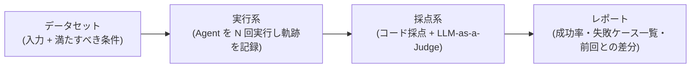

# Agent 評価の基礎

## この記事の目的

「作ったが品質が分からない」状態を脱するために、Agent の評価を **何を測るか(評価対象)・どう採点するか(採点方法)・何で測るか(データセット)** の 3 つの設計判断に分解して組み立てられるようになります。本セクション(04-evaluation)の他の記事すべての前提になります。

## 対象読者

- Agent のプロトタイプはできたが、本番投入を判断する基準を持っていないエンジニア
- 「デモでは動く」と「品質が分かっている」の差を埋めたいテックリード

## 前提知識

- [Agent ループ](../01-concepts/agent-loop.md) — 評価対象となる実行構造
- [Workflow 型 vs Agent 型の使い分け](../02-architecture/workflow-vs-agent.md) — 評価の難しさは自律度に比例します

## 本文

### 概要: なぜ Agent の評価は普通のテストより難しいか

`assert 出力 == 期待値` が成立しない理由が 4 つ重なっているためです。

1. **非決定性** — 同じ入力でも実行ごとに出力・経路が変わります(temperature を下げても消えません)
2. **経路の自由度** — 正解にたどり着く手順が 1 つに定まりません
3. **開放的な出力** — 文章での回答は文字列一致で正誤判定できません
4. **多段の複合** — 失敗の原因がどのステップにあるか、最終出力だけでは分かりません

この 4 つに対応するのが、本文で扱う複数回実行・不変条件による評価・LLM-as-a-Judge・軌跡評価という道具立てです。

### 詳細: 評価対象の 3 層

| 層 | 見るもの | 例 | 主な用途 |
| --- | --- | --- | --- |
| 最終成果(outcome) | タスクが達成されたか | 回答が正しい。あるべき最終状態(DB・チケット)になっている | 投入判断・リリースゲート |
| 軌跡(trajectory) | 途中の経路 | 適切なツールを適切な引数で、無駄なく安全に呼んだか | デバッグ・安全性の検証 |
| 単一ステップ(component) | 部品単体 | 検索の再現率、分類の正答率、ツール実装の動作 | 原因の切り分け・高速な改善反復 |

原則は「**判断にはまず最終成果、原因究明には軌跡、改善の反復には部品**」です。軌跡の詳細は [軌跡(trajectory)評価](trajectory-evaluation.md) で扱います。

### 詳細: 採点方法の 3 分類

| 方法 | 仕組み | 長所 | 短所 |
| --- | --- | --- | --- |
| コードベース採点 | 決定的なロジックで判定(完全一致・正規表現・スキーマ検証・最終状態の検証) | 速い・安い・再現可能 | 開放的な出力を判定できない |
| LLM-as-a-Judge | 別の LLM に基準を与えて判定させる | 開放的な出力を扱える。スケールする | judge 自体の検証が必要。コスト・非決定性 |
| 人手評価 | 人間が判定する | 最も信頼できる基準 | 遅い・高い。継続実行に向かない |

三択ではなく組み合わせます。**コードで採点できるものは必ずコードで採点し**(judge に回さない)、開放的な出力だけを [LLM-as-a-Judge](llm-as-a-judge.md) に回し、人手は judge の検証と少数の重要ケースに集中させるのが基本形です。

### 詳細: 評価データセットの作り方

- **小さく始めます** — 20〜50 件で十分です。網羅性より「今日から回ること」を優先します
- **ソースは実際の失敗です** — 開発中に遭遇した失敗、ユーザーからの報告、本番ログが最良の供給源です(想像で書いたケースは実入力より簡単になりがちです)。本番データを使う場合は個人情報・秘密情報の除去を通します
- **期待値は「満たすべき条件」で書きます** — 「正解文字列」ではなく「金額 X が含まれる」「規定違反を指摘している」「書き込み操作をしていない」のような条件にします(経路の自由度・開放的出力への対応)
- **分布を意識します** — 正常系だけでなく、曖昧な依頼・情報不足の依頼・拒否すべき依頼を混ぜます
- **育て続けます** — 本番で見つかった失敗を修正と同時にケース化します([回帰テストと CI 組み込み](regression-testing.md))

### 詳細: 評価ハーネスの最小構成

評価ハーネス(evaluation harness)とは、評価を繰り返し実行可能にする仕組み一式のことです。最小構成は 4 つの部品です。

専用の評価プラットフォームやフレームワーク付属の機能もありますが、この 4 点セットは小規模なら自作でも十分に成立します。重要なのはツールの選択より「データセットと採点基準がチームの資産としてバージョン管理されていること」です。

### 設計判断: メトリクスの決め方

- **基本はケース単位の合格/不合格**、集計はスイート全体の成功率です。「品質スコア平均 7.2」のような 1 本の数値は、何が起きたか説明できず行動につながりません
- **非決定性には複数回実行**で対応します。重要ケースは 1 ケースを N 回(目安 3〜5 回)実行し、「1 回でも成功すればよい」タスクか「毎回成功すべき」タスクかで基準を変えます(後者は全回成功を要求します)
- **品質と同時にコスト・レイテンシ・ステップ数を記録します**。これを見ないと「成功率は 3 ポイント上がったがコストが 3 倍」を見逃します

### 設計判断: 開発フェーズ別の投資

| フェーズ | 評価への投資 |
| --- | --- |
| プロトタイプ | 目視 + 手元 10 ケース程度の再実行。この段階で重厚なハーネスは作らない |
| 投入前 | ハーネス + 50 件規模のデータセット + 関係者で合意した合格基準 |
| 運用中 | 本番ログからのケース追加、CI での回帰実行([回帰テストと CI 組み込み](regression-testing.md))、本番監視([可観測性とトレーシング](../05-operations/observability-and-tracing.md))との接続 |

## 実務での注意点

### アンチパターン

- **デモの成功で投入を判断する** → デモは成功しやすい入力を選んでおり、実運用の入力分布とずれている → 実入力に近い分布のデータセットで成功率を測ってから判断する
- **平均スコア 1 本で品質を管理する** → 数値が動いても理由が分からず、改善行動につながらない → ケース単位の合格/不合格と失敗ケースの一覧を一次情報にする
- **評価ケースを開発者の想像だけで書く** → 実ユーザーの入力は想像より曖昧・多様で、評価が実態より甘くなる → 実際の失敗・本番ログから採取する
- **公開ベンチマークのスコアで自タスクの品質を推定する** → ベンチマークの分布は自タスクと無関係で、順位は入れ替わる → 自前データセットでの測定を正とする

### チェックリスト

- [ ] いま測っているものが 3 層(最終成果・軌跡・部品)のどれか説明できる
- [ ] 各ケースの期待値が「満たすべき条件」で書かれている
- [ ] コードで採点できる部分がコード採点になっている(judge を無駄に使っていない)
- [ ] 重要ケースを複数回実行し、成功率で判定している
- [ ] 品質と同時にコスト・レイテンシを記録している
- [ ] データセットと採点基準がバージョン管理されている
- [ ] 本番の失敗をデータセットに追加する運用が決まっている

## 関連トピック

- [LLM-as-a-Judge](llm-as-a-judge.md) — 開放的な出力の採点方法の詳細
- [軌跡(trajectory)評価](trajectory-evaluation.md) — 途中経路の評価の詳細
- [回帰テストと CI 組み込み](regression-testing.md) — 評価を継続的に回す仕組み
- [オンライン評価と A/B テスト](online-evaluation-and-ab-testing.md) — 本番トラフィックで真の効果を確かめる評価
- [エージェントベンチマークの全体像](agent-benchmarks-landscape.md) — 自社評価の外側にある公開ベンチマークの地図と読み方
- [Agent ループ](../01-concepts/agent-loop.md) — 評価対象の実行構造
- [可観測性とトレーシング](../05-operations/observability-and-tracing.md) — 本番側の観測との接続
- [エージェント評価環境の構築](evaluation-environments.md) — 評価を実行する環境(モック・状態付きサンドボックス)の構築(発展層)
- [ユーザーシミュレータの設計](user-simulator-design.md) — 対話型 Agent の評価に使うユーザー役 LLM(発展層)
- [信頼度と較正(calibration)](confidence-and-calibration.md) — 確信度を取り出し低信頼時に縮退する(発展層)
- [公平性・バイアスの評価](fairness-and-bias-evaluation.md) — 属性・グループの品質差と偏りの評価(発展層)
- [日本語品質の評価](japanese-quality-evaluation.md) — 敬語・文体・表記など日本語固有の品質(発展層)

## 参考資料

- [Your AI Product Needs Evals(Hamel Husain)](https://hamel.dev/blog/posts/evals/) — 評価駆動での開発プロセスの実践的な解説(アクセス日: 2026-07-05)
- [Building Effective Agents(Anthropic)](https://www.anthropic.com/research/building-effective-agents) — 計測に基づいて複雑さを足すという本ライブラリ共通の原則(アクセス日: 2026-07-05)

## TODO・未確認事項

> **TODO(要確認):** 評価プラットフォーム・評価支援ツールの機能は変化が速いため、本文では意図的に個別製品に触れていない。選定時に各公式ドキュメントで確認する(最終確認: 2026-07)
