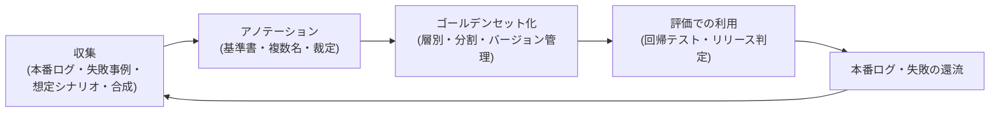

# 評価データセットの構築と保守

## この記事の目的

評価の信頼性はデータセットの質で決まります。本記事では、評価ケースをどこから集め、合成データをどこまで使い、アノテーションの品質をどう担保し、ゴールデンセットをどう設計・保守するかを判断できるようになります。[Agent 評価の基礎](agent-evaluation-basics.md)が評価ハーネスの全体像を扱うのに対し、本記事はその中の「データセット」部分を深掘りする実装編です。

## 対象読者

- 評価ハーネスは作ったが、ケース数と質が足りず判断に使えない状態のエンジニア
- 複数案件で使い回せる評価基盤・アノテーション運用を整備するテックリード・評価担当

## 前提知識

- [Agent 評価の基礎](agent-evaluation-basics.md) — データセット・実行系・採点系・レポートという評価ハーネスの 4 要素
- [回帰テストと CI 組み込み](regression-testing.md) — データセットの主要な使い先
- [LLM-as-a-Judge](llm-as-a-judge.md) — 人手ラベルとの一致率測定に本記事のアノテーションを使う

## 本文

### 概要: データセットは「作る」ではなく「育てる」

評価データセットは一度作って終わりの成果物ではなく、本番の失敗を取り込みながら育てる循環資産です。全体のライフサイクルは次のとおりです。

最初から大規模を狙う必要はありません。10〜50 件の質の高いケースで回し始め、本番の失敗が出るたびに追加する方が、最初に 1,000 件の雑なケースを作るより判断に役立ちます。

### 収集源と選び方

評価ケースの収集源は 4 つで、それぞれ役割が違います。

| 収集源 | 強み | 注意点 |
| --- | --- | --- |
| 本番ログ(実際の入力) | 実際の入力分布を代表する。想定外の言い回し・入力の乱れを含む | 個人情報・機微情報のマスキングが必須。ログ利用の方針を関係部門と合意する |
| 失敗事例(インシデント・修正記録・クレーム) | 「二度と起こしたくない」ケースの再発防止に直結する | 件数が偏る(失敗ばかり)。正常系と混ぜて分布を保つ |
| 想定シナリオ(設計者が書き起こす) | リリース前でログがなくても作れる。エッジケースを意図的に置ける | 設計者の想像力の範囲に閉じる(ハッピーパス偏重になりやすい) |
| 合成データ(LLM に生成させる) | 量とバリエーションを安く稼げる | 次節の危険を理解して使う |

リリース前は「想定シナリオ + 合成」で始め、リリース後は「本番ログ + 失敗事例」へ重心を移すのが基本の流れです。本番ログから拾うときは、無作為抽出だけでなく、品質シグナル(利用者の修正・再試行・低評価)が立ったケースを優先的に取り込みます。

### 合成データの使いどころと危険

合成データ(LLM に評価用の入力を生成させる手法)は、正しく使えば強力ですが、無自覚に使うと「高スコアなのに本番で使えない」評価を作ります。

**使いどころ**:

- 実データの言い換え・バリエーション展開(1 つの実ケースから表現違いを 10 件作る)
- レアケース・境界条件の補完(実ログにはまだ現れていないが起こり得る入力)
- 個人情報を含む実ログを使えない場面での代替(実在情報を含まない類似ケースを合成)

**危険と対策**:

- **分布の偏り**: 生成された入力は「LLM が書きがちな整った文」に寄り、実際の利用者の乱れた入力(誤字・省略・混合言語)を代表しません → 実ログの文体を例示して生成させ、それでも実データの代替ではなく補完と位置づけます
- **盲点の共有**: 評価対象と同系のモデルで生成すると、モデルが苦手なケースはそもそも生成されにくく、評価が甘くなります → 生成には別系統のモデルを使う、人がエッジケースを設計して混ぜる、という対策をとります
- **正解ラベルの信頼性**: 入力と一緒に「期待する答え」まで生成させると、正解自体が間違っていることがあります → 合成ケースの正解は人がレビューしてから採用します

### アノテーションと品質

アノテーション(評価ケースへの正解・合否ラベル付け)の品質管理は、従来の機械学習と同じ規律が必要です。

1. **基準書(ルーブリック)を書く**: 「何を合格とするか」を判定例付きで文書化します。基準書なしの複数人ラベルは、人によって判定が割れて使いものになりません
2. **複数名で一致率を測る**: 重要なラベルは 2 名以上で独立に付け、一致率を確認します。一致率が低いのはアノテーターの問題ではなく、基準書が曖昧なサインです
3. **不一致の裁定プロセスを決める**: 割れたケースは第三者(業務有識者)が裁定し、裁定結果を基準書へ判定例として還元します
4. **専門知識の必要性を見極める**: 業務固有の正しさ(規定・医療・法務など)はエンジニアだけでラベル付けせず、業務側の有識者をアノテーションに巻き込みます

このアノテーションは、[LLM-as-a-Judge](llm-as-a-judge.md) を導入する際の「judge と人手ラベルの一致率測定」にそのまま使えます。人手ラベルの品質が低いと、judge の検証もできません。

### ゴールデンセットの設計

ゴールデンセット(golden set)とは、正解・合格基準がアノテーション済みで、リリース判定や回帰テストの基準として維持される評価ケース集合です。設計のポイントは規模より **層別と分割** です。

- **層別(stratification)**: タスク種別・難易度・入力の長さ・正常系/異常系などの軸でケースを分類し、各層に最低限のケース数を確保します。層別のない 1,000 件より、層別された 100 件の方が「どこが壊れたか」が分かります
- **規模の目安**: 開発中のスモークテストは 10〜20 件、CI の回帰テストは 100〜300 件、リリース判定はさらに厚く、が出発点です(規模は 1 ケースあたりの実行コストとの相談で決めます。[回帰テストと CI 組み込み](regression-testing.md) の段階的実行と組み合わせます)
- **開発用と判定用を分ける**: プロンプト調整に使うセット(開発セット)と、リリース判定に使うセット(判定セット)を分けます。同じセットで調整と判定を行うと、そのセットに過適合した「見かけの改善」を検出できません
- **汚染(contamination)を防ぐ**: 評価ケースやその正解が、システムプロンプト・few-shot 例・RAG の知識ソースに紛れ込むと、評価は「カンニング済みの試験」になります。評価データの置き場所と参照経路を分離し、公開ベンチマーク由来の問題は「モデルの学習データに含まれている可能性がある」前提で扱います

### 保守と陳腐化対策

データセットは業務・システムの変化で静かに陳腐化します。作りっぱなしを防ぐ運用を最初から組み込みます。

- **定期的な棚卸し**: 業務ルールの変更(規定改定・仕様変更)で正解が変わったケースを更新・廃止します。「正解が古い評価セット」は誤った不合格(または合格)を出し続けます
- **失敗の還流を仕組みにする**: 本番で見つかった失敗・インシデントは、修正と同時に評価ケース化して追加します(再発防止の回帰ケース)。「インシデント対応の完了条件に評価ケース追加を含める」と決めておくと漏れません
- **バージョン管理**: データセット自体をコードと同様にバージョン管理し、変更履歴(追加・修正・廃止の理由)を残します。スコアの推移を比較するには「どの版のデータセットで測ったか」が特定できる必要があります
- **飽和の検知**: 全ケースが常に合格する状態が続いたら、データセットが簡単すぎるサインです。難しい層(失敗還流・エッジケース)を補充します

## 実務での注意点

### アンチパターン

- **整った合成データだけで高スコアを出して安心する** → 実際の利用者の乱れた入力で崩れる → 本番ログ・失敗事例を必ず混ぜ、合成は補完と位置づける
- **同じ評価セットでプロンプト調整とリリース判定を行う** → セットへの過適合で「見かけの改善」が起き、本番品質と乖離する → 開発セットと判定セットを分割する
- **基準書なしで複数人にラベル付けを頼む** → 判定が人によって割れ、どのラベルも信用できなくなる → ルーブリックと判定例を先に書き、一致率で基準書の曖昧さを検出する
- **データセットを作りっぱなしにする** → 業務変更で正解が古くなり、評価が形骸化する → 棚卸しと失敗還流を運用サイクル(完了条件)に組み込む
- **件数だけを追う** → 層の偏った大量ケースは「どこが壊れたか」を教えてくれない → 層別を先に設計し、各層の最小件数を確保してから増やす

### チェックリスト

- [ ] 収集源(本番ログ・失敗事例・想定シナリオ・合成)の構成比を意図して決めている
- [ ] 本番ログの利用について、個人情報のマスキングと利用方針を関係部門と合意した
- [ ] 合成データは別系統モデルまたは人手設計で盲点を補い、正解は人がレビューしている
- [ ] アノテーション基準書(判定例付き)があり、重要ラベルは複数名の一致率を測った
- [ ] ゴールデンセットが層別され、開発用と判定用が分割されている
- [ ] 評価ケースがプロンプト・few-shot 例・知識ソースへ混入しない分離ができている
- [ ] データセットがバージョン管理され、変更理由が追跡できる
- [ ] 本番の失敗を評価ケース化する還流プロセスが完了条件に組み込まれている

## 関連トピック

- [Agent 評価の基礎](agent-evaluation-basics.md) — 評価ハーネス全体の中でのデータセットの位置づけ
- [回帰テストと CI 組み込み](regression-testing.md) — ゴールデンセットの主要な使い先と段階的実行
- [LLM-as-a-Judge](llm-as-a-judge.md) — 人手アノテーションを judge 検証に使う方法
- [軌跡(trajectory)評価](trajectory-evaluation.md) — 最終出力ラベルに加えて過程を評価する場合のケース設計
- [RAG 実装パターン](../03-implementation/rag-implementation-patterns.md) — 検索(recall@k)用の質問・正解チャンク対応表の作り方
- [PoC から本番への進め方](../09-business/poc-to-production.md) — PoC から本番へ持ち越す最重要資産としての評価データセット
- [学習用合成データの実務](../03-implementation/synthetic-data-for-training.md) — 学習用の合成データ(本記事の評価用と厳格に分離する)

## 参考資料

- [openai/evals(GitHub)](https://github.com/openai/evals) — 評価ハーネスと評価ケース記述形式の代表的なオープンソース実装(アクセス日: 2026-07-06)

## TODO・未確認事項

なし
