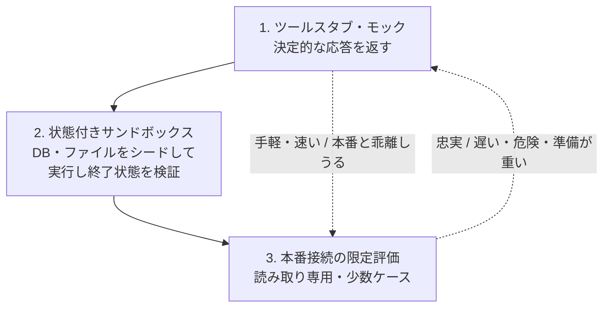

# エージェント評価環境の構築

## この記事の目的

ツールを実行する Agent を、**安全かつ再現可能に評価する環境**を構築できるようになります。「実行するたびに本番の DB を触ってしまう」「実行ごとに結果が変わって比較できない」を解消し、[Agent 評価の基礎](agent-evaluation-basics.md)で設計した評価を実際に回す土台を作れる状態がゴールです。

## 対象読者

- ツール実行・状態変更を伴う Agent を評価したいが、実行環境の作り方で詰まっているエンジニア
- 評価を CI に載せたいが、外部依存・副作用で安定しないと感じているエンジニア

## 前提知識

- [Agent 評価の基礎](agent-evaluation-basics.md) — 何を測るか(評価対象・採点・データセット)。本記事はそれを実行する環境の側
- [回帰テストと CI 組み込み](regression-testing.md) — 評価を継続的に回す仕組み(本記事の環境をその実行系に載せる)

## 本文

### 概要: 分担と「評価用の環境」という論点

| 対象 | 正本 | 本記事 |
| --- | --- | --- |
| 何を測るか(評価対象・採点・データセット) | [Agent 評価の基礎](agent-evaluation-basics.md) | — |
| 評価を CI で継続実行する仕組み | [回帰テストと CI 組み込み](regression-testing.md) | — |
| 本番からのセキュリティ隔離(サンドボックス) | [ツール権限設計とサンドボックス](../06-security/tool-permissions-and-sandboxing.md) | — |
| **評価を実行する環境の構築** | **本記事** | モック・状態付き環境・再現性・忠実度・CI 統合 |

「何を測るか」は [Agent 評価の基礎](agent-evaluation-basics.md) が決めます。本記事はその評価を、**副作用を出さず・再現可能に・繰り返し**実行する環境を扱います。なお本記事の「隔離環境」は**評価のための隔離**(本番データを触らない・状態をリセットできる)であり、悪意あるコードから本番を守る**セキュリティ隔離**とは目的が別です(後者は [ツール権限設計とサンドボックス](../06-security/tool-permissions-and-sandboxing.md) が正本)。

### 評価環境の 3 層

ツールを持つ Agent の評価環境は、忠実度と手軽さのトレードオフで 3 層に分けられます。

| 層 | 何をするか | 向く評価 |
| --- | --- | --- |
| ツールスタブ・モック | ツール呼び出しに決定的な固定応答を返す | 「正しいツールを正しい引数で呼んだか」の軌跡評価・部品評価 |
| 状態付きサンドボックス | DB・ファイル・API を初期状態にシードして実行し、**終了状態**を検証する | 「あるべき最終状態になったか」の最終成果評価(τ-bench・OSWorld 型の自前版) |
| 本番接続の限定評価 | 本番(または本番相当)に読み取り専用・少数ケースで接続 | モックと本番の乖離の確認・最終確認 |

多くのタスクは**②の状態付きサンドボックスが主役**です。公開ベンチマークでも、DB を初期化して Agent を動かし、会話終了時の DB 状態を正解と比較する(τ-bench)、実 OS 上で操作させて終了状態を検証する(OSWorld)といった「状態を検証する環境」が主流です([エージェントベンチマークの全体像](agent-benchmarks-landscape.md))。この考え方を自社タスクに転用します。

### 再現性の担保

評価が実行ごとにブレると、変更の効果を測れません。**環境側で決定性を担保**します。

- **状態リセット**: 各ケースの実行前に、環境(DB・ファイル・外部状態)を既知の初期状態に戻します。前のケースの副作用が次に漏れないようにします
- **時刻の固定**: 「今日」「現在時刻」に依存するタスクは、時刻を固定しないと日によって結果が変わります。評価時は時刻を注入・固定します
- **乱数・ID の固定**: シードを固定し、生成される ID・順序を再現可能にします
- **外部依存の固定**: 外部 API の応答をモック・記録再生(録画したレスポンスを返す)で固定します。ネットワークの揺れやレート制限で評価が落ちるのを防ぎます

Agent 自体の非決定性(同じ入力でも出力が変わる)は消せないため、**複数回実行**([Agent 評価の基礎](agent-evaluation-basics.md))で扱います。環境側の非決定性は、上記で**消せるものは消す**のが原則です。

### 忠実度と保守コストのトレードオフ

評価環境の最大の難所は、**モックが本番と乖離する**ことです。

- モックは手軽で速いが、本番の挙動を単純化しています。本番 API が返すエッジケース(エラー・空・大量データ)をモックが再現していないと、「評価は通るのに本番で落ちる」が起きます
- かといって本番そっくりの環境を維持するのは高コストです。本番 API が変わるたびにモックも更新しないと、乖離が静かに広がります
- **判断**: 忠実度は必要なだけ上げます。軌跡(正しいツールを呼んだか)を見るならモックで十分、最終状態の正しさを見るなら状態付きサンドボックスが要ります。そして**本番接続の限定評価(③)を時々挟み、モックと本番の乖離を検知**します
- モックの更新を、本番 API 変更の運用に組み込みます(「API を変えたらモックも更新」をチェックリスト化)

### CI への統合

評価環境は、[回帰テストと CI 組み込み](regression-testing.md)の実行系に載せてこそ効果を発揮します。

- **セットアップ・ティアダウンを自動化**: 環境のシード・リセットを CI のステップに組み込み、人手を介さず回せるようにします
- **層で分ける**: 速く決定的なモック評価は頻繁に(コミットごと)、重い状態付きサンドボックスは節目で(マージ前・定期)、と実行頻度を分けます([回帰テストと CI 組み込み](regression-testing.md)のレイヤ分け)
- **コストを見る**: 状態付きサンドボックスは実行が重く、LLM 呼び出しコストもかかります。全ケースを毎回回すのではなく、重要ケースに絞る・サンプリングするなどでコストを管理します

### 失敗の再現環境化

本番で起きた失敗は、**再現できる評価ケース + 環境に変換**して初めて再発防止になります。

- インシデント([インシデント対応](../05-operations/incident-response.md))で「この状態でこの入力だと失敗する」が分かったら、その初期状態をシードとして環境化し、評価ケースに追加します
- こうして「本番の失敗 → 評価環境で再現 → 修正 → 回帰スイートに常駐」の流れを作ると、同じ失敗が二度と本番に出なくなります([Agent 評価の基礎](agent-evaluation-basics.md)の「本番の失敗をケース化する」の環境側)
- 再現に必要なのは入力だけでなく**状態**です。状態付きサンドボックスがあるからこそ、状態依存の失敗を再現できます

## 実務での注意点

### アンチパターン

- **本番環境で評価を実行する** → 副作用が本番に出る・実行ごとに状態が変わって比較できない → 状態付きサンドボックスをシード・リセットして使う
- **モックだけで評価を完結させる** → モックが本番と乖離し、「評価は通るのに本番で落ちる」が起きる → 本番接続の限定評価を時々挟み、乖離を検知する
- **状態をリセットせずにケースを連続実行する** → 前のケースの副作用が次に漏れ、結果が汚染される → 各ケース前に環境を既知の初期状態に戻す
- **時刻・乱数を固定しない** → 日や実行で結果が変わり、変更の効果を測れない → 時刻・シードを注入して固定する
- **本番 API 変更時にモックを更新しない** → 乖離が静かに広がり、評価が本番を代表しなくなる → API 変更の運用にモック更新を組み込む

### チェックリスト

- [ ] 評価対象に応じて 3 層(モック / 状態付きサンドボックス / 本番接続)を選んでいる
- [ ] 最終状態を検証するタスクで、状態付きサンドボックスをシード・リセットして使っている
- [ ] 各ケース実行前に環境を既知の初期状態に戻している
- [ ] 時刻・乱数・外部依存を固定し、環境側の非決定性を消している
- [ ] モックと本番の乖離を、本番接続の限定評価で定期的に検知している
- [ ] 環境のセットアップ・リセットを CI に自動化し、層で実行頻度を分けている
- [ ] 本番の失敗を、状態を含む再現可能な評価ケース + 環境に変換している

## 関連トピック

- [Agent 評価の基礎](agent-evaluation-basics.md) — 何を測るか(本記事はそれを実行する環境の側)
- [回帰テストと CI 組み込み](regression-testing.md) — 評価環境を載せる継続実行の仕組み
- [ユーザーシミュレータの設計](user-simulator-design.md) — 対話型 Agent の評価環境に置く「ユーザー役」
- [軌跡(trajectory)評価](trajectory-evaluation.md) — モック環境で見る「正しいツールを呼んだか」
- [エージェントベンチマークの全体像](agent-benchmarks-landscape.md) — τ-bench・OSWorld など状態検証型の評価環境の実例
- [ツール権限設計とサンドボックス](../06-security/tool-permissions-and-sandboxing.md) — 本番からのセキュリティ隔離(評価用の隔離とは別)
- [インシデント対応](../05-operations/incident-response.md) — 本番の失敗を評価環境に変換する起点

## 参考資料

- [τ-bench: A Benchmark for Tool-Agent-User Interaction in Real-World Domains](https://arxiv.org/abs/2406.12045) — DB 状態をシード・検証する状態付き評価環境の設計例(アクセス日: 2026-07-08)
- [OSWorld: Benchmarking Multimodal Agents for Open-Ended Tasks in Real Computer Environments](https://arxiv.org/abs/2404.07972) — 実環境の終了状態を検証する評価環境の例(アクセス日: 2026-07-08)

## TODO・未確認事項

なし
