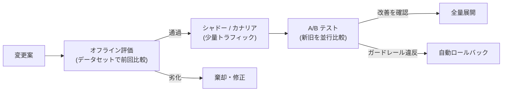

# オンライン評価と A/B テスト

## この記事の目的

オフライン評価(手元のデータセットでの計測)を通過した変更が、本番でも本当に改善なのかを確かめる仕組みを設計できるようになります。本番トラフィックで測る品質シグナル、A/B テストとカナリアの設計、自動ロールバックのためのガードレールメトリクス、そして少トラフィック・多重比較・新奇性効果(novelty effect)といった落とし穴への対処を扱います。

## 対象読者

- オフライン評価は回しているが、本番での実際の効果を測る手段を持っていないエンジニア
- Agent の改善を A/B テスト・カナリアで安全に検証したいテックリード・データ担当

## 前提知識

- [Agent 評価の基礎](agent-evaluation-basics.md) — オフライン評価の 3 層・採点方法(本記事はその本番編)
- [可観測性とトレーシング](../05-operations/observability-and-tracing.md) — 品質シグナルの検知(本記事はそれを比較実験に使う)
- [バージョニング・デプロイ・モデル更新追従](../05-operations/versioning-and-model-updates.md) — カナリア・ロールバックの機構

## 本文

### 概要: オフラインとオンラインは補完関係

オフライン評価とオンライン評価は、どちらか一方では足りません。役割が違うからです。

| | オフライン評価 | オンライン評価 |
| --- | --- | --- |
| 測る場所 | 手元の固定データセット | 本番トラフィック |
| 強み | 速い・安い・再現可能・リリース前に測れる | 実際の入力分布・実際のユーザー反応で測れる |
| 弱み | データセットの分布に閉じる。実ユーザーの反応は分からない | 遅い・実ユーザーに影響が及ぶ・交絡が入る |
| 主な役割 | 劣化案をリリース前に落とす関門 | 本番での真の効果を確定する |

順序は **オフラインが先、オンラインが後** です。オフラインで大半の劣化案を安く落とし、通過した有望な変更だけを高コストなオンライン検証にかけます。オフラインを飛ばして本番 A/B に持ち込むのは、実ユーザーを使ったデバッグになり高くつきます。

### オンラインで測るべきもの

本番では「正解ラベル」が手に入らないことが多いため、品質の代理シグナルを測ります([可観測性とトレーシング](../05-operations/observability-and-tracing.md)・[フィードバックループの運用](../05-operations/feedback-loops.md)で設計したシグナルがそのまま使えます)。

- **タスク成功の代理指標**: タスク完了率、人間へのエスカレーション率、やり直し・言い直し率、下書きの修正距離など。タスク特性に合った主指標を 1 つ決めます
- **明示フィードバック**: 評価ボタン・報告。回答率は低いが理由まで取れます
- **ガードレールメトリクス(悪化を監視する指標)**: 主指標を追う一方で、「悪化してはいけない指標」を定義します。コスト/リクエスト、レイテンシ(p95)、エラー率、安全性の逸脱率など。主指標が上がってもこれらが閾値を超えたら失敗と見なします
- **オンライン LLM-as-a-Judge**: 本番出力をサンプリングし、検証済みの judge で採点します([LLM-as-a-Judge](llm-as-a-judge.md))。全量は高コストなのでサンプリングが前提です

### A/B テストの設計

A/B テスト(利用者を新旧に振り分けて指標を比較する実験)を Agent に適用するときの要点です。

- **割付の単位を固定する**: 同じユーザー(またはセッション)は常に同じ群に入れます。リクエストごとに振り分けると、1 人が新旧を行き来して体験が壊れ、比較も濁ります
- **主指標と成功基準を事前に決める**: 「何がどれだけ改善したら勝ちか」を実験開始前に固定します。開始後に指標を選ぶと、都合のよい指標を後付けで拾う結果解釈(チェリーピッキング)になります
- **サンプルサイズと期間を見積もる**: 検出したい差を見るのに必要なトラフィック量と期間を事前に見積もります。「なんとなく良さそう」で早期に打ち切ると、偶然の変動を効果と誤認します
- **ガードレールを同時に監視する**: 主指標だけでなく、上記のガードレールメトリクスを実験中つねに監視します

Agent 特有の注意として、**遅延して現れる効果**があります。Web の CTR のような即時指標と違い、タスクの成否・ユーザーの信頼は数日〜数週間かけて現れることがあります。観測期間はこの遅れを見込みます。

### カナリアと自動ロールバック

A/B が「どちらが良いか」を統計的に確定するための実験なら、カナリアは「新バージョンが壊れていないか」を安全に確かめる段階的リリースです(機構は [バージョニング・デプロイ・モデル更新追従](../05-operations/versioning-and-model-updates.md))。

- **段階的に広げる**: 数 %→ 十数 %→ 全量、と広げながらガードレールメトリクスを新旧比較します
- **自動ロールバックの条件**: エラー率・コスト・安全性逸脱などのガードレールが閾値を超えたら、人手を待たず自動で旧構成へ戻す条件を設定します。この即時切り替えは、デプロイなしのフラグ切り替えが前提です
- **シャドーランの活用**: 副作用のない範囲では、新構成に本番入力を流して結果を記録だけする(ユーザーには旧を返す)シャドーランで、ユーザー影響ゼロのまま本番分布での挙動を先に測れます。副作用のあるツールはシャドー側で実行しない設計が必要です

### 落とし穴

本番の比較実験は、統計と人間行動に由来する罠が多くあります。

- **少トラフィック問題**: トラフィックが小さいと有意差を検出できず、ノイズを効果と誤認します。対策は、指標を敏感なもの(二値の成功/失敗より連続値の修正距離など)にする、観測期間を延ばす、そもそも A/B ではなくオフライン評価とシャドーランで判断する、のいずれかです。小規模サービスで無理に A/B を回すより、オフライン + 少数の手動確認が現実的なこともあります
- **多重比較**: 多くの指標・多くのセグメントを同時に見ると、偶然「有意」に見えるものが必ず出ます。主指標を事前に 1〜2 個に絞り、探索的に見た指標は「仮説」であって「結論」ではないと扱います
- **新奇性効果 / 学習効果**: 新しい挙動は物珍しさで一時的に指標が動き(良くも悪くも)、時間で落ち着きます。短期の数字で判断せず、定常状態を見ます
- **交絡とセグメント差**: 「新機能を試すのは元々アクティブなユーザー」のような偏りが効果を偽装します。ランダム割付を徹底し、主要セグメントで分けても結論が一貫するか確認します
- **判定できないものを A/B にかけない**: そもそも本番で成功を測れないタスク(正解が長期間分からない・シグナルが取れない)は、A/B の土俵に乗りません。オフライン評価と人手レビューで判断します

## 実務での注意点

### アンチパターン

- **オフライン評価を飛ばして本番 A/B から始める** → 実ユーザーを使ったデバッグになり、遅く高くつく → オフラインで劣化案を落とし、通過分だけをオンライン検証にかける
- **主指標を実験後に選ぶ** → 都合のよい指標を後付けで拾い、偽の改善を「成功」と報告する → 主指標と成功基準を実験開始前に固定する
- **ガードレールなしで主指標だけ追う** → 成功率は上がったがコストが倍・安全性が悪化、を見逃す → 悪化監視指標(コスト・レイテンシ・エラー・安全逸脱)を同時監視し、超過を失敗とする
- **短期の数字で勝敗を決める** → 新奇性効果や少サンプルのノイズを効果と誤認する → 定常状態まで観測し、必要サンプルサイズを事前見積もりする
- **小トラフィックで無理に A/B する** → 有意差が出ずノイズに振り回される → オフライン評価 + シャドーラン + 手動確認で判断する

### チェックリスト

- [ ] オフライン評価を通過した変更だけをオンライン検証にかけている
- [ ] 本番で測る主指標(タスク成功の代理)を 1〜2 個に事前確定した
- [ ] 悪化を監視するガードレールメトリクス(コスト・レイテンシ・エラー・安全)がある
- [ ] A/B の割付が同一ユーザー(セッション)単位で固定されている
- [ ] 必要サンプルサイズと観測期間を事前見積もりした
- [ ] カナリアにガードレール閾値による自動ロールバック条件がある
- [ ] 多重比較・novelty 効果・交絡を考慮して結果を解釈している
- [ ] 本番で成功を測れないタスクを A/B にかけていない(オフライン + 人手で判断)

## 関連トピック

- [Agent 評価の基礎](agent-evaluation-basics.md) — オフライン評価の設計(本記事の前段)
- [可観測性とトレーシング](../05-operations/observability-and-tracing.md) — オンラインで測る品質シグナルの検知
- [フィードバックループの運用](../05-operations/feedback-loops.md) — シグナルを継続的な改善に還流させる運用
- [バージョニング・デプロイ・モデル更新追従](../05-operations/versioning-and-model-updates.md) — カナリア・シャドーラン・自動ロールバックの機構
- [LLM-as-a-Judge](llm-as-a-judge.md) — オンライン採点に使う judge の設計と検証
- [評価データセットの構築と保守](evaluation-datasets.md) — オフライン評価の土台

## 参考資料

- [Trustworthy Online Controlled Experiments(Kohavi ら)](https://experimentguide.com/) — A/B テスト設計の落とし穴(多重比較・novelty 効果・信頼性)の体系的整理(アクセス日: 2026-07-07)

## TODO・未確認事項

なし
