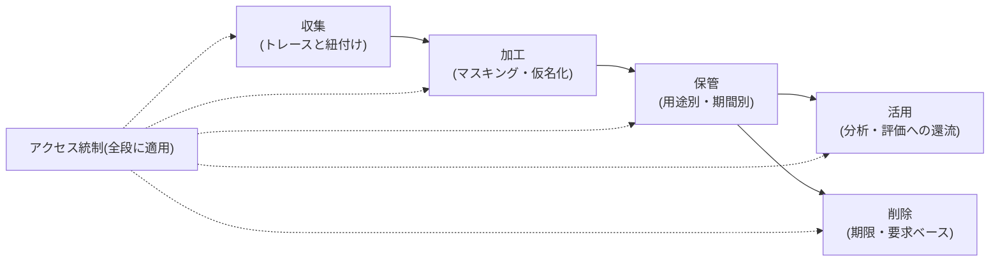

# 会話データの管理基盤

## この記事の目的

Agent の会話ログ — 機微情報を含む非構造データでありながら、プロダクト改善の最重要の一次資料でもある — を、**安全に持ち、使える形で持つ**ためのライフサイクル(収集 → 加工 → 保持・削除 → 活用 → アクセス統制)を設計できるようになります。汎用のデータ基盤(データウェアハウス(DWH)・ETL 製品の選定)は扱わず、会話データに固有の論点に絞ります。

## 対象読者

- Agent の本番ログを改善・分析に使いたいが、個人情報の扱いに確信が持てないエンジニア・テックリード
- 会話データの保持・削除・アクセスのルールを、法務・情報セキュリティ部門と設計する立場の人

## 前提知識

- [可観測性とトレーシング](observability-and-tracing.md) — トレース記録の設計(本記事はその下流のデータ管理)
- [コンプライアンスとガバナンス](../06-security/compliance-and-governance.md) — 保持・削除・同意に効く規制の地図(規制内容の正本)

## 本文

### 概要: 二面性を持つデータのライフサイクル

会話データには他のログにない二面性があります。**改善の一次資料**(実際のユーザーが何を求め、どこで失敗したかの記録)であると同時に、**機微情報の塊**(個人情報・社内機密・健康や財務の相談内容までが、予測できない場所に非構造で混ざる)です。「安全のために封印する」と改善が止まり、「改善のために開放する」と事故になります。両立させるのは、次のライフサイクル設計です。

### 収集とトレースの関係

会話データは独立に集めるのではなく、**トレースの一部として同じ ID 体系で記録**します([可観測性とトレーシング](observability-and-tracing.md))。「この応答の元になったプロンプト・検索結果・ツール実行」まで遡れて初めて、失敗分析と改善に使えます。フィードバック(評価ボタン・修正)も同じ trace ID に紐付けます([フィードバックループの運用](feedback-loops.md))。

収集時点で決めるべきことが 2 つあります。

- **通知と同意**: 会話が記録されること、何に使われるか(品質改善・不具合調査など)をユーザーに示します。特にモデルの学習への利用は、通常の運用目的とは別立ての同意・契約事項として扱います(要求水準は[コンプライアンスとガバナンス](../06-security/compliance-and-governance.md)が正本)
- **全量か、サンプリングか**: デバッグ・削除要求対応には全量が要りますが、分析・評価にはサンプルで足りることも多いです。「短期は全量、長期はサンプル + 集計」という組み合わせが現実的な既定です

### 機微情報の処理: 非構造ゆえの難しさ

フォーム入力と違い、会話では機微情報が**どこに現れるか予測できません**。ユーザーは住所を雑談に混ぜ、エラーログごと認証情報を貼り付けます。対策は 1 つの魔法ではなく層で組みます。

1. **入口での検出・マスキング**: 既知パターン(メールアドレス・電話番号・カード番号・認証情報)を記録前に検出してマスクします。ツールの返した結果(顧客レコードなど)も対象です
2. **仮名化(pseudonymization)**: 分析用データでは、ユーザー識別子を可逆の仮 ID に置き換え、対応表を分離保管します。ユーザー単位の分析(継続率・失敗傾向)を、生の識別子なしで行えるようにします
3. **用途別のデータセット分離**: 「生ログ(短期・厳格統制)」「マスク済み分析用(中期・チーム利用)」「匿名化(anonymization)済み評価セット(長期・広い利用)」を分け、下流ほど機微度を下げます

重要な前提が 2 つあります。第一に、**マスキングは完全にはなりません**。文脈から個人が推定できる記述(「◯◯部の部長との面談内容」)は機械的な検出をすり抜けます。だからマスキングは「アクセス統制を軽くしてよい理由」ではなく、被害半径を減らす 1 層として扱います。第二に、**派生データにも機微は写ります**。埋め込み・要約・キャッシュ・評価ケースは原本と同じ統制レベルから出発させ、明示的に匿名化した時点で初めて緩めます([ケーススタディ: 社内ナレッジ Agent](../07-case-studies/case-study-knowledge-agent.md)の派生データの原則と同じです)。

### 保持と削除の設計

保持期間は「なんとなく全部保存」ではなく、**用途ごとに期間を宣言**します。

| データ | 用途 | 期間の考え方 |
| --- | --- | --- |
| 生ログ(全文トレース) | 不具合調査・削除要求対応 | 短く(調査に必要な週〜月単位)。期限で自動削除 |
| マスク済み分析用 | 失敗分析・利用傾向 | 中期。ビジネス上の必要性で正当化できる範囲 |
| 匿名化済み評価セット | 回帰テスト・改善 | 長期。個人と切り離せていることが条件(自由文は文脈からの再識別リスクが残るため、切り離せているかの確認が前提) |
| 集計メトリクス | ダッシュボード・報告 | 長期(個人データを含まない) |

削除には期限ベース(保持期間満了)と**要求ベース(ユーザー・テナントからの削除要求)**があります。要求ベースで問われるのは横断性です — 生ログだけ消して、派生データ(仮名化データ・埋め込み・キャッシュ・評価セット・長期記憶)に残っていれば、削除は完了していません。ユーザー ID・テナント ID で全保存層を横断検索・削除できるデータ配置を最初から作ります([長期記憶の実装](../03-implementation/long-term-memory-implementation.md)の削除設計、[マルチテナント設計](../02-architecture/multi-tenancy-and-isolation.md)のテナント単位削除と同じ要件です)。評価セットに入れたケースが削除要求で抜けると回帰テストが壊れるため、**評価セットには匿名化してから入れる**のが安全な運用です。

### 分析・改善への活用

管理基盤の投資は、活用できて初めて回収されます。改善サイクル(失敗抽出 → トリアージ → 評価セット還流)の運用は[フィードバックループの運用](feedback-loops.md)と[評価データセットの構築と保守](../04-evaluation/evaluation-datasets.md)が正本で、本記事の関心は**それを可能にするデータ側の要件**です。

- **検索できること**: 「先週の、ツール実行に失敗した、否定的フィードバック付きの会話」を数分で取り出せるか。トレース属性(モデル・プロンプトバージョン・失敗種別・フィードバック)でのフィルタが要ります
- **ラベルを付けられること**: トリアージの結果(失敗モード分類)や評価用アノテーションを、データに紐付けて保存できる場所を用意します
- **持ち出さずに分析できること**: 分析のたびに生ログを手元へエクスポートする運用は、統制の外にコピーを増やします。マスク済みデータを既定とし、分析環境の中で完結させます

### アクセス統制: 「誰が会話を読めるか」

会話ログには全ユーザーの生の発話が集まります。運用チームの全員がいつでも読める状態は、それ自体が事故です(外部への漏えいがなくても、契約・信頼の問題になります)。

- **既定はマスク済みデータ**: 日常の分析・デバッグはマスク済みで行い、生ログへのアクセスは調査目的の例外承認制にします
- **役割と目的で絞る**: 開発者のデバッグ・アノテーター・サポート担当で、見える範囲(自分の担当ケース・マスクレベル)を分けます
- **閲覧も監査する**: 誰がいつどの会話を見たかを記録します。監査ログは「見られる側」への説明責任の裏付けです([コンプライアンスとガバナンス](../06-security/compliance-and-governance.md))
- **外部サービスへの送信は経路として扱う**: 会話データを監視 SaaS・分析ツールへ送ることは、データの越境・第三者提供の論点になります。送信先の扱い(保持・学習利用)を契約で確認します([データ漏えい対策](../06-security/data-exfiltration.md))

## 実務での注意点

### アンチパターン

- **全会話を生のまま無期限に保持する** → 保持の正当化ができず、漏えい時の被害も最大になる → 用途別に期間を宣言し、期限で自動削除する
- **「マスキング済みだから」とアクセス統制を省く** → 文脈からの個人推定はマスキングをすり抜ける → マスキングは 1 層と位置づけ、統制・監査と併用する
- **削除要求で生ログだけを消す** → 仮名化データ・埋め込み・評価セット・長期記憶に残り、削除が完了していない → ID で全保存層を横断削除できる配置にし、評価セットは匿名化してから作る
- **分析のたびに生ログを手元にエクスポートする** → 統制外のコピーが増殖し、実質的な漏えい経路になる → マスク済みデータを既定に、分析環境内で完結させる
- **学習利用を通常の運用目的に紛れ込ませる** → 同意・契約の範囲を超えた利用になる → 学習利用は別立ての同意・契約事項として明示する

### チェックリスト

- [ ] 会話データがトレースと同じ ID 体系で記録され、フィードバックと紐付いている
- [ ] 記録・利用目的をユーザーに示し、学習利用は別立てで扱っている
- [ ] 入口のマスキングと仮名化があり、用途別にデータセットが分離されている
- [ ] 派生データ(埋め込み・要約・評価ケース)が原本と同じ統制から出発している
- [ ] 用途ごとの保持期間が宣言され、期限で自動削除される
- [ ] ユーザー・テナント単位の横断削除(派生データ含む)ができる
- [ ] 生ログへのアクセスが例外承認制で、閲覧が監査されている
- [ ] 外部サービスへ送る会話データの扱い(保持・学習利用)を契約で確認した

## 関連トピック

- [可観測性とトレーシング](observability-and-tracing.md) — 収集側の設計(本記事はその下流)
- [コンプライアンスとガバナンス](../06-security/compliance-and-governance.md) — 保持・削除・同意の規制面の正本
- [フィードバックループの運用](feedback-loops.md) — このデータ基盤の上で回す改善サイクル
- [評価データセットの構築と保守](../04-evaluation/evaluation-datasets.md) — 還流先(匿名化してから入れる)
- [長期記憶の実装](../03-implementation/long-term-memory-implementation.md) — 削除要求が波及するもう 1 つの保存層
- [マルチテナント設計](../02-architecture/multi-tenancy-and-isolation.md) — テナント境界でのログ・削除の扱い
- [データ漏えい対策](../06-security/data-exfiltration.md) — 外部送信・持ち出し経路の防御
- [AI のためのデータガバナンス](data-governance-for-ai.md) — 「AI に食わせる知識源データ」側の管理(本記事は「AI が生む会話ログ」側。対の記事)

## 参考資料

- なし(会話データの管理は、一般的なデータガバナンスの実践を Agent 固有の性質 — 非構造・機微混在・派生データ・トレースとの一体性 — に適用した本ライブラリの整理のため、単独の外部一次資料はありません。規制要件の一次情報は[コンプライアンスとガバナンス](../06-security/compliance-and-governance.md)の参考資料と `research/professional/compliance.md` を参照)

## TODO・未確認事項

なし
