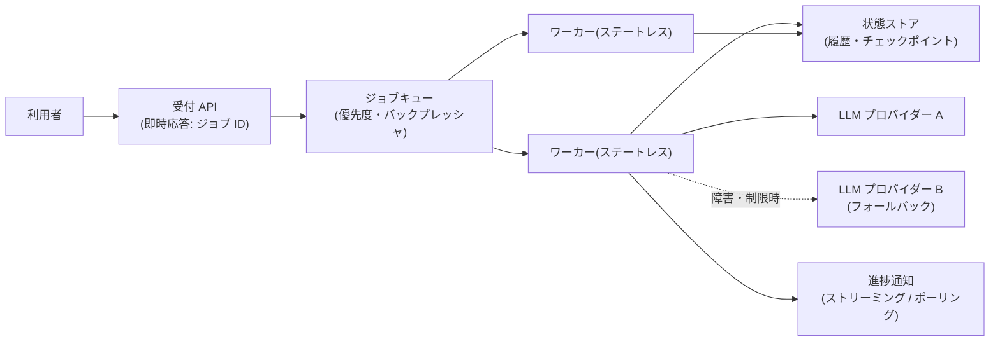

# デプロイとスケーリング

## この記事の目的

Agent を本番インフラに載せるときの実行形態(同期・ジョブキュー・常駐・サーバーレス)を選定し、状態の外部化・プロバイダーのレート制限を前提とした容量設計・フォールバック構成・段階的ロールアウトを設計できるようになります。単発のデモを「多数の利用者が同時に使っても壊れないシステム」にするためのインフラ判断を扱います。

## 対象読者

- Agent を本番環境へデプロイするアーキテクチャを設計するエンジニア
- 利用者・トラフィックの増加でレート制限・タイムアウト・コスト超過に直面しているエンジニア・SRE

## 前提知識

- [Agent ループ](../01-concepts/agent-loop.md) — 実行時間が長く非決定的である、という配置制約の源
- [エラー処理・リトライ設計](../02-architecture/error-handling-and-retries.md) — 呼び出し単位の失敗処理(本記事はシステム全体の容量・構成)
- [バージョニング・デプロイ・モデル更新追従](versioning-and-model-updates.md) — 何をバージョン管理し、どう切り替えるか

## 本文

### 概要: Agent 特有のインフラ制約

Agent のデプロイは通常の Web アプリと 3 点で異なります。

1. **1 リクエストが長い**: ツール呼び出しを重ねる Agent ループは数十秒〜数分かかり、HTTP の同期リクエストの常識(数百 ms〜数秒)から外れます
2. **真のボトルネックが外部にある**: 自前のサーバーをいくら増やしても、LLM プロバイダー側のレート制限(分あたりリクエスト数・トークン数)が上限になります
3. **コストがリクエスト数でなくトークン数に比例する**: 容量計画・課金管理の単位が従来と違います([コスト管理](cost-management.md))

図は代表的な構成(キュー + ステートレスワーカー)です。以下、各要素の設計判断を見ていきます。

### 実行形態の選択

| 実行形態 | 向くケース | 制約 |
| --- | --- | --- |
| リクエスト同期(API の中で完結) | 対話 UI で応答が数十秒以内。ストリーミングで逐次表示する | ゲートウェイ・LB のタイムアウトに縛られる。リトライが「もう一度全部」になる |
| ジョブキュー + ワーカー | 数分かかるタスク、スパイクのある負荷、失敗時の再実行が必要 | 非同期 UX(進捗通知・完了通知)の設計が必要 |
| 常駐ワーカー / スケジュール実行 | 定期バッチ(日次レポート等)、イベント駆動の自動処理 | 同時実行数とコストの上限管理を自前で持つ |
| サーバーレス(FaaS) | 短い単発処理、低頻度でインフラ管理を持ちたくない | 実行時間上限・コールドスタート・状態を持てない制約が長い Agent ループと相性が悪い |

判断の起点は **「1 タスクの実行時間の分布」** です。p50 ではなく p95〜p99 で考えます(Agent はループ回数が入力次第で伸びるため、裾が長い)。p99 が同期の許容時間を超えるなら、対話型 UI であってもジョブ化 + ストリーミング進捗の構成に寄せます([ストリーミングと Agent の UX 実装パターン](../03-implementation/streaming-and-agent-ux.md))。

### 状態管理とスケールアウト

ワーカーを水平スケールできるかは、状態をどこに置くかで決まります。

- **ワーカーはステートレスにする**: 会話履歴・実行中の Agent の状態(ループの途中経過・ツール結果)をワーカーのメモリだけに置くと、スケールイン・再起動・障害で消えます。状態は外部ストア(DB・キャッシュ)に置き、どのワーカーでも再開できる形にします
- **チェックポイント**: 長いタスクは「ここまで終わった」を節目(ツール実行の完了ごと・フェーズごと)で永続化し、失敗時は途中から再開できるようにします。全部やり直しはコスト(トークン課金)にも直撃します
- **冪等性**: 再実行が起きる前提で、副作用のあるツール(送信・登録・決済)は冪等キーや実行済みチェックで二重実行を防ぎます([エラー処理・リトライ設計](../02-architecture/error-handling-and-retries.md))
- **セッション親和性に頼らない**: 「同じ利用者は同じワーカーへ」という設計は、状態外部化をさぼる誘惑になりがちです。障害時に会話が消える構成は本番に置けません

### レート制限と容量設計

容量設計の主役は自前サーバーの CPU ではなく、**プロバイダー側のレート制限(分あたりリクエスト数・分あたりトークン数)** です。

- **同時実行の上限を自分で決める**: ワーカー数・スレッド数を無制限にすると、スパイク時に全リクエストがレート制限エラーになり、リトライがさらに負荷を増やす悪循環に入ります。プロバイダーの制限から逆算した同時実行数(セマフォ)をアプリ側で管理します
- **バックプレッシャ**: 上限を超えた分は落とすのではなくキューで待たせ、キュー長・待ち時間を監視します。キューが伸び続けるなら、それは容量不足のシグナルです([可観測性とトレーシング](observability-and-tracing.md))
- **優先度を分ける**: 対話中の利用者(待たせると体験を損なう)と、バッチ処理(遅れてもよい)を同じキューに入れないでください。優先度付きキュー、または時間帯でのバッチ移動が定石です
- **見積もりはトークンで行う**: 「1 タスク平均 N トークン × ピーク時タスク数」で分あたりトークン数を見積もり、制限との比率を容量として管理します。1 タスクのトークン数はループ回数に比例して伸びるため、上限(ループ回数・トークン)の設定が容量の予測可能性に直結します
- **縮退の設計**: ピーク超過時の振る舞い(待たせる / 軽量モデルに切り替える / 機能を限定する)を事前に決めます。モデルティアの切り替えは品質が変わるため、評価で縮退時品質を確認しておきます([モデル選定ガイド](../03-implementation/model-selection.md))

### フォールバックと多重化

LLM プロバイダーの障害・遅延は起きる前提で設計します。

- **フォールバック先を用意する**: 同一プロバイダーの別モデル、または別プロバイダーへの切り替え経路を用意します。切り替えの条件(エラー率・タイムアウト率のしきい値)と復帰の条件を明文化します
- **フォールバックは「別のシステム」として評価する**: モデルが変わればプロンプトの効き方も品質も変わります。フォールバック先での評価セット実行を事前に済ませ、「切り替えたら品質が急落した」を防ぎます([回帰テストと CI 組み込み](../04-evaluation/regression-testing.md))
- **切り替えを可観測にする**: どのリクエストがフォールバックで処理されたかをトレースに記録します。品質・コストの分析がプロバイダー別にできないと、障害後の振り返りができません
- **完全停止時の縮退**: 全プロバイダーが落ちた場合の振る舞い(受付停止 + 明示的なエラー / キュー退避して後で処理)も決めておきます。[インシデント対応](incident-response.md) の停止手段と接続します

### ロールアウト戦略

プロンプト・モデル・パイプラインの変更は、コードのデプロイと同じく段階的に出します。個々の手法(カナリアリリース・シャドーラン・ロールバック)は [バージョニング・デプロイ・モデル更新追従](versioning-and-model-updates.md) が正本です。本記事の文脈で追加する判断は次の 2 点です。

- **インフラ構成の変更もカナリアで**: 実行形態の変更(同期 → ジョブ化)、キュー・ワーカー構成の変更も、一部トラフィックから段階適用します。挙動の差(タイムアウト・再試行頻度)は本番負荷でしか見えないことが多いためです
- **容量の余裕を持って切り替える**: 新旧並行稼働(シャドーラン・カナリア)の期間は、レート制限消費が一時的に増えます。並行稼働分を容量計画に入れておかないと、リリース作業自体がレート制限超過を引き起こします

## 実務での注意点

### アンチパターン

- **Web リクエストの中で数分の Agent ループを同期実行する** → ゲートウェイのタイムアウトで切断され、利用者には失敗に見えるのに処理は課金されながら走り続ける → p95〜p99 の実行時間でジョブ化を判断し、進捗はストリーミング・ポーリングで返す
- **ワーカーのメモリに会話状態を持つ** → スケールイン・再起動のたびに会話が消え、水平スケールもできない → 状態を外部ストアへ出し、ワーカーはステートレスにする
- **同時実行を制御せずスケールアウトする** → 自前サーバーを増やした分だけレート制限エラーが増え、リトライの嵐で全体が止まる → プロバイダー制限から逆算した同時実行上限とバックプレッシャを入れる
- **フォールバック先を評価せずに切り替える** → 障害対応のつもりが品質インシデントになる → フォールバック構成も評価セットで事前検証し、切り替えをトレースに記録する
- **容量・コストをリクエスト数で見積もる** → トークン数ベースの実態と乖離し、ループの長いタスクで予算とレート制限を食い潰す → トークンベースの見積もりと、タスクあたりのループ・トークン上限をセットで設計する

### チェックリスト

- [ ] 1 タスクの実行時間分布(p95〜p99)を測り、実行形態(同期 / ジョブ)を選定した
- [ ] 会話履歴・実行状態が外部ストアにあり、任意のワーカーで再開できる
- [ ] 副作用のあるツールに冪等性(冪等キー・実行済みチェック)がある
- [ ] プロバイダーのレート制限から逆算した同時実行上限とバックプレッシャがある
- [ ] 対話系とバッチ系の優先度が分離されている
- [ ] 容量・コストの見積もりがトークンベースで、タスクあたりの上限が設定されている
- [ ] フォールバック経路があり、フォールバック先での品質を評価済みで、切り替えが記録される
- [ ] 新構成のロールアウトが段階的で、並行稼働分の容量が計画に入っている

## 関連トピック

- [非同期・長時間タスクの設計(耐久実行)](../02-architecture/async-and-durable-agents.md) — 本記事のインフラの上で動く実行モデル(チェックポイント・再開・承認待ち)の設計
- [バージョニング・デプロイ・モデル更新追従](versioning-and-model-updates.md) — カナリア・シャドーラン・ロールバックの正本
- [エラー処理・リトライ設計](../02-architecture/error-handling-and-retries.md) — 呼び出し単位の失敗処理と冪等性
- [コスト管理](cost-management.md) — トークンベースのコスト構造と上限設計
- [レイテンシ最適化](latency-optimization.md) — 同期構成を維持したい場合の応答時間短縮
- [インシデント対応](incident-response.md) — 縮退・停止手段との接続
- [PoC から本番への進め方](../09-business/poc-to-production.md) — 本記事の内容が「本番化の関門」になる位置づけ

## 参考資料

- [Anthropic API: Rate limits](https://platform.claude.com/docs/en/api/rate-limits) — 分あたりリクエスト数・トークン数という制限の構造(アクセス日: 2026-07-06)
- [OpenAI: Rate limits](https://developers.openai.com/api/docs/guides/rate-limits) — 同上(プロバイダーごとの制限体系の比較用)(アクセス日: 2026-07-06)

## TODO・未確認事項

> **TODO(要確認):** 各プロバイダーのレート制限の体系(ティア・引き上げ手続き・キューイング機能の提供状況)は変化が速い。設計時に各社公式ドキュメントで最新の制限値と緩和手段を確認する(最終確認: 2026-07)
