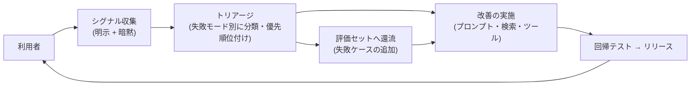

# フィードバックループの運用

## この記事の目的

利用者からのシグナル(明示的な評価と暗黙的な行動)を集め、評価データセットと改善に還流させる循環を設計・運用できるようになります。[可観測性とトレーシング](observability-and-tracing.md)が品質シグナルの「検知」を扱うのに対し、本記事はそのシグナルを「継続的な改善」に変える運用サイクルを扱います。

## 対象読者

- リリース後の Agent の品質を継続的に上げる仕組みに責任を持つエンジニア・テックリード
- 「評価ボタンは付けたが、集まったデータを誰も見ていない」状態を脱したいチーム

## 前提知識

- [可観測性とトレーシング](observability-and-tracing.md) — 品質シグナルの定義とトレースの設計(本記事の土台)
- [評価データセットの構築と保守](../04-evaluation/evaluation-datasets.md) — シグナルの主要な還流先

## 本文

### 概要: 「集める」ではなく「循環させる」

フィードバックの価値は収集ではなく循環で決まります。集めたシグナルが評価セットと改善に流れ、その結果が利用者に返る、というループが回って初めて意味を持ちます。

よくある失敗は、このループの右半分(トリアージ以降)を作らずに評価ボタンだけ置くことです。データは溜まりますが何も変わらず、やがて誰も見なくなります。

### シグナルの設計

シグナルは 2 系統あり、性質が補完的です。

| 系統 | 例 | 強み | 弱み |
| --- | --- | --- | --- |
| 明示シグナル | 評価ボタン(良い / 悪い)、理由タグ、自由記述、問題の報告 | 意図が明確。理由まで取れる | 回答率が低く、強い不満・満足に偏る |
| 暗黙シグナル | 修正率(下書きをどれだけ書き直したか)、再試行・言い直し、途中放棄、人へのエスカレーション、提案の採用率 | 全利用の行動から取れて量が多い | 解釈が必要(修正 = 不満とは限らない) |

設計の起点は「**このタスクでは何が品質の代理変数か**」を決めることです。下書き生成なら修正距離(生成文と送信文の差分)、検索応答なら再質問率、実行型 Agent なら人の差し戻し率、のようにタスク特性で主指標を選び、明示シグナルはその裏取りに使います。

### 収集の実装

- **トレース ID に必ず紐づける**: フィードバックは「どの応答への評価か」が特定できて初めて使えます。評価イベントにはトレース ID([可観測性とトレーシング](observability-and-tracing.md))を必ず持たせ、当時のプロンプト・モデル・入力まで遡れるようにします
- **明示シグナルは軽く、文脈の中で**: 応答直下のワンクリック + 任意の理由(タグ選択)が基本形です。必須入力・別画面への遷移は回答率を大きく下げます
- **暗黙シグナルはイベント設計から**: 修正・再試行・放棄をログから計算できるよう、UI 側のイベント(編集開始・送信・破棄)を最初から記録します。あとから「修正率を出したい」と思っても、イベントがなければ遡れません
- **機微データの扱い**: フィードバックの自由記述や紐づくトレースには個人情報が含まれ得ます。保持期間・アクセス制御は監視ログと同じ規律で扱います

### 評価・改善への還流

- **失敗モードで分類する**: 個別の低評価をそのまま積むのではなく、「検索が外れている」「規定の解釈を誤る」「口調が硬い」のような失敗モードに分類して集計します。優先順位は頻度 × 影響度で付けます
- **評価セットへ流す**: 代表的な失敗ケースは(マスキングした上で)評価データセットに追加します。これで「同じ失敗の再発」が回帰テストで検知できるようになります。還流の運用は[評価データセットの構築と保守](../04-evaluation/evaluation-datasets.md)の保守サイクルそのものです
- **改善はループの外まで見る**: 対策はプロンプト修正とは限りません。検索の改善([RAG 実装パターン](../03-implementation/rag-implementation-patterns.md))、ツール定義の見直し、そもそも要件・期待値の調整([ユースケース発見と要件定義](../09-business/usecase-discovery.md))が正解のこともあります
- **リリースで閉じる**: 改善は回帰テストを通し、品質シグナルを新旧比較しながらリリースします([バージョニング・デプロイ・モデル更新追従](versioning-and-model-updates.md))。シグナルが実際に改善したかまで確認して 1 周が閉じます

### 運用サイクル

ループは仕組みだけでは回りません。定例とオーナーを決めます。

| 頻度 | やること |
| --- | --- |
| 週次 | シグナルのトリアージ(新しい失敗モードの発見・優先順位の更新)。担当を輪番でもよいので明示する |
| リリースごと | 品質シグナルの新旧比較(改善したつもりの変更が悪化していないか) |
| 四半期 | 失敗モード分類の見直しと評価データセットの棚卸し |

**フィードバック疲れの回避**も運用の一部です。毎回の評価要求は回答率と体験の両方を下げます。サンプリング(N 回に 1 回・重要フローのみ)にする、回答が反映されたことを見せる(「報告いただいた問題を修正しました」)、の 2 つが効きます。特に後者は「送っても無駄」という学習を防ぐ、ループを回し続けるための投資です。

## 実務での注意点

### アンチパターン

- **評価ボタンを置いて満足する** → データは溜まるが誰も見ず、何も変わらない → トリアージの定例と担当、評価セットへの還流プロセスまで含めて「フィードバック機能」と定義する
- **明示シグナルだけに依存する** → 回答率が低く、強い不満に偏ったデータで全体品質を見誤る → タスクに合った暗黙シグナル(修正率・放棄率・エスカレーション率)を主指標にする
- **フィードバックをトレースに紐づけない** → 「悪い」と言われても何が起きたか調べられず、対策が立てられない → 評価イベントにトレース ID を必須にする
- **毎回評価を求める** → フィードバック疲れで回答率がさらに下がり、体験も悪化する → サンプリングと「反映の見える化」で、少数の質の高いシグナルを長く集める
- **集計スコアだけ見て個別ケースを読まない** → 平均は横ばいでも新しい失敗モードが育っている → 週次トリアージで低評価・高修正ケースの実物を読む

### チェックリスト

- [ ] タスクの品質を代理する主指標(暗黙シグナル)が定義されている
- [ ] 明示・暗黙のシグナルがすべてトレース ID に紐づいている
- [ ] 暗黙シグナルの計算に必要な UI イベントが記録されている
- [ ] 失敗モードの分類と、頻度 × 影響度による優先順位付けの運用がある
- [ ] 代表的な失敗ケースを評価データセットへ還流するプロセスがある
- [ ] 週次トリアージの定例と担当が決まっている
- [ ] リリース前後で品質シグナルを比較している
- [ ] 評価要求がサンプリングされ、反映結果を利用者に見せている

## 関連トピック

- [可観測性とトレーシング](observability-and-tracing.md) — 品質シグナルの定義と記録(本記事の土台)
- [オンライン評価と A/B テスト](../04-evaluation/online-evaluation-and-ab-testing.md) — 同じシグナルを比較実験で改善の確定に使う
- [評価データセットの構築と保守](../04-evaluation/evaluation-datasets.md) — 失敗ケースの還流先と保守サイクル
- [バージョニング・デプロイ・モデル更新追従](versioning-and-model-updates.md) — 改善をリリースし新旧比較する仕組み
- [プロンプト資産の管理とバージョニング](../03-implementation/prompt-management.md) — 改善の実施側の変更フロー
- [PoC から本番への進め方](../09-business/poc-to-production.md) — 本番化後の改善体制としての位置づけ

## 参考資料

- なし(フィードバック運用は一般的なプロダクト改善の実践と本ライブラリの評価・運用章を Agent 向けに統合した整理のため、単独の外部一次資料はありません)

## TODO・未確認事項

なし
