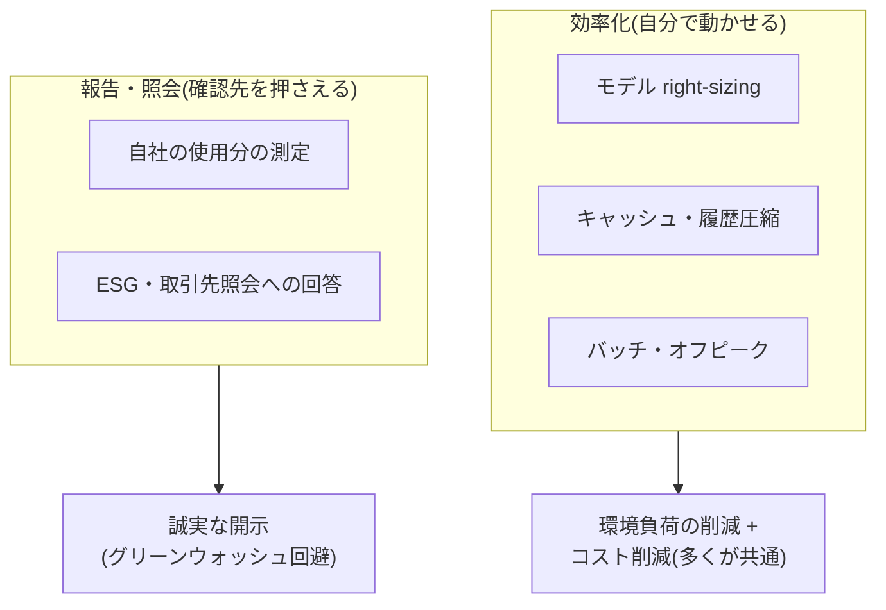

# AI の環境負荷とグリーン AI

## この記事の目的

AI の環境負荷(電力・水・カーボン)の**構造**を理解し、エンジニアが実際に打てる効率化と、増えつつある報告・照会への備えができるようになります。コスト最適化の施策の多くがそのまま環境負荷の削減にも効く、という接続を軸に、負荷の測り方の限界・プロバイダー開示の読み方・グリーンウォッシュを避ける誠実な主張までを、運用の実務として整理します。数値は前提で 1 桁以上動くため、本記事は具体値を断定せず「どの一次情報で最新値を確認するか」の所在も示します。

## 対象読者

- AI システムの運用・コストに責任を持ち、環境負荷の削減や報告要求にも向き合うエンジニア・テックリード
- ESG 開示や取引先からのサステナビリティ照会に、技術側から回答を準備する立場の人

## 前提知識

- [コスト管理](cost-management.md) — 本記事の削減施策の正本(コスト削減と環境削減は施策の多くが共通)
- [小型言語モデル(SLM)の活用戦略](../03-implementation/slm-strategy.md) — right-sizing の中心手段
- [GPU・AI ハードウェアの基礎](gpu-and-hardware-basics.md) — 電力を消費する計算資源の側

## 本文

### 概要: 環境負荷は「効率化」と「報告」の 2 面で捉える

AI の環境負荷にエンジニアが関われる面は、2 つに分かれます。

重要なのは、**効率化の施策の大半が[コスト管理](cost-management.md)とそのまま重なる**ことです。トークンを減らす・小さいモデルを使う・キャッシュする・急がない処理をバッチに逃がす — これらはコストを下げると同時に、計算量(=電力=カーボン)を下げます。グリーン AI を「別の取り組み」として立てる前に、すでにやっているコスト最適化が環境にも効いていることを押さえます。

一方、負荷の**測定と報告**は、断定を避けるべき領域です。推計は前提で大きく動き、プロバイダーの開示は自己申告で、規制・ツールも変化が速いためです。本記事は測定については「所在」を示すにとどめます。

### 負荷の構造

AI の環境負荷を語るとき、まず境界を揃えないと議論がかみ合いません。

- **学習 vs 推論**: 公開される推計は学習(training)偏重のものが多いですが、**普及したサービスでは推論(inference)の総量が支配的になり得ます**(1 回は小さくても回数が桁違い)。自社が運用者なら、効率化の主戦場は推論側です
- **データセンターの電力と冷却水**: 計算は電力を消費し、その多くが熱になり、冷却に電力と**水**を使います。施設の効率は PUE(電力使用効率 = 施設総電力 ÷ IT 機器電力、理想 1.0)、水は WUE(水使用効率、L/kWh)という指標で語られます。**PUE は「IT 機器から先」しか測らず、電源の炭素強度は別軸**です(低 PUE = 低排出ではない)
- **カーボンの会計境界(スコープ)**: 電力由来の排出は主にスコープ 2、ハードウェア製造やバリューチェーンはスコープ 3 です。さらにスコープ 2 は**立地ベース(その地域の電源構成)と市場ベース(証書調達を反映)で数値が大きく変わります**。開示値を読むときは、どの境界の数字かを必ず確認します
- **規模感は「帯」で捉える**: データセンターの電力需要や将来推計は、公的機関(IEA、米 LBNL/DOE など)が分析していますが、**将来はシナリオ幅が大きい**ため、単一の値を鵜呑みにしません。「無視できないが、前提次第で幅がある」という帯で捉えるのが誠実です

### エンジニアにできる削減

削減の主力は、特別なグリーン技術ではなく、**コスト最適化としてすでに確立された施策**です([コスト管理](cost-management.md)が正本)。

| 施策 | コストへの効果 | 環境への効果(同じ機構) | 補足 |
| --- | --- | --- | --- |
| モデル right-sizing(SLM・使い分け) | 単価の安いモデルで安く | 小さいモデルは計算量・電力が小さい | 品質評価とセット([SLM 活用戦略](../03-implementation/slm-strategy.md)・[モデル選定ガイド](../03-implementation/model-selection.md)) |
| プロンプトキャッシュ・履歴圧縮 | 再送トークンの削減 | 処理する計算量そのものが減る | [コスト管理](cost-management.md)のキャッシュ戦略 |
| セマンティックキャッシュ | モデル呼び出し回数の削減 | 呼ばない = 計算しない | 誤ヒット制御が前提([セマンティックキャッシュ](semantic-caching.md)) |
| バッチ処理・オフピーク実行 | バッチ API の割引 | 電力の炭素強度が低い時間帯・リージョンに寄せられる余地 | 即時性不要の処理を逃がす([バッチ処理](batch-processing.md)) |
| 無駄なループ・暴走の抑制 | トークン浪費の防止 | 空回りの計算 = 無駄な電力 | 上限設計([コスト管理](cost-management.md)の 3 層上限) |
| リージョン選択 | — | 電源構成の炭素強度が低いリージョンを選ぶ | レイテンシ・データ主権と両立する範囲で |

要点は、**「環境のために何か新しいことをする」より先に、コスト最適化を徹底することが最大の環境施策**だという点です。両者は同じ「計算量を減らす」機構を共有します。right-sizing は特に効果が大きく、すべてのステップに最上位モデルを使わない設計([SLM 活用戦略](../03-implementation/slm-strategy.md))が、コストとカーボンの両方を下げます。

### 測定の現実

自社の環境負荷を「正確に」測るのは難しく、限界を理解して使います。

- **推計手法**: 計算メタデータ(ハードウェア・稼働時間・リージョンの炭素強度)から排出を推計する手法(ML CO2 Impact Calculator 系)や、実行時に消費電力を実測するツール(CodeCarbon 系)があります。ソフトウェアの機能単位あたりの炭素強度を**レート**で算定する標準として Green Software Foundation の SCI(Software Carbon Intensity、ISO/IEC 21031)もあり、AI 向け拡張(SCI for AI)が整備されつつあります
- **推計の限界**: いずれの推計も、前提(モデル規模・ハードウェア・立地の炭素強度・PUE の仮定)で **1 桁以上動きます**。数値を出すときは、出典・確認日・前提を必ず併記し、レンジで示します。単一の断定値は誤解を生みます
- **プロバイダー開示の読み方**: 主要クラウド/AI プロバイダーは環境レポートを公表していますが、これは**自己申告**です。第三者保証(assurance)の有無・対象期間・算定境界を確認し、**社間の単純比較は避けます**(境界が揃っていないため)。API を使う側としては、各クラウドが提供する顧客単位のカーボン算定ツール(利用分のスコープ 2 排出を可視化)が、自社の使用分を測る現実的な入口です。ただしツールの提供形態は変わりやすく、市場ベースと立地ベースで数値が変わる点に注意します

### 報告需要への備え

環境負荷は「測って終わり」ではなく、**外部への報告・照会**が増えています。ここは規制の内容解釈には踏み込まず、確認先を押さえるにとどめます([業界別規制の入口マップ](../09-business/industry-regulations-map.md)と同じ姿勢)。

- **ESG・サステナビリティ開示**: 企業の GHG インベントリは GHG プロトコル(スコープ 1/2/3)を事実上の基盤とし、EU の CSRD/ESRS E1 など制度開示がこれを参照します。適用範囲・要求内容は変化中で、**自社が対象かは法務・サステナビリティ部門と確認**します
- **義務報告と自主開示は別物**: 「自主開示(各社のサステナビリティレポート)」と「義務報告(EU EED のデータセンター報告など規制ベース)」は性質が違います。前者は PR を含み、後者は規制要求です。読むときも作るときも区別します
- **取引先からの照会に備える**: サプライチェーンのスコープ 3 開示のため、取引先から「あなたの AI サービスの排出は」と問われる場面が増えます。自社の使用分(クラウドのカーボンツールの出力)と、依拠する前提を説明できる状態にしておきます

### グリーンウォッシュを避ける誠実な主張

環境の主張は、盛ると信頼を失います。エンジニアとして誠実であるための区別を持ちます。

- **相殺と実削減は別**: 「カーボンネガティブ」「ウォーターポジティブ」「再エネ 100%」「ネットゼロ」は、**相殺(オフセット)・証書調達・水補充・将来目標**を含む主張であり、実消費・実排出の削減とは別概念です。自社で語るときも、実削減なのか相殺なのかを区別します
- **時間単位と年間マッチングの違い**: 「再エネ 100%」の多くは年間の証書マッチングで、消費した瞬間にクリーン電力だったことを意味しません(時間単位のカーボンフリー = 24/7 CFE はより厳しい主張)。この違いを混同しません
- **できることを等身大で言う**: 運用者ができる最大の貢献は、派手な宣言ではなく、**right-sizing・キャッシュ・無駄の抑制で計算量を実際に減らすこと**です。測定の限界を認めたうえで、実施した効率化を具体的に示すのが、最も誠実で説得力のある主張です

## 実務での注意点

### アンチパターン

- **「グリーン AI」を既存のコスト最適化と別プロジェクトにする** → 同じ「計算量を減らす」施策を二重に立てて労力を分散する → コスト最適化を徹底することが最大の環境施策と捉え、[コスト管理](cost-management.md)に環境の観点を足す
- **単一の推計値を事実として引用する** → 前提で 1 桁動く数字を断定し、後で覆って信頼を失う → 出典・確認日・前提つきでレンジで示す
- **プロバイダーの環境数値で社間比較する** → 算定境界が揃っておらず、比較が無意味 → 境界(スコープ・立地/市場ベース・PUE/WUE のカテゴリ)を確認し、比較でなく自社の使用分の把握に使う
- **「再エネ 100%」「カーボンネガティブ」をそのまま自社の主張に流用する** → 相殺・年間マッチングを実削減と混同し、グリーンウォッシュになる → 実削減と相殺・目標を区別して語る
- **報告要求が来てから慌てる** → スコープ 3・CSRD・取引先照会に対応する測定基盤がなく、後手に回る → 自社使用分の測定(クラウドのカーボンツール)を平時から回し、確認先を法務・サステナビリティ部門と押さえておく

### チェックリスト

- [ ] コスト最適化施策(right-sizing・キャッシュ・バッチ・上限)を環境効果の観点でも棚卸しした
- [ ] 効率化の主戦場が推論側であることを踏まえて施策を優先付けした
- [ ] 環境負荷の数値を、出典・確認日・前提つきのレンジで扱っている(単一断定をしていない)
- [ ] プロバイダー開示を読むとき、算定境界(スコープ・立地/市場ベース・PUE/WUE)を確認している
- [ ] 自社の使用分を測る手段(クラウドのカーボン算定ツール等)を把握している
- [ ] ESG・取引先照会の確認先(GHG プロトコル・該当制度・自社の法務/サステナビリティ部門)を押さえた
- [ ] 自社で環境を語るとき、実削減と相殺・目標・年間マッチングを区別している

## 関連トピック

- [コスト管理](cost-management.md) — 削減施策の正本(コスト削減と環境削減は機構が共通)
- [小型言語モデル(SLM)の活用戦略](../03-implementation/slm-strategy.md) — right-sizing の中心手段
- [モデル選定ガイド](../03-implementation/model-selection.md) — 使い分け・ティア混在の判断
- [GPU・AI ハードウェアの基礎](gpu-and-hardware-basics.md) — 電力を消費する計算資源とその効率(量子化・帯域律速)
- [セマンティックキャッシュと応答再利用](semantic-caching.md) — 呼び出し回数を減らす削減施策
- [バッチ処理の設計(バッチ API の活用)](batch-processing.md) — 急がない処理を割引・オフピークに逃がす
- [業界別規制の入口マップ](../09-business/industry-regulations-map.md) — 報告・規制の確認先の示し方(同じ入口方式)
- [「自社モデルを持つか」の判断](../09-business/own-model-strategy.md) — 学習インフラを持つ場合に生じる環境・コストの追従負担

## 参考資料

- [GHG Protocol — Standards](https://ghgprotocol.org/standards) — スコープ 1/2/3 の企業排出会計の事実上の基盤(WRI/WBCSD)(アクセス日: 2026-07-09)
- [Green Software Foundation — Software Carbon Intensity (SCI)](https://greensoftware.foundation/standards/sci/) — 機能単位あたりの炭素強度をレートで算定する標準(ISO/IEC 21031)。AI 向け拡張 SCI for AI も策定中(アクセス日: 2026-07-09)
- [IEA — Energy and AI](https://www.iea.org/reports/energy-and-ai) — AI とエネルギーに関する国際横断の一次分析(将来はシナリオ幅が大きい)(アクセス日: 2026-07-09)
- [LBNL/DOE 2024 United States Data Center Energy Usage Report](https://eta.lbl.gov/publications/2024-lbnl-data-center-energy-usage-report) — 米国データセンター電力消費の公的推計(レンジ提示)(アクセス日: 2026-07-09)
- [European Commission — Energy performance of data centres](https://energy.ec.europa.eu/topics/energy-efficiency/energy-efficiency-targets-directive-and-rules/energy-efficiency-directive/energy-performance-data-centres_en) — EED に基づくデータセンターの義務報告・欧州データベース(委任規則 (EU) 2024/1364)(アクセス日: 2026-07-09)
- [ML CO2 Impact Calculator](https://mlco2.github.io/impact/) — ハードウェア・稼働・リージョンから学習の CO2 を推計するフレームワーク(論文 arXiv:1910.09700)(アクセス日: 2026-07-09)

各プロバイダーのサステナビリティレポート等、環境開示の一次情報 URL と確認状況は `research/strategy/green-ai.md` に整理しています(いずれも自己報告であり、社間比較には使いません)。

## TODO・未確認事項

> **TODO(要確認):** 主要クラウド/AI プロバイダーの環境開示(PUE・WUE・CFE 比率・スコープ別排出)は年次で更新され変動する。数値を引用する際は各社の最新サステナビリティレポートで確認する(所在は `research/strategy/green-ai.md`)(最終確認: 2026-07)

> **TODO(要確認):** 顧客向けカーボン算定ツールの提供形態は変化が速い(例: AWS Customer Carbon Footprint Tool は後継サービスへの移行が告知されている)。利用時に各クラウドの公式ページで現行のツール名・仕様を確認する(最終確認: 2026-07)

> **TODO(要確認):** ESG 開示制度(EU CSRD/ESRS E1 の適用範囲・簡素化の動向、EU EED のデータセンター・レーティングスキーム)は変化中。自社が対象かと最新の要求内容は各制度の公式ページと法務・サステナビリティ部門で確認する(最終確認: 2026-07)
