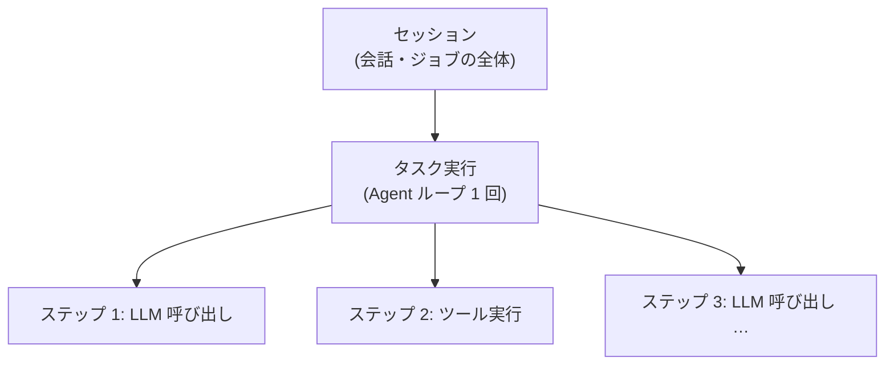

# 可観測性とトレーシング

## この記事の目的

本番の Agent で「たまに変な動きをする」を再現・分析できるように、何をどの粒度で記録するか(トレース設計)と、何を監視するか(メトリクスと品質シグナル)を設計できるようになります。プロンプトや応答というログの中身が機微データであることを前提にした扱いも決められるようになります。

## 対象読者

- Agent を本番投入するにあたり、監視・ログの設計に責任を持つエンジニア・SRE
- 「ユーザーから『変な応答だった』と言われたが、何が起きたか調べられない」状態を避けたいチーム

## 前提知識

- [Agent ループ](../01-concepts/agent-loop.md) — 記録対象となる実行構造
- [軌跡(trajectory)評価](../04-evaluation/trajectory-evaluation.md) — 同じ記録を評価側から見た話(本記事は本番運用側)

## 本文

### 概要: なぜ普通の APM では足りないか

Web アプリケーションの監視(APM)をそのまま Agent に当てても、肝心なものが見えません。理由は 3 つあります。

1. **失敗の多くが例外ではありません** — Agent の典型的な失敗は「エラーなく完走して、間違った答えを返す」静かな失敗です。エラー率のダッシュボードには何も映りません
2. **原因がコードの外にあります** — 障害の原因がプロンプトの 1 行・モデルの挙動・入力の変化に分散しており、スタックトレースでは追えません
3. **1 リクエストの裏に階層があります** — ユーザーから見た 1 応答の裏で、複数回の LLM 呼び出しとツール実行が走ります。リクエスト単位の集計では「どのステップで壊れたか」が分かりません

### 詳細: トレースの階層設計

Agent の実行は次の階層で記録します。

各スパンに記録すべき項目です。

| スパン | 記録項目 |
| --- | --- |
| 共通 | 開始・終了時刻、ステータス、親スパンへの参照 |
| タスク実行 | 入力タスク、最終結果、総ステップ数、総トークン数・コスト、使用したプロンプト・モデル・ツール定義のバージョン |
| LLM 呼び出し | モデル ID、入力(システムプロンプト・履歴)、出力、入出力トークン数、停止理由、レイテンシ |
| ツール実行 | ツール名、引数、結果(またはエラー)、レイテンシ |

ポイントは 2 つです。**バージョン情報を必ず含めること**(「この応答はどのプロンプトで生成されたか」が調査の起点になります。[バージョニング・デプロイ・モデル更新追従](versioning-and-model-updates.md))。そして**評価と同じ形式で記録すること** — 本番で見つけた失敗をそのまま評価ケースへ変換できるようになります([軌跡(trajectory)評価](../04-evaluation/trajectory-evaluation.md))。

### 詳細: メトリクスは「技術」と「品質」の 2 系統

| 系統 | 例 | 捉えられるもの |
| --- | --- | --- |
| 技術メトリクス | エラー率、レイテンシ、タスクあたりトークン・コスト、ステップ数の分布 | 暴走・障害・コスト異常。静かな失敗は捉えられない |
| 品質シグナル | 明示的フィードバック(評価ボタン)、暗黙的シグナル(言い直し率・人間へのエスカレーション率・タスク放棄率)、本番出力のサンプリング判定(オンラインでの LLM-as-a-Judge) | 静かな失敗の傾向。ただし遅行指標 |

技術メトリクスの中では**ステップ数の分布**が Agent 特有の早期警報になります。平均が同じでも分布の裾が伸びていれば、一部のセッションが迷走し始めているサインです。品質シグナルのサンプリング判定には検証済みの judge を使います([LLM-as-a-Judge](../04-evaluation/llm-as-a-judge.md))。

### 詳細: ログの中身は機微データ

プロンプトと応答の全文記録は調査に不可欠ですが、その中身にはユーザーの入力・社内データ・ツールが返した個人情報が含まれます。通常のアプリケーションログと同じ扱いにしてはいけません。

- 既知のパターン(認証情報・個人識別子)は記録前にマスキングします
- 保持期間を決めます(全文は短く、集計メトリクスは長く)
- アクセス制御を分けます(全文トレースの閲覧権限は調査担当に限定します)

漏えい経路としての詳細は `data-exfiltration.md`(執筆予定)で扱います。

### 設計判断: 何で作るか

選択肢は、OpenTelemetry の生成 AI 向け semantic conventions に沿った汎用スタック、LLM 特化の監視プラットフォーム、自前実装の 3 つです。判断軸は既存の監視基盤との統合・トレース全文の保存先(機微データを外部 SaaS に出せるか)・評価ワークフローとの接続です。

> **TODO(要確認):** OpenTelemetry GenAI semantic conventions の安定度(2026 年時点で開発中ステータス)と、LLM 監視プラットフォーム各種の機能は変化が速い。導入時に公式ドキュメントで確認する(最終確認: 2026-07)

### 詳細: アラートから対応へ

監視は検知して終わりではありません。コストレート・エラー率・ステップ数分布・品質シグナルのアラート条件を定義し、それぞれ「発火したら何をするか」を [インシデント対応](incident-response.md) の手順に接続します。

## 実務での注意点

### アンチパターン

- **最終応答だけをログする** → 中間ステップが見えず、「たまに変な動きをする」を再現も分析もできない → ループの全ステップ(LLM 呼び出し・ツール実行)を構造化して記録する
- **技術メトリクスだけを監視する** → エラーなく完走する誤動作(静かな失敗)を検知できない → 品質シグナル(フィードバック・エスカレーション率・サンプリング判定)を監視に組み込む
- **プロンプト・応答の全文を通常ログと同じ扱いで保存する** → 個人情報・機微データの漏えい経路になる → マスキング・保持期間・アクセス制御を最初に設計する
- **評価と本番で別のログ形式にする** → 本番の失敗を評価ケースに変換できず、改善サイクルが回らない → 共通のトレース形式に投資する

### チェックリスト

- [ ] ループの各ステップが構造化された形式で記録されている(評価側と共通)
- [ ] トレースにプロンプト・モデル・ツール定義のバージョンが含まれている
- [ ] タスク単位のコスト・ステップ数・レイテンシを集計できる
- [ ] ステップ数・コストを平均でなく分布(裾)で監視している
- [ ] 品質シグナルが定義され、静かな失敗を捉える手段がある
- [ ] ログ内の機微データの扱い(マスキング・保持期間・アクセス権)が決まっている
- [ ] アラート条件が対応手順(インシデント対応)に接続されている

## 関連トピック

- [Agent ループ](../01-concepts/agent-loop.md) — 記録対象の実行構造
- [軌跡(trajectory)評価](../04-evaluation/trajectory-evaluation.md) — 同じトレースを評価に使う
- [コスト管理](cost-management.md) — トークン・コスト計測の詳細
- [インシデント対応](incident-response.md) — アラートの先の対応手順
- [バージョニング・デプロイ・モデル更新追従](versioning-and-model-updates.md) — トレースに記録するバージョンの管理
- `data-exfiltration.md`(執筆予定)— ログ経由の情報漏えい対策

## 参考資料

- [Semantic conventions for generative AI systems(OpenTelemetry)](https://opentelemetry.io/docs/specs/semconv/gen-ai/) — LLM 呼び出し・エージェントのトレース属性の標準化の試み(アクセス日: 2026-07-05)

## TODO・未確認事項

> **TODO(要確認):** OpenTelemetry GenAI semantic conventions の安定度と主要監視プラットフォームの対応状況を、導入時に公式ドキュメントで確認する(最終確認: 2026-07)
