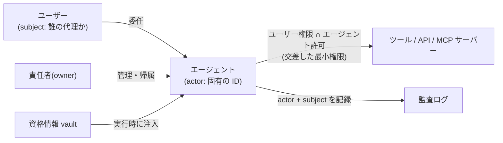

# エージェントの認証・認可

## この記事の目的

「このエージェントは誰として動くのか」を設計できるようになります。エージェント自身の ID、ユーザーからの委任、権限の最小化、行為の帰属(誰の責任か)、資格情報の受け渡しという 5 つの問いに分解し、2026-07 時点の標準化状況(専用標準は未成立)を踏まえた実務の組み立て方を扱います。

## 対象読者

- エージェントに社内システム・外部 API へのアクセスを与える設計を担当するエンジニア
- エージェント導入のセキュリティレビューで「アカウントと権限をどうするか」を判断するセキュリティ担当・アーキテクト

## 前提知識

- [ツール権限設計とサンドボックス](tool-permissions-and-sandboxing.md) — ツール層の権限制御(本記事はその下のアイデンティティ層)
- [Agent の脅威モデル概観](threat-model-overview.md) — エージェントが騙され得る前提(権限設計の出発点)
- ライブラリ外の前提: OAuth 2.0 の基本(アクセストークン・スコープ・認可サーバー)

## 本文

> **最終確認日:** 2026-07-06 — 本記事が触れる標準(IETF ドラフト・MCP 仕様)と各社機能の状況(GA / Preview)はこの日時点の公式一次情報に基づきます。調査記録は `research/professional/agent-identity.md` にあります。

### 概要: 「誰として動くのか」を 5 つの問いに分解する

従来のシステムの主体は「人間」か「サービス(機械)」の二分でした。エージェントはその中間にいます — 機械でありながらユーザーの代理で判断・行動し、しかも入力次第で騙され得る主体です。この設計は次の 5 つの問いに分解できます。

1. **認証(authentication)**: エージェント自身をどう識別するか(エージェント個別の ID)
2. **委任(delegation)**: 誰の代理として動くのかをどう表現するか
3. **認可(authorization)**: 何をしてよいか、権限をどう最小化するか
4. **帰属(attribution)**: 行為を誰の責任として記録・監査するか
5. **資格情報(credentials)**: ツール・外部サービスへの鍵をどう安全に渡すか

2026-07 時点で「AI エージェント専用」の認証・認可標準は存在せず、既存の OAuth 部品(トークン交換・委任クレーム)の組み合わせが実務解です。標準の現在地は後述の「標準化の動向」にまとめます。

### 2 つのアイデンティティモデル

エージェントの ID 設計は、大きく 2 つのモデルから選びます。

| | サービスアカウント型(自律) | ユーザー代理型(on-behalf-of) |
| --- | --- | --- |
| 動作 | エージェント自身の権限で動く(定期バッチ・自動処理) | 特定ユーザーの委任を受けて動く(アシスタント・対話型) |
| アクセス範囲 | エージェントに付与した固定の権限 | ユーザーの権限とエージェント許可の交差(後述) |
| 向く場面 | 特定ユーザーに紐づかない処理。入力が信頼できる範囲に閉じる処理 | ユーザーごとにアクセス範囲が違う処理。個人データを扱う処理 |
| 主なリスク | 権限が固定で広くなりがち。「誰のための処理か」がログから消えやすい | 委任の設計を誤ると、ユーザーへのなりすましと区別できなくなる |

判断の軸は 2 つです。**アクセス範囲がユーザーに依存するか**(依存するならユーザー代理型でないと権限管理が破綻します)と、**行為の責任を誰に置くか**(自律型はエージェントの責任者に、代理型は委任したユーザー + 責任者に帰属します)。

最悪の設計は「全ユーザー・全エージェント共有の強力なサービスアカウント 1 つ」です。全員の権限の和集合を持つ単一アカウントは、権限の最小化・帰属・失効のすべてを不可能にします。**エージェントごとに固有の ID を発行する**のが出発点です(このため主要各社はエージェント個別 ID の管理機能を製品化しています。後述)。

### トークンと委任の設計

ユーザー代理型の核心は、「ユーザーそのもの」と「ユーザーの代理をするエージェント」をトークン上で区別することです。OAuth 2.0 Token Exchange(RFC 8693)はこの区別を標準語彙で提供します。

- **なりすまし(impersonation)**: エージェントがユーザーと見分けが付かないトークンを持つ。下流のシステムは相手がエージェントだと分からない
- **委任(delegation)**: トークンの subject(誰の代理か)と actor(実際に行動する主体 = エージェント)が分離され、`act` クレームで「委任が起きたこと」と「現在のアクター」が表現される。多段の委任(ユーザー → アプリ → エージェント)もネストで表せる

実務の原則は **「委任を選び、なりすましを避ける」** です。エージェントは外部入力に騙され得るため([プロンプトインジェクション](prompt-injection.md))、下流システムとログが「これはエージェントの行為だ」と識別できることが、レート制限・追加検証・インシデント調査のすべての前提になります。

あわせて、トークンは **短寿命**(漏えい時の窓を狭める)、**スコープ最小**(次節)、**対象限定**(audience を特定のサービスに限定し、他所で使い回せなくする)を基本とします。なお「on-behalf-of(OBO)フロー」という名称は特定ベンダーの実装名で、IETF 側の一般形は RFC 8693 です — ドキュメントを読むときはこの対応を頭に置くと混乱しません。

### 権限の交差と最小化

ユーザー代理型でやりがちな誤りは、**ユーザーの権限をそのまま全部エージェントに渡す**ことです。人間には「変な指示は無視する」判断力がありますが、エージェントは間接プロンプトインジェクションで攻撃者の指示を実行し得ます。つまり **エージェントに渡した権限は、すべて攻撃面になる** 前提で設計します。

- **交差(intersection)**: エージェントの実効権限 = ユーザーの権限 ∩ エージェントに許可した操作、にします。「ユーザーができること」ではなく「このエージェントの職務に必要なこと」が上限です
- **タスク単位に絞る**: 常時フルスコープではなく、タスクの種類に応じたスコープでトークンを発行します。MCP の認可仕様(2025-11-25 版)にも、必要になった時点でスコープを追加要求する段階的同意(step-up)が入りました
- **高リスク操作は権限で解決しない**: 送金・削除・外部送信のような操作は、スコープを与えた上で人間の承認を挟みます([Human-in-the-Loop 設計](../02-architecture/human-in-the-loop.md))。認可の標準側でも、人間の非同期承認を組み込むアプローチ(CIBA 等)が製品化されています
- **ツール層との分担**: 本記事のアイデンティティ層(誰として・どのスコープで)と、[ツール権限設計とサンドボックス](tool-permissions-and-sandboxing.md)のツール層(どのツールを・どの引数制約で)は重ねて使います。どちらか一方では守れません

### 監査と帰属

「誰がやったのか」に答えられないエージェントは、本番に置けません。

- **actor と subject を両方記録する**: すべての行為ログに「どのエージェントが(actor)」「誰の委任で(subject)」「どのタスク・セッションで」を残します。委任チェーンをトークン(`act` クレーム等)に刻んでおくと、下流システムのログにも自然に残ります
- **人間の責任者を紐づける**: エージェント ID には所有者(owner)となる人間・チームを必ず割り当てます。作った人が異動・退職した「野良エージェント」は、権限を持ったまま管理不能になります。ID 管理製品がエージェントにオーナー・スポンサーを紐づける機能を持つのはこのためです
- **人間と区別できるログにする**: 監査ログ上でエージェントの行為が人間の操作と混ざると、不正調査もインシデント対応も止まります。エージェント ID を独立したプリンシパルとして扱い、フィルタできるようにします([可観測性とトレーシング](../05-operations/observability-and-tracing.md) のトレースと突き合わせられるとさらに強力です)
- **失効を設計する**: 責任者の異動・エージェントの廃止・インシデント時に、トークンと資格情報を即座に無効化できる手順を用意します([インシデント対応](../05-operations/incident-response.md)のキルスイッチの一部です)

### 資格情報の受け渡し

エージェントは多数のツール・外部サービスの鍵を必要としますが、**モデルが読める場所に鍵を置いてはいけません**。プロンプト・ルールファイル・会話履歴に入れた資格情報は、インジェクションや出力経由で漏えいします([データ漏えい対策](data-exfiltration.md))。

- **vault + 実行時注入**: 資格情報は専用の保管庫(vault)に置き、ツール実行の瞬間にアプリ側コードが注入します。エージェントにはプレースホルダしか見せず、外部への送信時に実値へ差し替える実装(エグレス時差し替え)なら、モデルは一度も実値を見ません
- **トークンの自動管理**: OAuth のリフレッシュトークン管理(取得・更新・失効)をアプリ側や token vault サービスに寄せ、エージェントのループ内でトークンを扱わない構成にします
- **ツールごとに個別の資格情報**: 全ツール共通の 1 つの鍵は、1 箇所の漏えいで全体が破られます。ツール・接続先ごとにスコープの狭い鍵を分け、影響範囲(blast radius)を限定します
- **MCP サーバーへの認可**: MCP の認可仕様は OAuth ベースで、リソースサーバー(MCP サーバー)と認可サーバーの分離、トークンの対象(audience)検証、そして **受け取ったトークンをそのまま上流 API へ転送する「トークンパススルー」の禁止**を定めています。パススルーは、権限のない主体が権限のある仲介者を悪用する混乱した代理人(confused deputy)問題の典型経路です([ツール接続標準(MCP とエコシステム)](../03-implementation/mcp-and-tool-protocols.md))
- **長寿命 API キーからの脱却**: 静的な API キーを配るのではなく、実行環境の ID から短寿命トークンへ交換するフェデレーション(workload identity federation)を使うと、「漏れる鍵」自体をなくせます。使う場合のキーはシークレットマネージャ保管 + 定期ローテーションが最低線です

### 標準化の動向(2026-07 時点)

変化が速い領域なので、「何が確定していて、何がまだ動いているか」を分けて把握します。

**確定している土台**:

- OAuth 2.0 Token Exchange(RFC 8693、2020 年発行): subject / actor の分離、`act` / `may_act` クレームによる委任チェーン表現。エージェント委任の実務の基礎語彙です

**採択済み・成立が近い標準**(いずれも 2026-07 時点で IETF ドラフト):

- **ID-JAG**(Identity Assertion JWT Authorization Grant): 企業 IdP のアサーションを起点に別アプリのトークンを得る OAuth WG 採択ドラフトで、仕様の付録に AI エージェントのユースケースが明記されています。ID 管理ベンダーの「Cross App Access(XAA)」(著者と仕様構成から ID-JAG をベースにしているとみられます)は、MCP の公式認可拡張(Enterprise-Managed Authorization)に採用されました
- **identity-chaining**: 複数トラストドメインをまたいでユーザー ID と認可を伝搬する仕様で、RFC 化の最終段階にあります
- 一方、「AI エージェント専用」を掲げる提案(WIMSE ワーキンググループのエージェント系ドラフト、on-behalf-of-user 拡張など)は 2026-07 時点ですべて個人ドラフト段階で、うち on-behalf-of-user 拡張は既に失効(expired)しています。OAuth 2.1 自体もまだドラフトです

**MCP の認可仕様**(現行リビジョン 2025-11-25):

- MCP サーバー = OAuth のリソースサーバーという整理、認可サーバーの分離、`resource` パラメータ必須、トークンパススルー禁止、事前登録なしクライアントの識別方式(CIMD)などを規定しています
- 認可章はリビジョンごとに大きく変わってきた実績があるため、実装時は必ず **バージョン付きの仕様 URL** を参照し、更新を追う前提で設計します

**主要ベンダーの提供状況**(名称・提供区分は 2026-07 時点。詳細と出典は調査メモ参照):

| 提供元 | 概要 | 状況 |
| --- | --- | --- |
| Microsoft(Entra Agent ID) | エージェント個別 ID(blueprint → agent identity)、条件付きアクセス・監査ログ、非対話の confidential client 設計 | GA(一部機能は Preview) |
| AWS(Bedrock AgentCore Identity) | インバウンド / アウトバウンド認証の分離、OAuth トークン等の token vault | GA |
| Google Cloud(Agent Identity) | エージェントに SPIFFE ID + 短寿命 X.509 を直接割り当て、証明書に束縛されたトークンを発行 | Preview |
| Okta / Auth0 | XAA(ID-JAG がベースとみられるクロスアプリ認可)、token vault、CIBA による非同期の人間承認 | 段階的提供中 |
| Anthropic | API 認証のフェデレーション(SPIFFE・各社 IdP 対応)、エージェント用資格情報のエグレス時差し替え型 vault | 提供中 |

ここから読み取るべき実務上の含意は 2 つです。(1) **「エージェント個別 ID + 委任表現 + vault」という設計形はベンダー横断で収斂しつつある**ので、この形で設計しておけば移植可能性が高い。(2) 個別の製品名・提供区分は 1 年以内に変わる可能性が高いので、設計文書では製品名でなく設計形(上の 5 つの問い)で書いておくのが安全です。

## 実務での注意点

### アンチパターン

- **全エージェント共有の強力なサービスアカウントで動かす** → 権限最小化・帰属・失効がすべて不可能になり、1 つの漏えいが全権限の漏えいになる → エージェントごとに固有 ID を発行し、職務に必要な権限だけ与える
- **ユーザー権限をそのまま渡す(なりすまし型の委任)** → インジェクションで騙されたとき、ユーザーの全権限が攻撃面になり、ログ上も人間の操作と区別できない → subject / actor を分離した委任 + 権限の交差にする
- **API キーをプロンプト・ルールファイル・コードに直書きする** → モデル経由・リポジトリ経由で漏えいする → vault + 実行時注入(またはエグレス時差し替え)にし、モデルの可視範囲から鍵を消す
- **MCP サーバーで受けたトークンを上流 API へ使い回す(トークンパススルー)** → audience 検証が壊れ、混乱した代理人問題の経路になる → 自分宛てトークンのみ受理し、上流へは自分の資格情報で接続する
- **「標準が固まってから設計する」と先送りする** → 専用標準の完成を待つ間、共有アカウントと直書きキーが本番に残り続ける → 確定済みの土台(個別 ID・RFC 8693 型の委任・vault)で今設計し、動く部分は定点観測で追従する

### チェックリスト

- [ ] エージェントごとに固有の ID があり、共有アカウントを使っていない
- [ ] サービスアカウント型 / ユーザー代理型の選択理由が設計文書に書かれている
- [ ] 委任トークンで subject(誰の代理か)と actor(エージェント)が区別されている
- [ ] エージェントの実効権限が「ユーザー権限 ∩ エージェント許可」の交差になっている
- [ ] トークンは短寿命・スコープ最小・audience 限定になっている
- [ ] 高リスク操作にスコープだけでなく人間の承認ゲートがある
- [ ] 資格情報が vault 管理され、モデルの可視範囲(プロンプト・履歴)に現れない
- [ ] ツール・接続先ごとに資格情報が分離されている(blast radius の限定)
- [ ] 監査ログでエージェント ID・委任元ユーザー・責任者(owner)を辿れる
- [ ] エージェント ID・資格情報を即時失効できる手順がある

## 関連トピック

- [ツール権限設計とサンドボックス](tool-permissions-and-sandboxing.md) — アイデンティティ層と重ねて使うツール層の制御
- [データ漏えい対策](data-exfiltration.md) — 資格情報がモデル可視領域にあるときの漏えい経路
- [プロンプトインジェクション](prompt-injection.md) — 「渡した権限はすべて攻撃面」の根拠
- [Human-in-the-Loop 設計](../02-architecture/human-in-the-loop.md) — 権限で解決しない高リスク操作の承認ゲート
- [ツール接続標準(MCP とエコシステム)](../03-implementation/mcp-and-tool-protocols.md) — MCP サーバー接続の全体像
- [可観測性とトレーシング](../05-operations/observability-and-tracing.md) — 帰属ログとトレースの突き合わせ
- [ケーススタディ: 社内 IT ヘルプデスク Agent](../07-case-studies/case-study-it-helpdesk-agent.md) — 実行系での最小権限・帰属・監査証跡の実例

## 参考資料

- [RFC 8693: OAuth 2.0 Token Exchange(IETF)](https://datatracker.ietf.org/doc/rfc8693/) — subject / actor の分離と `act` クレームによる委任表現(アクセス日: 2026-07-06)
- [MCP Authorization(2025-11-25 リビジョン)](https://modelcontextprotocol.io/specification/2025-11-25/basic/authorization) — MCP サーバーの OAuth ベース認可仕様(アクセス日: 2026-07-06)
- [Identity Assertion JWT Authorization Grant(IETF OAuth WG ドラフト)](https://datatracker.ietf.org/doc/draft-ietf-oauth-identity-assertion-authz-grant/) — AI エージェントのツールアクセスをユースケースに含むクロスアプリ認可(アクセス日: 2026-07-06)
- [Microsoft Entra Agent ID](https://learn.microsoft.com/en-us/entra/agent-id/what-is-microsoft-entra-agent-id) — エージェント個別 ID・条件付きアクセス・監査の商用実装例(アクセス日: 2026-07-06)
- [Amazon Bedrock AgentCore Identity](https://docs.aws.amazon.com/bedrock-agentcore/latest/devguide/identity.html) — インバウンド / アウトバウンド認証と token vault(アクセス日: 2026-07-06)
- [Google Cloud IAM: Agent Identity](https://docs.cloud.google.com/iam/docs/agent-identity-overview) — SPIFFE ID と証明書束縛トークンによるエージェント ID(アクセス日: 2026-07-06)
- [Okta: Cross App Access パートナー発表](https://www.okta.com/newsroom/press-releases/okta-announces-cross-app-access-partners/) — XAA の MCP 公式認可拡張への採用(アクセス日: 2026-07-06)
- [Claude API: Authentication](https://platform.claude.com/docs/en/manage-claude/authentication) — API キーと workload identity federation の使い分け(アクセス日: 2026-07-06)

## TODO・未確認事項

> **TODO(要確認):** OpenAI のエージェント資格情報に関する公式推奨(API キー安全ベストプラクティス、Connectors の OAuth 認可)を platform.openai.com で確認する(今回の調査では取得できず)(最終確認: 2026-07)

### 変わりやすい項目(定点観測)

- OAuth 2.1 の RFC 化(2026-07 時点でドラフト。IESG 提出予定 2026-12)
- MCP 認可仕様の次期リビジョン(認可章はリビジョンごとに大きく変わる実績。CIMD・拡張仕様の扱い)
- IETF のエージェント関連ドラフトの採択・失効(ID-JAG、identity-chaining、WIMSE のエージェント系個人ドラフト)
- 各社のエージェント ID 機能の提供区分(Google Cloud Agent Identity の GA 化、Okta XAA / Auth0 の提供拡大)と製品名の再編
