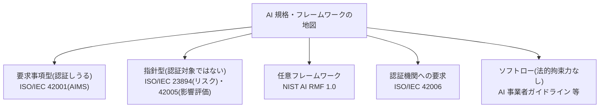

# AI 規格・認証の実務(ISO/IEC 42001 ほか)

> **免責:** 本記事は法的助言ではありません。規格の逐条解説はせず、「AI マネジメント規格・認証を検討するとき、何を・どこで確認するか」の所在と判断の枠組みを示します。個別の適合性・認証の要否は、認証機関・法務・専門家に確認してください。

## この記事の目的

AI マネジメントシステム規格(ISO/IEC 42001 ほか)への適合・認証を検討するとき、**規格の地図(どれが認証できて、どれが指針か)・認証を取る意味と限界・適合の進め方・取得判断のフレーム**を持ち帰れるようになります。「認証を取れば AI が安全」という誤解を避け、費用対効果で判断できる状態を目指します。規制そのものの地図は[コンプライアンスとガバナンス](compliance-and-governance.md)が正本で、本記事はその中の「規格・認証」を掘り下げます。

**本記事は変化のあるページです。** 規格の版・整合規格の進捗・国内認定制度は動くため、具体は本文冒頭の最終確認日と各公式で確認してください。

## 対象読者

- 取引先要件や信頼の外部化のために、AI マネジメント規格の認証取得を検討する立場の人(セキュリティ・品質・ガバナンス担当、テックリード)
- 「ISO/IEC 42001 を取るべきか」を費用対効果で判断したい人

## 前提知識

- [コンプライアンスとガバナンス](compliance-and-governance.md) — 規制・ガバナンスの地図の正本(本記事はその中の規格・認証層)
- [業界別規制の入口マップ](../09-business/industry-regulations-map.md) — 同じ入口マップ方式の業界規制版

## 本文

> **最終確認日:** 2026-07-10 — 本記事が挙げる規格の版・制度はこの日付時点のものです。各一次情報 URL・確認状況は、リポジトリ内 `research/ecosystem/standards.md` を参照してください。規格本文は有償のことが多く、本記事は所在と枠組みまでを示します。

### 規格の地図: 「認証できるもの」と「指針」を分ける

AI に関わる規格・フレームワークは種類が違い、**認証できるものとできないものが混在**します。ここを分けないと議論が混乱します。

| 種類 | 代表例 | 性格 |
| --- | --- | --- |
| **要求事項型**(認証できる) | ISO/IEC 42001(AI マネジメントシステム、AIMS) | 組織が満たすべき要求。第三者認証の対象になる |
| 指針型(認証対象ではない) | ISO/IEC 23894(AI リスクマネジメントの指針)、ISO/IEC 42005(AI システム影響評価) | 「やり方の手引き」。それ自体は認証されない |
| 任意フレームワーク | NIST AI RMF 1.0(+ 生成 AI プロファイル) | 任意(voluntary)の枠組み。認証規格ではない |
| 認証機関への要求 | ISO/IEC 42006 | 認証機関が満たす要求(認証の信頼性を担保する土台) |
| ソフトロー | AI 事業者ガイドライン(日本)等 | 法的拘束力を持たない政府の任意ガイド |

**「規格 = 認証」ではありません。** 認証できるのは要求事項型の ISO/IEC 42001 であり、指針(23894・42005)や任意フレームワーク(NIST AI RMF)は「認証」する対象ではありません。この違いを最初に押さえます。

### ISO/IEC 42001 とは(所在レベル)

ISO/IEC 42001(2023 年発行、世界初とされる AI マネジメントシステム規格)は、**個々の AI アプリの技術詳細ではなく、組織が AI のリスクと機会を PDCA で統制する「仕組み」**を要求します。対象は AI を開発・提供・利用する組織全般です。

- **ISMS(ISO/IEC 27001)との関係**: ISO 共通の高位構造を採り、27001 と骨格(組織の状況・リーダーシップ・計画・運用・改善など)を共有します。既に ISMS を持つ組織は**統合マネジメントシステムとして拡張**しやすく、27001 の代替ではなく **AI 固有の統制(バイアス管理・影響評価・透明性など)を上乗せする**関係と捉えます
- **日本での位置づけ**: ISO/IEC 42001 に一致する **JIS Q 42001:2025** が国内規格として発行されています(技術内容は同じ)

規格の逐条は有償の本文が正なので、本記事は「何を扱うか + 公式の所在」までにとどめます(詳細は末尾の参考資料・研究メモ)。

### 認証を取る意味と限界

**認証を「安全の証明」と誤解しないこと**が、この記事で最も重要な点です。

- **意味(なぜ取るか)**: 認証は**取引要件への対応・信頼の外部化**です。「AI を統制する仕組みを組織が備え、独立した第三者が確認した」ことを、取引先・規制当局・利用者に示せます。RFP でマネジメント規格の認証を求められる場面が増えています([AI 調達・ベンダー選定の実務](../09-business/ai-procurement.md)は買う側の視点)
- **限界(認証 ≠ 安全)**: 認証は**マネジメントシステムの適合**であって、**個々の AI 出力の正確性・無害性を保証しません**。「認証を取ったから安全・正しい」ではなく、「AI を統制する仕組みがあることを確認した」に過ぎません。安全そのものの評価は別系統(評価・レッドチーミング・[フロンティアセーフティ](frontier-safety-overview.md))です
- **認定の出所で通用範囲が変わる**: 認証は「認定機関 → 認証機関 → 認証取得組織」の二層構造で成り立ちます。日本では ISMS-AC(認定機関)が認証機関を認定する国内制度が 2025〜2026 年に立ち上がりました。どの認定機関の認定を受けた認証かで通用範囲が変わりうる、という観点を持ちます(個別案件の判断は認証機関に確認)

### 適合の進め方

認証取得を決めたら、実務はマネジメントシステム構築の定石に沿います。

- **既存の仕組みと統合する**: ISMS(27001)や品質(9001)を持つなら、高位構造の共通部分を活かして統合します。ゼロから作らず、既存の文書・運用に AI 固有の統制を足します
- **ギャップ分析から始める**: 規格の要求と現状の差分(ギャップ)を洗い出し、埋めるべき統制・文書を特定します
- **文書化は運用の写像にする**: 規格は文書化を求めますが、**実際の運用と乖離した文書は監査で露呈**します。運用していることを文書にする、が原則です
- **影響評価・リスク管理を回す**: AI 固有のリスク(バイアス・誤用・影響)を評価し記録する仕組みを持ちます(指針として ISO/IEC 23894・42005 や NIST AI RMF を参照できます)

### 監査対応

認証は一度取って終わりでなく、定期的な審査で維持します。

- **監査は運用の副産物にする**: [コンプライアンスとガバナンス](compliance-and-governance.md)の「監査対応は日々の運用の副産物」という原則が、規格でも同じです。監査のためだけの作業を作ると形骸化します。日々の運用で記録が残る設計にします
- **記録が要求に対応することを示せる**: 何を・どう統制しているかを、記録(ログ・レビュー記録・影響評価)で示せる状態を保ちます

### 取得判断のフレーム

認証取得は費用対効果の判断です。次を問います。

- **誰に求められているか**: 取引先・入札・規制で認証が要件になっているか。要件でないのに「箔付け」で取ると、維持コストに見合いません
- **維持できるか**: 認証は取得より**維持**(定期審査・文書更新・運用継続)にコストがかかります。維持できる体制があるか
- **代替で足りないか**: 取引先が求めるのが「認証」なのか「統制の実態」なのか。自己宣言・第三者評価・既存認証で足りる場合もあります
- **規格 vs 指針 vs フレームワークの使い分け**: 認証が要らないなら、認証せずに指針(23894・42005)や NIST AI RMF を**内部のガバナンス改善に使う**選択もあります(認証なしで中身を良くする)

## 実務での注意点

### アンチパターン

- **認証を「AI が安全・正しい」証明として扱う** → マネジメントシステムの適合であって個々の出力を保証しない → 「統制の仕組みの確認」と正しく位置づけ、安全性は別系統(評価・レッドチーミング)で担保する
- **規格と指針・フレームワークを混同する** → 認証できない指針(23894/42005)や任意 FW(NIST AI RMF)を「認証する」と誤解する → 要求事項型(認証できる)と指針・任意 FW を分ける
- **要件でないのに箔付けで認証を取る** → 取得・維持コストが効果に見合わない → 「誰に求められているか」を先に確認し、費用対効果で判断する
- **ゼロから作ろうとする** → 既存の ISMS 等と統合できる部分を活かせず、二重管理になる → 高位構造の共通部分を活かして統合マネジメントシステムにする
- **監査のためだけの文書を作る** → 運用と乖離し、監査で露呈し、形骸化する → 日々の運用で記録が残る設計にし、監査を運用の副産物にする

### チェックリスト

- [ ] AI 規格を「要求事項型(認証できる)/指針/任意フレームワーク/ソフトロー」で区別している
- [ ] 認証が「統制の仕組みの確認」であり「AI の安全・正しさの保証ではない」と理解している
- [ ] 認証取得の動機(取引要件・信頼の外部化)が明確で、費用対効果で判断している
- [ ] 既存の ISMS 等との統合を検討した(ゼロから作っていない)
- [ ] ギャップ分析を行い、埋めるべき統制・文書を特定した
- [ ] 文書が実際の運用の写像になっている(監査のためだけの文書でない)
- [ ] 認証の維持(定期審査・更新)を続けられる体制がある
- [ ] 認証が不要な場合、指針・フレームワークを内部改善に使う選択も検討した

## 関連トピック

- [コンプライアンスとガバナンス](compliance-and-governance.md) — 規制・ガバナンスの地図の正本(本記事は規格・認証層)
- [業界別規制の入口マップ](../09-business/industry-regulations-map.md) — 同じ入口マップ方式の業界規制版
- [フロンティアセーフティの概観](frontier-safety-overview.md) — 安全そのものの評価(認証とは別系統)
- [AI 調達・ベンダー選定の実務](../09-business/ai-procurement.md) — 認証を取引要件として求める買う側の視点
- [AI 利用ポリシー策定の実務](../09-business/ai-usage-policy.md) — 社内ルール(規格適合の内部運用側)
- [PoC から本番への進め方](../09-business/poc-to-production.md) — 規格・認証の確認を組み込む関門

## 参考資料

- [ISO/IEC 42001(ISO 公式)](https://www.iso.org/standard/42001) — AI マネジメントシステム規格のページ(アクセス日: 2026-07-10)
- [NIST AI Risk Management Framework](https://www.nist.gov/itl/ai-risk-management-framework) — 任意のリスクマネジメントフレームワーク(認証規格ではない)(アクセス日: 2026-07-10)
- [Understanding standardisation in the AI Act(European Commission)](https://digital-strategy.ec.europa.eu/en/policies/ai-act-standardisation) — EU AI Act の整合規格(CEN-CENELEC JTC 21)の所在(アクセス日: 2026-07-10)
- [JIS Q 42001:2025 発行のお知らせ(ISMS-AC)](https://isms.jp/topics/news/20250820-1.html) — ISO/IEC 42001 の JIS 化(一致規格)(アクセス日: 2026-07-10)
- [AIMS 適合性評価制度(ISMS-AC)](https://isms.jp/aims.html) — 国内の AI マネジメントシステム認定制度(認定機関 → 認証機関)(アクセス日: 2026-07-10)

その他の規格(ISO/IEC 22989・23894・42005・42006)・認証機関の代表例・AISI/IPA の評価観点ガイドの所在は `research/ecosystem/standards.md` に整理しています。

## TODO・未確認事項

> **TODO(要確認):** ISO/IEC 42001 の改訂、関連規格(42005・42006 ほか)の追補、EU 整合規格(JTC 21)の個別番号・ステータス、日本の認定制度(ISMS-AC「AIMS 適合性評価制度」)の認証機関・取得組織の状況は動く。取得を検討する際は各公式(iso.org・nist.gov・digital-strategy.ec.europa.eu・isms.jp)で現行を確認する(所在は `research/ecosystem/standards.md`)(最終確認: 2026-07)

### 変わりやすい項目(定点観測)

> **TODO(要確認):** ISO/IEC 42001 の版・SC 42 の新規格、NIST AI RMF の改訂、EU 整合規格の進捗、日本の JIS Q 42001 の版・ISMS-AC 認定制度の立ち上がり(初認証/初認定の時系列は公式で食い違いがあり、日付は断定しない)を四半期ごとに確認する(`research/ecosystem/standards.md` を更新起点にする)(最終確認: 2026-07)
