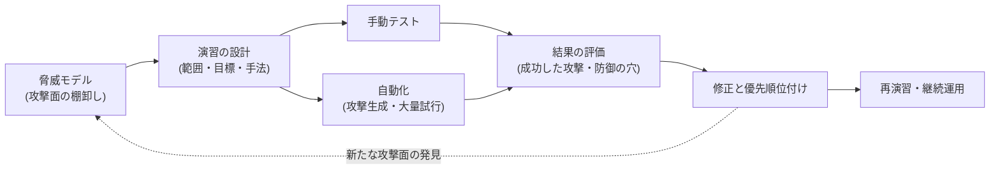

# エージェントのレッドチーミング

## この記事の目的

脅威モデル([Agent の脅威モデル概観](threat-model-overview.md))を机上の分析で終わらせず、実際に攻撃を試して防御の穴を見つける演習(レッドチーミング)を設計・運用できるようになります。攻撃シナリオの作り方、手動テストの型、自動化の使いどころ、結果の評価と修正の優先順位付け、そして継続的に回す仕組みを扱います。

## 対象読者

- Agent を本番投入する前に、防御の実効性を攻撃側の視点で検証したいエンジニア・セキュリティ担当
- 脅威モデルは作ったが、それが本当に守れているか確かめる手段を持っていないチーム

## 前提知識

- [Agent の脅威モデル概観](threat-model-overview.md) — 何を攻撃対象にするかの地図(レッドチーミングはこの検証)
- [プロンプトインジェクション](prompt-injection.md) — 主要な攻撃手法の各論
- [ガードレール](guardrails.md) — 検証対象となる防御層

## 本文

### 概要: レッドチーミングは脅威モデルの「実地試験」

脅威モデリングが「どこが危ないかを机上で洗い出す」作業なら、レッドチーミング(red teaming)は「実際に攻撃して、想定した防御が本当に効くか試す」作業です。前者だけでは「対策したつもり」が残り、後者だけでは網羅性がありません。両輪で使います。

対象は「モデルが不適切な文章を出すか」だけではありません。エージェント特有の主眼は **「騙されたモデルが、権限を使って実際に害のある行動を取れてしまうか」** です。有害な出力より、有害な**行動**(データ持ち出し・不正操作)に重心を置きます。

### 演習の設計

やみくもに攻撃しても学びは得られません。先に 4 点を決めます。

- **範囲(スコープ)**: どのシステム・どの機能・どの権限構成を対象にするか。本番そっくりの権限を持つ検証環境で行うのが理想です(本番で破壊的攻撃を試さない)
- **目標(攻撃者のゴール)**: 脅威モデルの高リスク項目から具体的なゴールを設定します。「間接インジェクションで社内文書を外部メールに送らせる」「承認ゲートを迂回して書き込み操作を実行させる」のように、成功/失敗が判定できる形にします
- **前提(攻撃者の能力)**: 攻撃者が何にアクセスできるか(Agent が読む Web ページを改ざんできる/メールを送れる/ユーザーとして入力できる)を明示します。前提が変われば攻撃面が変わります
- **成功条件と記録**: 何をもって「攻撃成功」とするか、証拠(ログ・軌跡)をどう残すかを決めます。再現手順が残らない攻撃は修正につなげられません

### 手動テストの型

熟練者の手動テストは、自動化では見つからない創造的な攻撃を見つけます。エージェント特有の代表的な型です。

| 攻撃の型 | 何を試すか | 対応する脅威 |
| --- | --- | --- |
| 直接的な指示上書き | ユーザー入力で「これまでの指示を無視して」を試す | 直接プロンプトインジェクション |
| 間接インジェクション | Agent が読む外部コンテンツ(Web・メール・文書・ツール結果)に指示を仕込む | 間接プロンプトインジェクション(最重要) |
| 権限の逸脱 | 与えられた範囲外のツール・データにアクセスさせようとする | 過剰な自律性・権限 |
| 承認ゲートの迂回 | 人間の承認が必要な操作を、承認なしで実行させる経路を探す | Human-in-the-Loop の破り |
| データ持ち出し | 非公開データを応答・リンク・ツール送信の経路で外部に出させる | データ漏えい(致命的三重奏) |
| 多段・連鎖攻撃 | 単体では無害な操作を組み合わせて害を成立させる | 複合的な攻撃 |
| ソーシャル的な誘導 | 緊急性・権威・役割演技でモデルの判断を歪める | 安全学習の迂回 |

型に沿いつつ、「この Agent の設計者が想定していなさそうな経路」を探すのが手動テストの価値です。特に**間接インジェクション**は、Agent が触れる外部コンテンツの数だけ攻撃面があるため、入力ソースを 1 つずつ潰していきます。

### 自動化

手動テストは深いが遅く、再現性に欠けます。自動化で網羅性と反復性を補います。

- **攻撃プロンプトの生成**: 既知の攻撃パターンをテンプレート化し、言い換え・多言語・エンコード変形などのバリエーションを機械的に大量生成します。1 つの成功攻撃から派生を作り、修正後も再発しないか確認できます
- **LLM を攻撃側に使う**: 攻撃者役の LLM に「この Agent を騙してゴール X を達成させる入力を作れ」と反復させる手法があります。防御側の応答を見て攻撃を調整させると、人手より多くの経路を探索できます
- **回帰スイート化する**: 過去に成功した攻撃(と塞いだ後の再試行)を自動テストとして残し、変更のたびに回します。これは[回帰テストと CI 組み込み](../04-evaluation/regression-testing.md)のセキュリティ版で、[評価データセットの構築と保守](../04-evaluation/evaluation-datasets.md)の考え方をそのまま適用できます
- **判定の設計**: 「攻撃が成功したか」を自動判定する採点が必要です。害のある行動の有無はログ・最終状態で機械判定し、微妙なものは [LLM-as-a-Judge](../04-evaluation/llm-as-a-judge.md) を使います(judge 自体の検証は前提)

自動化の限界も認識します。既知パターンの網羅は得意ですが、新しい発想の攻撃は人間が見つけます。**自動化で広く、手動で深く**の役割分担が基本です。

### 結果の評価と修正

見つかった攻撃は、件数ではなく**深刻さと構造**で評価します。

- **決定的対策で塞げるかを見る**: 成功した攻撃に対し、モデルの追加学習(確率的)ではなく、権限・承認・ガードレール(決定的)で塞げるかを検討します。プロンプトの調整だけで塞いだ穴は、別の言い換えで再び開きます([ガードレール](guardrails.md))
- **構造的な穴を優先する**: 個別の攻撃文字列より、「致命的三重奏が成立している」「承認ゲートが飾りになっている」という構造の問題を優先します。1 つ塞いでも同型が無数に作れる穴が、最も危険です
- **優先順位付け**: 影響の大きさ(取り消せるか・データの機微度・件数)× 悪用のしやすさで並べます。脅威モデルの優先順位付けと同じ枠組みです
- **修正の検証**: 修正後、同じ攻撃と派生が本当に塞がったかを再演習で確認します。「直したつもり」を残さないために、修正は回帰スイートに追加します

### 継続運用

レッドチーミングは一度きりのイベントではありません。Agent は構成(ツール追加・MCP サーバー接続・モデル更新・プロンプト変更)が変わるたびに攻撃面が変わります。

- **頻度とトリガー**: 定期実施(四半期など)に加え、攻撃面を変える変更(新しいツール・外部接続の追加)をトリガーにします
- **回帰スイートの常時実行**: 既知攻撃の回帰テストは CI で毎回回し、リリースのたびに再発を検知します
- **外部の視点**: 内部チームは自分たちの設計の盲点を共有しがちです。重要なシステムでは外部の専門家によるレッドチーミングや、責任ある開示を受け付ける窓口(bug bounty 等)を検討します
- **脅威モデルへの還流**: 演習で見つかった新しい攻撃面は、脅威モデルに書き戻します。レッドチーミングは脅威モデルを更新し続けるエンジンです

## 実務での注意点

### アンチパターン

- **有害な出力だけをテストする** → 「不適切な文章を出すか」に注目し、騙された Agent が権限で害のある行動を取れる問題を見逃す → 出力ではなく行動(データ持ち出し・不正操作)を成功条件にする
- **見つけた攻撃をプロンプト調整だけで塞ぐ** → 言い換え・多言語・エンコード変形で容易に再突破される → 決定的対策(権限・承認・コード側ガード)で塞げるかをまず検討する
- **一度やって終わりにする** → 構成変更のたびに新しい攻撃面が開き、演習結果が陳腐化する → 変更トリガーと定期実施、既知攻撃の回帰スイート常時実行にする
- **本番環境で破壊的攻撃を試す** → 実際の被害や顧客データの露出を招く → 本番同等の権限を持つ隔離環境で行う
- **成功した攻撃の再現手順を残さない** → 修正の検証も回帰テスト化もできず、同じ穴が再発する → 攻撃の証拠(軌跡・ログ)と再現手順を必ず記録する

### チェックリスト

- [ ] 演習の範囲・攻撃者ゴール・前提能力・成功条件が事前に定義されている
- [ ] 本番同等の権限構成を持つ隔離環境で実施している
- [ ] 有害な「行動」(データ持ち出し・不正操作・承認迂回)を成功条件にしている
- [ ] 間接プロンプトインジェクションを、Agent が触れる各入力ソースについて試した
- [ ] 手動(深さ)と自動化(網羅・反復)を役割分担している
- [ ] 成功した攻撃を決定的対策で塞げるか検討し、構造的な穴を優先した
- [ ] 既知攻撃と塞いだ後の再試行が回帰スイートとして CI で回っている
- [ ] 構成変更のたびに再演習し、結果を脅威モデルへ還流している

## 関連トピック

- [Agent の脅威モデル概観](threat-model-overview.md) — レッドチーミングが検証する攻撃面の地図
- [プロンプトインジェクション](prompt-injection.md) — 主要な攻撃手法の各論
- [ガードレール](guardrails.md) — 攻撃を塞ぐ決定的対策の枠組み
- [データ漏えい対策](data-exfiltration.md) — 致命的三重奏の検証と対策
- [評価データセットの構築と保守](../04-evaluation/evaluation-datasets.md) — 攻撃ケースを回帰スイート化する運用
- [エージェントの認証・認可](agent-identity-and-auth.md) — 権限逸脱・承認迂回の攻撃が狙う設計層

## 参考資料

- [OWASP Top 10 for Large Language Model Applications](https://owasp.org/www-project-top-10-for-large-language-model-applications/) — 攻撃シナリオ設計の出発点となる脅威分類(アクセス日: 2026-07-07)
- [NIST AI Risk Management Framework](https://www.nist.gov/itl/ai-risk-management-framework) — リスク管理の枠組みにおけるテスト・評価の位置づけ(アクセス日: 2026-07-07)

## TODO・未確認事項

> **TODO(要確認):** レッドチーミング支援ツール・自動攻撃生成フレームワーク・公開された攻撃データセットは変化が速い。導入時に OWASP・NIST 等の公式情報と各ツールの公式ドキュメントで最新を確認する(最終確認: 2026-07)
