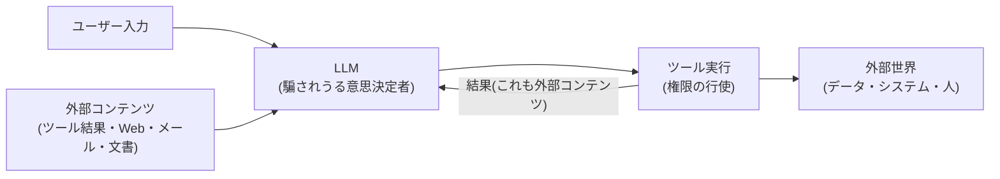

# Agent の脅威モデル概観

## この記事の目的

Agent システムが従来の Web アプリケーションと**どこで違う攻撃面を持つのか**を体系的に把握し、自分のシステムの脅威モデリング(攻撃面の棚卸しとリスクの優先順位付け)ができるようになります。本セクション(06-security)の各論(インジェクション・権限・漏えい・ガードレール)への地図となる記事です。

## 対象読者

- Agent システムの設計レビュー・セキュリティレビューを行うエンジニア・セキュリティ担当者
- 対策の個別実装に入る前に、脅威の全体像を押さえたい設計者

## 前提知識

- [AI Agent とは何か](../01-concepts/what-is-an-ai-agent.md) — 自律性という攻撃面の源泉
- [ツール使用](../01-concepts/tool-use.md) — 実行能力という攻撃面の源泉

## 本文

### 概要: 前提となる 3 つの事実

Agent のセキュリティは、次の 3 つを前提に組み立てます。

1. **モデルに入るあらゆるテキストは命令になりえます** — LLM はデータと命令を構造的に区別しません。ユーザー入力だけでなく、ツールが返した Web ページ・メール本文・ドキュメントも、モデルへの指示として機能しえます
2. **モデルは騙されうる部品です** — モデルの安全学習(不適切な指示の拒否)は防御層の 1 つですが、保証ではありません。「モデルが断るはず」を前提にした設計は成立しません
3. **被害の上限はモデルではなく権限が決めます** — どれだけ巧妙に騙されても、持っていない権限は行使できません。最後に信頼できるのはコードで強制される制御だけです

従来の Web セキュリティが「ユーザー入力を信頼しない」だったのに対し、Agent では「**モデルに入るものすべて・モデルから出るものすべてを信頼しない**」に信頼境界が広がります。

### 詳細: 信頼境界の見取り図

この図で重要なのは、ツール結果がモデルに戻る矢印です。Agent ループが回るたびに「外部コンテンツがモデルの入力になる」機会が増え、**信頼できないデータが意思決定者に直接届く経路**が常時開いています。

### 詳細: 代表的な脅威のカタログ

| 脅威 | 概要 | 主な対策の参照先 |
| --- | --- | --- |
| 直接プロンプトインジェクション | ユーザー自身が指示を上書きする入力を与え、想定外の挙動を引き出す | [プロンプトインジェクション](prompt-injection.md) |
| 間接プロンプトインジェクション | ツール結果・Web・メール等の外部コンテンツに埋め込まれた指示をモデルが実行する。Agent で最も重要な脅威 | [プロンプトインジェクション](prompt-injection.md) |
| データ漏えい(exfiltration) | 機微データが応答・ツール送信・リンク等の経路で外部に出る | [データ漏えい対策](data-exfiltration.md) |
| 過剰な自律性・権限 | 必要以上のツール・権限・自由度を持つ Agent が、騙されたとき・誤ったときに重大な副作用を起こす | [ツール権限設計とサンドボックス](tool-permissions-and-sandboxing.md) |
| サプライチェーン | 外部 MCP サーバー・ツール説明文の汚染(tool poisoning)、依存パッケージ経由の混入 | [ツール接続標準(MCP とエコシステム)](../03-implementation/mcp-and-tool-protocols.md)、[ツール権限設計とサンドボックス](tool-permissions-and-sandboxing.md) |
| メモリ・ナレッジ汚染 | 長期メモリや RAG のインデックスに悪意ある内容を書き込ませ、以後のセッションの挙動を持続的に操作する | [メモリと状態管理](../01-concepts/memory-and-state.md)、[プロンプトインジェクション](prompt-injection.md) |
| 経済的 DoS(コスト攻撃) | 意図的に長いループ・大量呼び出しを誘発させ、コストを浪費させる | [コスト管理](../05-operations/cost-management.md) の 3 層上限、[インシデント対応](../05-operations/incident-response.md) |
| システムプロンプト・設定の抽出 | プロンプトや内部設定を聞き出す。それ自体の被害は限定的だが、他の攻撃の下調べになる | [プロンプトインジェクション](prompt-injection.md)(秘匿に頼らない設計) |

### 詳細: 致命的三重奏 — 漏えいが構造的に成立する条件

個別の脅威と別に覚えておくべき**組み合わせの危険**があります。1 つの Agent が次の 3 つを同時に持つと、間接プロンプトインジェクションによるデータ持ち出しが構造的に可能になります。

1. **非公開データへのアクセス**(社内文書・顧客情報・メール)
2. **信頼できないコンテンツへの接触**(Web 閲覧・外部からのメール・第三者の文書)
3. **外部への送信能力**(メール送信・API 呼び出し・リンクを含む応答の表示)

これは「致命的三重奏(lethal trifecta)」と呼ばれます。3 つが揃った Agent では、外部コンテンツに仕込まれた指示が「非公開データを読み、外部に送る」の全行程を駆動できます。**どれか 1 つを外せば、この経路は構造的に閉じます**。設計レビューで最初に確認すべきチェックポイントです(詳細は [データ漏えい対策](data-exfiltration.md))。

### 設計判断: 脅威モデリングの実務手順

1. **棚卸し** — Agent が持つツールの一覧を、それぞれの権限(読み/書き)・触れるデータ・入力ソース(誰が書けるコンテンツを読むか)とともに表にします
2. **信頼境界図を描く** — 上の見取り図を自システムで具体化し、「信頼できないコンテンツがモデルに入る経路」をすべて明示します
3. **三重奏チェック** — 非公開データ・信頼できないコンテンツ・外部送信の 3 点が揃っていないか確認します
4. **優先順位付け** — 影響の大きさ(取り消せるか・件数)と発生しやすさで並べます。多くのシステムでは間接プロンプトインジェクション起点の経路が最上位になります
5. **対策の割り当て** — 脅威ごとに、決定的な対策(権限・承認・[ガードレール](guardrails.md))と確率的な対策(検知・モデルの安全学習)を区別して割り当てます。決定的な対策のない高リスク脅威が残っていれば、それは設計の見直し(権限や機能の削減)が必要なサインです

## 実務での注意点

### アンチパターン

- **モデルの拒否を防御として当てにする** → 安全学習は迂回されることがあり、保証にならない → モデルの外側の決定的な制御(権限・承認・ガード)を主防御にし、モデルの拒否は追加の層と位置づける
- **脅威モデルなしで対策を個別に積む** → 目立つ脅威だけ塞がり、構造的な経路(三重奏)が残る → 先に棚卸しと信頼境界図を作り、対策を経路に割り当てる
- **開発時の広い権限のまま本番投入する** → デモ用の全権 API キー・管理者アカウントが、騙された Agent の被害上限をシステム全体に広げる → 本番投入前に権限の棚卸しと最小化を必ず通す([ツール権限設計とサンドボックス](tool-permissions-and-sandboxing.md))
- **「社内向けだから安全」と考える** → 社内ユーザーも間接インジェクションの運び手になる(外部メール・Web を読む Agent なら攻撃面は外に開いている) → 入力ソースで信頼を判断し、利用者の所属では判断しない

### チェックリスト

- [ ] ツール一覧が権限・データ・入力ソースとともに棚卸しされている
- [ ] 信頼できないコンテンツがモデルに入る経路がすべて特定されている
- [ ] 致命的三重奏(非公開データ・信頼できないコンテンツ・外部送信)の有無を確認した
- [ ] 脅威ごとに決定的対策と確率的対策を区別して割り当てた
- [ ] 決定的対策のない高リスク脅威が残っていない(残る場合は権限・機能の削減を検討した)
- [ ] 脅威モデルが構成変更(ツール追加・MCP サーバー接続)のたびに見直される運用になっている

## 関連トピック

- [プロンプトインジェクション](prompt-injection.md) — 最重要脅威の各論
- [ツール権限設計とサンドボックス](tool-permissions-and-sandboxing.md) — 被害上限を決める権限の設計
- [データ漏えい対策](data-exfiltration.md) — 三重奏と漏えい経路の各論
- [ガードレール](guardrails.md) — 対策を実装する 3 層の枠組み
- [ツール接続標準(MCP とエコシステム)](../03-implementation/mcp-and-tool-protocols.md) — サプライチェーン面
- [インシデント対応](../05-operations/incident-response.md) — 攻撃を受けたときの停止と復旧

## 参考資料

- [OWASP Top 10 for Large Language Model Applications](https://owasp.org/www-project-top-10-for-large-language-model-applications/) — LLM アプリケーションの脅威分類の標準的な整理(アクセス日: 2026-07-05)
- [The lethal trifecta for AI agents(Simon Willison)](https://simonwillison.net/2025/Jun/16/the-lethal-trifecta/) — 致命的三重奏の提唱記事(アクセス日: 2026-07-05)

## TODO・未確認事項

> **TODO(要確認):** OWASP の LLM・Agent 向け脅威分類は改版が続いている。レビュー基準に使う際は OWASP 公式サイトで最新版を確認する(最終確認: 2026-07)
