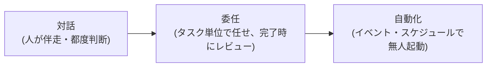

# 自動化・業務効率化パターン

## この記事の目的

コーディングエージェントの利用を「対話」から「委任」「自動化」へ段階的に引き上げ、定型的な開発タスクをエージェントに移す設計ができるようになります。ツール非依存のパターンを扱い、具体的な設定は各実践ガイドに委ねます。

## 対象読者

- 対話利用には慣れたが、チームの定型作業(レビュー・依存更新・トリアージ)を自動化したいエンジニア
- CI・定期実行へのエージェント組み込みを設計するテックリード

## 前提知識

- [コーディングエージェントへの依頼設計](coding-agent-prompting.md) — 完了条件の設計(自動化の前提)
- [コーディングエージェントの権限とセキュリティ](coding-agent-security.md) — 無人実行の権限設計

## 本文

### 概要: 自動化の 3 段階

右に進むほど人の時間は空きますが、前提条件が増えます。

| 段階 | 前提条件 |
| --- | --- |
| 委任 | 機械検証できる完了条件(テスト・リント)、レビュー体制 |
| 自動化 | 上記 + 無人でも安全な権限設計、冪等性、失敗時の通知、コスト上限 |

**自動化に向くタスクの条件**は次の 3 つです: ①手順がパターン化できる ②成否を機械判定できる ③失敗しても「何もしなかった」に倒せる(部分的な壊れた状態を残さない)。この条件を満たさないタスクは、無理に自動化せず委任(人の事後レビュー付き)に留めます。

### 定番パターン集

2026 年時点で複数ツールが公式サポートする定番の自動化パターンです。「どのツールで」は [比較](coding-agents-comparison.md) と各実践ガイドを参照してください。

| パターン | トリガー | 完了基準 | 人手ゲートの位置 |
| --- | --- | --- | --- |
| PR の一次レビュー | PR 作成・更新 | 指摘コメントの投稿 | 人のレビューが本審(エージェントは前段) |
| Issue トリアージ | Issue 作成 | ラベル付与・重複判定・再現手順の確認コメント | 対応方針の決定は人 |
| 依存関係の更新 | 定期(週次など) | 更新 + テスト通過の PR 作成 | PR マージ |
| テスト補強 | 委任(カバレッジの穴を指定) | 新規テストが既存挙動で通過 | テストが仕様を検証しているかのレビュー |
| ドキュメント同期 | コード変更・定期 | docs の差分 PR | 内容の正確さのレビュー |
| リリースノート生成 | リリースタグ・定期 | 差分からのドラフト生成 | 公開前の編集 |
| lint・型エラーの一括解消 | 委任・定期 | lint / 型検査の通過 | 機械的でない修正箇所の確認 |

共通する設計は「**エージェントの出力は常にブランチ + PR に閉じ、マージは人が握る**」ことです。ブランチ保護と必須チェックが最後の防衛線になります([権限とセキュリティ](coding-agent-security.md))。

### 非対話実行と CI 組み込み

主要ツールは非対話(ヘッドレス)実行モードを持ちます(Claude Code の `-p`、Codex の `codex exec`、Copilot CLI・Cursor CLI の print 系)。CI に組み込む際の設計点は次のとおりです。

- **出力を機械可読にする** — 後続ステップが判定できるよう、構造化出力(JSON など)や終了コードの仕様を確認して使います
- **タイムアウトと上限を必ず設定する** — 無人実行での暴走は誰も止めません。実行時間・試行回数・コスト上限([コスト最適化](coding-agent-cost-optimization.md))を CI 側とツール側の両方に置きます
- **CI トークンのスコープを最小にする** — エージェントの権限上限は CI トークンで決まります。書き込み範囲を絞り、デプロイ用シークレットと同居させないでください
- **認証は API キー系を使う** — 対話ログイン前提のサブスクリプション認証は CI に向きません。CI 用の認証経路(API キー・サービスアカウント)と課金の扱いを確認します

### 定期実行(スケジュール)

依存更新・棚卸し・レポート生成など「毎回同じ依頼」は、スケジュール実行機能(Claude Code の Routines、Devin のスケジュールセッション、Cursor の Automations、cron + ヘッドレス実行など)に乗せられます。

- 依頼文はリポジトリ管理し、実行のたびに同じものを使います(再現性とレビュー可能性)
- 結果の通知先(PR・チャット)を必ず設計します。「静かに失敗し続ける定期ジョブ」は存在しないのと同じです
- 定期実行は消費も定期的に発生します。1 回あたりの消費を測ってから頻度を決めます

### 並列化

- **ローカル並列**: git worktree で作業ツリーを分け、複数セッションを同時に走らせる方式です。互いに独立したタスクが条件です
- **クラウド並列**: クラウド実行型への同時委任です。手元の環境を塞がず、隔離も既定で付きます
- 並列化の律速は多くの場合**人のレビュー能力**です。エージェントの生産量にレビューが追いつかなくなったら、並列度ではなくタスクの粒度と自己検証(テスト)の質を上げます([チーム導入](coding-agent-team-adoption.md) のレビュー負荷の議論)

### 自動化の失敗設計

無人実行は「失敗すること」を前提に設計します。

1. **冪等にする** — 再実行しても安全な設計(同じ PR を重複作成しない、途中状態を残さない)にします
2. **失敗は「何もしない」に倒す** — 中途半端な変更を push するより、失敗を報告して終了する方が安全です
3. **通知と観測** — 成功・失敗・スキップを人が見る場所(チャット・ダッシュボード)に流します。成功率の推移は品質監視の入力になります([評価](coding-agent-evaluation.md)、[可観測性](../05-operations/observability-and-tracing.md))
4. **外部入力への防御** — Issue・PR コメントをトリガーにする自動化は、外部の書き込みがそのまま入力になります。間接プロンプトインジェクションを想定した権限設計([権限とセキュリティ](coding-agent-security.md))が前提です

## 実務での注意点

### アンチパターン

- **対話で成功したことがないタスクをいきなり自動化する** — 自動化はうまくいく手順の固定化です。→ まず対話・委任で成功パターンを確立し、依頼文を固めてから自動化します
- **完了基準がないまま定期実行を仕込む** — 「動いているか分からないジョブ」が増えるだけです。→ 機械判定できる完了基準と通知を先に設計します
- **マージまで自動化する** — 品質ゲートを失い、事故時の影響が本線に直結します。→ マージは人が握り、ブランチ保護を維持します
- **並列度を上げて生産性が上がったと錯覚する** — レビュー待ち PR が積み上がるだけなら、リードタイムは改善していません。→ レビュー消化量とセットで見ます

### チェックリスト

- [ ] 自動化対象タスクが 3 条件(パターン化・機械判定・安全な失敗)を満たすか
- [ ] 出力がブランチ + PR に閉じ、マージが人手ゲートになっているか
- [ ] タイムアウト・試行上限・コスト上限を CI とツールの両方に設定したか
- [ ] CI トークンのスコープが必要最小限か
- [ ] 失敗・スキップの通知先が設計されているか
- [ ] 外部入力(Issue・コメント)起点の自動化でインジェクションを想定したか

## 関連トピック

- [コーディングエージェントへの依頼設計](coding-agent-prompting.md) — 自動化の元になる依頼文の設計
- [コーディングエージェントの権限とセキュリティ](coding-agent-security.md) — 無人実行の権限・CI トークン設計
- [コーディングエージェントのコスト最適化](coding-agent-cost-optimization.md) — 自動化の消費制御
- [Human-in-the-Loop 設計](../02-architecture/human-in-the-loop.md) — 人手ゲートの一般論
- 各ツールの具体設定: [Claude Code 実践ガイド](claude-code-in-practice.md) / [OpenAI Codex 実践ガイド](openai-codex-in-practice.md) / [GitHub Copilot 実践ガイド](github-copilot-in-practice.md)

## 参考資料

- [Claude Code GitHub Actions(公式)](https://code.claude.com/docs/en/github-actions) — CI 組み込みの公式実装例(アクセス日: 2026-07-05)
- [About Copilot cloud agent(GitHub Docs)](https://docs.github.com/en/copilot/concepts/agents/coding-agent/about-coding-agent) — Issue 起点の自動化の公式仕様(アクセス日: 2026-07-05)

## TODO・未確認事項

> **TODO(要確認):** 定番パターン表の各行について、主要ツールの公式サポート状況(機能名)を四半期の定点観測時に確認する(最終確認: 2026-07)
