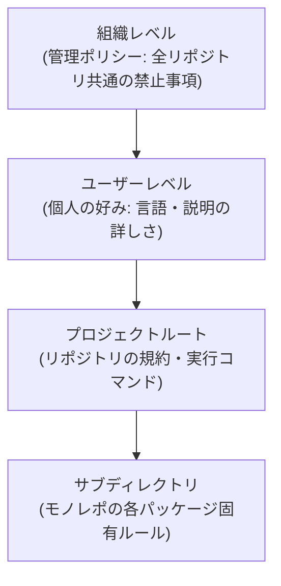

# ルールファイルと設定の設計

## この記事の目的

プロジェクトの規約や制約をコーディングエージェントに伝える「ルールファイル」を設計・保守できるようになります。何を書くと効果があり、何を書くと逆効果になるかを判断し、モノレポや組織展開でのスコープ設計まで扱えるようになることが目標です。

## 対象読者

- コーディングエージェントの出力がプロジェクトの規約に従わず、毎回同じ指摘を繰り返しているエンジニア
- エージェント利用をリポジトリの規約として整備したいテックリード

## 前提知識

- [AI コーディングエージェントの分類と全体像](coding-agents-overview.md)
- [コンテキストエンジニアリング](../02-architecture/context-engineering.md) — ルールファイルはコンテキスト設計の一形態です

## 本文

### 概要

ルールファイル(rules file)は、コーディングエージェントがセッション開始時に読み込む、プロジェクト固有の指示書です。ビルド・テストの実行方法、コーディング規約、触ってはいけない領域などを記述し、毎回の依頼文で繰り返さなくても済むようにします。

エージェントへの指示は「恒常的な規約はルールファイル、そのタスク限りの指示は依頼文」と分担するのが基本です。依頼文の設計は [コーディングエージェントへの依頼設計](coding-agent-prompting.md) を参照してください。

### ルールファイルの種類と対応関係

2026 年時点では、ツール横断の共通形式である `AGENTS.md` への収斂が進む一方、ツール固有の形式も並存しています。代表的な形式は次のとおりです。

| 形式 | 主な利用ツール | 特徴 |
| --- | --- | --- |
| `AGENTS.md` | OpenAI Codex、Gemini CLI、Cursor、GitHub Copilot(coding agent)など複数ツール | ツール非依存の共通形式。マルチツール環境の第一候補 |
| `CLAUDE.md` | Claude Code | ユーザー / プロジェクト / サブディレクトリの階層をサポート |
| `.cursor/rules/` | Cursor | 複数ファイル分割と適用条件(グロブ)を指定可能 |
| `.github/copilot-instructions.md` | GitHub Copilot | リポジトリ単位のカスタム指示 |
| `GEMINI.md` | Gemini CLI | 階層的な読み込みをサポート |

> **TODO(要確認):** 各ツールの対応形式(特に AGENTS.md サポートの有無と読み込み優先順位)を各公式ドキュメントで確認する。対応状況は 2025〜2026 年に急速に変化している(最終確認: 2026-07)

複数ツールを併用するチームでは、**正本を 1 つに決めて他形式から参照(またはシンボリックリンク・生成)する**構成にしないと、ルールの二重管理が発生します。

### 内容設計(何を書くか)

ルールファイルはコンテキストウィンドウを消費します。「書けば書くほど従ってくれる」わけではなく、長くなるほど個々の指示の重みは薄まります。**短く・検証可能・実行可能**が原則です。

**書くべきもの**:

- ビルド・テスト・リント・型検査の実行コマンド(エージェントが自己検証に使う)
- リポジトリ構造の要点(どこに何があるか。全ディレクトリの列挙ではなく判断に必要な範囲)
- 機械が従える形のコーディング規約(例: 「エラーは Result 型で返す。例外は境界層のみ」)
- 触ってはいけない領域(自動生成物、ベンダーコード、マイグレーション済みファイル)
- コミット・PR の規約(メッセージ形式、ブランチ運用)
- ドメイン固有の用語・略語(エージェントが誤解しやすいもの)

**書くべきでないもの**:

- 一般的な「良いコード」の説明(モデルは既に知っており、トークンの無駄)
- 頻繁に変わる情報(依存バージョン、担当者名。コードや別ファイルを正本にする)
- 秘密情報・内部 URL・環境依存の絶対パス
- 人間向け README の複製(エージェントに必要なのは「実行方法と制約」であり、プロダクト紹介ではない)

判断基準として「**エージェントがこの指示に従わなかったとき、レビューで機械的に気づけるか**」を使うと、曖昧な精神論(「保守性の高いコードを書く」など)を排除できます。

### 階層化とスコープ

多くのツールは複数レベルのルールを合成して読み込みます。

- **プロジェクトルート**を正本とし、リポジトリにコミットしてチームで共有します
- **サブディレクトリ**のルールはモノレポで有効です。パッケージごとの技術スタック差(例: `apps/web` は TypeScript、`ml/` は Python)をそれぞれの階層に書き、ルートには共通事項のみ残します
- **ユーザーレベル**には個人の好みだけを書き、プロジェクトの規約を書かない(チームメンバー間で挙動が変わるため)
- 合成の順序・優先度はツールごとに異なるため、併用時は各ツールの仕様を確認します

### 保守と形骸化防止

ルールファイルは書いた瞬間から陳腐化が始まります。運用として機能させるには次の 3 つが有効です。

1. **失敗駆動で追記する** — エージェントが同じ間違いを 2 回したら、その再発防止をルール化します。「いつか役立ちそうなこと」を先回りで書かないことで、全ルールに実績(根拠となった失敗)がある状態を保てます
2. **ルールファイルをコードレビューの対象にする** — 規約の変更は挙動の変更です。PR でレビューし、変更履歴を残します
3. **定期的に棚卸しする** — コードベースと矛盾したルール(移行済みの旧規約など)は従わせる手段がなく、エージェントの他の指示への信頼度も下げます。四半期ごと程度に実態と突き合わせます

## 実務での注意点

### アンチパターン

- **何でも書く巨大ルールファイル** — 数千行のルールはコンテキストを浪費し、重要な指示を希釈します。従われない指示が増えるほど「ルールは無視してよい」学習をさせているのと同じです。→ 数百行以内を目安に保ち、詳細はリポジトリ内の文書へのパス参照にします
- **人間向けドキュメントの複製** — README や設計書をそのまま貼ると、エージェントに不要な情報が大半を占めます。→ 「実行方法・制約・構造」に絞った差分を書きます
- **一度書いて放置** — コードベースと乖離したルールは害です(存在しないコマンド、廃止された規約)。→ 失敗駆動更新と定期棚卸しを運用に組み込みます
- **秘密情報・環境依存値の記載** — ルールファイルはコミットされ、エージェントのコンテキスト(=ベンダーへの送信データ)に毎回含まれます。→ 秘密は環境変数参照とし、[権限とセキュリティ](coding-agent-security.md) の原則に従います

### チェックリスト

- [ ] ビルド・テスト・リントの実行コマンドが書かれており、実際に動くか
- [ ] 触ってはいけない領域(生成物・ベンダーコード等)が明示されているか
- [ ] すべての指示が「従わなかったことに気づける」形(検証可能)か
- [ ] トークン量を意識したサイズか(目安: 数百行以内)
- [ ] ルールファイルの変更が PR レビューの対象になっているか
- [ ] 複数ツール併用時、正本が 1 つに決まっているか

## 関連トピック

- [コンテキストエンジニアリング](../02-architecture/context-engineering.md) — ルールファイルが消費するコンテキスト予算の考え方
- [コーディングエージェントへの依頼設計](coding-agent-prompting.md) — ルールファイルと依頼文の役割分担
- [コーディングエージェントの権限とセキュリティ](coding-agent-security.md) — 設定に含めるべき権限・除外設定
- [主要コーディングエージェント比較](coding-agents-comparison.md) — ツールごとのルールファイル対応

## 参考資料

- [AGENTS.md](https://agents.md/) — ツール横断のルールファイル共通形式の公式サイト(アクセス日: 2026-07-05)
- [Claude Code Best Practices(公式ドキュメント)](https://code.claude.com/docs/en/best-practices) — CLAUDE.md の内容設計に関する公式プラクティス(旧エンジニアリングブログの統合先)(アクセス日: 2026-07-06)

## TODO・未確認事項

> **TODO(要確認):** 各ツールのルールファイル対応形式(AGENTS.md サポート・階層合成の優先順位)を各公式ドキュメントで確認し、本文の対応表を更新する(最終確認: 2026-07)
