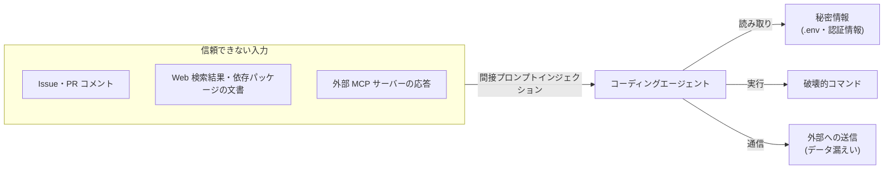

# コーディングエージェントの権限とセキュリティ

## この記事の目的

コーディングエージェントに与える権限と事故防止策を、特定ツールに依存しない原則として設計できるようになります。秘密情報の露出・破壊的操作・プロンプトインジェクション経由の攻撃という 3 大リスクに対し、導入前のセキュリティレビューで確認すべき点を判断できることが目標です。

## 対象読者

- コーディングエージェント導入時のセキュリティレビューを担当するエンジニア・セキュリティ担当者
- 自動承認(自律実行)の範囲をどこまで広げてよいか判断したいテックリード

## 前提知識

- [AI コーディングエージェントの分類と全体像](coding-agents-overview.md)
- [Agent の脅威モデル概観](../06-security/threat-model-overview.md) — エージェント一般の脅威分類
- [ツール権限設計とサンドボックス](../06-security/tool-permissions-and-sandboxing.md) — 権限設計の一般論

## 本文

### 概要

コーディングエージェントは「ファイルの読み書き・コマンド実行・ネットワーク通信」という強い権限を持つエージェントです。事故は **権限 × 信頼できない入力** の交点で起きます。開発環境には秘密情報(認証情報・顧客データ)と本番への到達経路(デプロイ権限・クラウド認証)が同居していることが多く、一般的なエージェントより被害の上限が高いと考えるべきです。

一方で、コードには git による可逆性、テスト・レビューという検査機構が既に備わっています。これらを防御層として活用できるのがコーディングエージェント特有の強みです。

### コーディングエージェント固有の脅威

1. **間接プロンプトインジェクション** — エージェントが読み込む Issue 本文・PR コメント・Web 検索結果・依存パッケージの README などに、攻撃者が指示を混入させる経路です。特に GitHub 連携型(公開リポジトリの Issue を処理する構成)は、外部の誰でも入力を書き込める点に注意が必要です。詳細は [プロンプトインジェクション](../06-security/prompt-injection.md) を参照してください
2. **秘密情報の露出** — エージェントが `.env` や認証情報ファイルを読み、その内容がモデルへの送信データ・ログ・生成コード・コミットに混入する経路です
3. **破壊的操作** — `rm -rf`、`git push --force`、データベースへの直接操作、クラウドリソースの削除など。悪意がなくても、誤解したエージェントが「掃除」として実行する事故が起きます
4. **サプライチェーン** — 出所不明の MCP サーバー・拡張・ルールファイルは、ツール定義や応答を通じてエージェントの挙動を操作できます。[MCP とツール接続標準](../03-implementation/mcp-and-tool-protocols.md) の信頼の議論が該当します
5. **ベンダーへのデータ送信** — エージェントが読むコードとコンテキストはモデル提供者に送信されます。保持期間・学習利用の既定・オプトアウト手段はツールと契約プランで大きく異なります

### 権限モデルの設計

主要ツールの承認モデルは、おおむね次の 3 型に整理できます。上から下へ、安全性と引き換えにスループットが上がります。

| 型 | 動作 | 向く状況 |
| --- | --- | --- |
| 都度承認 | ファイル変更・コマンド実行のたびに人が確認 | 導入初期、権限の広い環境、不慣れなタスク |
| 許可リスト | 事前承認した操作(例: `npm test`)は自動、それ以外は確認 | 日常利用の標準。可逆な操作だけを許可リストに入れる |
| サンドボックス内自動 | 隔離環境内は全自動、境界(外部通信・push)で確認 | クラウド実行型・並列実行。隔離の実効性が前提 |

設計原則は既存のセキュリティ原則と同じです。

- **デフォルト拒否・最小権限** — 「必要になったら許可を足す」方向で運用します。逆(全許可から削る)は事故が先に起きます
- **自動承認は「元に戻せる操作」に限定** — ファイル編集は git で戻せますが、`git push --force`・外部 API 呼び出し・DB 操作は戻せません。可逆性を許可リストの判断基準にします
- **読み取りにも権限設計が要る** — 書き込みだけ守っても、秘密情報の読み取り + 外部送信で漏えいは成立します([データ漏えい対策](../06-security/data-exfiltration.md))

### 秘密情報の扱い

- **エージェントの作業環境に本物の秘密を置かない**のが最も確実です。開発用のダミー値・スコープの狭いトークンに置き換えます
- ツールの**アクセス除外設定**(deny リスト・ignore ファイル)で `.env`・鍵ファイル・認証情報ディレクトリを読み取り対象から外します
- 会話ログ・トランスクリプトにも秘密は混入します。ログの保存先と共有範囲を確認します
- 本番の認証情報を持つ端末・セッションでエージェントを動かさないでください。本番作業用の環境と分離します

### 破壊的操作への多層防御

単一の防御に頼らず、層を重ねます。

1. **git による可逆性** — 作業は必ずブランチ上で行い、こまめなコミットを習慣化します。エージェントの変更が「いつでも捨てられる」状態を保つのが最も費用対効果の高い防御です
2. **実行環境の隔離** — コンテナ・VM・専用ユーザーでの実行は、ホスト環境への被害を遮断します。クラウド実行型は隔離が既定で備わる一方、ローカル CLI 型は自分で用意する必要があります
3. **ネットワーク境界** — 外部送信できる先を制限すれば、インジェクションが成立しても漏えいを止められます
4. **CI 権限の限定** — GitHub 連携型は CI 上で動くため、その実行トークンのスコープ(書き込み範囲・シークレットへのアクセス)がエージェントの権限上限になります。デプロイ用シークレットと同居させないでください

### 監査とログ

- エージェントが「何を読み・何を実行し・何を変更したか」の記録を残します。組織導入では、ツールの監査ログ機能(または集中管理)が要件になります
- インシデント時の対応は [インシデント対応](../05-operations/incident-response.md) の停止 → 影響範囲特定 → 復旧の枠組みがそのまま使えます

## 実務での注意点

### アンチパターン

- **利便性のために全自動承認モードを常用する** — 平常時は問題が起きないため権限は広がり続け、インジェクションが成立した瞬間に無防備になります。→ 全自動は隔離環境(サンドボックス・使い捨てコンテナ)内に限定します
- **本番認証情報を持つ環境でエージェントを実行する** — 誤操作・漏えいの被害上限が「本番」になります。→ 開発専用の分離環境・スコープの狭いトークンで動かします
- **MCP サーバーや拡張を検証せずに追加する** — ツール定義・応答経由でエージェントを操作される経路になります。→ 出所・必要権限・メンテ状況を確認し、承認済みリストで管理します
- **クラウド実行型にデータ取り扱いの確認なしで私有コードを渡す** — 保持期間・学習利用・準拠法の確認漏れはコンプライアンス違反に直結します。→ 契約プランのデータポリシーを導入前に確認します

### チェックリスト

- [ ] 自動承認の範囲が「元に戻せる操作」に限定されているか
- [ ] 秘密情報(.env・鍵・認証情報)がエージェントの読み取り対象から除外されているか
- [ ] 外部由来テキスト(Issue・Web・パッケージ文書)を処理するフローでインジェクションを想定したか
- [ ] MCP サーバー・拡張の出所と権限を確認し、承認済みリストで管理しているか
- [ ] ベンダーのデータ保持期間・学習利用の既定・オプトアウトを契約プランで確認したか
- [ ] GitHub 連携型の場合、CI トークンのスコープが必要最小限か
- [ ] インシデント時の停止手順(セッション停止・トークン失効)が決まっているか

## 関連トピック

- [Agent の脅威モデル概観](../06-security/threat-model-overview.md) — 脅威の全体分類
- [プロンプトインジェクション](../06-security/prompt-injection.md) — 本記事の脅威 1 の詳細
- [ツール権限設計とサンドボックス](../06-security/tool-permissions-and-sandboxing.md) — 権限設計・隔離技術の一般論
- [データ漏えい対策](../06-security/data-exfiltration.md) — 読み取り + 外部送信の経路の防ぎ方
- [チーム導入とレビュー体制](coding-agent-team-adoption.md) — 組織としてのポリシー整備
- [企業システム環境の制約と対応](se-enterprise-constraints.md) — 顧客資産を扱う際の「そもそも渡してよいか・どの提供形態か」の判断(本記事の手前の可否判断)

## 参考資料

- [MITRE ATLAS](https://atlas.mitre.org/) — AI システムへの攻撃手法の分類(アクセス日: 2026-07-05)
- [OWASP Top 10 for LLM Applications](https://owasp.org/www-project-top-10-for-large-language-model-applications/) — プロンプトインジェクション等の LLM 固有リスク一覧(アクセス日: 2026-07-05)

## TODO・未確認事項

> **TODO(要確認):** 各ツールのサンドボックス実装方式(OS レベル隔離かコンテナか)と既定の承認モードを、比較記事の執筆時に各公式ドキュメントで確認する(最終確認: 2026-07)
