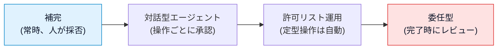

# AI コーディングエージェントの分類と全体像

## この記事の目的

乱立する AI コーディング支援ツールを「提供形態」と「自律性」の軸で整理し、個別ツールの情報を位置づけて理解できる地図を持てるようになります。この章(08-coding-agents)全体の入口です。

## 対象読者

- AI コーディング支援の導入を検討しているソフトウェアエンジニア
- コード補完は使った経験があるが、エージェント型のツールは未経験の人

## 前提知識

- [AI Agent とは何か](../01-concepts/what-is-an-ai-agent.md) — エージェントの定義
- [Agent ループ](../01-concepts/agent-loop.md) — 観測・思考・行動のループ(コーディングエージェントの動作原理そのものです)

## 本文

### 概要

コーディングエージェント(coding agent)は、コードベースを読み、ファイルを編集し、コマンドを実行して結果を検証する、というループで開発タスクを遂行するエージェントです。「1 行の補完」ではなく「バグを修正して」「この機能を追加して」という**タスク単位の委任**を受けられる点が、従来のコード補完との本質的な違いです。

2026 年時点でこの分野はツールの数・変化の速さともに極端で、個別ツールの知識はすぐ陳腐化します。本記事ではまず**変わりにくい分類の枠組み**を押さえ、個別ツールの詳細は各ツール別記事と [主要コーディングエージェント比較](coding-agents-comparison.md) に委ねます。

### コード補完からコーディングエージェントへ

AI コーディング支援はおおむね 3 段階で発展してきました。

| 世代 | 形 | 人の関与 |
| --- | --- | --- |
| コード補完 | カーソル位置の続きを提案(1 行〜関数) | 常時。提案の採否を毎回人が判断 |
| チャット支援 | 質問応答・コード生成。人がコピーして貼り付け | 高い。文脈の受け渡しも人が担当 |
| コーディングエージェント | タスクを受け、探索 → 編集 → 実行 → 検証を自律的に繰り返す | 委任。節目の承認と最終レビュー |

コーディングエージェントの動作は [Agent ループ](../01-concepts/agent-loop.md) そのものです。**観測**(コードの読み取り・テスト結果・エラー)→ **思考**(次の手の決定)→ **行動**(ファイル編集・コマンド実行)を、完了条件を満たすまで繰り返します。ツール間の差は、このループを「どこで動かすか」「何をトリガーに始めるか」「人がどこで確認するか」の設計の差として理解できます。

### 提供形態による 5 分類

入口の整理として、提供形態で 5 つに分類します。

| 分類 | 定義 | 代表例(2026-07 時点) |
| --- | --- | --- |
| ターミナル型 | 開発者のシェル上で動く対話型 CLI。ローカル実行で既存ツールチェーンに直結 | Claude Code、Codex CLI、Gemini CLI、Aider |
| IDE 統合型 | 既存 IDE の拡張、または専用 IDE。エディタの文脈(開いているファイル・選択範囲)を活用 | GitHub Copilot、Cursor、Windsurf、Cline |
| GitHub / Issue / PR 連携型 | Issue 割当・PR コメント・レビュー依頼をトリガーに動く | Copilot coding agent、Claude Code の GitHub Actions 連携、Gemini Code Assist の PR レビュー |
| クラウド実行型 | ベンダー管理のサンドボックスで非同期・並列にタスクを実行 | Devin、Codex(クラウド)、Jules、Claude Code on the web |
| オープンソース・拡張可能型 | コードが公開されている、または拡張機構(MCP・フック・SDK)を持つ | Aider、Cline、OpenHands、Goose(拡張機構の例: MCP 対応、Agent SDK) |

**この 5 分類は排他的ではありません。** 主要ツールは複数の形態を持つのが 2026 年時点の常態です(例: Claude Code は CLI・IDE 拡張・Web・GitHub Actions のすべてを提供し、OpenAI Codex も CLI・IDE 拡張・クラウドを提供します)。「どのツールか」と「どの形態で使うか」は別の選択です。

### 2 軸での整理(トリガー面 × 実行場所)

より正確には、各ツール・機能を次の 2 軸で捉えます。

- **トリガー面** — どこから仕事を依頼するか: CLI / IDE / Issue・PR / チャットツール
- **実行場所** — エージェントのループがどこで回るか: ローカルマシン / ベンダーのクラウド / 自分の CI

| | ローカル実行 | クラウド実行 | CI 上で実行 |
| --- | --- | --- | --- |
| **CLI から** | ターミナル型の基本形 | CLI からクラウドへ委任 | — |
| **IDE から** | IDE 統合型の基本形 | バックグラウンドエージェント | — |
| **Issue・PR から** | — | クラウド実行型 | GitHub Actions 連携型 |

この 2 軸は選定時の質問に直結します。実行場所は「コードがどこへ送られ、コマンドが何の権限で走るか」を決め([権限とセキュリティ](coding-agent-security.md))、トリガー面は「開発フローのどこに組み込まれるか」を決めます([選定基準と使い分け](coding-agent-selection.md))。

### 自律性と人の関与のスペクトラム

右へ行くほどスループットが上がる代わりに、1 回の失敗の影響範囲が広がります。重要なのは、**自律性はツールの属性ではなく設定と運用の選択**だということです。同じツールでも都度承認でも委任でも使えます。右側の運用を選ぶほど、権限設計([権限とセキュリティ](coding-agent-security.md))と検証の仕組み([依頼設計](coding-agent-prompting.md) の完了条件)が前提になります。この構図は [Human-in-the-Loop 設計](../02-architecture/human-in-the-loop.md) の一般論のコーディング特化版です。

### この章の読み方

1. 選定する立場の人: [選定基準と使い分け](coding-agent-selection.md) → [主要コーディングエージェント比較](coding-agents-comparison.md) → 候補のツール別記事
2. 使い始めた人: [依頼設計](coding-agent-prompting.md) → [ルールファイルと設定](coding-agent-rules-and-config.md)
3. 組織に広げる人: [権限とセキュリティ](coding-agent-security.md) → [チーム導入とレビュー体制](coding-agent-team-adoption.md) → [評価](coding-agent-evaluation.md)

## 実務での注意点

### アンチパターン

- **「エージェント = 全自動」と誤解して導入する** — 自律性は設定の選択であり、いきなり委任型の運用を始めると権限・検証の前提が揃わないまま事故になります。→ 都度承認から始め、実績に応じて許可リストを広げます
- **ツール名で語り、形態を区別しない** — 「X 社のツールは安全か」という問いは、同じツールでもローカル CLI とクラウド実行でデータの流れが違うため答えられません。→ トリガー面 × 実行場所で特定してから評価します
- **分類表の暗記を目的にする** — ツールの顔ぶれと形態は年単位で入れ替わります。→ 2 軸(トリガー・実行場所)と自律性スペクトラムという枠組みの方を持ち帰ります

### チェックリスト

- [ ] 検討中のツールについて「トリガー面」と「実行場所」を特定できるか
- [ ] 使おうとしている運用が自律性スペクトラムのどこかを説明できるか
- [ ] その自律性レベルに必要な前提(権限設計・完了条件)を把握しているか

## 関連トピック

- [コーディングエージェントの選定基準と使い分け](coding-agent-selection.md) — この分類を使った絞り込み
- [主要コーディングエージェント比較](coding-agents-comparison.md) — 具体ツールの横断比較
- [Agent ループ](../01-concepts/agent-loop.md) — 動作原理の詳細
- [Human-in-the-Loop 設計](../02-architecture/human-in-the-loop.md) — 承認設計の一般論
- [コンピュータ操作型・マルチモーダル Agent](../01-concepts/computer-use-and-multimodal-agents.md) — 隣接分野(GUI 操作エージェント)との関係

## 参考資料

- [Building Effective Agents(Anthropic)](https://www.anthropic.com/research/building-effective-agents) — エージェントの自律性スペクトラムの背景となる設計論(アクセス日: 2026-07-05)
- [AGENTS.md](https://agents.md/) — ツール横断で使われるルールファイル共通形式(エコシステムの収斂の例)(アクセス日: 2026-07-05)

## TODO・未確認事項

> **TODO(要確認):** 5 分類の代表例に挙げたツール名・提供形態を、各ツール別記事の執筆時(公式情報の裏取り後)に再確認する(最終確認: 2026-07)
