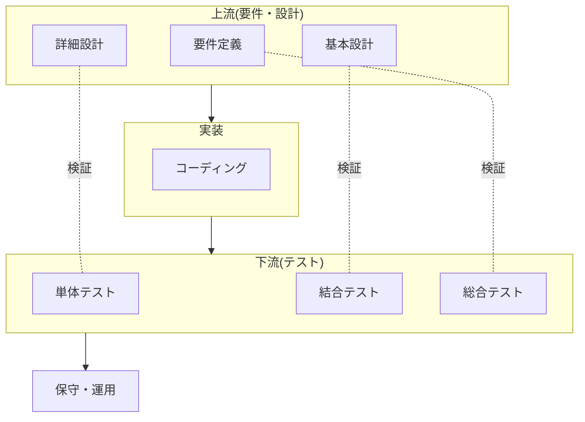

# SE 工程別活用マップ(V 字モデルで見る使いどころ)

## この記事の目的

企業システム開発のシステムエンジニア(SE)が、要件定義から保守まで**どの工程で AI コーディングエージェントが効き、どこで効かないか・何を人が握るか**を 1 枚で見渡せるようになります。ここを起点に、自分の工程の詳細記事へ進める「シリーズの地図」です。読み終えたとき、工程ごとの向く作業・向かない作業・外してはいけない責任の線引きを、自分のプロジェクトに当てはめて判断できる状態を目指します。

## 対象読者

- 実装だけでなく要件定義・設計・テスト・保守運用まで担う、日本の企業システム開発(SIer・情報システム部門)の SE
- 「コーディング以外の工程で AI をどう使えるか」を工程全体で整理したいプロジェクトリーダー・リーダー格の SE

## 前提知識

- [AI コーディングエージェントの分類と全体像](coding-agents-overview.md) — 提供形態と自律性の軸(本シリーズが前提にするツールの基礎)
- [コーディングエージェントへの依頼設計](coding-agent-prompting.md) — タスク分割・コンテキスト・完了条件(各工程での使い方の土台)

## 本文

### 概要: このシリーズの地図

本記事は「SE 実践シリーズ」の背骨です。既存の 08 章が「エージェントを使う開発者」の視点で選定・設定・依頼設計・セキュリティ・チーム導入を扱うのに対し、本シリーズは**日本の企業システム開発の工程と商流**に軸を移します。各工程の詳細は個別記事に譲り、ここでは全体像と共通原則、そして「自分の工程からどこへ進むか」を示します。

> **このシリーズの前提**: 本記事群は「エージェントを作る」話ではなく「**保守・開発対象のシステムに、コーディングエージェントを道具として使う**」話です。ツール選定・権限設計などの基礎は既存 08 章が正本です。

### 全工程に共通する原則

工程を問わず、SE の実務で AI コーディングエージェントを使うときに貫く原則があります。

- **成果物責任は人が持つ**: 設計書・テスト仕様書・エビデンス・納品コードの品質責任は、契約上も人にあります。エージェントの出力は**ドラフト**であり、レビューして確定するのは人です。この線は全工程で動きません
- **発散はエージェント、確定は人**: 観点出し・候補列挙・下書きといった「広げる作業」はエージェントが得意です。取捨選択・整合性判断・顧客合意といった「決める作業」は人が握ります
- **現行システムの挙動が正**: 既存システムを扱う工程(保守・レガシー理解)では、エージェントが生成した「仕様の説明」より、**実際に動いているシステムの挙動**が正です。生成物は仮説として検証します
- **機微情報は経路を先に決める**: 顧客名・業務データ・ソースコードをエージェントに渡してよいかは、工程に入る前に契約と経路で判断します(詳細は本シリーズの企業制約の記事)
- **効率化の効果は測ってから主張する**: 「速くなった」は体感でなく、[コーディングエージェントの評価](coding-agent-evaluation.md)の考え方で工程ごとに確かめます

### 工程別マップ(V 字モデルで見る)

V 字モデルの各工程に沿って、向く作業・向かない(人が握る)作業・主なリスクを一望します。

| 工程 | 向く作業(発散・下書き) | 人が握る作業(確定・責任) | 主なリスク |
| --- | --- | --- | --- |
| 要件定義 | 抜け漏れ観点出し・質問リスト・用語整理 | 要件の確定・顧客合意・優先順位 | 顧客業務の誤解を「もっともらしく」補完 |
| 基本・詳細設計 | 設計書ドラフト・構成図/シーケンス図・整合性チェック | 方式決定・非機能要件・設計責任 | 既存方式との不整合、根拠なき断定 |
| 実装 | コード生成・リファクタ・定型実装(既存 08 章が正本) | 設計意図の担保・レビュー・マージ判断 | 動くが設計から外れたコード |
| テスト | 観点表・テストケース/データ・エビデンス整理 | テストの妥当性判断・品質保証責任 | 生成コードを生成テストで検証する自己参照 |
| 保守・運用 | 障害調査支援・影響調査・経緯復元・ドキュメント追従 | 本番判断・恒久対策の決定 | 本番データ/環境の境界越え、現行挙動の誤認 |

このマップの読み方は、**「エージェントに広げさせ、人が絞る」**が全工程で共通し、工程によって「広げられる範囲」と「絞る責任の重さ」が変わる、という一点です。上流ほど誤りの影響が大きく、下流ほど検証で捕まえやすい、というリスクの非対称も V 字の形どおりです。

### ウォーターフォールとアジャイルの読み替え

V 字モデル(ウォーターフォール)を軸に整理していますが、アジャイル・反復開発でも中身は同じです。

- アジャイルでは、同じ「要件 → 設計 → 実装 → テスト」の活動が**短い反復で回る**だけで、各活動でのエージェントの向き不向きは変わりません
- 反復が速いぶん、「発散はエージェント・確定は人」の切り替えが**1 日に何度も**起きます。ドラフトの回転数が上がるほど、レビューの負荷管理([チーム導入とレビュー体制](coding-agent-team-adoption.md))が効いてきます
- ウォーターフォールでは工程間の**成果物(設計書・テスト仕様書)**が重く、後述の要件・設計記事の「ドキュメント形式の壁」への対応が重要になります

### 自分の工程から始める

このシリーズは、自分の担当工程の記事から読み始められます。

- **上流(要件定義・設計)**: [要件定義・設計工程での活用](se-requirements-and-design.md) — 観点出し・設計書ドラフト・Excel 設計書文化への現実解
- **テスト**: [テスト工程での活用](se-test-process.md) — テスト観点・ケース生成と、その検証責任
- **保守・レガシー**: レガシーコード理解・保守運用の各記事(本シリーズで順次追加)
- **商流・環境**: 企業システムの制約(閉域網・監査・持ち込み承認)と顧客合意形成の各記事(本シリーズで順次追加)

まずは自分の工程で「発散に使う小さなタスク」から試し、成果物責任の線を保ったまま範囲を広げるのが、SE 文脈での安全な入り方です。

## 実務での注意点

### アンチパターン

- **工程を問わずエージェントに「決めさせる」** → 要件・設計・テスト妥当性の判断まで委ね、品質責任の所在が曖昧になる → 「発散はエージェント・確定は人」を全工程で固定する
- **上流の誤りを下流で気づく前提で進める** → 要件・設計の誤りは影響が大きく、手戻りコストが跳ねる → 上流ほどレビューを厚くし、根拠の裏取りを人がする
- **効率化を体感で語る** → 「AI で速くなった」を測らずに顧客・上長へ主張し、後で齟齬が出る → 工程ごとに効果を測ってから示す
- **機微情報の経路を決めずに使い始める** → 顧客コード・業務データを承認前にツールへ渡してしまう → 工程に入る前に契約と経路(本シリーズの企業制約記事)を確定する

### チェックリスト

- [ ] 自分の担当工程で「向く作業(発散)」と「人が握る作業(確定)」を仕分けた
- [ ] 各工程の成果物(設計書・テスト仕様書・コード)の品質責任が人にあることを明文化した
- [ ] 上流工程ほどレビュー・裏取りを厚くする運用にした
- [ ] 既存システムを扱う工程で「現行の挙動が正・生成物は仮説」を徹底した
- [ ] エージェントに渡してよい情報の経路を、工程着手前に決めた
- [ ] 効率化の効果を工程ごとに測る仕組みを用意した

## 関連トピック

- [AI コーディングエージェントの分類と全体像](coding-agents-overview.md) — 本シリーズが前提にするツールの基礎
- [コーディングエージェントへの依頼設計](coding-agent-prompting.md) — 各工程での「発散させる」依頼の作り方
- [要件定義・設計工程での活用](se-requirements-and-design.md) — 上流工程の詳細(次に読む 1 本)
- [テスト工程での活用](se-test-process.md) — テスト工程の詳細
- [チーム導入とレビュー体制](coding-agent-team-adoption.md) — ドラフト増加に対応するレビュー設計(自社チーム側)
- [コーディングエージェントの評価](coding-agent-evaluation.md) — 工程ごとの効果を測る考え方
- [ユースケース発見と評価](../09-business/usecase-discovery.md) — 「どの業務に効くか」を選ぶ企画側の視点

## 参考資料

- なし(V 字モデルは日本の企業システム開発で広く共有された開発工程モデルであり、本記事は特定の一次資料の解説ではなく、その各工程へコーディングエージェントの活用を対応づけた整理のためです。工程モデルの定義そのものは各社の開発標準・公的な開発ガイドラインを参照してください)

## TODO・未確認事項

なし
