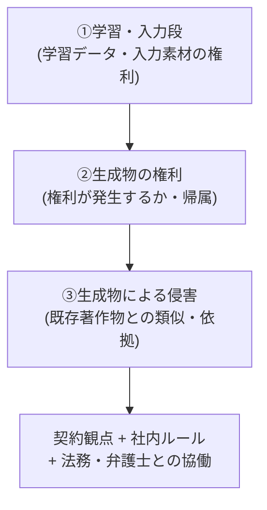

# AI と著作権・知的財産の入口マップ

> **免責:** 本記事は法的助言ではありません。著作権・知財論点の**内容の解説・適法/違法の断定はせず**、「AI 案件で問題になる知財論点を、何を・どの一次情報で確認しに行くか」の所在(入口)だけを示します。各資料の「扱う範囲」は、その資料が**どの論点を取り上げているか**を中立に記したもので、論点への結論ではありません。個別案件の判断は、必ず一次情報と法務・弁護士・弁理士に確認してください。

## この記事の目的

AI 案件で問題になる知的財産の論点 — 学習・入力段の権利、生成物の権利、生成物による侵害 — の「**在り処**」を短時間で特定できるようになります。国内・海外の一次情報の所在、契約で確認すべき観点、社内ルールの型、法務と協働する準備を整理します。**本記事は内容解説をせず、確認先の提示に徹します。**

## 対象読者

- AI(特に生成 AI)を業務・プロダクトに使う際の知財リスクの確認先を、短時間で特定したいエンジニア・PM
- 法務・知財部門に「何を確認したいか」を持ち込む立場の人

## 前提知識

- [コンプライアンスとガバナンス](../06-security/compliance-and-governance.md) — 横断規制・ベンダー契約の正本(本記事は著作権・知財の入口に特化)
- [業界別規制の入口マップ](industry-regulations-map.md) — 同じ「入口マップ」方式の業界規制版(本記事は知財版)

## 本文

> **最終確認日: 2026-07。** 本記事の資料名・版・発行主体はこの日付時点の各公式ページに基づきます。**著作権・知財の公的資料と法制度は改定・審議が速い**ため、参照時は必ず各発行主体の公式ページで現行版を確認してください。各資料の URL・確認状況はリポジトリ内 `research/trust/copyright.md` の調査メモに整理しています(主要な一次情報は末尾の参考資料にも掲載)。

### 概要: 知財論点は 3 層で確認する

AI の知財論点は、**時系列の 3 層**に分けると迷いません。同じ論点を扱う資料でも、層ごとに見るべき箇所が変わります。

内容の解説をしない理由は 3 つです。(1) 知財の議論は改定・審議が速く、解説はすぐ陳腐化します(2026-07 時点で、後述の資料の多くが 2024〜2025 年に公表・更新されています)。(2) 解釈は文脈依存で、**法的助言の領分**です。(3) 一次情報(公式の本文)が常に正であり、必要なのは「どこを見るか」だけだからです。使い方は次の 3 ステップです。

1. 自分の案件が 3 層のどこに当たるか(学習に使う/生成物を使う/類似が問題になりうる)を切り分ける
2. 該当層の表から資料を特定し、**発行主体の公式ページで現行版を確認する**(二次解説は旧版ベースが残ります)
3. 確認結果と契約観点を持って、法務・弁護士・弁理士と協働する(後述の「準備」)

### ①学習・入力段(学習データ・入力素材の権利)

AI の開発・学習で著作物を収集・複製・データセット化する場面の論点の所在です。

| 論点 | 資料(発行主体) | いつ見るか |
| --- | --- | --- |
| 学習段階の権利制限の考え方 | 「AI と著作権に関する考え方について」(令和 6 年 3 月、文化庁 文化審議会) | 著作物を学習に使う可否・条件の論点を確認するとき(著作権法 30 条の 4 等を扱う中核資料) |
| 実務者向けの確認手順 | 「AI と著作権に関するチェックリスト＆ガイダンス」(令和 6 年 7 月、文化庁著作権課) | 開発者・利用者が学習/生成/利用の各場面で確認すべき項目を洗い出すとき |
| 知財戦略の横断整理 | 「AI 時代の知的財産権検討会 中間とりまとめ」(2024 年 5 月、内閣府 知的財産戦略推進事務局) | 著作権に限らず AI と知財全般(学習・生成・侵害・契約)の論点を横断的に把握するとき |

- 学習段の中核は**文化庁「考え方について」+ チェックリスト＆ガイダンス**で、権利制限の論点の所在はここに集約されます
- 学習データの取得・利用の可否は、上記資料の論点と、使うモデル提供者の学習データに関する表明(後述の契約観点)を併せて確認します

### ②生成物の権利(権利が発生するか・帰属)

AI 生成物に著作権・特許権等が発生するか、誰に帰属するかの論点の所在です。著作権側と特許側の 2 系統で押さえます。

| 論点 | 資料(発行主体) | いつ見るか |
| --- | --- | --- |
| 生成物の著作物性(著作権) | 「AI と著作権に関する考え方について」(令和 6 年 3 月、文化庁) | 生成物が著作物に当たるか(人の創作的寄与の論点)を確認するとき |
| 権利帰属・対価還元(権利者視点) | 「AI 時代の知的財産権検討会 中間とりまとめ ―権利者のための手引き―」(2024 年 11 月、知財本部) | 権利者として取り得る対応(法・技術・契約)の論点を把握するとき |
| AI と発明者性・特許 | 特許庁「AI 関連発明」ページ / 産業構造審議会 特許制度小委員会「AI 技術の発達を踏まえた特許制度上の適切な対応」(令和 7 年 1 月) | 発明者性・特許適格性・審査事例の論点を確認するとき |

- 著作権側は**文化庁「考え方について」**、特許側は**特許庁「AI 関連発明」ページ + 産構審資料**が所在です
- 生成物を商用利用してよいか・権利は誰に帰属するかは、上記の論点に加え、**使うモデルの規約**(後述の契約観点)で確認します

### ③生成物による侵害(既存著作物との類似・依拠)

AI 生成物が既存著作物と類似・依拠する場面(生成・利用段階の侵害)の論点の所在です。

| 論点 | 資料(発行主体) | いつ見るか |
| --- | --- | --- |
| 生成・利用段階の侵害の論点整理 | 「AI と著作権に関する考え方について」の「生成・利用段階」パート(令和 6 年 3 月、文化庁) | 類似性・依拠性という侵害成否の判断枠組みの論点を確認するとき |
| 利用者が確認すべき事項 | 「AI と著作権に関するチェックリスト＆ガイダンス」(令和 6 年 7 月、文化庁) | 生成・利用時に侵害リスクを下げるための確認事項を洗い出すとき |

- ③侵害段は独立の公的文書があるわけではなく、**文化庁「考え方について」の生成・利用段階パート + チェックリスト＆ガイダンス**が所在です(①学習段と資料自体は重なり、見る箇所が違います)

### 海外の一次情報の所在(参照レベル)

海外の論点は、所在の案内に留めます(結論・評価は扱いません)。

| 地域 | 資料(発行主体) | 扱う範囲 |
| --- | --- | --- |
| 米国 | U.S. Copyright Office「Copyright and Artificial Intelligence」(copyright.gov/ai。Part 1 デジタルレプリカ・Part 2 著作権適格性・Part 3 学習 + 登録ガイダンス) | 著作権局による AI と著作権の報告書・登録実務の入口 |
| EU | 欧州委員会 AI Act の著作権関連(Art. 53 の GPAI 提供者の著作権ポリシー・学習内容の要約テンプレート) | 汎用 AI モデル提供者の著作権関連義務の入口 |

- EU AI Act 全体のタイムライン・GPAI 義務構造は [コンプライアンスとガバナンス](../06-security/compliance-and-governance.md) が正本で、本記事は著作権関連条項の所在のみを示します

### 契約で確認すべき観点(列挙)

知財リスクの多くは、**使うモデル・サービスの契約**で手当てされます。条項の解釈は法務の領分ですが、**確認すべき観点**を列挙できます。各社の IP 補償・出力所有権の具体は変化が速いため、[画像生成のプロダクト組み込み](../12-multimodal/image-generation-integration.md)や各社の規約・調査メモ `research/multimodal/generation.md` で確認します。

- **モデル提供者の IP 補償(indemnification)**: 学習データ由来の第三者侵害クレームを提供者が防御・補償するか、上限・除外(禁止用途・改変等)・対象プラン(GA/beta・無料/Enterprise)
- **学習データの出所・素材ライセンスの表明**: 提供者が学習データの適法な取得・ライセンス使用を表明しているか
- **成果物(出力)の権利帰属・所有権**: 出力の所有権がユーザーに帰属するか、商用可否・再配布・解約後利用の条件
- **入力素材(顧客提供データ)の権利・責任分担**: 入力素材の権利処理責任、入力データの学習利用の既定([コンプライアンスとガバナンス](../06-security/compliance-and-governance.md)のベンダー契約)
- **禁止用途・利用ポリシー**: 補償・権利付与が禁止用途違反で失効しうる点
- **準拠法・紛争解決・通知窓口**: 権利者からの申立て窓口・クレーム時の手続
- これらは**確認すべき論点の列挙**であり、有利/不利や適法性の評価はしません。実際の条件は各社規約と法務に委ねます

### 社内ルールの型

知財リスクは、案件ごとの確認だけでなく**社内ルール**で下げられます。型を持っておきます。

- **生成物の利用範囲を決める**: 生成物をどの用途(社内・外部公開・商用)まで使ってよいかを、社内ルールで定めます。用途で確認すべき観点が変わります
- **出所を記録する**: どのモデル・どの入力で生成したか、来歴([生成物の来歴と検出](../06-security/content-provenance-and-detection.md))を記録します。問題が起きたときの追跡と、透明性の責任に効きます
- **確認済みの資料・版を記録する**: 参照した公的資料・契約の版と確認日を残し、四半期で見直します(後述の定点観測)

### 法務・弁護士と協働するための準備

知財対応は「法務に丸投げ」でも「エンジニアの独自解釈」でも失敗します。**判断は法務・弁護士・弁理士の領分、判断材料を揃えるのがエンジニアの領分**です。持ち込む材料は 4 点です。

1. **案件の 3 層マッピング**: 自分の案件が①学習/②生成物利用/③侵害リスクのどこに当たるか
2. **使うモデル・サービスと契約の該当条項**: モデル提供者・規約・IP 補償/出力所有権/学習利用の条項の当たり
3. **生成物の利用範囲**: 社内利用か・外部公開か・商用か。用途の明確化
4. **候補資料リスト**: 本記事のマップから当たりを付けた公的資料名と版。「ゼロから調べて」でなく「この論点はこの資料で確認したい」と持ち込むと協働が速く回ります

この準備は、PoC → 本番の関門([PoC から本番への進め方](poc-to-production.md))に組み込み、本番直前でなく PoC 設計段階で始めます。

### 更新の追い方(確認先マップ)

主要な確認先は次のとおりです。**発行主体の公式ページを起点にし、二次解説は根拠にしません。**

| 機関 | 扱う論点 |
| --- | --- |
| 文化庁 著作権課 | ①学習 / ②著作物性 / ③類似・依拠(著作権の中核入口) |
| 内閣府・内閣官房 知的財産戦略推進事務局 | ①〜③横断 + 契約・技術対応(検討会の資料は移転中のため所在に注意) |
| 特許庁 | ②特許側(発明者性・特許適格性・審査事例) |
| 米国著作権局 / 欧州委員会(AI Act) | 海外の著作権・GPAI 義務の入口 |

## 実務での注意点

### アンチパターン

- **二次解説(まとめ記事)を根拠に判断する** → 旧版ベースの解説で、公表・改定を追えていない → 発行主体の公式ページで現行版を確認する
- **本記事や公的資料を「法的助言」として使う** → 内容解説でない入口マップを結論と誤用する → 判断は一次情報と法務・弁護士・弁理士に委ねる
- **3 層を切り分けずに「AI と著作権」と一括で考える** → 学習段と侵害段で見る箇所が違うのに混同する → 案件が①②③のどこに当たるかを切り分ける
- **契約の IP 補償・出力所有権・学習利用を確認しない** → モデル提供者の条件を知らずに使う → 契約観点を洗い出し、各社規約と法務で確認する
- **一度確認して終わりにする** → 公的資料・各社規約は改定が速い → 版・確認日を記録し、四半期で見直す

### チェックリスト

- [ ] 案件が①学習/②生成物利用/③侵害リスクのどの層かを切り分けた
- [ ] 該当層の公的資料(文化庁・知財本部・特許庁等)の現行版を発行主体の公式ページで確認した
- [ ] 使うモデル・サービスの契約観点(IP 補償・出力所有権・学習利用・禁止用途)を確認した
- [ ] 生成物の利用範囲(社内/外部/商用)を社内ルールで定め、出所を記録している
- [ ] 法務・弁護士に持ち込む 4 点(3 層マッピング・契約条項・利用範囲・候補資料リスト)を用意した
- [ ] 本記事を法的助言でなく確認先の入口として使っている
- [ ] 参照資料・契約の版と確認日を記録し、四半期見直しに載せた

## 関連トピック

- [業界別規制の入口マップ](industry-regulations-map.md) — 同じ入口マップ方式の業界規制版(本記事は知財版)
- [コンプライアンスとガバナンス](../06-security/compliance-and-governance.md) — 横断規制・ベンダー契約(著作権の外側の枠組み)
- [エージェントの責任と説明責任](agent-liability-and-accountability.md) — 契約・責任の論点整理(IP は契約観点の 1 つ)
- [画像生成のプロダクト組み込み](../12-multimodal/image-generation-integration.md) — 生成物の商用利用・来歴・各社 IP 補償の実例
- [生成物の来歴と検出](../06-security/content-provenance-and-detection.md) — 生成物の出所記録(社内ルールの技術的裏付け)
- [PoC から本番への進め方](poc-to-production.md) — 知財確認を組み込む関門
- [契約レビュー・法務ドメイン Agent](../13-domain-agents/legal-review-agents.md) — 同じ入口マップ方式の契約レビュー版(業際・機密の論点)

## 参考資料

- [AI と著作権について(文化庁著作権課)](https://www.bunka.go.jp/seisaku/chosakuken/aiandcopyright.html) — 「考え方について」「チェックリスト＆ガイダンス」等への総合入口(アクセス日: 2026-07-08)
- [AI 時代の知的財産権検討会(内閣府 知的財産戦略推進事務局)](https://www.kantei.go.jp/jp/singi/titeki2/ai_kentoukai/kaisai/index.html) — 中間とりまとめ・権利者のための手引きの検討会(内閣官房へ移転中。現行の所在を確認)(アクセス日: 2026-07-08)
- [AI 関連発明(特許庁)](https://www.jpo.go.jp/system/patent/gaiyo/sesaku/ai/index.html) — 発明者性・特許適格性・審査事例の入口(アクセス日: 2026-07-08)
- [Copyright and Artificial Intelligence(U.S. Copyright Office)](https://www.copyright.gov/ai/) — 米著作権局の AI 特設ページ(Part 1〜3 + 登録ガイダンス)(アクセス日: 2026-07-08)
- [Regulatory framework for AI(European Commission)](https://digital-strategy.ec.europa.eu/en/policies/regulatory-framework-ai) — EU AI Act の概要(GPAI 提供者の著作権関連義務 Art. 53 の入口)(アクセス日: 2026-07-08)

上記以外の資料(文化庁の各 PDF・知財本部の手引き・産構審資料・EU 学習内容要約テンプレート等)の URL と確認状況は `research/trust/copyright.md` に整理しています。

## TODO・未確認事項

> **TODO(要確認):** 本記事の資料名・版・発行主体を四半期ごとに各発行主体の公式ページで再確認する(`research/trust/copyright.md` を更新起点にする)。直近の注目: 文化庁のガイダンス追補、知財本部の検討会ページの移転先(kantei.go.jp → 内閣官房 cas.go.jp)と「プリンシプル・コード(仮称)」の策定状況、特許庁の産構審での検討、米国著作権局 Part 3(学習)の最終版公表、EU GPAI 学習内容要約テンプレートの運用(最終確認: 2026-07)

> **TODO(要確認):** 本記事は入口マップ(法的助言ではない確認先の提示)であり、個別案件の適法性・権利帰属・侵害の判断は一次情報と法務・弁護士・弁理士に確認する(内容解説をしない方針の維持。最終確認: 2026-07)
