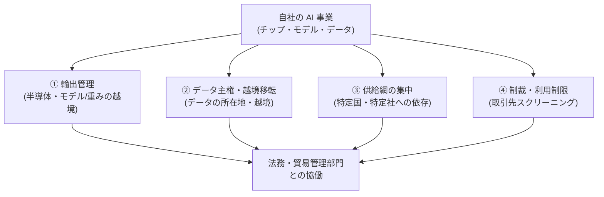

# AI と地政学・輸出規制の入口マップ

> **免責:** 本記事は法的助言でも、地政学的見解の表明でもありません。輸出規制・データ規制・制裁などの**内容の解説・解釈はせず**、「AI(チップ・モデル・データ)を事業で扱うとき、何を・どの一次情報で確認しに行くか」の所在(入口)だけを示します。個別案件の該非判断・適法性の判断は、必ず自社の法務・貿易管理部門や所管当局・専門家に確認してください。

## この記事の目的

AI に関わる地政学リスク — チップ・モデル・データにかかる輸出管理、データ主権、供給網の集中、制裁 — について、**着手前に確認すべき一次情報の「在り処」**を短時間で特定できるようになります。内容の解釈はせず、確認先の当局・公式ソースと、法務・貿易管理部門と協働するためにエンジニア側が準備すべきものを整理します。

**本記事は鮮度リスクの高いページです。** 規則の版・対象品目リスト・掲載団体・対象国は月〜年単位で変わるため、参照の際は必ず本文冒頭の最終確認日と各当局の公式ページで現行版を確認してください。本記事は特定の規則番号・しきい値・対象を**断定しません**。

## 対象読者

- AI 製品・モデル・チップ・データを国境をまたいで扱う可能性のある事業を企画・設計するエンジニア・テックリード
- 海外リージョン・海外ベンダー・オープンウェイトモデルの利用可否を、法務・貿易管理部門に持ち込む立場の人

## 前提知識

- [コンプライアンスとガバナンス](../06-security/compliance-and-governance.md) — 業界を問わない横断規制(AI 規制・個人情報保護)の正本。本記事はその隣にある地政学・貿易管理の層を扱います
- [業界別規制の入口マップ](industry-regulations-map.md) — 同じ「入口マップ + 免責」方式の業界規制版(本記事と対で使う別の確認軸)

## 本文

> **最終確認日:** 2026-07-09 — 本記事が挙げる当局・公式ソースの所在はこの日付時点のものです。各 URL・確認状況の詳細は、リポジトリ内 `research/strategy/geopolitics.md` の調査メモを参照してください(主要な一次情報の入口は本記事末尾の参考資料にも掲載)。規則の内容・版・対象は必ず各公式ページで現物確認してください。

### 概要: 地政学リスクは 4 類型で確認する

AI 事業で確認すべき地政学リスクは、4 つの類型に分けると見通せます。**それぞれ所管する当局と一次情報が違う**ため、まず自社の状況がどの類型に当たるかを切り分けます。

内容を解説しない理由は業界規制マップと同じです。(1) 規則は改版が速く、解説はすぐ陳腐化します。(2) 該非・適法性の判断は文脈依存で、貿易管理・法務の領分です。(3) 一次情報(当局の本文)が常に正であり、必要なのは「どこを見るか」だけだからです。

使い方は 3 ステップです。

1. 自社の事業が 4 類型のどれに触れるかを切り分ける(複数に触れることが多い)
2. 該当類型の表から所管当局を特定し、**公式ページで現行の規則・リスト・対象を確認**する(二次解説は旧版ベースが多く残ります)
3. 確認結果を持って法務・貿易管理部門と協働する(後述の「準備」を参照)

### ① 輸出管理(半導体・モデル/重みの越境)

先端半導体や、場合により AI モデル・重みそのものが、輸出管理の対象になり得ます。「該当するか」の判断は貿易管理部門の領分で、ここでは確認する入口だけを示します。

| 確認先 | 何を確認する入口か |
| --- | --- |
| 経済産業省 安全保障貿易管理(日本) | 外為法・輸出貿易管理令に基づく貨物の輸出・技術の提供の管理制度、関係法令・改正情報 |
| e-Gov 法令検索 — 輸出貿易管理令(日本) | 規制品目が参照される政令の条文本文(別表を含む)の所在 |
| BIS(米国 商務省 産業安全保障局) | Export Administration Regulations(EAR)、先端計算(advanced computing)関連の管理、品目分類・許可の入口 |
| Federal Register(米国官報) | BIS の個別規則(版・施行日)を現物確認する場所 |
| 欧州委員会 DG Trade(EU) | デュアルユース(軍民両用)品目の輸出管理の認可類型・管理品目リストの入口 |

**技術の提供・クラウド越しの利用・オープンウェイトの再配布**なども論点になり得ます。「モノを送らないから無関係」と自己判断せず、貿易管理部門に確認します。

### ② データ主権・越境移転(データの所在地・越境)

AI がどこで処理され、データがどの国に置かれ・越境するかは、データ保護規制に触れます。

| 確認先 | 何を確認する入口か |
| --- | --- |
| 個人情報保護委員会(PPC、日本) | 個人情報保護法、外国にある第三者への個人データ提供に関するガイドラインの所在 |
| 欧州委員会 データ保護 / 十分性認定(EU) | GDPR に基づく第三国へのデータ移転と、十分性認定の制度・対象国 |
| CAC(中国、PIPL 所管当局) | 個人情報保護法(PIPL)・データ安全法に基づく越境移転の各経路の発出元(所管当局。一次情報への到達性は下記 TODO 参照) |
| MeitY(インド、DPDP 法) | Digital Personal Data Protection Act と関連規則を所管する省庁のデータ保護の入口 |

リージョン選択は、レイテンシやコストだけでなく、**データ主権の観点**でも決まります([会話データの管理基盤](../05-operations/conversation-data-management.md)のデータフロー・所在の設計と直結)。

### ③ 供給網の集中(特定国・特定社への依存)

規制ではありませんが、**チップ・クラウド・モデルの供給が特定国・特定社に集中している**こと自体が事業リスクです。公的な分析が入口になります。

| 確認先 | 何を確認する入口か |
| --- | --- |
| OECD(半導体サプライチェーン分析) | 半導体サプライチェーンの地理的集中・脆弱性を扱う国際機関の報告書 |
| 経済産業省(半導体・デジタル産業戦略 / 経済安全保障) | 国内生産能力・安定供給確保に関する政策文書の所在 |
| 米国 GAO / 議会調査局(CRS) | 米国の半導体サプライチェーン・輸出管理に関する公的分析の入口 |

供給集中の構造を把握したうえで、後述の「調達の複線化」に落とします。主要 LLM・提供元の分布は[主要 LLM の全体像](../03-implementation/llm-landscape.md)も参照します。

### ④ 制裁・利用制限(取引先スクリーニング)

取引先(顧客・ベンダー・エンドユーザー)が制裁・エンドユーザー規制の対象でないかの確認は、多くの事業で必要になります。

| 確認先 | 何を確認する入口か |
| --- | --- |
| 経済産業省 外国ユーザーリスト(日本) | キャッチオール規制の運用で公表される、懸念が払拭されない外国所在団体の情報 |
| OFAC Sanctions List Search(米国財務省) | SDN リスト等の制裁対象を名称で検索する公式ツール |
| BIS Entity List(米国) | EAR 上、取引に追加の許可要件を生じさせ得る外国エンドユーザー等のリスト |
| 統合スクリーニングリスト(米国 CSL) | 商務省・国務省・財務省の複数リストを統合検索・ダウンロードする入口 |

スクリーニングは**取引の都度・定期の両方**で行う運用にします(リストは頻繁に更新されます)。最終判断は各原典(官報等)と法務で確認します。

### 事業への落とし込み

確認先を押さえたら、設計・調達の判断に落とします(ここは見解ではなく、依存を減らす一般的な備えです)。

- **調達の複線化**: チップ・クラウド・モデルの供給元を単一に固定せず、代替を評価しておく([AI 調達・ベンダー選定の実務](ai-procurement.md)のロックイン評価と直結)。乗り換え可能性は地政学リスクへの保険でもあります
- **リージョン戦略**: 処理・保存のリージョンを、データ主権・レイテンシ・コストの複数軸で設計する。モデル抽象化([LLM ゲートウェイ](../05-operations/llm-gateway.md))で切り替え可能性を確保します
- **依存の棚卸し**: 自社の AI スタックが、どの国・どの社の・何に依存しているかを一覧化する。棚卸しがないと、規制変更・供給途絶が起きてから初めて依存に気付くことになります

### 法務・貿易管理部門と協働するための準備

地政学対応は「法務・貿易管理に丸投げ」でも「エンジニアが独自判断」でも失敗します。**該非・適法性の判断は専門部門の領分、判断材料を揃えるのはエンジニアの領分**です。持ち込む材料は 4 点です。

1. **技術・データフロー図**: どのチップ・モデル・データが、どの国で処理・保存され、どこへ越境するか。クラウドのリージョンとベンダーの所在を含めます
2. **利用形態の明示**: 自社が「作る/使う/再配布する/海外に提供する」のどれに当たるか。オープンウェイトの再配布やクラウド越しの技術提供も明記します
3. **取引先リスト**: スクリーニング対象になる顧客・ベンダー・エンドユーザーの一覧
4. **当たりを付けた確認先**: 本記事のマップから特定した所管当局・リストの候補。「ゼロから調べて」ではなく「この類型に触れそうか確認したい」と持ち込むと協働が速く回ります

このプロセスは PoC → 本番の関門([PoC から本番への進め方](poc-to-production.md))に組み込み、本番化直前ではなく設計段階で始めます。

### 更新の追い方

- **当局の公式ページ・官報を起点にする**: 規則・リストの一次情報は当局の公式ページと官報です。まとめ記事や法律事務所の解説は「動きを知る」までに使い、根拠には使いません
- **版・確認日・対象を記録する**: 「いつ・どの当局の・何を確認したか」を設計文書に残します
- **四半期ごとに見直す**: 輸出管理規則・制裁リスト・データ規制はいずれも高頻度で改定されます。四半期の定点観測に含めます

## 実務での注意点

### アンチパターン

- **「モノを輸出しないから輸出管理は無関係」と自己判断する** → 技術の提供・クラウド越しの利用・モデル/重みの再配布が対象になり得ることを見落とす → 該非判断を貿易管理部門に確認する
- **二次解説(まとめ記事・法律事務所ブログ)を根拠に設計する** → 旧版ベースの解説が多く、改定に気付けない → 当局の公式ページ・官報で現行版を確認する
- **リージョンをレイテンシ・コストだけで選ぶ** → データ主権・越境移転の要求を見落とし、後で設計をやり直す → データ主権を含む複数軸でリージョンを設計する
- **取引先スクリーニングを一度きりにする** → 制裁・エンドユーザーリストは頻繁に更新され、対象が増える → 取引の都度と定期の両方でスクリーニングする
- **供給を単一ベンダー・単一国に固定する** → 規制変更・供給途絶で事業が止まる → 調達を複線化し、依存を棚卸ししておく
- **エンジニアが適法/違法を独自判断する** → 誤判断が法的リスクになる → 判断材料を揃えて専門部門につなぐ(本記事は所在案内まで)

### チェックリスト

- [ ] 自社の AI 事業が 4 類型(輸出管理・データ主権・供給集中・制裁)のどれに触れるか切り分けた
- [ ] 該当類型の所管当局・公式ソースの現行版を確認した(二次解説を根拠にしていない)
- [ ] 技術・データフロー図(どの国で処理・保存・越境するか)を用意した
- [ ] 自社の利用形態(作る/使う/再配布/海外提供)を明示した
- [ ] 取引先スクリーニングを都度・定期の運用に載せた
- [ ] 調達の複線化・リージョン戦略・依存の棚卸しを設計に反映した
- [ ] 法務・貿易管理部門に持ち込む 4 点を用意し、設計段階で協働を始めた
- [ ] 参照した規則・リストの版・確認日を記録し、四半期見直しに載せた

## 関連トピック

- [コンプライアンスとガバナンス](../06-security/compliance-and-governance.md) — 横断規制(AI 規制・個人情報保護)の正本
- [業界別規制の入口マップ](industry-regulations-map.md) — 同じ入口方式の業界規制版(別の確認軸)
- [AI 調達・ベンダー選定の実務](ai-procurement.md) — 調達の複線化・ロックイン評価(供給集中への備え)
- [「自社モデルを持つか」の判断](own-model-strategy.md) — 供給依存と「持つ/持たない」の投資判断
- [主要 LLM の全体像](../03-implementation/llm-landscape.md) — モデル・提供元の分布(供給集中の把握)
- [LLM ゲートウェイの設計](../05-operations/llm-gateway.md) — モデル抽象化による切り替え可能性の確保
- [会話データの管理基盤](../05-operations/conversation-data-management.md) — データフロー・所在・越境の実装側
- [PoC から本番への進め方](poc-to-production.md) — 地政学確認を組み込む関門

## 参考資料

- [経済産業省 安全保障貿易管理](https://www.meti.go.jp/policy/anpo/) — 外為法に基づく輸出管理制度の入口(日本)(アクセス日: 2026-07-09)
- [BIS(U.S. Bureau of Industry and Security)](https://www.bis.gov/) — EAR・先端計算関連管理・Entity List の所管当局(米国)(アクセス日: 2026-07-09)
- [Exporting dual-use items(European Commission DG Trade)](https://policy.trade.ec.europa.eu/help-exporters-and-importers/exporting-dual-use-items_en) — EU のデュアルユース輸出管理(Reg. (EU) 2021/821)の入口(アクセス日: 2026-07-09)
- [個人情報保護委員会(PPC)](https://www.ppc.go.jp/) — 個人情報保護法・越境移転ガイドラインの所管(日本)(アクセス日: 2026-07-09)
- [Adequacy decisions(European Commission)](https://commission.europa.eu/law/law-topic/data-protection/international-dimension-data-protection/adequacy-decisions_en) — GDPR の第三国移転・十分性認定(EU)(アクセス日: 2026-07-09)
- [OFAC Sanctions List Search(U.S. Treasury)](https://sanctionssearch.ofac.treas.gov/) — 制裁対象の検索ツール(米国)(アクセス日: 2026-07-09)
- [Consolidated Screening List(U.S. Dept. of Commerce)](https://www.trade.gov/consolidated-screening-list) — 複数スクリーニングリストの統合検索(米国)(アクセス日: 2026-07-09)
- [Vulnerabilities in the Semiconductor Supply Chain(OECD, 2023)](https://www.oecd.org/content/dam/oecd/en/publications/reports/2023/06/vulnerabilities-in-the-semiconductor-supply-chain_f4de7491/6bed616f-en.pdf) — 半導体供給網の集中・脆弱性の分析(アクセス日: 2026-07-09)

上記以外の入口(e-Gov 輸出貿易管理令、Federal Register、経産省 半導体戦略/外国ユーザーリスト、BIS Entity List、MeitY DPDP、GAO/CRS 等)の URL と確認状況は `research/strategy/geopolitics.md` に整理しています。

## TODO・未確認事項

> **TODO(要確認):** 輸出管理規則・制裁/エンドユーザーリスト・データ規制はいずれも改定が速い。特定の規則番号・しきい値・掲載団体・対象国を本記事は断定していない。参照時に各当局の公式ページ・官報で現行版・対象を現物確認する(所在は `research/strategy/geopolitics.md`)(最終確認: 2026-07)

> **TODO(要確認):** 中国 CAC の一次情報(PIPL 越境移転の規定)は、国外からの公式ページ到達性が不安定で本調査では本文を確認できていない。中国関連の確認は、所管当局が CAC であることを前提に、現地法務・専門家を通じて一次情報を確認する(最終確認: 2026-07)

### 変わりやすい項目(定点観測)

> **TODO(要確認):** 本記事の全表(所管当局・公式ソース)のリンク生存と、各規則・リストの現行版を四半期ごとに確認する(`research/strategy/geopolitics.md` を更新起点にする)。直近の注目: 米国 BIS の先端コンピューティング関連規則の改定、各制裁/エンドユーザーリストの更新、EU デュアルユース管理品目リストの改定、各国データ保護規則(インド DPDP 規則・EU 十分性認定)の動向(最終確認: 2026-07)
