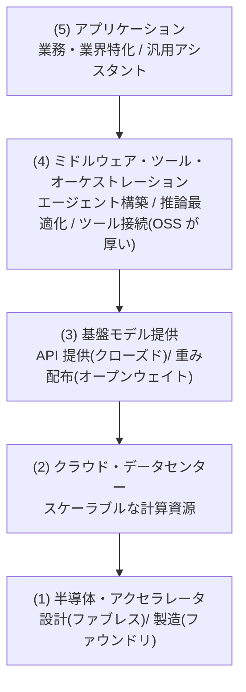

# AI 業界レイヤーマップ

## この記事の目的

「どの種類の会社が、どの層で何を担っているか」を**レイヤー構造**で掴み、調達・提携・技術選定の会話で業界の力学を読めるようになります。個別企業の優劣や戦略の評価ではなく、**層の役割と、層をまたぐ依存の構造**を地図として持ち帰り、ベンダーロックインや供給集中のリスク評価につなげることを目指します。

**本記事は鮮度リスクの高いページです。** 各層のプレイヤーの顔ぶれは速く変わるため、企業名は**代表例(網羅でも序列でもない)**として最小限に挙げ、変化の速いシェア・資本関係・調達額は扱いません。地図の「構造」は比較的安定です。

## 対象読者

- AI の調達・提携・技術選定の会話で、業界の全体像を短時間で掴みたいエンジニア・テックリード・企画担当
- 「モデルの名前は知っているが、その周りの業界構造が頭に入っていない」人

## 前提知識

- [主要 LLM の全体像](../03-implementation/llm-landscape.md) — モデル層(基盤モデル)の詳細の正本。本記事はその上下を含む業界全体の地図
- 特別な前提はありません

## 本文

> **最終確認日:** 2026-07-10 — 本記事が挙げる代表例・構造はこの日付時点のものです。各層の一次情報 URL と確認状況は、リポジトリ内 `research/ecosystem/industry-oss.md` の調査メモを参照してください。企業名は代表例であり、序列・推奨ではありません。

### 概要: 業界を「層」で見る

AI 業界は、単一の市場ではなく、**下から上へ積み重なる層(レイヤー)の連なり**として捉えると力学が見えます。層の数え方は論者により 3〜7 層と揺れますが、本記事は実務判断に使いやすい **5 層 + 日本の SIer 層**で整理します。層分けは「唯一の正解」ではなく、会話の共通言語としての整理軸です。

### 各層が担うもの(代表例つき)

各層の「役割」と、そこに位置する**代表例**です。列挙は例示で、網羅でも序列でもありません。

| 層 | 担うもの | 代表例(一部) |
| --- | --- | --- |
| (1) 半導体・アクセラレータ | 学習/推論用の GPU・専用アクセラレータの**設計と製造**。設計(ファブレス)と製造(ファウンドリ)がさらに分かれる | GPU/アクセラレータの設計各社、クラウド自社設計アクセラレータ、ファウンドリ |
| (2) クラウド・データセンター | 学習/推論のスケーラブルな計算資源を提供。GPU クラウド専業(いわゆる「ネオクラウド」)もこの層の一形態 | ハイパースケーラ各社、GPU クラウド専業 |
| (3) 基盤モデル提供 | 汎用/特化の基盤モデルを提供。**API のみ(クローズド)**と**重みを配布(オープンウェイト)**の 2 形態がある | 主要モデルプロバイダー各社(詳細は[主要 LLM の全体像](../03-implementation/llm-landscape.md)) |
| (4) ミドルウェア・ツール | モデルとアプリの間で、エージェント構築・オーケストレーション・推論最適化・ツール接続を担う。**OSS が厚い層**([オープンソース AI エコシステム](../03-implementation/open-source-ai-ecosystem.md)) | OSS フレームワーク・推論サーバ・エージェント基盤 |
| (5) アプリケーション | 特定業務・業界(金融・医療・製造・法務・サポート等)向けの製品や、汎用アシスタント。エンドユーザーに価値を届ける | 垂直特化 SaaS・汎用アシスタント(個別名は変化が速く割愛) |

具体的な企業名を網羅しないのは意図的です。**顔ぶれは速く変わり、列挙は序列や推奨と誤読されやすい**ため、本記事は「層の役割」を軸にします。

### 各層の力学

層を見る価値は、**どこに集中・分散が起き、依存が生じるか**を読めることです(特定企業の評価ではなく、構造の話です)。

- **層ごとに集中度が違う**: 半導体の設計・製造や大規模クラウドは参入障壁が高く集中しやすい一方、ミドルウェア・アプリ層は多数のプレイヤーが競います。**自分が依存する層の集中度**が、供給・価格のリスクを左右します
- **利益と交渉力の偏在**: 希少で代替の効きにくい層(計算資源・先端半導体)ほど交渉力を持ちやすい、という構造があります
- **層をまたぐ垂直統合**: 「クラウド事業者が自社アクセラレータを設計する」「モデルプロバイダーがアプリまで提供する」など、**単一プレイヤーが複数層にまたがる**例が観察されます。これは選択肢と依存の両方に効きます(統合先に乗ると便利だが、その企業への依存が深まる)

### 日本市場の構造

日本市場には、国産の基盤モデルと、それを業務に実装する層という特徴があります。

- **国産基盤モデルの 2 系統**: 「フルスクラッチで開発する国産モデル」と「海外のオープンモデルに日本語の継続事前学習・事後学習を施した派生モデル」の 2 系統があります(日本語 LLM の中立的なカタログ[awesome-japanese-llm](https://llm-jp.github.io/awesome-japanese-llm/)はこの区分で整理しています)
- **SIer・システムインテグレータ層**: モデルを業務システムに実装・統合する層が、日本の商流では厚く存在します。海外にはない「間に立つ層」として、調達・導入の実務で重要になります

どのモデルが優れているか、政府調達で何が選ばれたかといった具体は変化が速く政策にも依存するため、本記事では扱いません(確認先は末尾)。

### 地図の使い方

この地図は、次の実務判断に使えます。

- **ベンダーロックインの評価**: 自分が依存する層と企業を棚卸しし、乗り換えの難しさを見積もる([AI 調達・ベンダー選定の実務](ai-procurement.md)のロックイン評価・[モデル選定ガイド](../03-implementation/model-selection.md)の乗り換え自由)
- **供給集中・地政学リスク**: 特定の層・国・企業への集中を、事業リスクとして棚卸しする([AI と地政学・輸出規制の入口マップ](ai-geopolitics-map.md)の供給集中)
- **調達の複線化・フォールバック**: どの層で代替を確保できるかを設計する([デプロイとスケーリング](../05-operations/deployment-and-scaling.md)のフォールバックの戦略版)
- **「作る/使う」の判断**: どの層を自前化し、どこを借りるかの経営判断([「自社モデルを持つか」の判断](own-model-strategy.md))

### 更新の追い方

- **層の構造は安定、顔ぶれは変わる**: レイヤーの枠組みは比較的安定なので、変わるのは各層の代表プレイヤーです。四半期ごとに主要な層の顔ぶれを見直します
- **一次情報を起点にする**: 各社の公式発表・公式ドキュメントを起点にし、まとめ記事や評論は動向を知るまでに使って根拠にはしません
- **評価でなく構造で追う**: 「どの企業が勝つか」の予測に振り回されず、「どの層に依存しているか」の棚卸しを定期更新します

## 実務での注意点

### アンチパターン

- **企業名の一覧としてこの地図を使う** → 顔ぶれはすぐ古くなり、序列・推奨と誤読される → 「層の役割」を軸に使い、企業名は代表例として現行を都度確認する
- **依存している層を意識せずに調達する** → 集中した層への依存が、供給・価格・地政学リスクとして跳ねる → 自社が依存する層・企業を棚卸しし、代替の確保を設計する
- **垂直統合された便利さに乗り、依存を見落とす** → 統合先への依存が深まり、乗り換えが困難になる → 便利さと依存をセットで評価する(ロックイン評価)
- **シェア・資金・評価額で層の重要度を判断する** → 変化が速く、自社の依存構造とは無関係なことも多い → 自社にとっての「代替の効きにくさ」で重要度を測る
- **日本の SIer 層・国産モデルの動向を海外情報だけで判断する** → 商流・政策が異なり実態を見誤る → 国内の一次情報(公式・中立カタログ)で確認する

### チェックリスト

- [ ] 自社の AI スタックが、どの層の・どの種類の企業に依存しているかを棚卸しした
- [ ] 依存する層の集中度(代替の効きにくさ)を評価した
- [ ] 垂直統合された提供に乗る場合、その依存の深まりを評価した
- [ ] 供給集中・地政学リスクを層の観点で確認した([AI と地政学・輸出規制の入口マップ](ai-geopolitics-map.md))
- [ ] 企業名を代表例として扱い、現行の顔ぶれを一次情報で確認している
- [ ] 層の顔ぶれの見直しを四半期の定点観測に載せた

## 関連トピック

- [主要 LLM の全体像](../03-implementation/llm-landscape.md) — 基盤モデル層(第 3 層)の詳細の正本
- [オープンソース AI エコシステム](../03-implementation/open-source-ai-ecosystem.md) — ミドルウェア・OSS 層(第 4 層)とライセンスの地図
- [AI 調達・ベンダー選定の実務](ai-procurement.md) — ロックイン評価・調達の複線化(地図の調達側)
- [「自社モデルを持つか」の判断](own-model-strategy.md) — どの層を自前化するかの経営判断
- [AI と地政学・輸出規制の入口マップ](ai-geopolitics-map.md) — 供給集中・地政学リスクの確認先
- [モデル選定ガイド](../03-implementation/model-selection.md) — 乗り換え自由・ティア混在の判断
- [デプロイとスケーリング](../05-operations/deployment-and-scaling.md) — フォールバック・多重化(供給リスクの実装側)

## 参考資料

- [awesome-japanese-llm(LLM-jp)](https://llm-jp.github.io/awesome-japanese-llm/) — 日本語 LLM の中立的なカタログ(フルスクラッチ/継続事前学習/事後学習の区分)(アクセス日: 2026-07-10)
- 各層の代表例の公式サイト URL と確認状況は `research/ecosystem/industry-oss.md` に整理しています(いずれも代表例であり、序列・推奨ではありません)

## TODO・未確認事項

> **TODO(要確認):** 各層の代表プレイヤーの顔ぶれ(特にミドルウェア層・アプリ層)は流動的で、垂直統合の動きも速い。本記事は「層の役割」の構造に徹しており、現行の企業名・顔ぶれは各社公式・中立カタログで確認する(所在は `research/ecosystem/industry-oss.md`)(最終確認: 2026-07)

### 変わりやすい項目(定点観測)

> **TODO(要確認):** 各層の代表プレイヤーの顔ぶれ、垂直統合の動向、日本の国産基盤モデルの顔ぶれと政策・調達動向を四半期ごとに一次情報で確認する(`research/ecosystem/industry-oss.md` を更新起点にする)。本記事はシェア・資本関係・調達額を扱わず、構造に限定している(最終確認: 2026-07)
